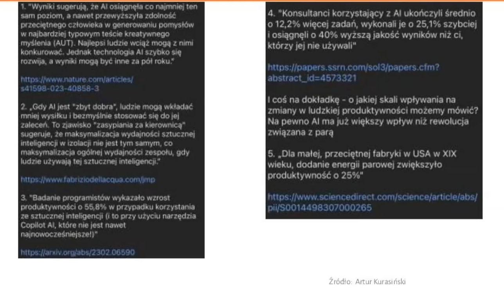

Konferencja Tłumaczy 2023 już za nami. Ale poniżej czeka na Was relacja.
Zapraszamy do lektury!

<!--truncate-->

## W dniu św. Hieronima, patrona tłumaczy

Co roku, 30 września, w dniu św. Hieronima, tłumacza Biblii, uznawanego za
patrona tłumaczy, obchodzony jest Międzynarodowy Dzień Tłumacza. I w tym samym
terminie, już od kilku lat, organizowana jest Konferencja Tłumaczy. Nie inaczej
było i w tym roku.

## Motyw przewodni

Motywem przewodnim tegorocznej Konferencji Tłumaczy była INTELIGENCJA. Dyskusje
toczyły się wokół inteligencji językowej (czyli czegoś, co każdy lingwista
posiada, ale musi też o to dbać), społecznej (czyli umiejętności współpracy z
innymi osobami), emocjonalnej (czyli umiejętności zarządzania sobą z perspektywy
własnej osobowości i emocji odczuwanych w trakcie tłumaczenia) oraz sztucznej
(czyli wokół narzędzi takich jak ChatGPT, ChatSonic, Chinchilla, DeepL).

## Piątkowe warsztaty

Jako przedsmak samej konferencji w piątek, 29 września, odbyły się warsztaty z
ekspertami, poruszającymi zarówno odwieczne, jak i aktualne kwestie nurtujące
branżę tłumaczeniową.

Dyskutowano więc o kwestiach takich jak stawki za tłumaczenia, reklamowanie
swoich usług tłumaczeniowych w sieci czy emisja głosu. Gratką dla uczestników
były warsztaty dotyczące zastosowania ChatGPT i AI w tłumaczeniach. Było o
wielkich modelach językowych (tzw. LLM-ach), prompt engineeringu, łączeniu
CAT-ów (czyli narzędzi wspomagających tłumaczenie), NMT (neuronowego tłumaczenia
maszynowego) i LLM (wielkich modeli językowych). Dyskutowano o anonimizacji,
poufności i ochronie danych wrażliwych w ChatGPT.

Na koniec chętni uczestnicy mogli zobaczyć, jak działa narzędzie Juremy
ułatwiające wyszukiwanie różnorakich terminów w 24 językach unijnych. Szkolenie
to było skierowanie przede wszystkim do tłumaczy zajmujących się tłumaczeniem
tekstów unijnych i prawniczych.

## Sobotnia konferencja

Właściwa konferencja odbyła się w sobotę, 30 września. Na wykładach i
prelekcjach pojawiło się mnóstwo tłumaczy i osób związanych z branżą
tłumaczeniową. Kto nie mógł pojawić się osobiście, miał szansę uczestniczyć w
konferencji online. Podobnie zresztą jak i niektórzy prelegenci, którym
zobowiązania zawodowe czy rodzinne nie pozwoliły wziąć udziału w wydarzeniu
osobiście.

## Inteligencja i inne tematy okołotłumaczeniowe

Jak przystało na temat przewodni dyskutowano o szeroko pojętej inteligencji.
Było więc i o neurobiologii inteligencji, i o inteligencji emocjonalnej – czyli
o tym jak tłumacze ustni radzą sobie w trakcie tłumaczeń konferencyjnych i
środowiskowych wywołujących duże i skrajne emocje. Znalazło się też miejsce na
rozmowy o tym, jak rozpoznać u siebie mocne i słabe strony, jak osiągnąć
satysfakcję z pracy, jak nauczyć się kontrolować stres, a także jak unikać
rozczarowań i skutecznie się relaksować.

Dyskutowano również o praktycznych kwestiach z życia tłumaczy. Było o różnych
formach pracy z innymi, czyli o tzw. co-workingu, fizjologicznej emisji głosu na
co dzień oraz zarządzaniu procesami i projektami. Prelegenci dzielili się
również swoją wiedzą i doświadczeniem w kwestii tego, jak się przebranżowić oraz
jak wcześniej podnieść swoje kompetencje, żeby zmiana branży i zawodu poszła
gładko i bezproblemowo.

Nie zabrakło też zabawnych historii wpadek językowych z życia tłumacza
konferencyjnego, który często natrafia na rafy kulturowe czy językowe podczas
tłumaczenia. Było też i o języku inkluzywnym, który coraz częściej pojawia się w
dyskusjach w przestrzeni publicznej.

Gościem tegorocznej konferencji było również ukraińskie biuro tłumaczeń Task
Force, którego przedstawiciele opowiadali o zmieniającej się branży
tłumaczeniowej w Ukrainie, tendencjach i wyzwaniach stojących przed nimi.

## AI i MT na tapecie

Jednak tegoroczna Konferencja Tłumaczy 2023 została zdominowana przez kwestie,
które wywołują od jakiegoś czasu spore emocje, rodzą nadzieje i obawy nie tylko
w przestrzeni publicznej, ale też w branży tłumaczeniowej. Chodzi mianowicie o
tłumaczenie maszynowe i sztuczną inteligencję.

Temat AI widziany oczami biura tłumaczeń rozpoczęła Magdalena Pluta z biura
tłumaczeń Skrivanek. Opowiedziała o tym, jak biuro tłumaczeń wykorzystuje
narzędzia AI, jak zmieniają się potrzeby klientów i jak w związku z tym biuro
zmienia się w zakresie procesów, używanego oprogramowania i innych rozwiązań
oraz jak dostawcy biura radzą sobie z technologiami AI. Pałeczkę przejął
następnie Agenor Hoffmann-Delbor, który jest znaną postacią nie tylko w branży
tłumaczeniowej, ale również, a może przede wszystkim, lokalizacyjnej. Dzień
wcześniej poprowadził warsztaty tematycznie powiązane z sobotnią prelekcją.

## Zastosowanie AI w tłumaczeniach

Agenor Hoffmann-Delbor podszedł do tematu bardzo technicznie i rzeczowo. Było
nie tylko o AI w tłumaczeniach, ale przede wszystkim ogólnie o sztucznej
inteligencji, silnikach korzystających z niej, jej zastosowaniach, mocnych i
słabych stronach.

Samo określenie „sztuczna inteligencja” pojawiło się już w latach 50. XX wieku i
zostało spopularyzowane przez literaturę science-fiction wraz ze wzrostem jej
popularności. Dlatego można powiedzieć, że nie jest to nowy twór, ale twór w
nowej odsłonie, dający możliwości, których wcześniej nie było. A same prace nad
AI, czyli zdolnością rozpoznawania pewnych wzorców, wyciągania z tych wzorców
wniosków i stosowania ich w praktyce, trwają od dawna. Podobnie jest z
obecnością AI w branży tłumaczeniowej.

### AI w tłumaczeniach to nic nowego

Nie jest prawdą, że w branży tłumaczeniowej przez dziesięciolecia sztucznej
inteligencji nie było, a pojawiła się nagle dopiero w ostatnim roku. Bo od dawna
istnieją rozwiązania, które były wykorzystywane w branży tłumaczeniowej już
wcześniej, np. rozpoznawanie tagów w CAT-ach, wybór tłumaczy przez AI zaszyte w
TMS, wyodrębnianie terminologii, wspomaganie weryfikacji i redakcji, testy
językowe w kontekście treści wrażliwych, alignment, rozpoznawanie
nietłumaczalnych elementów, MT/SMT/NMT, czy ocena jakości MT (MTQE).

### LLM-y w tłumaczeniach

Agenor opowiadał o zastosowaniach LLM-ów (czyli wielkich modeli językowych) w
tłumaczeniach wg Custom.mt, których jest ich ponad 39. Wyróżniamy tu
przygotowanie danych do tłumaczenia, ocenę jakości tekstu źródłowego,
tłumaczenia, dalszą obróbkę, sprawdzenie jakości i wiele innych.

Prelegent mówił o tym, że w ciągu ostatniego roku zaobserwowano skok jakości
tłumaczeń przy użyciu LLM-ów. Rozpoznawały one poprawnie 5 na 6 słów w
tłumaczonym zdaniu, a co najważniejsze nie wymagało to poprawek przez
postedytora. W październiku 2022 były to 2 na 3 słowa. Jest to skok jakości z
66% do 83%. – Tak więc tempo, w którym wielkie modele językowe zyskują na
jakości tłumaczeniowej jest spore, ale to było do przewidzenia – stwierdził
Agenor.

### OpenAI Translator

Wskazując na obecność sztucznej inteligencji w tłumaczeniach Agenor opowiadał o
dodatku do Tradosa, czyli jednego z narzędzi wspomagających tłumaczenie, tzw.
CAT-ów. Dodatek ten ma zaszytą w sobie pewną liczbę promptów, czyli zapytań. Co
to oznacza? Ni mniej, ni więcej to, że za jego pomocą można zrobić różne
przeróbki techniczne tekstu. Czyli: anonimizację, zmianę płci w tłumaczeniu,
podsumowanie, skrócanie tekstu, zmianę terminologii, wiele wersji tłumaczenia,
sprawdzenie gramatyki, sprawdzenie jakości podpowiedzi z różnych silników,
sprawdzenie „stosowności” tłumaczenia, dokańczanie podpowiedzi z pamięci
tłumaczeń i poprawianie ich.

Jak twierdzi prelegent, nie jest to najlepsze rozwiązanie. Po pierwsze dlatego,
że bazuje na pracy z fragmentami tekstu, oderwanymi od całego dokumentu, od
czego się dzisiaj odchodzi. Zwłaszcza, że modele językowe są w stanie pracować z
całym dokumentem i w nim odnaleźć kontekst. Po drugie dlatego, że dodatek ten
pozwala zaznaczyć i przeanalizować tylko jeden tekst – albo źródło, albo
tłumaczenie. Nie możemy wybrać jednocześnie i źródła, i tłumaczenia i zbadać,
czy źródło zostało dobrze przetłumaczone.

### Trados i wtyczka Custom.MT

Ciekawostką jest wtyczka Custom.MT do Tradosa, która jest podłączona do wielu
różnych silników. I jeśli jest to ChatGPT, który korzysta z translatora DeepL,
to, jak twierdzi Agenor, możemy wrzucić do DeepL’a swój słownik ze swoją
terminologią, a potem możemy jeszcze to, co wygeneruje DeepL za pomocą prompta
dodatkowo udoskonalić.

### ChatGPT

Tematem, który przewijał się przez całą prezentację był ChatGPT – jak działa,
jak nim sterować, jak go uczyć, jakie ma źródła informacji (nie tylko
Wikipedia), jak znaleźć idealne zapytanie dla czata, jak zwiększyć skuteczność
zapytań, czy warto uczyć się „prompt engineering”.

Było o łamaniu modelu (poprzez zapytania typu jak zbudować bombę, czy jak porwać
kogoś dla okupu czy polecenia mu napisania wirusa). Jest to coraz trudniejsze,
bo wprowadza się coraz więcej zabezpieczeń przed tego typu zapytaniami.
Prelegent wspominał o ChatGPT na komórkę (można się z nim porozumiewać głosowo,
nie trzeba pisać promptów), poruszył temat poufności ChatGPT (przechowywanie
danych z promptów do celów nauki czata jest domyślnie wyłączone), przeglądania
Internetu w ChatGPT. Mówił, że istnieje ponad 1000 pluginów do ChatGPT.
Wspominał też o tym, że OpenAI udostępnia detektor tekstu pisanego – można
sprawdzić czy tekst (np. oddawany przez kogoś jako oryginalna praca autorska)
został napisany przez model.

### Wpływ AI na rynek pracy

„AI będzie potrzebować 10-15 lat, aby zastąpić dzisiejsze zawody. W tym czasie
powstanie podobna liczba nowych.” (Yann LeCun, Chief AI Scientist, Meta)

Prelegent mówił o tym, że wpływ AI na rynek pracy jest widoczny już dziś.
Istnieje wiele raportów, które podają, jaki wpływ na rynek pracy ma lub będzie
mieć sztuczna inteligencja.

I tak, Goldman Sachs przewiduje, że na skutek popularyzacji AI pracę straci 300
milionów osób. Ale też jest gros osób, które pracy nie stracą, a będą korzystać
z AI, żeby ją usprawnić. Prelegent podkreślał, że na rynku widoczny jest trend,
że firmy wstrzymują duże rekrutacje, redukują zespoły, szczególnie w świecie IT.
Trudno jest w tej chwili powiedzieć, na kogo firmy postawią, kto będzie
korzystać z copilotów, wspomagaczy. Ale firmy będą stawiać raczej na
doświadczone osoby, które będą w stanie ocenić rzetelność informacji, które
modele wytwarzają.

Ponadto według przeanalizowanych raportów około 18% pracy na świecie da się
skomputeryzować. A efekty są już widoczne na rynkach rozwiniętych. A ponad 66%
zawodów w USA jest podatne na wprowadzenie AI: 7% zostanie całkiem zastąpionych,
63% będzie pracować wspólnie z AI, 30% pozostanie bez zmian.

### Rozwiązania AI są wszędzie

- Microsoft Copilot w aplikacjach Office

- Przeglądarki, np. Bing

- Facebook

- Google Bard – alternatywa dla ChatGPT

- Claude – dostępny w Wielkiej Brytanii, USA, jeszcze nie w Europie, świetnie
sobie radzi z tekstami prawnymi, wyciąga pułapki, które prawnicy zastawili na
użytkownika np. w warunkach licencyjnych

- HuggingFace - darmowa platforma, rozwiązanie m.in. Whisper, czyli rozwiązanie
do rozpoznawania mowy

### Istnieją darmowe modele (open-source LLMs) takie jak:

- LLaMa – posiada 65 mld parametrów

- Alpaca (Uniwersytet Stanford) – za 600 USD można osiągnąć efekt porównywalny z
GPT3

Powstały one dzięki temu, że z Facebooka/Meta wyciekły parametry, które powstały
podczas trenowania dużego modelu językowego. Rozwiązania te szybko zyskują na
jakości. - I można sobie taką LLaMę czy Alpakę „postawić” na swoim komputerze za
600 dolarów – mówił Agenor. Nie trzeba już trenować tego silnika tak, jak był
trenowany duży model. Można mieć coś takiego we własnym zakresie.

Agenor wspominał też o modelach, które działają na telefonach komórkowych.
Możemy więc wygenerować swój awatar. Możemy nagrać własny głos, który zostanie
następnie zmapowany, a model będzie potem mówił naszym głosem przybierając różne
emocje.

### Stan AI na koniec września 2023

Na zakończenie prelekcji Agenor przedstawił kilka wypowiedzi, które świetnie
podsumowują stan AI na koniec września 2023.

Dodał, że firmy mają swoją motywację, żeby wprowadzać zastosowanie AI. W branży
tłumaczeniowej trendy te też są już odczuwalne albo widoczne. Na pewnym etapie
poprawianie po maszynie nie będzie miało sensu. Postedycja, weryfikacja
tłumaczeń wykonanych przez maszynę jest ślepą uliczką, a funkcjonuje tylko
dlatego, że tłumaczenia nie są jeszcze wystarczająco dobrej jakości, bo to co
robią silniki nie jest wystarczająco dobre.

– Być może trzeba będzie pójść w tym kierunku. Trzeba być najlepszym w obszarze
kreatywności. Albo zawęzić swoją specjalizację do czegoś, co wymaga dużo więcej
niż tylko zerknięcia na ogromną porcję danych i wyciągnięcia z tego jakichś
wzorców – stwierdził na koniec Agenor.

## MT a Jack Sparrow

Równie ciekawą prelekcją była prezentacja Janusza Mrzigoda o tajemniczym tytule
„MT a Jack Sparrow”. Prelegent próbował odpowiedzieć na pytanie, do czego nadaje
się obecnie tłumaczenie mechaniczne, a do czego nie. Zastanawiał się, czego
brakuje sztucznej inteligencji w tej kwestii. Inspiracją do rozważań były
zmagania z tłumaczeniem mechanicznym skryptów gier, które – może wbrew pozorom –
zaliczają się do tekstów specjalistycznych. Prezentacja była okraszona licznymi
przykładami tłumaczeń MT, często zabawnymi, pochodzącymi z tekstów gier.
Pojawiły się też nawiązania do innych tekstów, do których zrozumienia potrzeba
wiedzy ogólnej i specjalistycznej.

Na początek prelegent zaserwował uczestnikom garść przykładów tłumaczenia, jak
mogłoby się wydawać, prostych wyrażeń. Jednak okazało się, że dla MT nie było to
takie proste, nawet po podaniu kontekstu.

I tak oto „murder of crows” stało się „morderstwem wron”, „pride of lions” –
„dumą lwów” a „stand of flamingos” – „stojakiem na flamingi”. Dla
niewtajemniczonych: murder, pride i stand w odniesieniu do ww. zwierząt to po
prostu stare dobre polskie „stado”.

Można powiedzieć, że takie „kwiatki” serwowane przez Google Translate (GT)
wychodzą bez kontekstu, ale po podaniu kontekstu wcale nie jest lepiej:

“A stand of flamingos flew over the lake” wg GT oznacza, że: „Nad jeziorem
przeleciało stoisko flamingów” [prawidłowo: stado flamingów]

Nie tylko Google Translate, ale każdy system tłumaczący ma problemy z
nietypowymi wyrażeniami. Czasem maszyna tłumaczy tekst odwrotnie niż się
spodziewamy.

I tak oto „mint state” wg GT to „stan miętowy” [prawidłowo: stan idealny]

Natomiast „mint condition” [termin nieco zmieniony] wg GT to już „stan menniczy”

A „car in a mint state/condition” [po podaniu kontekstu] wg GT to „auto w
opłakanym stanie” [prawidłowo: w stanie idealnym]

A ten sam termin, tylko w innym kontekście w tłumaczeniu wygląda tak: „the book
was in a mint state” wg GT oznacza: „książka była w stanie idealnym”

To wyrażenie zostało akurat prawidłowo przetłumaczone. Ale, jak zaznaczył
prelegent, problemem jest to, że wiele błędnych tłumaczeń figuruje w GT jako
tłumaczenia zatwierdzone przez społeczność.

Przykładowo „capital crime” wg GT to „przestępstwo kapitałowe” [prawidłowo:
przestępstwo zagrożone karą śmierci]

### Co z tym Sparrowem?

Parafrazując wypowiedź jednego ze swoich ulubionych bohaterów, czyli Jacka
Sparrowa z „Piratów z Karaibów”, prelegent zadał takie oto pytanie: „What MT can
do, and what MT can’t do?”

Zapewnił uczestników, że nie jest przeciwnikiem ani AI, ani MT, bo w wielu
przypadkach mogą okazać się przydatne. Jeśli bardziej stawiamy na użyteczność, a
nie na jakość, to tłumaczenie mechaniczne jest przydatne i daje akceptowalne
wyniki. Problem pojawia się wtedy, gdy tłumaczenie mechaniczne się nie sprawdza.

Jak w przytoczonych przez Janusza przykładach pochodzących z systemu
specjalistycznego szkolonego do tłumaczenia gier, a konkretnie sekcji szkolonej
do tłumaczenia gier wyścigowych.

I tak:

„Epic Games Support” wg systemu to „Obsługa epickich gier” [prawidłowo: Obsługa
związana ze sklepem Epic Games]

„UK (Italian, Iranian, Jamaican)” wg systemu to „Wielka Brytania (włoski,
irański, zuchwiany)”

### Postedytor na Edenie

– Czasem, gdy robię postediting, to mam wrażenie, że jestem bohaterem powieści
Stanisława Lema – zwierzył się prelegent. Miał na myśli książkę Stanisława Lema
pt. „Eden”, w której ziemski statek rozbija się na planecie, gdzie żyje
cywilizacja, z którą ludzie próbują się porozumieć. Następuje to za pomocą
tłumaczącego komputera zwanego kalkulatorem. Przekłada on słowa opierając się na
tzw. widmie semantycznym (jak sobie to wówczas wyobrażał Lem). Czyli w słowach
jest schowane znaczenie tych słów. Kosmonauci z planety Ziemia przełączają się
na kalkulatora w tzw. tryb poliwalencyjny. Tryb ten oznacza, że kiedy brak jest
w słowniku kalkulatora słowa, którego widmo znaczeniowe odpowiada temu z
oryginału, to on takie słowo zbuduje na podstawie tego widma.

Jaki jest tego efekt? Otóż taki:

„Dubelt praca fizyczna nie. Pauza. Organ elektryczny praca tak, ale
akceleroinwolucja degeneracja nadużycie. Pauza. Południe to egzemplifikacja
prokrustyki samosterownej pauza. Biosocjozwarcie antyśmierć pauza. Izolacja
społeczna nie siła, nie przymus, pauza. Dobrowolność pauza. Mikroadaptacja grupy
centrosamociąg produkcja tak nie pauza.”

– Lem wszystko przewidział, ponieważ sztuczna inteligencja robi podobne rzeczy z
polskim tekstem – podsumowuje prelegent. Chociaż nie wiadomo, dlaczego, bo nie
powinno się tak dziać. Nastąpił wielki postęp w generowaniu obrazów przez AI.
Tworzy ona wizerunki ludzi, których nie można odróżnić od zwykłych zdjęć. Np.
zdjęcie papieża z kosmitami, myśliwych z upolowanym gorylem gigantem, mutantów
itp. wyglądają jak autentyczne fotografie. Oczywiście pod warunkiem, że nie
widać rąk, stóp, ani zębów. Bo AI nie radzi sobie dobrze z generowaniem tych
części ciała.

Przykładowo:

„Soft cap” wg MT to „Miękkie kręciki” [chodzi o wartość progową, którą można
przekroczyć w grze, czyli limit]

„engine breaking” wg MT to „łamanie silnika” [chodzi o hamowanie silnikiem, co
człowiek będzie wiedział]

W powyższych przykładach widać wyższość człowieka nad AI, ponieważ AI nie zawsze
zauważy, że jest jakiś błąd w tekście. Jak w przypadku „engine breaking”, które
zostało przetłumaczone jako „łamanie silnika”. Słowa się zgadzają, ale tutaj
chodzi o hamowanie silnikiem, co człowiek będzie wiedział, a AI już nie.

W przypadku dłuższych tekstów jest jeszcze gorzej.

„Devon was an easy target whenever they got into a scrape with one another.” Wg
MT oznacza to, że: „Devon był łatwym celem, gdy wjechał w szrapkę ze sobą.”
[chodzi o to, gdy się ze sobą kłócili, były między nimi tarcia]

„Stillwater Designs” wg MT to „Wzory w nadalwaterze” [chodzi o nazwę własną
firmy]

Jest to słowotwórstwo, które miesza jedno z drugim.

### Im dalej od angielszczyzny, tym gorzej

– W obszarze języka angielskiego jest jeszcze spokojnie. Jak w parze językowej
  nie ma angielszczyzny, to AI niestety mocno głupieje – mówił prelegent.
  Spójrzmy na przykład tłumaczenia maszynowego innych języków.

Jak się okazuje problematyczne dla MT jest też tłumaczenie tytułów obrazów, czy
z języka angielskiego czy innych języków.

I tak „Original sin” Salvadora Dali wg MT to „Oryginalny bez”

„La Belle Dame Sans Merci” Franka Cadogana Cowpera (1926) wg MT to „Piękna dama
bez podziękowania” [prawidłowo: Piękna pani bezlitosna, bo „sans merci” oznacza
„bez litości”]

– AI nie łapie tła kulturowego. Jest to niezrozumiałe, bo żeby złapać tło
kulturowe wystarczyłoby, żeby AI „przeczytała” Wikipedię, bo tam prawie wszystko
jest – dodał prelegent.

### Teksty twórcze a AI

Na tym polu wcale nie jest lepiej. Szyk w zdaniu jest zaburzony, pojawiają się
niejasności czy dwuznaczności. Interpunkcja jest niewłaściwa. W teście źródłowym
mamy synonimy, a w tekście tłumaczenia zostało użyte to samo słowo. Konstrukcja
jest nieskładna. AI nie wyłapuje skrótów myślowych.

„Lando był jednym z tych kierowców, którzy wyrzeźli szuler przez scenę kartingu
[prawidłowo: wybili się albo przebili się w kartingu], zbierając tytuły przez
garstek [prawidłowo: całą garścią], podczas gdy w dużej mierze brakuje ogona ich
szkoły [prawidłowo: ominęli większość końcówki swojego szkolenia], gdy płakali
[prawidłowo: śmigając] przez Europę.”

A tekst oryginalny brzmiał tak:

„Lando was one of those drivers who carved a swathe through the karting scene,
gathering titles by the handful while largely missing the tail end of their
schooling as they criss-crossed Europe.”

### Inne kwiatki

Prelegent postawił tezę, że MT jest stosowane tam, do czego się jeszcze nie
nadaje. - Jestem przekonany, że będzie się nadawać, może trochę później niż chcą
entuzjaści, ale będzie – dodał. Jest to kwestia odpowiedniego skomplikowania
silników tłumaczących.

Dla zilustrowania jego tezy:

„He dug deep for that performance.” wg MT oznacza to, że: „Dupnął głęboko po tym
występie.” [prawidłowo: Sięgnął głęboko, żeby jechać tak dobrze.]

### Wyższość człowieka nad maszyną

W czym się ona przejawia? Czego maszyna nie widzi, co łatwo może dostrzec
człowiek? Otóż, jak przekonywał Janusz, maszyna nie rozumie kontekstu (np.
dostajemy takie tłumaczenie z gry golf: „… naucz się atakować każdą dziurę jak
profesjonalista” [„hole” w golfie to „dołek”, nie „dziura”), kolokwializmów (np.
„spring cleaning” wg MT to „wiosna – czyszczenie sprężyn” [zamiast „wiosenne
porządki”]), metafor (np. zdanie „Put one in the back of the net!” w tłumaczeniu
maszynowym brzmi: „Włóż jedną z tyłu siatki!” [a powinno brzmieć: „Wpakuj piłkę
do siatki”]) czy tła kulturowego (np. tytuł obrazu Gian Lorenzo Berniniego „Ill
ratto di Proserpina” w tłumaczeniu maszynowym brzmi: „Szczur Proserpina” [a
powinno brzmieć: „Porwanie Proserpiny”]).

AI trzeba nauczyć kolokwializmów, metafor itp., żeby można było ją stosować. -
Skoro ona tego nie umie, to nie należy jej stosować jeszcze i forsować, żeby
tłumacze robili postedycję. – stwierdził prelegent.

### Co możemy z tym zrobić?

Niestety niewiele. Działa tu czynnik ekonomiczny, bo tłumaczenie mechaniczne
jest szybsze i tańsze od tłumaczenia wykonanego przez człowieka. Będzie gorsze,
a czasem w ogóle nie będzie mieć sensu, ale jest to rzecz drugorzędna. Firmy
dążą do maksymalizacji zysków i pieniędzy poprzez cięcie kosztów.

Na koniec prelegent przedstawił smutną wizję losu tłumaczy, którzy zostaną
sprowadzeni do roli poprawiaczy MTP. Nie miał złudzeń, że prędzej czy później
tak się stanie. A z tłumaczy pisemnych ostaną się tylko tłumacze literatury
pięknej, wysokiej, niszowej, beletrystyki, poezji. Ich sztuczna inteligencja
jeszcze długo nie zastąpi.

Janusz sugerował, że możemy spróbować obrócić to na naszą korzyść. Czyli zacząć
samemu wykorzystywać AI do pomocy w naszej pracy, do przyspieszenia jej. Chociaż
większość z nas już to robi – bo używa CAT-ów, które pomagają w tłumaczeniu
mechanicznym. Do CAT-ów można podłączać pluginy (mówił o tym Agenor w swoim
wystąpieniu w odniesieniu do Tradosa i OpenAI Translator).

Na koniec prelegent przytoczył takie przysłowie indiańskie, które mówi: „Jeśli
nie możesz kogoś pokonać, przyłącz się do niego”. Jest to pragmatyczne
podsumowanie wystąpienia.

## Tłumaczenia certyfikowane odporne na AI?!

Kolejna prelekcja, która była bardziej dyskusją między uczestnikami i
prowadzącymi niż suchą prelekcją, oscylowała wokół tematu sztucznej inteligencji
i tego, czy AI jest zagrożeniem dla tłumaczy przysięgłych. Dlaczego zawód
tłumacza ustnego nie wyginie w obliczu nowinek technologicznych?

Opinie dyskutujących były podzielone. Byli tacy, którzy twierdzili, że AI
zastąpi tłumaczy (ba, to już się dzieje), inni przeciwstawiali się temu
twierdząc, że żywego tłumacza maszyna nigdy nie zastąpi, byli też tacy, którzy
widzieli przyszłość we współpracy tłumacza z „maszynką” jak żartobliwie
określali silnik do tłumaczenia maszynowego.

Zachęcając do dyskusji prelegenci stawiali przed sobą i uczestnikami pytania,
którym przyglądamy się poniżej.

### Żywy tłumacz – bo człowiek może więcej?

Zastanawiano się, co to znaczy „może więcej”?

Czy to znaczy, że może więcej ilościowo czy jakościowo? Jaka jest wartość dodana
człowieka w zestawieniu go z maszyną? Dotyczy to oczywiście tłumaczeń ustnych.
Czy człowiek może więcej w kontekście tłumaczeń ustnych niż maszyna?

Wypowiadający się uczestnicy byli zgodni co do tego, że maszyna będzie lepsza od
człowieka pod względem ilościowym – czyli jeśli chodzi np. o liczbę słów
tłumaczonych na godzinę. Ma większy zasięg, jest łatwiej dostępna, może dotrzeć
do większej liczby osób, które nie mają środków, aby inwestować w tłumaczy. Z
maszyny można skorzystać tu i teraz, gdy człowiek jest w trudnej sytuacji, a pod
ręką ma tylko komórkę.

Jednak pod względem jakościowym, na chwilę obecną, jeśli chodzi o język polski,
to maszyna nie będzie lepsza od człowieka. Nie będzie też wiedziała, czy
wypowiedź człowieka stojącego na scenie (którego tłumacz tłumaczy) można
przełożyć dokładnie tak, jak ona wybrzmiała. Czy publiczność nie zostanie
przypadkiem obrażona. Bo dosłowne tłumaczenie może prowadzić do problemów nawet
na skalę polityczną. W tym momencie maszyna może więcej, ale wcale nie lepiej.

Pojawiły się też głosy, że idealną sytuacją by było, gdyby tłumacz był wspierany
przez maszynę. Bo chociaż możemy być świetnymi tłumaczami, każdy może mieć
gorszy dzień, każdy może nie zdążyć pojawić się na tłumaczeniu, a każdy ma prawo
do dobrego tłumaczenia. I z uwagi na to tłumaczenie przez człowieka powinno iść
w parze z tłumaczeniem maszynowym. Tłumacz w sądzie i w prokuraturze – bo język
prawa nie jest łatwy?

Prowadzący rozpoczęli tę część dyskusji od tego, że istnieją języki, które ma
dużo różnych wariantów. Albo są pełne dialektów i np. w każdej wsi w danym mówi
się inaczej. Tak więc jeśli tłumacz zna dany język, to zna też powiązane z nim
konteksty historyczne, kulturowe, dialekty czy warianty, to taki tłumacz „może
więcej”. A silnik czy telefon użyty do tłumaczenia maszynowego może wyrządzić
więcej szkody niż pożytku takiej osobie, która potrzebuje pomocy czy to w sądzie
czy w prokuraturze.

Bo maszyna, nawet najbardziej inteligentna nie wyjaśni i nie pomoże zrozumieć
temu, komu tłumaczy albo kogo tłumaczy zawiłej formułki prawniczej czy terminów
specjalistycznych. Czasem terminologia specjalistyczna wymaga sparafrazowania,
opowiedzenia. Trudno maszynę wytrenować w takim zakresie i dostarczyć jej takie
dane wejściowe. Wbrew temu, co niektórzy sugerowali, że maszynę można „nakarmić”
danymi wejściowymi typu konteksty kulturowe, historyczne czy dialekty.

Ponadto zdarzają się sytuacje, że język, którym posługuje się dana osoba nie
jest nawet czystym dialektem, tylko czymś pomiędzy językiem ojczystym a językiem
kraju jej zamieszkania. Albo połączeniem 3 języków sąsiadujących ze sobą krajów.
Często jest to niezrozumiałe nawet dla samego tłumacza. A tym bardziej byłoby to
dla maszyny. A dodatkowo, jeśli chodzi o języki rzadsze, to musimy jeszcze długo
zaczekać, zanim maszyny nauczą się je dobrze tłumaczyć. Może radzą sobie z
prostym angielskim, ewentualnie chińskim, rosyjskim czy hiszpańskim. Ale nie
poradzą sobie z dialektem np. Turków pochodzenia bułgarskiego, którzy mówią
specyficznym bardzo prostym dialektem.

### Tłumacz na policji – bo można coś przekręcić?

Przy tym pytaniu pojawiły się opinie, że maszyna czasem przekręca i tłumaczy na
odwrót. Może dojść do kuriozalnych sytuacji, gdy podczas przesłuchania na
policji padnie pytanie ze strony śledczego: Ukradłeś? Na co podejrzany odpowie:
Nie. A maszyna przetłumaczy: Tak.

Nawiązano też do kwestii empatii w trakcie tłumaczenia. Pytano, czy empatia np.
podczas trudnych tłumaczeń zeznań ofiar przestępstw jest potrzebna. Bo ważne
jest, aby tak przetłumaczyć terminologię używaną przez funkcjonariuszy, żeby to
nie brzmiało bezosobowo i instrumentalnie. Bo ofiara nie jest przygotowana na
taki suchy i bezosobowy przekaz. Empatia okazana przez drugiego człowieka jest
wtedy potrzeba. I jeszcze bardzo długo będzie.

Wbrew zarzutom niektórych uczestników nie jest to ingerencja, tylko tłumaczenie
na poziomie lingwistycznym. Chodzi o dobieranie kilku dostępnych odpowiedników w
języku, na który tłumaczymy. Nie chodzi tutaj o bawienie się w psychologa, tylko
odpowiednie dobieranie słów. Trzeba mieć z tyłu głowy, że obok siedzi żywa
osoba, która jest zapłakana, rozedrgana, niekoniecznie jest przygotowana na
generowany przez maszynę bezosobowy język, który nie będzie empatyczny.

### Tłumacz na granicy – bo w tłumaczeniu są emocje?

– To, czego maszyna na pewno nie ma to empatia, której maszyna w sytuacji
tłumaczeń wywołujących duże emocje nie okaże – stwierdził jeden z uczestników.

Tu jest przewaga człowieka nad maszyną. Maszyny nie można nakarmić wyczuciem
stanu emocjonalnego, tym, w jakim stanie psychicznym jest np. osoba, która jest
przesłuchiwana w prokuraturze, nawet w charakterze świadka. Bo dla wielu osób
jest to ogromny stres i tym osobom trzeba wytłumaczyć w jakiej sytuacji się
znalazły.

Pojawiły się głosy, że oczywiście maszyna nie odczuwa empatii, ale też nikt od
niej tego nie oczekuje. A nawet jeśli, to patrząc na rozwój technologiczny jest
to kwestia miesięcy, żeby maszyna się tego nauczyła. Od 2015 roku firmy uczą
maszyny rozpoznawać emocje. To nie jest kwestia paru lat. To już teraz się
dzieje. A poza tym, jeśli maszyna nie ma empatii, to nie ma też stronniczości
politycznej.

### Tłumacz w kontekstach tajne przez poufne – bo sekretów trzeba strzec?

Przy tym pytaniu zastanawiano się, co z danymi poufnymi, którymi zostanie
nakarmiona „maszynka”. Bo są informacje (np. tajemnice państwowe), które nie
mogą wydostać się poza krąg danych osób. I człowiek sobie z tym radzi. A jak ma
wyglądać w takim kontekście zastosowanie takiej maszyny.

Pojawiły się głosy, że trudno sobie wyobrazić, aby rozmowy dyplomatyczne były
tłumaczone przez maszynę. Bo tłumaczenia na najwyższym szczeblu muszą być
wykonywane przez ludzi z uwagi na to, że ludzie mogą wyłapać kontekst. I często
dzięki tłumaczom właśnie nie dochodzi do skandali właśnie np. dyplomatycznych.

Wspomniano też o tajemnicy adwokackiej. Bo tłumaczone jest nie tylko
przesłuchanie, ale też rozmowy adwokata z oskarżonym. Adwokat ustalający np.
strategię obrony z klientem nie będzie chętny do korzystania z maszyny do
tłumaczenia. Bo strony wymieniają między sobą informacje, które nie powinny
nigdzie wypłynąć.

Pojawiły się głosy, że nie będzie możliwości, aby maszyny zastąpiły tłumaczy w
miejscach, gdzie nie ma Internetu. Jest to podstawowy problem przy tłumaczeniach
online – czy jest Internet? Natomiast jeśli chodzi o tłumaczenia tajne, to nikt
w takiej sytuacji nie dopuści do tego, żeby był Internet. Zwłaszcza, że przy
takich tłumaczeniach podejmowane są wszelkie środki ostrożności – zostawia się
komórki w innej sali, osoby mające uczestniczyć w spotkaniu są przeszukanie, a
dopiero potem są wpuszczane na salę właściwą.

### To co z tymi maszynami mającymi zastąpić człowieka?

Jak stwierdził jeden z uczestników, maszyny nie zastąpią całkowicie tłumaczy.
Będzie raczej następować separacja, czyli dopasowanie zastosowania do danej
sytuacji w konkretnym zakresie. Powstaje pytanie, na ile ludzie, nie tłumacze,
tylko ludzie korzystający z usług tłumaczy będą chcieli rozmawiać z maszyną.
Przy jakich tekstach czy w jakich kontekstach będą chcieli używać maszyny do
tłumaczenia. - Takie porównanie: były tramwaje w mieście, potem ich nie było, a
potem powróciły, bo się okazało, że są potrzebne, więc może bez tych naszych
tramwajów tłumaczeniowych też się obyć nie będzie można – dodał na koniec.

## Podsumowanie

Konferencja przebiegała w sympatycznej i przyjaznej atmosferze. Dyskusje, które
toczyły się w salach prelekcyjnych można było przenieść w warunki bardziej
nieformalne do jednego z warszawskich pubów, gdzie uczestnicy spotkali się po
konferencji. Była to okazja do spędzenia czasu z kolegami i koleżankami z
branży, wymiany doświadczeń zawodowych, porozmawiania na luźniejsze tematy, czy
po prostu do miłego spędzenia czasu w gronie znajomych, z którymi nie ma się
kontaktu osobistego na co dzień.

Niektórzy patrzą z niepokojem w przyszłość i zastanawiają się, czy nie staną się
przeżytkami w dobie tłumaczenia maszynowego i coraz szerszych zastosowań
sztucznej inteligencji. Jednak gros tłumaczy jest zgodnych co do tego, że
maszyny ich tak szybko nie zastąpią.

Są one z nami od jakiegoś czasu, ale stosunkowo jest to nowość, tak jak kiedyś
CAT-y (czyli narzędzia wspomagające tłumaczenie), co do których również obawiano
się, że zastąpią tłumaczy. A tymczasem, jak sama nazwa na to wskazuje, ich
zadaniem było pomóc tłumaczom w ich pracy. Zwłaszcza przy wielostronicowych
powtarzalnych dokumentach jak np. instrukcje obsługi. Ale nigdy nie zastąpiły
one człowieka.

Tak samo w przypadku tłumaczenia maszynowego czy AI. Mogą pomóc w pracy
tłumacza, ale istnieją sytuacje i konteksty, w których maszyna nie będzie lepsza
od człowieka. Albo nie będzie wskazane jej użycie. Dlatego tłumacze mogą spać
spokojnie, przynajmniej przez kilkanaście kolejnych lat.