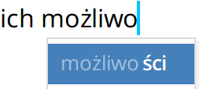

Jest miliard edytorów tekstu. Czym się wyróżnia właśnie ten?

<!--truncate-->

[Write!](https://writeapp.co/) to aplikacja do pisania urozmaiconego tekstu
(ang. rich text), a więc pozwala na wybieranie stylów typu nagłówki i akapity,
czy prostych pogrubień i kursywy. Aplikacja została stworzona przez firmę
HamsterCoders i jest ich próbą stworzenia narzędzia do pisania na miarę XXI
wieku. Oprócz Write!, HamsterCoders tworzą cały szereg zaawansowanych narzędzi
informatycznych, jak na przykład te dostępne w
[ich repozytorium na GitHubie](https://github.com/HamsterCoders).

My dostaliśmy propozycję przetestowania aplikacji Write! i postanowiliśmy
podzielić się wrażeniami z funkcjonalności, które przykuły naszą uwagę. Jeżeli
czujecie, że aplikacja może być interesująca, poczytajcie o jej możliwościach na
stronie [https://writeapp.co](https://writeapp.co).

Edytor Write! pozwala zapisywać pliki w chmurze i otwierać je z dowolnego
urządzenia, na którym jest zainstalowany (Windows, Mac OS lub Linux). Program
można nabyć za jednorazową opłatą 19,95 USD. Żeby go używać, trzeba założyć
konto, pod którym będą zapisywane nasze pliki. Po założeniu konta można
instalować aplikację na dowolnej liczbie urządzeń.

Co ciekawe, twórcy aplikacji oferują stypendium dla studentów w USA, Kanadzie,
Australii i Wielkiej Brytanii w wysokości 1000 USD. Więcej szczegółów
[na stronie](https://writeapp.co/write-app-scholarship).

Mieliśmy okazję potestować aplikację przez jakiś czas i poniżej umieszczamy małą
listę plusów i drobnych minusów.

## Plusy

- dokumenty można publikować online - wysyłać mailem lub szerować przez media
  społecznościowe
- pliki są zapisane w chmurze, więc są dostępne z różnych urządzeń
- pliki można formatować w przeróżny sposób oraz ozdabiać je licznymi
  dekoracjami czy kolorami
- fajny, intuicyjny UI
- spellcheck po polsku!
- autocomplete, czyli autouzupełnianie w czasie pisania, które zgaduje jakie
  słowo chcemy napisać (chociaż dla niektórych może to być minus, a nie
  plus)
- eksport do wielu formatów
  - HTML
  - PDF
  - ODF
  - DOCX
  - TXT
  - Markdown (.md, .markdown, .mdown, textile .md, wiki .md)

## Drobne minusy

- żeby użyć sugestii spellchecka, trzeba wcisnąć F7 - to może mieszać w głowie
  osobom, które są przyzwyczajone prawo-klikać na podkreślone słowa, żeby je
  poprawiać
- czasem dzieją się dziwne rzeczy związane z synchronizacją w chmurze, ale chyba
  tylko jak się testuje aplikację do granic możliwości, np. edytuje ten sam plik
  na dwóch urządzeniach jednocześnie

## Z punktu widzenia Technical Writera

Aplikacja nie została stworzona do technical writingu, więc nie ma
funkcjonalności, które byłyby przydatne w naszym fachu. Na przykład nie
użylibyśmy jej, żeby stworzyć online helpa i edytować jego CSS, lub pisać w
Markdownie z podglądem. Niemniej jednak, można znaleźć kilka ciekawych
zastosowań:

- Pisać wzbogaconym tekstem i eksportować do innego formatu, np. HTML lub
  Markdown
- Publikować proste dokumenty do formatu PDF
- Składać i publikować dokumenty z wielu plików - traktując każdy plik jak
  rozdział
- Współpracować z innymi autorami bądź ekspertami (SME) nad jednym dokumentem w
  chmurze

Poza tymi wąskimi zastosowaniami, nie jest to raczej narzędzie, które się przyda
Technical Writerowi. Zazwyczaj mamy do dyspozycji inne narzędzia, które lepiej
spełniają powierzone nam zadania, a do tych kilku zastosowań możemy użyć
darmowych narzędzi, jak na przykład Google Docs.

## Podsumowanie

Aplikacja jest poręczna i wygodna w użyciu. Pozwala na większą swobodę niż
edytory tekstu takie jak Notepad++, ale nie ma takich możliwości jak MS Word. Ma
wprawdzie pewne braki, ale to raczej drobne minusy niż jakieś poważne problemy.

Czy Wam się przyda? Czy warta jest swojej ceny? Decyzja należy do Was.
