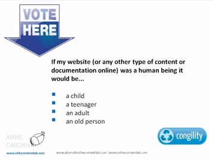

Z inicjatywy organizacji [Congility](http://www.congility.com/ "Congility"), 12
marca odbyło się webinarium poprowadzone przez
[Anne Caborn](http://www.inthecontentlab.com/about/ "Anne Caborn"), specjalistkę
od zarządzania treścią i trenerkę. Opowiadała ona o tym co sprawia, że treść
staje się atrakcyjna dla użytkownika i dla maszyny.

Od razu zaznaczmy, że mówiąc o maszynach mamy tutaj na myśli wyszukiwarki
internetowe, które definiują "atrakcyjność" treści przy użyciu odpowiednich
algorytmów.

## I'm not bad, I'm just drawn this way

Treści publikowane w sieci są wynikiem pracy wielu różnych ludzi, w tym osób
zajmujących się komunikacją techniczną, ale niezależnie od tego kto je tworzy,
powinny one być atrakcyjne zarówno dla ludzi jak i dla maszyn. Często jednak
rodzi się konfilkt pomiędzy oczekiwaniami twórców treści, tym co chcą oni
przekazać, a tym jak mogą to przekazać. Ważne, aby pamiętać o tym, że drobne
potknięcie może być bardzo poważne w skutkach i mieć ogromny wpływ na to, jak
dana treść zostanie odebrana.

Nie bez znaczenia jest też to, że użytkownicy internetu dojrzewają i rozwijają
się. Poznajemy nowe technologie, rozwijamy swoje umiejętności, a co za tym
idzie, rosną nasze oczekiwania, również te dotyczące przekazywanych nam treści.
Tutaj jako przykład Anne przywołała reklamy telewizyjne, które na przełomie lat
niezwykle się rozwinęły. A stało się to, bo widownia ciągle uczyła się czegoś
nowego i stawała bardziej świadoma. Nie można jej już tak łatwo wcisnąć byle
czego. Widzowie zauważają potknięcia, kłamstwa i nieścisłości tracąc przez to
zaufanie do reklamowanych marek. Ta forma przekazuje musiała więc dorosnąć wraz
z jej odbiorcami.

## Od dziecka do wczesnej dorosłości

Ale nie tylko odbiorca się rozwija. W przypadku internetu rozwija się też sposób
wyszukiwania i klasyfikowania materiałów zamieszczonych w sieci. Anne
przeprowadziła analizę wyszukiwarki Google porównując ją do faz
dojrzewania.Stwierdziła, że Google wkracza właśnie w dorosłość, i bardziej
stawia na jakość niż na ilość. Było to o tyle ciekawe porównanie, że zakończyło
się pytaniem do widowni. Zostaliśmy poproszeni o odpowiedź na poniższe pytanie:

Według 33% osób tworzone przez nich materiały są na poziomie dziecka, a 44%
porównało je do nastolatka. Wyniki o tyle ciekawe, że przeprowadzona wcześniej
sonda podczas której w taki sam sposób porównywaliśy Google ujawniła, że wyżej
oceniamy dojrzałość przeglądarki niż naszych własnych utworów. Według
prowadzącej pokazuje to, że istnieje pewna przepaść pomiędzy naszą wiedzą
technologiczną, a dojrzałością Google, co daje duże pole do manewru dla firm i
organizacji, które powinny rozpocząć otwarty dialog ze swoimi pracownikami w
celu znalezienia sposobu na zmniejszenie tej różnicy.

## Pióro potrafi więcej niż algorytm

To właśnie człowiek jest w tej dogodnej sytuacji, że może nagiąć zasady
wyszukiwania treści do swoich potrzeb, tworząc je bardziej atrakcyjnymi. Anne
Caborn przedstawiła kilka rad, jak to osiągnąć. Nawet jeśli niektóre wydawać się
mogą dość oczywiste, warto sobie o nich przypomnieć.

Nie wolno zapominać o konkretnych i treściwych tytułach oraz opisach. Język,
którego używamy musi być łatwo przyswajalny i nieprzesadzony. Treści powinny
zawsze wyjaśniać, odpowiadać na pytania i tłumaczyć co zrobić i jak to zrobić.

W ramach firm i organizacji ważne jest, aby ludzie na różnych stanowiskach
rozmawiali, wymieniali się doświadczeniami mówiąc co im się podoba, a co nie,
jakie treści są dla nich pożyteczne. Nigdy nie należy zakładać, że na przykład
za stworzenie dokumentacji technicznej odpowiada tylko i wyłącznie jeden dział.
Nie koncentrujmy się na tym, że tylko technical writer wie jak opisać
funkcjonalność, a tylko handlowiec potrafi stworzyć idealną prezentację dla
klienta. Wszyscy jesteśmy potencjalnymi odbiorcami wszelakich treści i wiemy jak
na jej różne formy reagujemy, więc **nie utwardzajmy silosów kompetencyjnych**.

I ważny punkt na koniec. Poszukując informacji, zawsze pytaj: **"Jak byś to
zrobił?"** A nie: "Czy mółbyś przekazać mi potrzebne informacje do stworzenia
tego dokumentu."

Nagranie całego webinarium można obejrzeć
[tutaj](https://www.youtube.com/watch?v=bm8784PN17M&feature=youtu.be).
Przypominamy też, że w czerwcu odbędzie się kolejna konferencja
[Congility](http://www.congility.com/congility-2014/). Może ktoś z was się
wybiera?

Przy okazji informujemy, że soap! organizuje wkrótce kolejne webinarium o
tematyce związanej z zarządzaniem treścię. Poprowadzi go Rahel Anne Bailie, a
szczegóły możecie znaleźć na ich
[stronie](http://www.soapconf.com/dont-miss-webinar/).
