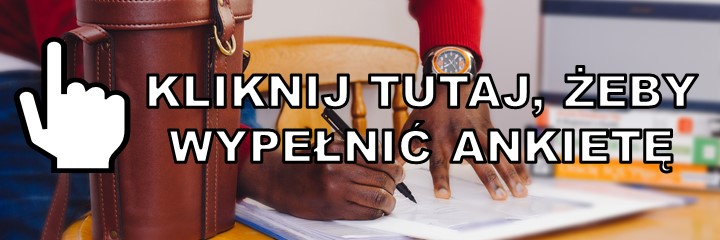

W tym roku, już po raz trzeci zachęcamy Was do wypełnienia ankiety o zarobkach.

<!--truncate-->

W 2017 roku postanowiliśmy zrobić nasze własne, kompleksowe badanie płac wśród
technical writerów i powiązanych profesji. Rok później, zrobiliśmy badanie
jeszcze raz. Wyniki ankiet możecie zobaczyć pod tymi linkami:

- [Wyniki badania płac w komunikacji technicznej 2017](http://techwriter.pl/wyniki-badania-plac-w-komunikacji-technicznej/)
- [Wyniki badania płac w komunikacji technicznej 2018](http://techwriter.pl/wyniki-badania-plac-w-komunikacji-technicznej-2018/)

W tym roku również wracamy do tematu i mamy nadzieję, że to badanie płac stanie
się naszą doroczną tradycją. Dzięki temu po kilku latach będziemy w stanie
pokazać pewne trendy.

Chcemy prosić Was o anonimowe podanie danych o Waszych zarobkach. Zebranymi
informacjami oczywiście się podzielimy.

Ankieta jest dostępna
[pod tym linkiem](https://docs.google.com/forms/d/e/1FAIpQLSdP1lBx1Wg-QlWN5uiMNO8-nQhQCO5UNbpyr-N2lcaAbS47WQ/viewform).

### Dlaczego warto wypełnić tę ankietę?

1. Bo pomoże ona Wam przy następnej zmianie pracy - dowiecie się jakich widełek
   płacowych można się spodziewać.
2. Bo pomoże ona osobom, które rozważają karierę w naszej branży - będą wiedzieć
   jakiego wynagrodzenia oczekiwać.
3. Bo pomoże ona rekruterom i osobom budującym zespoły komunikacji technicznej -
   będą wiedzieć ile kosztują najlepsi specjaliści w branży, czyli Wy 😊
4. Bo będzie to pierwsza ankieta, która pozwoli nam wszystkim za kilka lat
   prześledzić czy zarobki wzrastają czy spadają.

### Ile zajmie mi wypełnienie ankiety?

Ankieta zawiera tylko kilka prostych pytań. Jej wypełnienie nie zajmie Ci więcej
niż 2 minuty, a jeśli odpowiedzi będzie wystarczająco dużo - każdy z nas może
mieć z tego wymierną korzyść.

### Jak długo ankieta będzie aktywna?

Na odpowiedzi czekamy do 15 kwietnia 2019 roku.

### Gdzie będzie można sprawdzić wyniki ankiety?

Po zakończeniu badania, wyniki opublikujemy na techwriter.pl.

_Grafika pochodzi z serwisu [Vecteezy](https://vecteezy.com/)_
