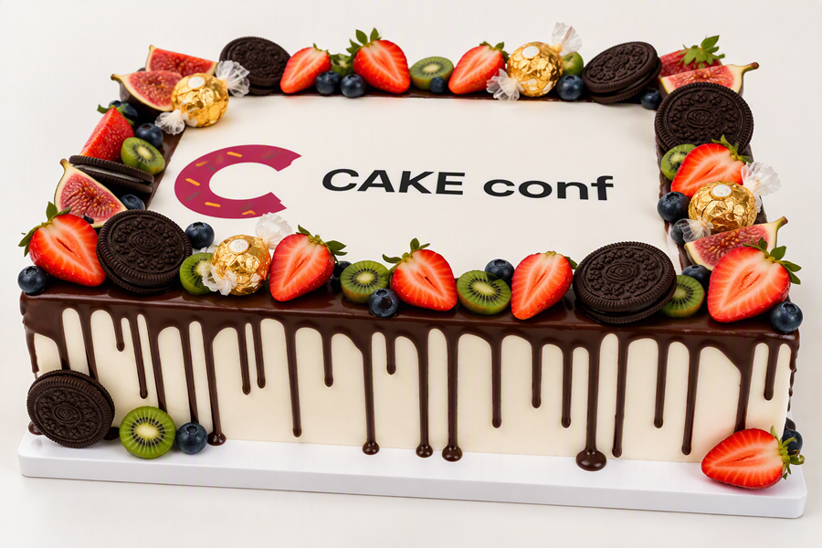

Druga edycja CAKE conf w Krakowie za nami! Sprawdź, jakie prezentacje, warsztaty i dodatkowe atrakcje czekały na uczestników tegorocznej konferencji.

<!--truncate-->

Za nami już druga edycja konferencji CAKE conf, która odbyła się w dniach 24-25 września 2026 r. na Wydziale Anglistyki Uniwersytetu Jagiellońskiego w Krakowie.

Dla przypomnienia, konferencja powstała z myślą o pisarzach, specjalistach, a także wszystkich entuzjastach pisania treści, którzy chcą się spotkać i wymienić doświadczeniami ze świata pisania i tworzenia treści, choć nie tylko.

Organizatorem wydarzenia jest znany już zapewne wielu osobom z branży zespół [Content Bytes](https://contentbytes.pl), który tworzą [Barbara Czyż](https://www.linkedin.com/in/barbara-szwarc/), [Edyta Rakowska](https://www.linkedin.com/in/edyta-rakowska/), [Kasia Zielińska](https://www.linkedin.com/in/kasia-szczepanska/) i [Paweł Chłodnicki](https://www.linkedin.com/in/pawelchlodnicki/).

## Co czekało na uczestników?

Przede wszystkim spora dawka wiedzy i nowinek z branży tworzenia treści, ale nie tylko! Organizatorzy zadbali o wszelkie szczegóły, począwszy od gadżetów powitalnych, przez dobrze zorganizowane zaplecze gastronomiczne, aż po konkursy, w których można było zgarnąć naprawdę fajne nagrody. Fani Lego na pewno nie byli zawiedzeni.

Co więcej, jednym ze sponsorów była firma TechSmith, dzięki której uczestnicy konferencji otrzymali roczny dostęp do [Snagit](https://www.techsmith.com/snagit/) za darmo.

Oczywiście nie mogło tam zabraknąć przedstawicieli portalu [techwriter.pl](https://techwriter.pl), który jest partnerem wydarzenia.

Za nami dwa pełne dni zdobywania wiedzy i nawiązywania nowych znajomości. Pewnie spora część czytelników jest ciekawa, jak dokładnie wyglądała tegoroczna edycja, więc przejdźmy do konkretów!

## Pierwszy dzień konferencji

### Walk & talk

Pierwszy dzień konferencji rozpoczął się z przytupem. W zeszłym roku zaczynaliśmy od warsztatów, a w tym roku dla chętnych organizatorzy przygotowali jeszcze jedną poranną atrakcję - **Walk & talk**. Poranny spacer połączony ze sporą dawką informacji na temat pobliskich atrakcji poprowadził Michał Skowron ([Tech Writer Koduje](https://techwriterkoduje.pl/)).

Była to świetna propozycja na poranną rozgrzewkę, poszerzenie wiedzy o Krakowie i poznanie nowych ludzi.

### Warsztaty

Godzina 9:30 to znak, że warsztaty czas zacząć! Formuła warsztatów pozostała niezmieniona względem pierwszej edycji. Mieliśmy do wyboru jeden z dwóch warsztatów dostępnych tego dnia. Warto wspomnieć o tym, że było zaledwie 14 miejsc, więc trzeba było szybko rezerwować miejsce!

Tego dnia mieliśmy do wyboru:

- Documentation teardown: a workshop for spotting what you’ve stopped seeing (Marcel Rebro)
- Building customized knowledge bases using markdown (Lance Cummings)

### Czas na prezentacje

Warsztaty to tylko przedsmak tego, co czekało na nas tego dnia. Przed nami było osiem różnych prezentacji, a pomiędzy nimi przerwy podczas których mogliśmy uzupełnić braki kawy, a także nawiązać nowe znajomości. Okazji ku temu było naprawdę bardzo dużo.
Prezentacje skupiały się na kilku głównych obszarach.

#### Dokumentacja

W tej kategorii mogliśmy wysłuchać trzech prezentacji:

- From documentation to certification: building a knowledge hub (Marzena Cudecka)
- How documentation can become a growth engine (Ian Freeman)
- Docs that rewire the brain: designing documentation for how people learn (Monika Skoneczna, Gergely Garai)

#### Sztuczna inteligencja

Podobnie jak w zeszłym roku, temat AI cieszył się dużym zainteresowaniem podczas konferencji. Pierwszego dnia wysłuchaliśmy trzech prezentacji:

- Designing the AI experience: what's old, what's new? (Kalina Tyrkiel-Szymańska)
- On becoming a slop janitor: an enemies to lovers story (Mateusz Król)
- AI as a skill: let’s stop and think beyond the prompt in learning, work, and docs (Małgorzata Lis)

#### Dostępność

Oczywiście nie zabrakło również tematu dostępności, z którym wielu pisarzy mierzy się na co dzień w swojej pracy. W tej kategorii znalazła się jedna prezentacja:

- Web fiction: when accessibility meets performance (Jakub Andrzejewski, Magdalena Pociecha)

#### Zarządzanie

Temat zarządzania pojawił się w jednej prezentacji tego dnia:

- How to survive and then thrive as a small documentation team (Paweł Woźnikowski)

Z pewnością wielu pisarzy może utożsamić się z rzeczywistością przedstawioną przez Pawła. Sporo z nas pracuje przecież w jednoosobowych lub małych zespołach dokumentacyjnych.

### After party

Ostatnia prezentacja zakończyła się po 17:30, ale to jeszcze nie oznaczało końca atrakcji tego dnia. Na wytrwałych uczestników czekało jeszcze after party.

Z relacji wiem, że wszyscy bawili się świetnie, a najbardziej wytrwali świętowali do późnych godzin nocnych.

## Drugi dzień konferencji

W drugim dniu konferencji również rozpoczęliśmy od warsztatów. Tym razem czekały na nas dwie propozycje - jedna związana ze sztuczną inteligencją, a druga z tematyką typowo dokumentacyjną:

- Agents do the busywork. You keep the craft (Leo Breedt)
- Sketchnoting against cognitive surrender (Olga Stefaniuk-Ziemecka)

Po zakończonych warsztatach, wszyscy znów spotkaliśmy się na piątym piętrze, aby rozpocząć kolejny dzień prezentacji.

### Czas na prezentacje, dzień II

Tego dnia czekało na nas sześć różnych prezentacji z obszarów sztucznej inteligencji, dokumentacji, a także wellbeing.

#### Sztuczna inteligencja

Można powiedzieć, że drugi dzień został zdominowany przez temat sztucznej inteligencji. Mogliśmy wysłuchać aż trzech prezentacji:

- Fact, fiction, and the future of AI in technical communication (Thomas Bro-Rasmussen, Scott Deloach)
- Copy that, words we didn’t choose (Justin Gagne)
- I taught an AI to write my docs (so I don't have to) (Agnieszka Marzec)

#### Dokumentacja

Tutaj czekały na nas kolejne dwa tematy do rozważań:

- Writing for different readers: when your audience is half human, half LLM (Anastasiya Biaroza)
- We've been building docs nav for ourselves (Tomas Nosek)

#### Wellbeing

Ta kategoria była nowością podczas tegorocznej konferencji i spotkała się ze sporym entuzjazmem, mimo że poruszany temat nie należał do najłatwiejszych.

- Counting down to Friday? How to tell a tough period from burnout (Aleksandra Kulga)

### Have a byte

Tego dnia również nie mogło zabraknąć nowości w agendzie. Michał Skowron był prowadzącym sekcję _Have a byte_, podczas której uczestnicy konferencji mogli wyjść na scenę i podzielić się z publicznością swoimi przemyśleniami na dowolny temat.

Znalazło się siedmiu śmiałków, którzy postanowili przemówić tego dnia, a jeden z nich nawet pokusił się o wyjaśnienie, który majonez jest lepszy - Winiary czy Kielecki?

Pozwolicie jednak, że nie zaprezentuję wyników tej ankiety, aby nie wywoływać zbyt silnych emocji wśród naszych czytelników.

Sekcja _Have a byte_ okazała się więc strzałem w dziesiątkę, a dwóch najlepszych mówców zgarnęło gadżety przygotowane przez Michała.

## Zakończenie konferencji

Po ostatniej prezentacji tego dnia nadszedł czas na słodkie pożegnanie. Na uczestników czekał pyszny tort, który był idealnym zwieńczeniem dwóch intensywnych dni konferencji.

Jeśli przegapiłeś tegoroczną konferencję CAKE conf, a jesteś żądny wiedzy i poznania innych z branży, nie musisz czekać kolejnego roku! Zespół Content Bytes regularnie organizuje spotkania w Krakowie. Warto śledzić ich [LinkedIn](https://www.linkedin.com/company/content-bytes/), aby nie przegapić najbliższego spotkania.

Zespołowi Content Bytes dziękujemy za organizację tak świetnego wydarzenia i trzymamy kciuki, aby udało się je powtórzyć również za rok!

Mam nadzieję, że do zobaczenia w 2027 r.!
