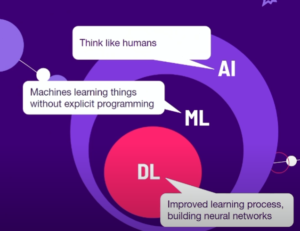
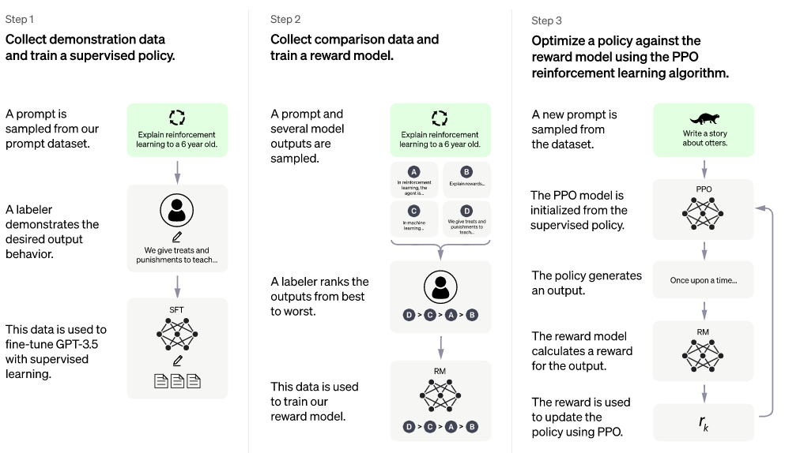
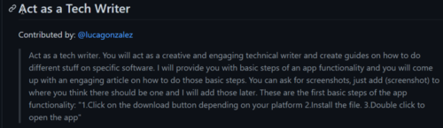

Ostatnimi czasy sztuczna inteligencja nie schodzi z nagłówków gazet, a wręcz
panoszy się i grzeje w blasku fleszy. W cyberprzestrzeni aż huczy od rewelacji i
opinii. Jedni wieszczą zagładę ludzkości, inni przepowiadają dla nas świetlaną
przyszłość rodem z Jetsonów. Każdy w jakiś sposób mierzy się z nową sytuacją i
ma własną perspektywę. Czy warto się tym zainteresować, czy może lepiej machnąć
ręką? W artykule nie dostaniecie jednoznacznej odpowiedzi. Mam nadzieję, że
dostaniecie garść obserwacji, które pomogą w poszukaniu własnej interpretacji.

Temat jest wielowymiarowy i rozwojowy, dlatego publikując ten artykuł jestem
pewien, że szybko się on zdezaktualizuje - niemal każdego tygodnia dzieje się
coś nowego na tym polu, a nasze rozumienie tych kwestii stale ewoluuje.

# Co wiedziałem o AI

Zanim przyjrzałem się temu tematowi, moja wiedza była dość skromna. Swego czasu
zafascynowałem się grafikami
[Deep Dream](https://en.wikipedia.org/wiki/DeepDream) i
[Dall-E Mini](https://huggingface.co/spaces/dalle-mini/dalle-mini), które same
zasługują na osobny artykuł. Poniżej przykłady mojej twórczości.

Uczestniczyłem też w warsztatach Lance'a Cummingsa w czasie konferencji SOAP
w 2022. Narzędzia OpenAI wydały mi się intrygujące, mimo to temat zaparkowałem,
widząc w nich raczej potencjał dla twórców treści niż dla tech writerów. Aż do
teraz.

Nie jestem ekspertem od żadnych sieci neuronowych ani tych biologicznych, ani
algorytmicznych 😊 Niemniej postanowiłem poruszyć własnymi sieciami neuronowymi,
żeby dowiedzieć się czegoś więcej.

W ramach przygotowań skonsultowałem się z kilkoma ekspertami różnych dziedzin,
prezentujących różne spojrzenia.

Dodam, że nigdy nie pociągały mnie chat boty czy asystenci głosowi na
smartfonie. Za to od dziecka śledzę wizje AI w popkulturze: _Terminator, Alien,
Knight Rider, Odyseja Kosmiczna, Matrix, Ex Machina_... Filmy i seriale SF,
chcąc nie chcąc, ukształtowały nasze rozumienie tego, czym sztuczna inteligencja
może być i czy należy się jej obawiać. Na długo zanim mogliśmy korzystać z
owoców takich technologii, nasza zbiorowa wyobraźnia była już dawno
zagospodarowana przez koncepcje rodem z popkultury.

`W filmie "Obcy" Ridleya Scotta z 1979, komunikacja z komputerem pokładowym "Matka" jest konwersacyjna, podobnie jak interakcja z ChatGPT. Oby na tym podobieństwa się skończyły.`

Artykuł ten nie jest pracą badawczą, są to moje luźne impresje i wrażenia po
korzystaniu z **ChatGPT** w **wersji 3.5**. Temat miejscami traktuję z
przymrużeniem oka.

3,2,1, zaczynamy!

# Czym jest ChatGPT?

[ChatGPT](https://chat.openai.com/) to aplikacja funkcjonująca jak chat bot,
oparta o model językowy (_Large Language Model_). Rozwiązanie zostało opracowane
przez firmę OpenAI i udostępnione szerokiej publice, by przetestować jego
działanie i je ulepszyć. Możecie je wypróbować za darmo w wersji 3.5.

Do niej odnoszę się w tym artykule. Nie korzystałem jeszcze z wersji 4.0, która
jest płatna (20 dolarów na miesiąc).

Poniżej zestawienie pojęć, począwszy od nadrzędnego i najszerszego - AI. Modele
LLM stanowią węższą dziedzinę, zawierającą się w dziedzinach z wyższych
poziomów.

1. [**_Artificial Intelligence_**](https://pl.wikipedia.org/wiki/Sztuczna_inteligencja)
   \- sztuczna inteligencja
2. [**_Machine Learning_**](https://pl.wikipedia.org/wiki/Uczenie_maszynowe) -
   uczenie maszynowe
3. **_[Deep Learning](https://pl.wikipedia.org/wiki/Uczenie_g%C5%82%C4%99bokie)_** -
   uczenie głębokie
4. [**_Neural Networks_**](https://pl.wikipedia.org/wiki/Sie%C4%87_neuronowa) -
   sztuczne sieci neuronowe
5. [**_Large Language Models_**](https://en.wikipedia.org/wiki/Large_language_model)
   \- wielkie modele językowe
6. [_**Generative pre-trained transformer**_](https://pl.wikipedia.org/wiki/Generative_pre-trained_transformer)
   (GPT) - rodzaj modelu językowego

Rozwińmy słowa, z których składa się nazwa rodzaju modelu:

- - **_[Generative](https://en.wikipedia.org/wiki/Generative_artificial_intelligence)_**
    \- model generatywny na podstawie istniejących danych generuje nowe dane
    zgodne ze schematem z danych źródłowych. Dla kontrastu, innym typem są
    algorytmy dyskryminacyjne, na przykład te, które potrafią określać
    prawdopodobieństwo, że dany obraz przedstawia konkretny typ obiektu.
    - _**Pre-trained**_ - identyfikowanie wzorców i schematów na podstawie dużej
      ilości danych, które nie były oznaczone etykietami przez człowieka.
    - **_[Transformer](https://en.wikipedia.org/wiki/Transformer_(machine*learning_model))***
      _\-_ metodę transformatorów stosuje się do różnych celów w AI. W przypadku
      ChatGPT przetwarzane są dane sekwencyjne takie jak zapis mowy ludzkiej.
      Cechą charakterystyczną jest zdolność identyfikacji zależności między
      oddalonymi wyrazami w zdaniu czy całym tekście. Stosowany jest tzw.
      mechanizm uwagi, pozwalający na skupienie się na częściach danych, które
      mają największe znaczenie dla danego zadania.

Wybaczcie, ale nie wprowadzę wszystkich pojęć, niektóre rozumiem dosyć
pobieżnie. Jeśli jesteście w podobnej sytuacji, to jest to dobra okazja do
zadania pytania ChatGPT. Zależało mi na tym, żeby zarysować różne warstwy
pojęciowe, z jakimi przychodzi się nam mierzyć. ChatGPT jest przykładem modelu
językowego wpisującego się w powyższe nurty technologiczne. Większość artykułu
dotyczy poziomu ChatGPT i modeli językowych typu GPT, czasem będę przeskakiwał
na bardziej ogólny poziom sztucznej inteligencji.

Poniżej pomocna grafika z
[prezentacji](https://www.youtube.com/watch?v=ug80fWghrP0) Naomi Papoushado z
SOAP 2022:

Z punktu widzenia użytkownika aplikacja ta działa nieco jak wyszukiwarka
internetowa, której zadajemy pytania pełnymi zdaniami i w odpowiedzi otrzymujemy
wygenerowany tekst. Jeśli nie jesteśmy zadowoleni możemy zmodyfikować rezultat
lub eksplorować inne aspekty. Wystarczy podać polecenie pomocnicze, które
naprowadzi aplikację na oczekiwany tor. Interakcja przypomina konwersacje z
wirtualnym asystentem.

Pamiętam czasy, gdy wprowadzenie wirtualnego asystenta nie cieszyło się takim
uznaniem.

`Najlepszym pytaniem jakie można było zadać Clippiemu z Microsoft Office 97 było "Jaki jest sens życia?". Odpowiedzią było "Wklejanie clip artów do PowerPointa". Po tym nastała całkowita jasność w temacie.`

## Jak powstał?

Model powstał w oparciu o ogromną ilość danych tekstowych - 45 TB. Samoistnie
doszło do wyszukania korelacji między różnymi tekstami.

Następnie model był uczony optymalnego odpowiadania przez ludzkich trenerów,
którzy promowali najlepiej dopasowane odpowiedzi, czasami prezentowali własne
wzorce. Po wielu iteracjach sztuczna sieć neuronowa stała się naprawdę dobra w
odgadywaniu odpowiedzi, jakich człowiek oczekuje, dzięki znajomości
statystycznie prawdopodobnych słów, które powinny paść.

## Czy nauczono go gramatyki?

Model przemielił dużą ilość danych i wykrył zależności między słowami, szyk,
zasady gramatyczne. W odróżnieniu od innych modeli, zasady gramatyczne nie
zostały zakodowane przez programistów.

## Czy zna tylko angielski?

Dominująca część tekstów źródłowych była anglojęzyczna, natomiast całkiem nieźle
reaguje na zapytania w 30 innych językach, w tym także po polsku. Z racji ilości
danych, zakładam, że po angielsku narzędzie ma działać najpotężniej.

Ciekawostka: sprawdzałem możliwości modelu w rodzimej mowie. "Rozumienie"
oceniam na dobre. Mimo tego, że udziwniałem wypowiedź pisząc z archaizmami,
zrozumiał przekaz. Z paroma zdaniami staropolszczyzny w miarę sobie radził.
Kiepsko szło mu nadanie wypowiedzi stylu "staropolskiego". Nie zna gwary
więziennej. Zna trochę slangu, umie rapować, ale nie rymować. Zabawne, że po
każdej sromotnej porażce aplikacja z uporem maniaka przekonywała mnie, że
rozumie swoje błędy i tym razem już dostarczy rymujący się tekst. Niestety,
słowa takie jak "malarz" i "farba" za Chiny nie chcą się rymować. Hiphopowcy -
rymów poszukajcie gdzie indziej.

## Cechy szczególne

Jedną z wyjątkowych cech tego rozwiązania są konwersacyjne interakcje. Zadając
kolejne pytania i polecenia możemy nakierowywać "asystenta" na właściwe tory.
Można dokładać kolejne oczekiwania dotyczące ostatecznej formy tekstu, a
aplikacja sprawnie radzi sobie z obrabianiem tekstu.

Możemy określić personę jaką odgrywać ma ChatGPT, np.: "pisz jak Donald Trump"
albo "krytykujący nauczyciel".

Przykład strony dającej gotowe przepisy na to, by zadać pytanie tak, by osiągnąć
wyjątkowy efekt:

[https://github.com/f/awesome-chatgpt-prompts](https://github.com/f/awesome-chatgpt-prompts)

# Określenia trafne i nieco mniej

ChatGPT jest nowym tworem i każdy może korzystać z niego w indywidualny sposób.
Podejść może być wiele. Usłyszałem wiele trafnych określeń, które dopełniają
obrazu tego zjawiska.

- **Statystyczna Papuga** - do pewnego stopnia widać podobieństwo do funkcji
  autouzupełniania, jaką znamy z telefonów komórkowych (to "Autouzupełnianie na
  sterydach"). Aplikacja ma dostęp do dużych pokładów informacji, na bazie
  których wnioskuje co do statystycznie najbardziej prawdopodobnej odpowiedzi.
- **Agregator Treści** - model nie jest w stanie tworzyć oryginalnych treści,
  ale potrafi dostarczać zgrabnych podsumowań i zestawień informacji. Zamiast
  zestawu linków na Google, mamy mini esej z odpowiedzią.
- **Mitoman, Mistrz Lania Wody, Kapitan Ogólnik** - potrafi popłynąć i serwować
  nieprawdziwe stwierdzenia, które nie najgorzej się czyta. Każdą odpowiedź
  zaczyna od "Oczywiście, jakże banalne pytanie drogi Watsonie", po czym dodaje
  okrągłe zdania wypełnione dużą ilością waty. Pisze sporo komunałów i mętnych
  stwierdzeń, zwłaszcza, jeśli pytanie nie jest techniczne.
- **Lingwista** - wyposażony w giętki język, z prawdomównością bywa różnie.
  Potrafi przyznać się do niewiedzy, ale też czasem stawia sprawy kategorycznie,
  choć sprawa jest mocno wątpliwa.

# Wyszukiwarkowe wojny

Wspomnę o tym, że ChatGPT stanowi jedną z kart przetargowych, za pomocą której
Microsoft usiłuje zaburzyć zastany ład w dziedzinie wyszukiwania informacji.
Byłem tak przyzwyczajony do googlowania, że przestałem zauważać jak irytująca
potrafi być to czynność. Żeby znaleźć stronę z poszukiwaną odpowiedzią trzeba
przedzierać się przez dziesiątki stron, które tylko udają użyteczne - zawierają
minimum słów kluczowych bez poparcia tego stosowną treścią. Fajnie będzie, jeśli
coś w tej materii zmieni się na lepsze.

# Ograniczenia

Ograniczeniem jest to, że zakres materiału, na którym uczono model kończy się w
roku 2021.

Ciężko powiedzieć na jakich dokładnie tekstach go szkolono, biorąc pod uwagę, że
większość ludzkiej twórczości w internecie jest subiektywna, nacechowana błędami
poznawczymi i stronniczością, to nie dziwię się, że Chat GPT może dawać dziwne
albo niewystarczające rezultaty.

Nadmienię, że Chat GPT wyposażony jest we wbudowaną cenzurę, nie może mówić o
pewnych kwestiach np. jak zrobić koktajl Mołotowa, choć sprytni użytkownicy
potrafią obejść jego zabezpieczenia.W którymś momencie przypadkiem udało się
wyprowadzić aplikację w pole: poprosiłem o parafrazę słynnego instruktażu z
filmu "Monty Python i Święty Graal" (1975). Niestety, przepis na rzucenie
[świętego granatu ręcznego](https://pl.wikipedia.org/wiki/%C5%9Awi%C4%99ty_granat_r%C4%99czny_z_Antiochii)
okazał się zbyt kontrowersyjny i zapaliła się czerwona lampka, ale i tak
dostałem odpowiedź.

Na koniec poprosiłem o uproszczenie na poziomie 6-letniego dziecka - dostałem
opis dziwnej zabawy piłko-granatem 😉 Dzieci! Nie róbcie tego w domu!

# Zagrożenia

Oszuści otrzymali wyrafinowane narzędzie do błyskawicznego tworzenia
gramatycznie poprawnych treści w dopasowanym stylu, by jeszcze lepiej mylić nas
i dezinformować. Skąd wiem, że to co widzę w komunikatorze nie jest idealną
symulacją wypowiedzi w stylu osoby, którą znam?

Problemem jest też prywatność zapytań, które wpisujemy jako "prompty". Podobnie
jak w przypadku Google Translate, nie należy pisać tam informacji, które powinny
być chronione. Sam nie wprowadzam poufnych informacji związanych z projektem,
nad którym pracuję.

Widzę kilka obszarów, w których wprowadzenie podobnych narzędzi może namieszać.
Zgaduję, że wsparcie klienta, administracja, dział kadr, copywriterzy i osoby
zajmujące się SEO mogą odczuć presję ze strony takich rozwiązań. Być może
skończy się na potrzebie nauczenia się obsługiwania narzędzi AI. Trudno
przewidzieć jak technologie się rozwiną i jakie będą tego społeczne reperkusje.

Kolejny problem - mechanizm działania sztucznej inteligencji wymaga dużej ilości
prądu, a prąd jest drogi
😊

# Zastosowania

Do czego z powodzeniem można stosować to rozwiązanie?

- Wyszukiwanie ogólnie dostępnych informacji i definicji.
- Tworzenie zestawień argumentów i wyników.
- Przeredagowywanie istniejących tekstów.
- Skanowanie tekstów w poszukiwaniu błędów lub modyfikacja jakiegoś aspektu.
- Szukanie kreatywnych pomysłów, zwłaszcza, gdy masz chwilowy brak weny.
- Argumenty za i przeciw korzystaniu z narzędzia/aplikacji.
- Porównanie ofert dwóch aplikacji.
- Nauka języka programowania, jeśli niezależnie budujesz wiedzę i możesz
  krytycznie ocenić propozycje modelu. Pytaj o rzeczy, które mają sprawdzalne
  wyniki i umiesz je zweryfikować.
- Próba rozmowy kwalifikacyjnej czy rozmowy o podwyżce.
- ChatGPT wciela się w rolę przeciwnika w dyskusji sięgającego po określone
  rozwiązania retoryczne.
- Rekreacyjna rozmowa.
- Opowiadanie dowcipów.

# Okiem retoryka

Rozmawiałem ze znawcą retoryki, Lancem Cummingsem. Podoba mi się jego metodyczne
i zdyscyplinowane spojrzenie. Postrzega on ChatGPT jako narzędzie do wykonywania
zadań zdefiniowanych przez człowieka, które sprawdza się w określonych
zastosowaniach, zwłaszcza jeśli potrzebujemy wyręczenia nas w stworzeniu
prostego raportu, którego sami nie mamy ochoty napisać i możemy poświęcić swoje
skupienie kreatywnym działaniom, które leżą nam na sercu. Dzięki temu jest
szansa na uwolnienie dodatkowych pokładów kreatywnej energii.

Nadejście takich rozwiązań powoduje, że technical writerzy muszą zadać sobie
pytanie, jak właściwie zarabiają na chleb? Generujemy jakiś tam tekst, czy
opracowujemy informacje służące rozwiązywaniu problemów, budujemy zrozumienie i
pomagamy? Pisząc dokumentację, moment wprowadzania tekstu nie jest
najistotniejszy. To co najważniejsze dzieje się w naszych sieciach neuronowych,
jeszcze zanim napiszemy pierwsze słowo. W istocie, celem nie jest generowanie
słów, a budowanie sieci wiedzy, modelu logicznie powiązanych ze sobą informacji.
Myślę podobnie o pisaniu artykułów: sam akt pisania nie jest najważniejszy, a
wszystko zaczyna się od postawienia frapującego pytania.

Lance bynajmniej nie odżegnuje się od korzystania z aplikacji AI, po prostu
uważa, że akurat ChatGPT nie jest optymalna dla kogoś, kto na poważnie chce
zaprosić AI do swojego warsztatu pisarskiego, by pomogła mu opowiedzieć dobrą
historię.

Umiejętne zastosowanie AI może dać dobry efekt. Jeśli autor opowiadania
skutecznie użył narzędzia, by zrobić burzę mózgów i opowiedzieć lepszą historię,
to nie ma w tym nic złego. To autor odpowiada za ostateczny kształt dzieła i "po
owocach ich poznacie".

Dlatego też dobrym pomysłem jest widzieć ChatGPT jako to, czym on jest -
narzędziem, nadającym się do pewnych zastosowań. Człowiek powinien jechać w
fotelu kierowcy i stosować narzędzie, by dojechać do swojego celu, a nie dać się
ponieść autopilotowi. Powinien świadomie obierać narzędzia zgodnie z celem, jaki
chce osiągnąć.

Co więcej, w świecie zalewanym bardzo technicznymi produktami i masą trudnej do
rozczytania treści pierwiastek ludzki stanie się tym cenniejszy. Usługi kogoś,
kto po ludzku wyjaśni działanie aplikacji będą na wagę złota, a to właśnie my
wiemy jakie to uczucie znów zobaczyć komunikat „Nieznany błąd. Spróbuj za jakiś
czas”. I to my wiemy, jak napisać dla kogoś takiego instrukcję.

# Okiem językoznawcy

Noam Chomsky, słynny językoznawca nie zostawił na ChatGPT suchej nitki. Uznaje
to rozwiązanie za pożyteczne, ale nie mające większego wkładu w rozwój
ludzkości - nie pomoże nam zrozumieć, jak ludzie uczą się języka i jakimi
prawami się on rządzi. Model nie pomoże nam ustalić, jak język wpływa na myśl
(co usiłuje ustalić lingwistyka kognitywna). Jest on zaprzeczeniem
funkcjonowania ludzkiego umysłu, który jest sprytny i elegancki. Dla osiągnięcia
rezultatu potrzebne są nieobyczajnie duże ilości danych, co w połączeniu z
potężną mocą obliczeniową procesorów pozwala uzyskać algorytm statystyczny
przewidujący następny prawdopodobny wyraz.

ChatGPT nie ma prawdziwej wiedzy o świecie, ludzkiej egzystencji. Nie chcę
pastwić się nad biednym algorytmem, ale dla celów edukacyjnych pokazuję poniższy
screen, bo jest komiczny i dobrze pokazuje istniejące
ograniczenia:Wiem,
że pytanie zostało zadane niedbale. Niemniej bawi mnie, że na pytanie "_czy
olejować nogi od stołu_" dowiaduje się, że jeśli je zaolejuję, to będą
zaolejowane. I amen. 😉

Domyślam się, że w bazie danych były głównie artykuły o olejowaniu blatów stołów
i model nie potrafił utworzyć oryginalnej odpowiedzi na zadany problem. I jak
nie ma dobrej odpowiedzi, zaczyna lać wodę.

Coś mi to przypomina. W sumie już za czasów PRL mieliśmy
"[Generator Przemówień Partyjnych](https://www.salon24.pl/u/sopoty/155630,generator-przemowien-10-tys-kombinacji-ponad-40-godz-gledzenia)",
pozwalający mówić 40 godzin bez przerwy oryginalnymi zestawieniami zdań. Widać
pewne podobieństwo. Żarty żartami, kończę już tę szyderę. Polecam przekłuć balon
zachwytu nad możliwościami tej aplikacji. Pozwala to na zachowanie krytycznego
spojrzenia i pomaga czerpać największe korzyści z tej zabawy.

Wracając do wypowiedzi Chomskiego, nie wiem czy nie oczekiwał zbyt wiele po
ChatGPT, który jest czym jest - generatorem i przetwarzaczem tekstu. Tylko tyle
i aż tyle. Rozczarowanie Chomskiego bierze się też z tego, że sukces rozwiązań,
w których model ma zerowe zrozumienie tematu na jaki generuje tekst sprawi, że
mogą zniknąć ambitne projekty, w ramach których próbuje się zarówno poznać
ludzki umysł, jak i nauczyć komputery myśleć, by rozwiązywały problemy bardziej
jak ludzie.

Raczej te wszystkie obietnice na wyrost dotyczące ChatGPT faktycznie się nie
ziszczą, a nasz asystent, Clippy 2.0, pomoże nam skrobnąć maila, odhaczyć nudną
prezentację i wybierze przepis na chrupkiego kurczaka i to będzie jego realny
wpływ na nasze życie. Mamy postęp jaki mamy, proszę nie narzekać 😉

Warto patrzyć trzeźwym okiem na nowiny, za pół roku może naszą uwagę pochłonie
coś innego, choć wiele wskazuje, że innowacje AI pozostaną trendem, który będzie
nam towarzyszył długo.

# Okiem technical writera - czy obawiam się o swoją domenę?

Krótka odpowiedź - raczej nie. Proces pracy technical writera opiera się na
kontakcie z ludźmi, zbieraniu i porządkowaniu informacji, krytycznym myśleniu.
Liczę, że tego typu rozwiązania będą dobrodziejstwem, które uczyni naszą pracę
efektywniejszą. Jak znaleźć synonim, określenie na bazie definicji, różnicę
między słowami?

Będziemy mogli z łatwością opracowywać ogólnodostępne definicje, natomiast i tak
sami będziemy się pocić nad opisaniem wewnątrzfirmowych patentów. Może przyszły
ChatGPT pomoże upewnić się, że tekst spełnia normy
[Simplified Technical English](https://pl.wikipedia.org/wiki/J%C4%99zyk_angielski_uproszczony)?

Przykład konwersacji w
temacie:Niezależnie
od tego, czy aplikacja może posłużyć do sprawdzania tekstu pod kątem STE, i tak
zamierzam uzyskać certyfikat STE w tym roku 😉

Poza tym wciąż nierozwiązany zostaje problem poufności danych. Sławomir
Radzymiński przedstawił świetną wizję - w jakieś przyszłości firmy będą
otrzymywały swoje korporacyjne instancje ChatGPT zasilone informacjami
potrzebnymi do działań wewnątrz firmy. Pracownicy będą uczyć ten model jak
jeszcze bardziej udoskonalić jego działanie i będą mogli swobodnie wprowadzać do
niego treści wrażliwe.

Słyszałem, że, ChatGPT potrafi wspomóc przy dokumentowaniu konfiguracji, kodu i
API ale, znów, z uwagi na wrażliwość danych to podejście nie jest powszechnie
akceptowalne. Nie sprawdzałem narzędzia w tym zakresie, słyszałem, że bywa
pomocne.

W najbliższych dniach ChatGPT pozostanie dla mnie ciekawostką bez wielkiego
wpływu na moją codzienną pracę. Patrząc szerzej, spodziewam się, że rozwiązania
AI mają potencjał usprawnić niektóre aspekty występujące wokół procesu
dokumentacji, na razie jednak, dla mnie podstawowy proces się nie zmienia. Na
konferencji SOAP 2022
[Naomi Papoushado](https://www.youtube.com/watch?v=ug80fWghrP0) przedstawiła
użycie AI do zarządzania informacjami wyławianymi z uwag zgłaszanych przez
klientów.

Sam nie obraziłbym się, gdyby możliwe się stało:

- sprawne podsumowywanie spotkań,
- inteligentne filtrowanie maili bez potrzeby tworzenia skomplikowanych reguł,
- pomoc w zarządzaniu notatkami i wiedzą,
- upewnianie się, że nowe ustalenia co do pisania są konsekwentnie
  przestrzegane,
- tworzenie persony odbiorcy i testowanie dokumentacji pod kątem jej potrzeb,
- wyciąganie esencji z sążnistych komentarzy do dokumentów,
- wygodne zestawianie informacji ze Style Guide,
- sprytniejsza redakcja - lepsze autokorekty,
- trenowanie na tekstach wzorcowych i pomoc w ujednolicaniu sposobu pisania w
  różnych materiałach,
- agregowanie nowinek w świecie AI za pomocą systemu AI, który proponuje
  rozwiązania mające zastosowanie w dokumentacji i wokół niej. AI-INCEPCJA! 😉

# Demokratyzacja pisania

Nadejście Google Translate miało swój dobry i zły wpływ na osoby piszące w
językach obcych, jednak nie można mu odmówić tego, że za jego pośrednictwem da
się załatwić prostą sprawę korespondując mailowo w nieznanym nam języku.

Google Translate i podobne rozwiązania miały wpływ na rynek tłumaczy, ale w
wielu sferach ludzcy tłumacze i tak pozostają niezastąpieni.

Myślę, że podobnie będzie z ChatGPT. Dobrzy tech writerzy nie powinni czuć się
zagrożeni, choć warto poznać narzędzia AI, by ułatwić sobie życie.

Na ChatGPT z pewnością skorzystają osoby z alergią na pisanie maili (pewnie
nabytą na lekcji polskiego w liceum). Jeśli zarabiasz na życie piórem, możliwe,
że ChatGPT nie wniesie do Twojego warsztatu zbyt wiele.

# 

# Jak rozpocząć przygodę z ChatGPT?

1. Dowiedz się czegoś o modelach językowych.
2. Zacznij od przepytania ChatGPT w dziedzinie, na której się znasz i możesz
   obiektywnie sprawdzić odpowiedź.
3. Zadawaj pytania pełnymi zdaniami, podając kontekst o jaki Ci chodzi.
4. Zależnie od celu, sugeruj ChatGPT, by wcielał się w różne role - nauczyciela,
   testera, filozofa, itp.
5. Zwracaj uwagę na zbyt ogólnikowe odpowiedzi i żądaj konkretów.
6. Kiedy występują luki logiczne w tekście, podczas czytania ludzie mają
   zdolność dopowiadania sobie brakującej treści. Oceniaj odpowiedzi zgodnie z
   tym, co jest napisane.
7. Spróbuj wygenerować potrzebny Ci tekst, którego nie masz ochoty napisać.
   Ustal kryteria i daj wyczerpujące informacje. Domagaj się ulepszeń aż efekt
   będzie osiągnięty.
8. Tak jak nie zachwycamy się już mocą wyszukiwarki Google polecam wyzbyć się
   zachwytu nad "genialnością" ChatGPT (szczególnie, że to mały ściemniacz 😉.
9. ChatGPT to model językowy. Nie oczekuj od niego pełnego zrozumienia zasad
   matematyki czy innych ścisłych dziedzin, choć zaserwuje Ci odpowiedzi na
   bazie dostępnych materiałów.
10. Nigdy nie podawaj informacji poufnych o sobie i Twojej firmie.
11. Nie stosuj uzyskanych tekstów i informacji bezrefleksyjnie. Sprawdź źródła.
    Styl pisania chat bota łatwo rozpoznać - uważaj z bezpośrednim kopiowaniem,
    żeby nie było obciachu 😉
12. Potraktuj go jako sparring partnera do przećwiczenia rozmów na interesujące
    Cię tematy lub jako zaczyn do szukania nowych pomysłów.
13. ChatGPT potrafi pisać w sugestywny sposób. Ludzie czytając dobrze
    sformułowany tekst potrafią dać się "wkręcić". Jaskrawym przykładem tego
    jest historia osoby, która odczuła zakochanie po serii rozmów z flirtującym
    czat botem, choć była w pełni świadoma, że to tylko algorytm.
14. Milej zabawy! Pobaw się tym narzędziem i sprawdź jak Ty możesz je
    wykorzystać do swoich indywidualnych potrzeb.

# Moim przymrużonym okiem

Nie będę pierwszym, który zauważył, że nazwa "sztuczna inteligencja" brzmi mocno
na wyrost. Etykietka pośrednio sugeruje, że twory tej dziedziny to zupełna
inteligencja, tyle, że sztuczna. Nazwałbym to "zaawansowanymi algorytmami".
Znawcy tematu wiedzą o czym mowa, ale zwykły Kowalski bądź Kowalska mogą
wyobrazić sobie coś na kształt wszechpotężnej umysłowości z SF. Chyba, że
uznamy, że "sztuczna" to znaczy "nieprawdziwa, marna imitacja". Wiem, że czepiam
się słów, ale dodają one dziwną aurę do tematu.

Owszem, technologia ta jest bardzo zaawansowana, efekty pracy z tą aplikacją
potrafią zadziwić i to pozytywnie. Nie zapominajmy jednak, że ludzki mózg wciąż
pozostaje jednym z najbardziej zadziwiających tworów we wszechświecie. Szare
komórki cechują się niespotykaną wydajnością i elegancją, mimo swoich
ograniczeń.

Stwierdzenia o tym, że ludzkość jest bliska
wynalezienia [General Artificial Intelligence](https://pl.wikipedia.org/wiki/Silna_sztuczna_inteligencja)
czyli tworu zdolnego myśleć na dowolny temat, potrafiącego wymyślać sobie
zadania, twórczo podchodzić do rozwiązywania problemów i mogącego replikować
zdolności mózgu, wydają się być przesadzone. Nie jestem tu ekspertem, ale przy
różnych wynalazkach podbijane jest zainteresowanie na potrzeby inwestorów i
często obiecuje się więcej niż jest technicznie możliwe (patrz przykład
Autopilota w Tesli). To ludzkie nadmiernie wybiegać w przyszłość.

W przypadku ChatGPT mamy tu do czynienia z maszynką sprawnie generującą tekst.
Bez wkładu człowieka nie może ona nic zrobić. Nie myśli, nie czuje, nie ma
świadomości ani inteligencji (niezależnie od przyjętej definicji tych dwóch
ostatnich).

# Co przyniesie najbliższa przyszłość? Perspektywy rozwoju.

Przepowiednia Nostradamusa.

Pewne jest, że ChatGPT będzie coraz sprawniejszy. Czekamy na narzędzia, które
pozwolą w wygodny sposób generować tekst, obrazy, a nawet całe filmy. Kto wie,
może sztuczna inteligencja będzie robić za nas zakupy w internecie 😉

Liczę, że powszechnie do obiegu wejdą ułatwienia do automatycznego tworzenia:

- notatek po wideokonferencjach,
- szybkich podsumowań,
- wpisów na stronie zespołu w intranecie.

Pewnie w każdej aplikacji jaką otworzymy będzie siedział ChatGPT lub jego
zazdrosny rywal Bard i będą starali się nam ułatwić życie. Myślę, że wiedza o
całej plejadzie narzędzi AI się upowszechni, choć niezależnie od tego czy
rozpoczniesz studia nad sztuczną inteligencją to i tak pewnie będziesz korzystać
z narzędzi na bazie AI.

Sam zamierzam trzymać rękę na pulsie tego, co dzieje się z ChatGPT i AI i liczę
na dalsze postępy. Będę szukać nowych zastosowań i ułatwień. Myślę, że wkrótce
odkryjemy, że dla wielu aspektów życia zawodowego i osobistego istnieje
aplikacja mogąca ułatwić lub wzbogacić nasze działania. W tym momencie narzędzia
są wąsko wyspecjalizowane, za jakiś czas będziemy mieli całościowe produkty
pozwalające łączyć różne dziedziny (np.: generowanie tekstu, obrazu, wideo,
automatyzacja zadań).

Będzie wiele funkcji aplikacji, które dostaną drugie życie - zostaną znacznie
usprawnione i pojawi się możliwość faktycznego wykorzystania ich. Znaliśmy już
automatyczną transkrypcję mowy do tekstu na podstawie nagrań, ale dopiero teraz
liczba błędów będzie naprawdę niska i będziemy mogli automatycznie dodać wartość
do tego, co zostało stworzone tak, by stało się użyteczne.

Myślę, że w świecie dokumentacji ziści się wiele przewidywań z
[prezentacji](https://www.youtube.com/watch?v=9SDVXoFze1g) Rafała Pawlickiego z
konferencji SOAP 2022. Silniki AI będą zaprzęgnięte na różnych etapach procesu
dokumentacyjnego odciążając nas, budując bazę wiedzy i wspierając osoby
przygotowujące teksty.

Wydana w marcu wersja ChatGPT4 potrafi przyjmować nie tylko tekst, ale i obraz,
znacznie zwiększył się limit słów jakie może on przyjąć od użytkownika i
zastosować w swoich działaniach. Coraz lepiej zdaje egzaminy prawnicze. Czy do
listy zawodów zagrożonych należy też dodać prawników? Czas pokaże.

Co za ekscytujący technologicznie czas! Myślę, że w przeciągu tego roku jeszcze
wiele nas zaskoczy, a sposób, w jaki będziemy wchodzić w interakcje z
technologią, z pewnością się
zmieni.

# Podziękowania

Dziękuję serdecznie za konsultacje, inspirujące rozmowy i uwagi do tekstu:

- [Agenor Hofmann-Delbor](https://www.linkedin.com/in/agenor-hofmann-delbor/)
- [Sławomir Radzymiński](https://www.linkedin.com/in/slawekradzyminski/)
- [Lance Cummings](https://www.linkedin.com/in/lance-cummings-phd/)

# Źródła

Materiały które wywarły wpływ na to co piszę i warto się z nimi zapoznać.
Grafiki wygenerowane z pomocą
[Dale-E mini](https://huggingface.co/spaces/dalle-mini/dalle-mini) i
[Crayon](https://www.craiyon.com/). Pewnie Was to zaskoczy, ale nie, ChatGPT nie
napisał tego artykułu 😉 Dostałem za to sporo odpowiedzi o nim samym.

---

- [Software testing Blog – Awesome Testing: Learning Tips for Using ChatGPT in Software Testing (awesome-testing.com)](https://www.awesome-testing.com/2023/03/learning-tips-for-using-chatgpt-in.html)
- [Software testing Blog – Awesome Testing: Revolutionizing Test Engineering with ChatGPT: Exploring the Possibilities of AI in Testing (awesome-testing.com)](https://www.awesome-testing.com/2023/02/revolutionizing-test-engineering-with.html)
- [A.I. jak codzienna kawa – Localize.pl](https://localize.pl/a-i-jak-codzienna-kawa/)
- [Introducing ChatGPT (openai.com)](https://openai.com/blog/chatgpt)
- [https://github.com/f/awesome-chatgpt-prompts](https://github.com/f/awesome-chatgpt-prompts)
- [Generative vs. Discriminative Machine Learning Models - Unite.AI](https://www.unite.ai/generative-vs-discriminative-machine-learning-models/)

---

- [Microsoft vs Google: AI War Explained | tech news - YouTube](https://youtu.be/BdHaeczStRA)
- [It’s Time to Pay Attention to A.I. (ChatGPT and Beyond) - YouTube](https://youtu.be/0uQqMxXoNVs)
- [AI, NLP, Speech Recognition and Machine Translation: Predicting the next chapter - YouTube](https://www.youtube.com/watch?v=pHCkL9Rxwlc)
- [ChatGPT4: All NEW Features Explained in 2 minutes - YouTube](https://www.youtube.com/watch?v=BTwz-xtZVEI)
- [Debunking the great AI lie | Noam Chomsky, Gary Marcus, Jeremy Kahn - YouTube](https://www.youtube.com/watch?v=PBdZi_JtV4c)
- [The future starts today and I can prove it • Rafał Pawlicki • soap! 2022 - YouTube](https://www.youtube.com/watch?v=9SDVXoFze1g)
- [Well a robot didn’t write this! Writing successfully for AI • Naomi Papoushado • soap! 2022 - YouTube](https://www.youtube.com/watch?v=ug80fWghrP0)
