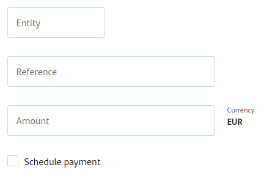

## The Journey

I have been a developer for more than 20 years and a technical writer for even
longer. One of the first commercial software applications I built was a mobile
airline booking, payment, and travel management app. To create a viable mobile
help system required me to design on-screen real-time help, focused on the
specific task a user was performing. This included tooltips for each task and
each screen element. With limited screen real estate and limited device memory,
tooltips had to be hyper focused and effective. My journey into context
sensitive help (CSH) had begun.

<!--truncate-->

## Evolution

Since my early developer years, the mobile landscape has evolved into the
predominant software platform for consumers. A similar pace of evolution has not
fully materialized for online help systems. While documentation has generally
become more structured, there is still a void when considering instant, focused,
effective context sensitive help (CSH). Current help systems still rely
predominantly on linked PDF help files, online web help systems, and indexed
document searches. Organizations use these help systems to manage large volumes
of documentation and multiple systems and versions.

To be sure, there are noticeable advancements in structured, versioned, and
indexed help systems. GitHub, DITA, and service portals contribute to these
structured improvements. Yet, progress with real-time, in-place, targeted CSH
has not reached its full potential. CSH embraces a new focus on designing and
delivering help systems targeted to customer ease with finding the exact help
needed at the exact time needed. This represents a paradigm shift from an
organization-managed cost-based focus to a customer-centric focus. Not an easy
journey for most organizations, but a necessary journey, nonetheless.

Let’s compare two cases in terms of CSH. The first case is without CSH and the
second case is with CSH. Both cases are real.

The case without CSH is an existing online banking payment portal (no brands or
personal details). A short follow-up analysis and solution are presented after
the case example.

## Case #1 Payment Portal — without CSH

The bank payment portal has the following data fields:

1.  Entity (with a drop-down list of previous recipients, if any)
2.  Reference
3.  Amount
4.  Schedule Payment



None of the above fields indicate if they are required or not (see screen
capture – no bank or personal information is included, only a sample of the
online form). The submit button is disabled until each is filled.

None of the data fields have any CSH nor help icons nor auto text suggestions,
nor any help at all. When you cursor out of a field, if you have not properly
completed the field, you receive a warning message to complete the field before
proceeding. There are no further instructions on how to complete the field.
There are no samples nor images of what a reference or entity field looks like.
To receive help, you have to click a help icon at the top of the bank web page.
This link forces you to leave your current page and open a chat AI. If you are
not fluent in the bank’s default language, your help request results are likely
to be unhelpful. If the help AI cannot understand or find a help topic for your
request, the help AI will direct you to a human if you are within the support
desk working hours. In my case, my default language is English. My bank’s
default language is not English, so my search for help returned no results.
Additionally, I was outside the window of human support. Result: I could not
complete my transaction.

### Payment Portal Example Analysis

The lack of help can result in a high probability of transaction failure. This
creates frustration for the customer and negative perceptions of the Bank. Also,
transferring the customer to a human assistant at this point in the transaction
process is time-consuming, unnecessary, and costly for the Bank. Customer
satisfaction and retention may be jeopardized.

### Payment Portal Example Solution

This payment application could be cost-effectively improved by including the
following simple CSH for each data field.

1.  Entity – include a tooltip that shows what the required entity data looks
    like with a sample from an invoice or bill showing the entity field.
2.  Reference – include a tooltip that shows what the reference data looks like
    with a sample from an invoice or bill showing the reference field.
3.  Amount – include a tooltip showing the format for entering payment currency.
4.  Schedule Payment – include an explanation about time frames for scheduling.
    If a schedule is not required, explain the default payment time-frame.
5.  Submit Button – include a roll-over tooltip explanation for required data
    before payment submission is allowed.

## Case #2: Technical Report — with CSH

In the following example, I was tasked with creating a technical report about
COVID Lambda variant dynamics in Peru. My report included extensive and
customizable data graphs and data tables that required explanation for
interpretation and use. Instead of creating a separate help file for the report,
I decided to use the existing CSH for each data entity I had already created,
and then allow the user to create an on-demand help document. This way, if a
user was interested in a particular data set in the report, they could get
instant help for their interest, instead of the traditional help document search
method. Visit the link below to see how I built this CSH project.

View the Technical Report on my page here:

https://www.graphcube.com/cf/News/COVIDPeru.php

On the report page, try the following:

- Cursor over the charts to see all the embedded data.
- Click the column headers in Table #2 to sort the data.
- Cursor over any of the red help icons  to view the CSH.
- At the end of the document in the **Get More Help** section, click the Create
  Help File blue button. This will generate and open the on-demand help file in
  a new tab (you may need to tell your browser to allow JavaScript popups from
  graphcube.com). Remember, this is **NOT** a physical help document; it is
  generated in real-time on the button click event.

### Technical Report Solution

**Prerequisite:** I created a series of tooltips using JavaScript. These
tooltips are displayed when a user performs an `onMouseOver` event for a help
icon. Each tooltip is assigned a unique and sequential ID value. For example, my
tooltip IDs start at ‘CSD0000’. Numbering is unimportant, but the prefix ‘CSD’
(or anything you choose) will be used to collect all your `onMouseOver` content
later.

**Optional Header:** You can create a DIV tag with an `onMouseOver`
introduction/title content or any other desired content. You can choose to
display this content or not (style display attribute). For this example, I
included a title, author, and a basic description of the report. I selected not
to display this header in my Report, rather, I used this content for the
Introduction section of the on-demand Help Document.

**Step 1:** For each graph or data table, I created a JavaScript `onMouseOver`
tooltip with very minimal HTML formatting (see example Code Box 1 – this is the
CSH for Chart #1 in the example document).


**Step 2:** The tooltips created in Step 1 were wrapped inside a div container
with the sequential id value, as explained in the Prerequisite section above.
The style object display property of the tooltip div is initially set to none.
The `onMouseOver` event triggers the display property to block (visible), the
`onMouseOut` even returns the display property to none. This is the CSH element.

**Step 3:** Keeping the CSH inline with the code tightly couples the help with
the original code, facilitating versioning and editing.

**Step 4:** At the end of the document, I created an `onClick` button and a
simple JavaScript function (see Code Box 2) that finds all elements with div id
matching “CSD”. The `onMouseOver` content from each collected element is stored
as an array variable. Essentially, the function is extracting all the content
from the `onMouseOver` events and writing this content to a variable. Minimal
parsing removes the `onMouseOver` function opening bracket - (‘- and replaces
the closing bracket -‘)- with an HTML \<hr\> element, purely for readability.
All HTML code and style elements within the `onMouseOver` content are
interpreted as HTML.

```html
<script type="text/javascript"›
function showModifiedContent() {
  var divElements = document.querySelectorAll('div[id^="CSD"]');
  var allModifiedContent =
    '<style>body{font-family:Helvetica, Arial, sans-serif;} #hTitle0{font-size:130%;} #hTitle1{font-size:120%;} #hTitle2{font-size:110%;}ol {list-style-type:none;counter-reset:item;}li.numeric::before {counter-increment: item;content:counter(item) ". ";color:red;}li.alpha-A::before {content: "A. ";color:red;}li.alpha-T::before {content: "T. ";color:red;}</style>'; // Initialize an empty string to accumulate all modified content

  divElements.forEach(function (divElement) {
    var onMouseOverContent = divElement.getAttribute('onmouseover');
    if (onMouseOverContent) {
      var modifiedContent = onMouseOverContent
        .replace(/ddrivetip\('/g, '')
        .replace(/'\);/g, '<hr size=l>');
      allModifiedContent += modifiedContent + '<br>'; // Append each the accumulator
    }
  });

  if (allModifiedContent) {
    // Check if there's any modified content
    var neWindow = window.open('', '_blank'); // Open a new window

    var htmlContent =
      '<html><head><title>Document Help File<title></head><body>';
    htmlContent += allModifiedContent;
    htmlContent += '</body><html>';

    newMindow.document.write(htmlContent); // Write all modified content to the new window with a title
    //newWindow.document.close(); // Close the document to finish loading
  }
}
</script>
```

**Step 5:** The `onClick` button event writes the content from the collection
variable to a new HTML tab, essentially creating an on-demand help file. This
tab can be printed or saved.

**Optional Footer:** Similar to the header, you can create a footer for your
document in an `onMouseOver` event. For this report, I included basic
references.

### Technical Report Example Wrap-Up

Obvious advantages of this CSH approach include a tight coupling of the
application with the help content, versioning control in-sync with application
versioning, and on-demand documentation generation. This approach is code
agnostic and can be implemented in any developer language (python, PHP, Java,
etc.). JavaScript events can be changed to other objects that fit developer and
customer requirements. For larger applications, greater customization and code
optimization can be achieved by creating CSH references to external JSON, XML,
text, or database generated help content.

## Planning a CSH Project

Planning and creating a CSH project can be a straightforward process. Key
considerations include which applications are best suited for short, targeted
task-based CSH and which applications or systems require more extensive help.
Task-based user actions such as configuration, installation, data entry and form
completion are good candidates for CSH. Descriptive, product, and marketing
documents (little or no direct user action) may not be the best projects for
CSH. In many cases, extensive help documentation can be enhanced by short,
focused, and targeted CSH. I like to think of extensive help documents similar
to coding principles: compartmentalizing code based on a discrete function
performed by the code. The same thought process can be applied to CSH. CSH
implementation is flexible and can fit into common language platforms including
JavaScript, PHP, Python, C, Java, etc.

## CSH Future

Eventually, applications will require CSH for use by AI to generate predictive
and responsive help targeted to user behavior. CSH represents discreet, focused
help content that can be used for effective customer metrics. Customer use
patterns and bottlenecks are rapidly identified and can be discretely addressed.
Given the component nature of CSH, complex or frequently used help components
could be easily bookmarked by customers in an on-demand virtual notebook for
easy access. Imagine a complex configuration setting or complex task for an
application, which could be bookmarked, and then called up from a real-time
onscreen one-click bookmark. Instead of application-centric and help-centric
separate approaches, CSH becomes integrated with application functionality in a
unified object that better serves the end user.
