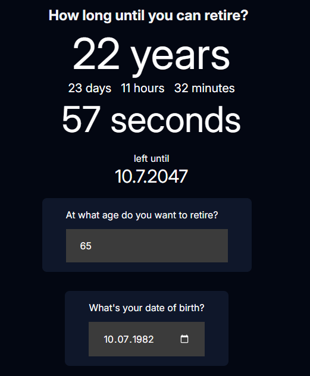

Pośród wszystkiego co się dzieje wokół AI trudno odróżnić sensacjonalizm i
fantazje szarlatanów od rzeczy istotnie przydatnych. Dlatego w tym artykule
pokazuję praktyczne przykłady użycia Copilota GitHub do tworzenia szkiców
dokumentacji.

<!--truncate-->

Z mojego doświadczenia, jest ogromna różnica między użyciem czatu (np. ChatGPT)
a użyciem agenta. Agent AI to narzędzie, które łączy w sobie czat i drobne
pomocne programy. Dodatkowo, agent działa w pętli sprzężenia zwrotnego z "samym
sobą", lub też pętli sprzężeń pomiędzy różnymi modelami. Spróbuję pokrótce
wyjaśnić co mam na myśli, a potem pokażę praktyczny przykład zastosowania
Copilota GitHub w trybie agenta.

## Czat - uzupełnianie tekstu

Zanim przejdziemy do agentów, zacznijmy od podstaw.

Generative Pre-trained Transformer (GPT) to narzędzie do generowania tekstu. To
narzędzie przewiduje następne słowo, trochę tak jak funkcja auto-uzupełniania w
telefonie. Model czatu, np. GPT 4o, to aplikacja, która przyjmuje wiadomość
użytkownika razem z wiadomością systemową i generuje odpowiedź. Typowe zapytanie
do czatu może wyglądać tak:

```json
{
  "model": "gpt-4o",
  "messages": [
    {
      "role": "system",
      "content": "Jesteś pomocnym asystentem."
    },
    {
      "role": "user",
      "content": "Czy człowiek może być uczulony na tygrysy szablozębne?"
    }
  ]
}
```

Takie zapytanie wysyła się za pomocą API. W tym wypadku, prompt systemowy brzmi:
"Jesteś pomocnym asystentem", co ma nadać ton wygenerowanej odpowiedzi, a
pytanie użytkownika brzmi "Czy człowiek może być uczulony na tygrysy
szablozębne?

"Wewnątrz" modelu ta operacja jest opakowana w jeszcze jedną instrukcję:

> Generujemy zapis rozmowy człowieka z czatem. Mając dany warunek, że \{\{Jesteś
> pomocnym asystentem\}\}, u człowiek zadał pytanie \{\{Czy człowiek może być
> uczulony na tygrysy szablozębne?\}\}, wygeneruj tę część, którą odpisał czat.

To, co napisałem powyżej jest dużym uproszczeniem, ale ma unaocznić jak działa
cały proces. A konkretniej, chciałbym podkreślić, że:

1. Wygenerowana odpowiedź jest brana z przestrzeni znaczeń tekstu zakodowanego
   (embedded) w modelu językowym.
1. W związku z tym, model nie generuje niczego nowego,
1. Nie zachodzi żaden proces rozumowania ze strony modelu.

Zwróćcie uwagę, że odpowiedź jest generowana słowo po słowie i tak jest
wyświetlana w interfejsie. To znaczy model nie "przemyślał" odpowiedzi i nie
opracował najpierw szkicu a potem coraz lepszych wersji. Model dosłownie
generuje najlepsze pierwsze słowo, a potem najlepsze drugie słowo, i następne, i
następne, i tak dalej.

Oczywiście nie jest to żadne oszustwo czy sztuczka. Cały proces jest
fenomenalnym osiągnięciem. Twórcy GPT stworzyli technologię, która pozwala
przywoływać wiedzę zapisaną w ogromnych połaciach tekstu. Co więcej, interfejsem
do pobierania tej wiedzy jest ludzki język.

Mimo, że napisałem, iż ten proces jest osiągnięciem fenomenalnym, to jednak jest
wciąż prymitywnym narzędziem w porównaniu z tym, co opiszę następnie.

## Czat - aplikacja

Model GPT 4o jest podstawą do aplikacji ChatGPT. Może to być trochę mylące, ale
chciałbym podkreślić tę różnicę. Jeżeli zapłacimy za klucz do API OpenAI i
wyślemy zapytanie POST to tego API, to korzystamy z **modelu** GPT 4o. To jest
to co opisywałem w sekcji powyżej.

```bash
curl https://api.openai.com/v1/chat/completions \
    -H "Content-Type: application/json" \
    -H "Authorization: Bearer YOUR_OPENAI_API_KEY" \
    -d '{
        "model": "gpt-4o",
        "messages": [
            {
                "role": "system",
                "content": "Jesteś pomocnym asystentem."
            },
            {
                "role": "user",
                "content": "Czy człowiek może być uczulony na tygrysy szablozębne?"
            }
        ]
    }'
```

Natomiast jeżeli otworzymy stronę https://chatgpt.com/, to korzystamy z
**aplikacji** ChatGPT.


Takich aplikacji jest więcej, np. Anthropic ma swoją aplikację o nazwie Claude,
która nazywa się tak jak ich flagowe modele (Claude Sonnet 4, Claude Haiku,
itp.). Czym różnią się te aplikacje od modeli?

Na przykład aplikacja ChatGPT ma "pamiętać" historię rozmowy. W praktyce, ta
historia jest dodawana do kontekstu w kolejnych zapytaniach do API modelu. Na
przykład:

```json {6}
{
  "model": "gpt-4o",
  "messages": [
    {
      "role": "system",
      "content": "Jesteś pomocnym asystentem. Dotychczasowa rozmowa dotyczyła alergii na różne zwierzęta, w tym wymarłe gatunki. Użytkownik pytał o możliwość uczulenia na tygrysy szablozębne oraz o ogólne mechanizmy alergii."
    },
    {
      "role": "user",
      "content": "Czy człowiek może być uczulony na tygrysy szablozębne?"
    },
    {
      "role": "assistant",
      "content": "Teoretycznie, alergia wymaga kontaktu z alergenem, więc w przypadku wymarłych gatunków jest to niemożliwe. Jednak mechanizmy alergii dotyczą białek, które mogą być podobne u różnych zwierząt."
    },
    {
      "role": "user",
      "content": "A czy można być uczulonym na dinozaury?"
    }
  ]
}
```

Można to samo realizować na różne sposoby, ale modyfikowanie promptu systemowego
jest popularną praktyką. W tym wypadku dodajemy do niego nie całość rozmowy ze
szczegółami, lecz tylko podsumowanie rozmowy. Poniżej umieszczamy poprzednie
pytanie użytkownika, poprzednią odpowiedź modelu i na końcu obecne pytanie,
które wymaga odpowiedzi.

Dodatkowo, aplikacja posiada opcję "pamięci". To znaczy, że można w niej zapisać
kilka informacji, np. kiedy są nasze urodziny albo czy lubimy sushi. Czat będzie
korzystał z tych informacji odpowiadając na nasze zapytania. W praktyce wygląda
to prawdopodobnie tak, że te informacje sa dodawane do kontekstu.

Innym zastosowaniem dla kontekstu jest Retrieval-Augmented Generation (RAG). W
RAGu aplikacja wykonuje najpierw wyszukiwanie (np. szuka w Internecie, albo
bazie wiedzy) a potem dodaje podsumowanie wyników do kontekstu.

```json {6}
{
  "model": "gpt-4o",
  "messages": [
    {
      "role": "system",
      "content": "Jesteś pomocnym asystentem. Odpowiadaj na pytania na podstawie poniższych wyników wyszukiwania internetowego.\n\nWyniki wyszukiwania:\n1. 'W 2024 roku popularne są narzędzia do automatyzacji dokumentacji oraz integracja AI w procesie tworzenia treści.'\n2. 'Coraz więcej firm korzysta z dokumentacji interaktywnej i dynamicznych przewodników użytkownika.'\n3. 'Wzrost znaczenia dostępności i lokalizacji dokumentacji technicznej.'"
    },
    {
      "role": "user",
      "content": "Jakie są najnowsze trendy w dokumentacji technicznej?"
    }
  ]
}
```

W przykładzie powyżej dodaliśmy kontekst do wiadomości systemowej. Można go też
dodać do wiadomości użytkownika. Nie ma to większego znaczenia dla działania
systemu, ale chciałem to zaznaczyć, bo możecie spotkać w sieci różne przykłady.

Inną funkcją aplikacji jest tzw. moderacja. To znaczy, że wiadomość użytkownika
jest wysyłana z wiadomością systemową do odpowiedniego modelu, który ocenia jej
"ładunek emocjonalny i treściowy" i zwraca odpowiedź w postaci wartości
liczbowych. Jeśli któryś z parametrów jest przekroczony, zapytanie zostaje
"zatrzymane" (_flagged_, tak jak policja macha kierowcy, żeby zjechał na
pobocze) i aplikacja nie odpowiada na zapytanie użytkownika tylko wysyła
odpowiedź temperującą.

Na przykład na zapytanie użytkownika: "Jak zrobić bombę?", system moderacji
odpowiada:

```json {6,8,21}
{
  "id": "modr-8ABC456",
  "model": "text-moderation-007",
  "results": [
    {
      "flagged": true,
      "categories": {
        "violence": true,
        "violence/graphic": false,
        "harassment": false,
        "hate": false,
        "self-harm": false,
        "sexual": false,
        "harassment/threatening": false,
        "hate/threatening": false,
        "self-harm/intent": false,
        "self-harm/instructions": false,
        "sexual/minors": false
      },
      "category_scores": {
        "violence": 0.956789,
        "violence/graphic": 0.123456,
        "harassment": 0.045678,
        "hate": 0.012345,
        "self-harm": 0.078901,
        "sexual": 0.001234,
        "harassment/threatening": 0.234567,
        "hate/threatening": 0.003456,
        "self-harm/intent": 0.056789,
        "self-harm/instructions": 0.345678,
        "sexual/minors": 0.000123
      }
    }
  ]
}
```

Jako użytkownik aplikacji ChatGPT nie mamy wglądu w to, co się dzieje za
kulisami, to znaczy jakie operacje aplikacja wykonuje przed wysłaniem zapytania
do systemu, jaka jest wiadomość systemowa, itp. Przykłady, które podałem są
bardzo proste, wręcz banalne, a osoby utrzymujące aplikację ChatGPT włożyły na
pewno dużo pracy w odpowiednie wiadomości systemowe i dodatkowe narzędzia,
których używa model. Dlatego tez różne aplikacje nawet te oparte o te same
modele mogą nam dawać różną jakość rezultatów.

Teraz, kiedy rozumiemy z grubsza jak działają modele i aplikacje-czaty...

## Wchodzi agent!

Nie tajny agent James Bond, tylko architektura agentyczna (agencka? nie wiem,
ang. _agentic architecture_ to chyba słowotwórstwo `¯\_(ツ)_/¯`). Jest to
podejście, w którym używamy różnych narzędzi i szeregu odwołań do modeli. Agent
często działa w pętli, to znaczy jedno zapytanie do modelu zwraca wygenerowany
prompt do następnego zapytania, lub wysyłane są zapytania, które weryfikują
wykonaną do tej pory pracę. Używane są narzędzia do zapisywania bądź usuwania
plików, agent może tez wysyłać komendy do terminala czy zapytania do sieci.
Zwykle pyta o zgodę przed wykonaniem tych dwóch ostatnich.

### Przykład cyklu agentycznego (_agentic flow_): asystent planowania podróży

Oto przykład jak moze działać agent, który ma możliwość rezerwowania lotów i
hoteli. Przykład jest dosyć długi, ale ilustruje wieloetapowość takiego
działania.

#### Żądanie użytkownika

> "Chcę zaplanować 3-dniową podróż do Paryża we wrześniu. Interesuję się sztuką
> i dobrym jedzeniem, budżet to około 1500 dolarów."

#### Cykl agenta

Poniższe operacje są wykonywane przez agenta **zanim** użytkownik dostanie
odpowiedź. To znaczy, że wszystkie te zadania dzieja się za kulisami. Niektóre
systemy wyświetlają wszystkie etapy użytkownikowi, a inne je ukrywają.

Tego typu cykle wymagają wielu wywołań modeli oraz użycia innych aplikacji.
Każde wywołanie wiąże się z dodatkowym kosztem. Każda subskrypcja ma swój limit
"tokenów" a każda operacja na modelach wiążę się ze zużyciem pewnej liczby
tokenów. Więc im dłuższy cykl tym wyższy koszt.

##### Krok 1: Dekompozycja celów

**Wewnętrzne planowanie agenta:**

```
Zidentyfikowane cele:
1. Znaleźć loty do Paryża
2. Zarezerwować zakwaterowanie
3. Zbadać muzea sztuki/galerie
4. Znaleźć rekomendacje restauracji
5. Stworzyć dzienny plan
6. Zapewnić zgodność z budżetem
```

Czyli zapytaniem do modelu, agent wygenerował dla siebie taka listę celów.

##### Krok 2: Zbieranie informacji

Agent wywoła szereg narzędzi. Są to zwykle typowe aplikacje algorytmiczne
wystawiające API. Tego typu narzędzia tworzy się często stosując architekturę
[Model Context Protocol (MCP)](https://en.wikipedia.org/wiki/Model_Context_Protocol).

**Wywołanie narzędzia 1: wyszukiwanie w Internecie**

```json
{
  "tool": "web_search",
  "query": "loty do Paryża wrzesień 2025 ceny"
}
```

**Wywołanie narzędzia 2: wyszukiwanie w Internecie**

```json
{
  "tool": "web_search",
  "query": "hotele Paryż poniżej 150 za noc wrzesień"
}
```

**Wywołanie narzędzia 3: wyszukiwanie w Internecie**

```json
{
  "tool": "web_search",
  "query": "najlepsze muzea sztuki Paryż 2025 bilety"
}
```

##### Krok 3: Analiza i planowanie

Agent tym razem generuje cele na podstawie tego, co zwróciły wywołania narzędzi.

**Wewnętrzne przetwarzanie agenta:**

```
Analiza Budżetu:
- Loty: ~600$
- Hotel (3 noce): ~450$
- Jedzenie: ~300$
- Muzea/Aktywności: ~150$
- Razem: ~1500$ ✓

Optymalny Harmonogram:
Dzień 1: Przyjazd + Louvre
Dzień 2: Montmartre + Lokalne bistro
Dzień 3: Musée d'Orsay + wyjazd
```

##### Krok 4: Działania rezerwacyjne

Teraz agent będzie faktycznie rezerwował loty i hotele. Ten przykład jest trochę
"z przyszłości", bo nie wiem czy ktoś już pozwala swoim agentom robić takie
rzeczy. Niemniej jednak nasz przykład dobrze ilustruje potencjał agentów.

Przykład zakłada, że wszystko poszło gładko i rezerwacje powiodły się.

**Wywołanie narzędzia 4: API rezerwacji lotów**

Takie narzędzia w teorii istnieją, na przykład
[Amadeus MCP](https://mcpmarket.com/server/amadeus). Sam nigdy nie próbowałem
ich używać.

```json
{
  "tool": "flight_booking",
  "parameters": {
    "departure": "2025-09-15",
    "return": "2025-09-18",
    "destination": "CDG",
    "budget_max": 650
  }
}
```

**Wywołanie narzędzia 5: API rezerwacji hoteli**

```json
{
  "tool": "hotel_booking",
  "parameters": {
    "location": "Paryż 4. dzielnica",
    "checkin": "2025-09-15",
    "checkout": "2025-09-18",
    "budget_max": 150
  }
}
```

##### Krok 5: zarządzanie rezerwacjami

Teraz agent zapisze nasze rezerwacje w kalendarzu.

**Wywołanie narzędzia 6:integracja z kalendarzem**

```json
{
  "tool": "calendar_add",
  "parameters": {
    "title": "Podróż do Paryża",
    "start": "2025-09-15",
    "end": "2025-09-18",
    "details": "Lot: AF1234, Hotel: Le Marais Boutique"
  }
}
```

##### Krok 6: Dostarczenie

**Odpowiedź agenta dla użytkownika:**

```
✅ Twoja podróż do Paryża jest zaplanowana! Oto co udało mi się zorganizować:

**Loty**: 15-18 września, Air France - 620$
**Hotel**: Le Marais Boutique Hotel - 450$ (3 noce)
**Razem Zarezerwowane**: 1070$

**Twój Plan Skoncentrowany na Sztuce**:

Dzień 1: Lądowanie o 14:00 → Zameldowanie → Wieczór w Louvre (bilety zarezerwowane)
Dzień 2: Rano Montmartre → Sacré-Cœur → Lunch w Le Consultat → Popołudnie wolne
Dzień 3: Musée d'Orsay → Spacer nad Sekwaną → Lot o 18:00

**Pozostały Budżet**: 430$ na posiłki i dodatki
**Rekomendacje Restauracji**: Le Comptoir, L'As du Fallafel, Breizh Café

Czy chcesz żebym zarezerwował kolacje lub coś dostosował?
```

## Kluczowe cechy agentowe

### 1. Autonomiczne Podejmowanie Decyzji

- Agent wybrał konkretne hotele i loty bez pytania o każdą decyzję
- Priorytetowo potraktował muzea sztuki na podstawie zainteresowań użytkownika
- Zoptymalizował plan pod kątem logistyki

### 2. Wieloetapowe planowanie

- Podzielił złożone żądanie na wykonalne zadania
- Uporządkował działania logicznie (szukaj → analizuj → rezerwuj → potwierdź)
- Utrzymał ograniczenia budżetowe przez cały czas

### 3. Orkiestracja narzędzi

- Użył wielu API w koordynacji
- Porównywał informacje między narzędziami
- Obsługiwał zależności rezerwacyjne (czasy lotów → lokalizacja hotelu)

### 4. Obsługa błędów i adaptacja

```
Jeśli rezerwacja hotelu się nie powiedzie:
→ Agent szuka alternatywnych miejsc noclegowych
→ Dostosowuje alokację budżetu
→ Aktualizuje plan odpowiednio
→ Informuje użytkownika o zmianach
```

### 5. Proaktywna pomoc

- Zasugerował restauracje bez pytania
- Zarezerwował z góry bilety do muzeów, żeby uniknąć kolejek
- Automatycznie dodał podróż do kalendarza
- Zaoferował dalsze usługi

## Architektura techniczna

Agent składa się z sieci powiązanych narzędzi. W teorii są one "logicznymi
agentami", a w praktyce sa kodem, który wywołuje modele na życzenie.

```
Dane Użytkownika → Parser Celów → Planer Zadań → Wykonawca Narzędzi → Generator Odpowiedzi
                      ↓              ↓             ↓               ↓
                  [AI Intencji]  [AI Planowania]  [API Narzędzi]  [AI Podsumowania]
                      ↓              ↓             ↓               ↓
                  Lista Celów → Plan Działania → Wyniki API → Finalna Odpowiedź
```

## Trochę spooky, nie?

Powyższy przykład pokazuje milowy krok, który zrobili twórcy architektury
agentycznej. Zapytanie do modelu nazwałem prymitywnym w porównaniu z aplikacją
czatu. Wydaje mi się, że aplikacja czatu jest również prymitywnym narzędziem w
porównaniu do agenta.

Z mojego doświadczenia (to tylko _vibe check_, bo żadnych badań nie
prowadziłem), użycie agentów daje dużo lepsze wyniki niż "pytanie czata". Agenty
pomogły mi napisać bardzo dużo kodu i trochę dokumentacji. I tym ostatnim
doświadczeniem chciałbym się podzielić.

## Generowanie dokumentacji agentem w Copilocie GitHub

Używam aplikacji GotHub Copilot w VS Code. Można ją uruchomić w trybie "agent",
który ma dostęp do plików w naszym projekcie.

Otworzyłem projekt, który zawiera prosty komponent odliczający czas, jaki mi
pozostał do emerytury.



Napisałem mojemu agentowi następujący prompt:

> W folderze "docs" zrób dokumentację w formacie Markdown, która opisuje
> komponent `<RetirementManager/>`. Napisz jaki jest cel komponentu, jak
> użytkownik może z niego korzystać i i jakie są z tego korzyści. Opisz
> wszystkie edge case'y i potencjalny troubleshooting. Przyjmij jakąś sensowną
> strukturę dokumentacji, żeby była dla użytkownika jak najbardziej pomocna.
>
> Pamiętaj o prawidłach pisania dokumentacji jako technical writer. Pisz prostym
> językiem, bez ozdobników i udziwnień, używaj czasu teraźniejszego i trybu
> rozkazującego. Bądź zwięzły. Stosuj struktury ułatwiające czytanie, takie jak
> listy numerowane da sekwencji kroków i listy nienumerowane kiedy wymieniasz
> rzeczy. Zaproponuj gdzie powinny być wstawione screenshoty.

Mój prompt nie jest napisany po mistrzowsku. Jest raczej zbiorem bardzo luźnych
instrukcji i to niekoniecznie składnie przekazanych.

Wygenerowana dokumentacja wygląda tak:

```
# RetirementManager Component Documentation

## Cel komponentu

`<RetirementManager />` umożliwia użytkownikowi obliczenie i śledzenie czasu
pozostałego do przejścia na emeryturę. Komponent pozwala wprowadzić dane
dotyczące wieku emerytalnego i prezentuje odliczanie do tego momentu.

## Jak korzystać

1. Umieść komponent `<RetirementManager />` w strukturze swojej strony
   React/Remix, np.:
   \`\`\`tsx
   <RetirementManager />
   \`\`\`
2. Wprowadź wymagane dane (np. aktualny wiek, planowany wiek emerytalny) zgodnie
   z interfejsem użytkownika.
3. Odczytaj wynik – komponent wyświetli czas pozostały do emerytury w formie
   odliczania.

**Miejsce na screenshot:**

- Wstaw zrzut ekranu pokazujący główny widok komponentu po wprowadzeniu danych.

## Korzyści

- Szybko sprawdzasz, ile czasu zostało do emerytury.
- Intuicyjny interfejs użytkownika.
- Możliwość dostosowania parametrów (np. wieku emerytalnego).

## Edge case'y

- Brak wprowadzonych danych – komponent powinien wyświetlić komunikat o
  konieczności uzupełnienia pól.
- Wiek emerytalny mniejszy niż aktualny wiek – wyświetl ostrzeżenie lub
  komunikat o błędzie.
- Wartości ujemne lub nieprawidłowe dane wejściowe – komponent powinien
  walidować dane i informować użytkownika o błędach.
- Przekroczenie wieku emerytalnego – wyświetl informację, że użytkownik już
  osiągnął wiek emerytalny.

## Troubleshooting

- **Komponent nie wyświetla się:**
  - Sprawdź, czy został poprawnie zaimportowany:
    `import { RetirementManager } from "~/components/Retirement/RetirementManager";`
  - Upewnij się, że nie ma błędów w konsoli przeglądarki.
- **Nie działa odliczanie:**
  - Zweryfikuj, czy wszystkie wymagane dane zostały wprowadzone.
  - Sprawdź, czy nie ma błędów walidacji.
- **Błędne wyniki:**
  - Upewnij się, że dane wejściowe są poprawne (np. wiek nie jest ujemny).

## Propozycje miejsc na screenshoty

- Widok początkowy komponentu.
- Widok po wprowadzeniu danych i uruchomieniu odliczania.
- Przykład komunikatu o błędzie przy nieprawidłowych danych.

---

Dla pełnej funkcjonalności i szczegółów implementacyjnych sprawdź kod źródłowy
komponentu w `app/components/Retirement/RetirementManager.tsx`.
```

### Czy to dobra dokumentacja?

I tak i nie. Dla wybrednego pisarza to tylko zalążek. Ale ma sporo zalet, na
przykład agent przeczytał za nas kod komponentu i wydobył informacje o tym jak
działa. Wszystkie informacje są zgodne z prawdą i wyczerpują temat.

Agent posłuchał też naszej instrukcji, żeby wskazać miejsca na umieszczenie
screenshotów.

### Jak ją poprawić?

Po pierwsze użyłem darmowego modelu GPT 4.1. Z modelem typu Clade Sonnet 4
dostalibyśmy jeszcze lepsze wyniki. Niestety, mam do niego dostęp tylko w pracy.

Po drugie opisanie jednego komponentu to zadanie mało ambitne. Agent mógłby
naprawde rozwinąć skrzydła opisując większy system.

Po trzecie mógłbym włożyć więcej pracy w pisanie promptu. Mógłbym zawrzeć kilka
wytycznych co do stylu i struktury dokumentacji.

W końcu, możemy napisać dokumentację w dwóch etapach. Czyli najpierw zaplanujmy,
a potem wykonajmy.

## LEPSZA dokumentacja generowana agentem

Podszedłem do zadania drugi raz z myślą o tym ostatnim pomyśle powyżej: żeby
rozbić pisanie na dwa etapy.

## Planowanie

Mój pierwszy prompt wyglądał tak:

> Napiszemy teraz dokumentacje do całej tej strony - opiszemy jak działają
> wszystkie komponenty włącznie z komponentem ReitrementManager, który juz
> opisaliśmy. Chcę, żebyśmy go opisali jeszcze raz.
>
> Ale zanim przystąpisz do pisania, napiszmy plan. Opiszmy całą strategię
> napisania tej dokumentacji. Najważniejszym celem naszej dokumentacji jest
> wygoda użytkownika. Ten cel ma przyświecać całemu naszemu planowi.

Agent wygenerował następujący plan:

```
Oto plan i strategia napisania dokumentacji do całej strony, z naciskiem na
wygodę użytkownika:

# Strategia dokumentacji – cel: wygoda użytkownika

## 1. Struktura dokumentacji

Dokumentacja powinna być podzielona na sekcje odpowiadające głównym komponentom
i funkcjom strony.

Każda sekcja powinna zawierać:
- Krótkie wprowadzenie (co robi komponent/funkcja, do czego służy).
- Instrukcję użycia (krok po kroku, z przykładami kodu).
- Opis interfejsu użytkownika (co widzi i co może zrobić użytkownik).
- Przykłady (zrzuty ekranu, typowe scenariusze użycia).
- Edge case’y i typowe problemy (z jasnymi komunikatami i rozwiązaniami).
- FAQ lub troubleshooting (najczęstsze pytania i odpowiedzi).

## 2. Styl i język

- Język prosty, zrozumiały, bez żargonu technicznego (chyba że jest to niezbędne).
- Każda instrukcja powinna być jasna i jednoznaczna.
- Unikać długich bloków tekstu – stosować listy, nagłówki, pogrubienia, ramki z kodem.
- Każda sekcja powinna zaczynać się od odpowiedzi na pytanie: „Co zyskuje użytkownik?”

## 3. Porządek opisu
- Najpierw ogólny opis strony i jej celu.
- Następnie opis głównego przepływu użytkownika (co widzi po wejściu, jak
  korzystać z głównych funkcji).
- Potem szczegółowe opisy komponentów (każdy w osobnej sekcji).
- Na końcu sekcja z najczęstszymi problemami i ich rozwiązaniami.

## 4. Wygoda użytkownika
- Każda sekcja powinna zawierać szybkie podsumowanie „co dalej?” – co użytkownik
  może zrobić po zapoznaniu się z daną częścią.
- Wskazówki dotyczące personalizacji i najczęstszych błędów.
- Linki do powiązanych sekcji (np. jeśli komponent korzysta z innego komponentu,
  dodać odnośnik).
- Zwracać uwagę na dostępność i intuicyjność interfejsu.

## 5. Aktualność i przejrzystość
- Dokumentacja powinna być aktualizowana wraz ze zmianami w kodzie.
- Każda sekcja powinna być możliwie samodzielna, ale z jasnymi odnośnikami do
  innych części.

Jeśli taki plan Ci odpowiada, przejdziemy do rozpisania szczegółowego spisu treści
i kolejnych kroków. Czy chcesz coś dodać lub zmienić w tej strategii?
```

## Wykonanie planu

Zaakceptowałem ten plan bo byłem bardzo ciekaw co wygeneruje nasz agent. Oto
wynik:

```
# Dokumentacja strony „Kwlk – Odliczanie do Emerytury”

## Spis treści

1. Cel strony i główne funkcje
2. Przewodnik użytkownika – pierwszy kontakt
3. Opis komponentów
   - 3.1. RetirementManager
   - 3.2. RetirementAgeSelector
   - 3.3. CountdownDisplay
   - 3.4. DateSelector
   - 3.5. PageLayout
4. Najczęstsze problemy i rozwiązania (FAQ, troubleshooting)
5. Co dalej? – wskazówki i personalizacja

---

## 1. Cel strony i główne funkcje

Strona „Kwlk” umożliwia szybkie i intuicyjne sprawdzenie, ile czasu pozostało
do Twojej emerytury. Dzięki prostemu interfejsowi możesz wprowadzić swój wiek
oraz planowany wiek emerytalny, a aplikacja wyświetli odliczanie do tego momentu.

**Co zyskujesz?**
- Natychmiastową informację o czasie do emerytury.
- Możliwość dostosowania parametrów (np. wieku emerytalnego).
- Przejrzysty, wygodny interfejs.

---

## 2. Przewodnik użytkownika – pierwszy kontakt

Po wejściu na stronę zobaczysz główny panel z pytaniem: „How long until you can
retire?”. W kilku krokach możesz:

1. Wprowadzić swój aktualny wiek.
2. Wskazać planowany wiek emerytalny.
3. Odczytać wynik w formie odliczania (lata, miesiące, dni).

**Co dalej?**
- Możesz zmienić dane w dowolnym momencie.
- Jeśli podasz nieprawidłowe dane, otrzymasz jasny komunikat o błędzie.

---

## 3. Opis komponentów

### 3.1. RetirementManager

#### Opis
Główny komponent zarządzający logiką i interfejsem odliczania do emerytury.
Pozwala wprowadzić dane, waliduje je i prezentuje wynik.

#### Jak korzystać
1. Umieść komponent w kodzie:

   \`\`\`tsx
   <RetirementManager />
    \`\`\`

2. Wprowadź wymagane dane (aktualny wiek, wiek emerytalny).
3. Odczytaj wynik – zobaczysz odliczanie do emerytury.

#### Interfejs użytkownika

- Pola do wprowadzenia wieku.
- Przycisk do uruchomienia odliczania.
- Wyraźny licznik czasu do emerytury.
- Komunikaty o błędach w przypadku nieprawidłowych danych.

#### Przykłady użycia

- Widok początkowy: puste pola do wypełnienia.
- Po wprowadzeniu danych: licznik odliczający czas.
- Błąd: np. wiek emerytalny mniejszy niż aktualny wiek.

#### Edge case’y

- Brak danych – komunikat o konieczności uzupełnienia pól.
- Wiek emerytalny < aktualny wiek – ostrzeżenie.
- Wartości ujemne lub nieprawidłowe – walidacja i informacja o błędzie.
- Przekroczenie wieku emerytalnego – informacja, że już osiągnięto wiek
  emerytalny.

#### Troubleshooting

- Komponent nie wyświetla się? Sprawdź import i konsolę przeglądarki.
- Nie działa odliczanie? Zweryfikuj poprawność danych.
- Błędne wyniki? Upewnij się, że dane są poprawne.

#### Co dalej?

- Możesz zmienić dane i obserwować aktualizację wyniku.
- Przejdź do opisu szczegółowych komponentów poniżej.

---

### 3.2. RetirementAgeSelector

#### Opis

Komponent umożliwiający wybór planowanego wieku emerytalnego. Może być polem
liczbowym lub suwakiem.

#### Jak korzystać

- Wybierz lub wpisz wiek emerytalny.
- Komponent przekazuje wartość do RetirementManager.

#### Interfejs użytkownika

- Intuicyjne pole do wyboru wieku.
- Walidacja wartości.

#### Edge case’y

- Wartość spoza zakresu – komunikat o błędzie.

#### Co dalej?

- Po wyborze wieku emerytalnego przejdź do wprowadzenia aktualnego wieku.

---

### 3.3. CountdownDisplay

#### Opis

Wyświetla odliczanie do emerytury w czytelnej formie (lata, miesiące, dni).

#### Jak korzystać

- Komponent automatycznie aktualizuje się po zmianie danych wejściowych.

#### Interfejs użytkownika

- Duży, czytelny licznik.
- Komunikaty o osiągnięciu wieku emerytalnego.

#### Co dalej?

- Możesz zmienić dane wejściowe, aby zobaczyć nowy wynik.

---

### 3.4. DateSelector

#### Opis

Pozwala wybrać datę urodzenia lub inną datę związaną z kalkulacją emerytury.

#### Jak korzystać

- Wybierz datę z kalendarza lub wpisz ręcznie.

#### Interfejs użytkownika

- Kalendarz lub pole tekstowe z walidacją.

#### Co dalej?

- Data jest wykorzystywana do obliczeń w RetirementManager.

---

### 3.5. PageLayout

#### Opis

Odpowiada za ogólny układ strony, nagłówki, stopki i rozmieszczenie komponentów.

#### Jak korzystać

- Użyj jako kontenera dla głównych komponentów strony.

#### Interfejs użytkownika

- Spójny wygląd i nawigacja.

---

## 4. Najczęstsze problemy i rozwiązania

- **Komponent nie wyświetla się:** Sprawdź importy i konsolę przeglądarki.
- **Nie działa odliczanie:** Upewnij się, że wszystkie dane są wprowadzone i
  poprawne.
- **Błędne wyniki:** Sprawdź, czy wiek nie jest ujemny, a wiek emerytalny
  większy od aktualnego.
- **Problemy z interfejsem:** Odśwież stronę lub spróbuj w innej przeglądarce.

---

## 5. Co dalej? – wskazówki i personalizacja

- Możesz dowolnie zmieniać dane wejściowe i obserwować aktualizację wyniku.
- Jeśli chcesz dostosować wygląd lub logikę, sprawdź kod źródłowy komponentów.
- W razie problemów – zajrzyj do sekcji troubleshooting lub skontaktuj się z
  autorem.

---

Dzięki tej dokumentacji szybko i wygodnie skorzystasz z funkcji strony „Kwlk”.
Jeśli masz sugestie lub napotkasz problem, daj znać!

```

### Moja ocena

Dokumentacja jest 100% zgodna z prawdą, to znaczy z tym co jest zapisane w
kodzie. Jest to dla mnie zaskakujące, bo używam słabego już dziś modelu GPT 4.1,
ale poziom halucynacji wynosi zero. To anegdotycznie potwierdza tezę, że
[architektura agentyczna redukuje halucynacje](https://arxiv.org/html/2501.13946v1).

Czy dokumentacja jest 100% przydatna dla użytkownika? Trudno mi jest to ocenić,
bo tekst jest napisany bardzo porządnie i "wszystko w nim wygląda okej". Trudno
mi jest cokolwiek tu skrytykować, a to sprawia, że zapala mi się czerwona
lampka. Na pewno jako czytelnicy jesteście w stanie znaleźć słabe strony tej
wygenerowanej dokumentacji. A przynajmniej taką mam nadzieję.

## Czy polecam używanie agenta do pisania dokumentacji?

Na pewno polecam, żebyście **spróbowali i przekonali się sami**. Nie poddawajcie
się po pierwszych nieudanych próbach, bo używanie agentów to umiejętność jak
każda inna i trzeba się jej nauczyć.

Uważam, że warto spróbować, bo taki agent może wykonać za nas przynajmniej część
pracy i to, mam nadzieję, tę żmudną część. Może się okazać, że dzięki pracy z
agentem będziemy mieli więcej czasu i energii na kreatywne zadania wokół
pisania. Ja na pewno odczuwam taką poprawę w mojej pracy z kodem.

Jeżeli macie na ten temat przemyślenia, podzielcie się nimi na naszych mediach
społecznościowych.
