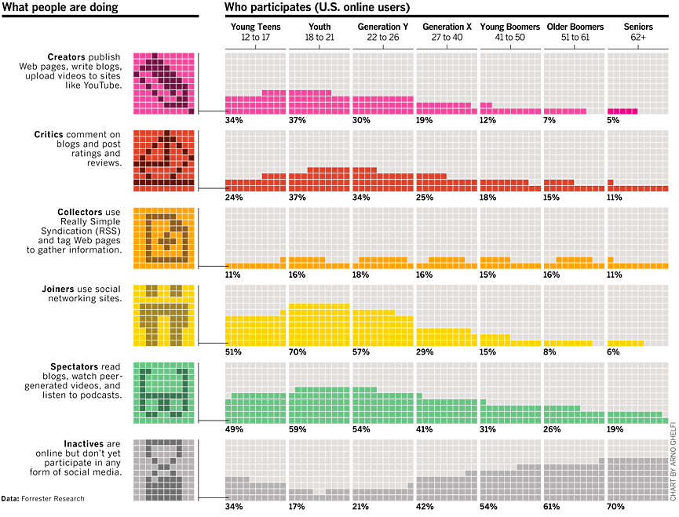

“A person without data is just another person with an opinion”. Dziennikarstwo
oparte o dane robi się coraz bardziej popularne. Przeczytajcie na czym polega i
jak można się go nauczyć.

<!--truncate-->

Skoro nawet dziennikarze Gazety Wyborczej stwierdzili, że warto pisać
[artykuły oparte na faktach](http://biqdata.pl/) - musi coś w tym być 😉.
Pociągnijmy więc temat, który zahacza nieco o wspomniany już przez nas jakiś
czas temu [efekt SMAC](http://techwriter.pl/kwestia-smacu/).

Jak podaje [Wikipedia](http://en.wikipedia.org/wiki/Data_journalism) - data
journalism to... właściwie trudno powiedzieć co 😊. Spróbujmy więc zbudować
naszą własną definicję - to po prostu odnoga (specjalizacja) dziennikarstwa,
charakteryzująca się wykorzystaniem dużej ilości danych numerycznych i
przedstawianiem płynących z nich wniosków (często nieoczywistych) w łatwej do
przyswojenia, graficznej formie. Często w formie
[infografik](http://techwriter.pl/infografiki/).

Np. takich jak ta:

Nie każdy może być "żurnalistą danych", ale też... dla chcącego nic trudnego!
Nam, techwriterom, zawód ten wydaje się bardzo bliskim - wymaga połączenia
umiejętności technicznych i humanistycznych, logicznego myślenia, jasnego
wyrażania myśli oraz zdolności graficznych. Różnica polega na tym, że operujemy
na surowych danych, a nie np. informacjach zdobywanych od technicznego eksperta.
Ciekawe, prawda?

Jeżeli też tak uważacie - zapraszamy do źródeł i przykładów:

- [Facts are sacred](http://www.theguardian.com/news/series/facts-are-sacred) -
  oparta na danych seria artykułów w The Guardian
- [Data Journalism Handbook](http://datajournalismhandbook.org/) - dostępna dla
  wszystkich za darmo encyklopedia dziennikarstwa opartego na danych
- [Information Is Beautiful](http://www.informationisbeautiful.net/) -
  ostrożnie, bardzo wciągające!

Prezentacji wprowadzającej:

<iframe style={{border: '1px solid #CCC', borderWidth: '1px', marginBottom: '5px', maxWidth: '100%'}} src="//www.slideshare.net/slideshow/embed_code/29022739" height={356} width={427} allowFullScreen frameBorder={0} marginWidth={0} marginHeight={0} scrolling="no" />

**[ODC BarCamp 2013 - Introduction to Data Journalism](https://www.slideshare.net/opendevcam/odc-barcamp-2013-introduction-to-data-journalism 'ODC BarCamp 2013 - Introduction to Data Journalism')**
from **[Open Development Cambodia](http://www.slideshare.net/opendevcam)**

Prezentacji praktycznej:

<iframe style={{border: '1px solid #CCC', borderWidth: '1px', marginBottom: '5px', maxWidth: '100%'}} src="//www.slideshare.net/slideshow/embed_code/8795039" height={356} width={427} allowFullScreen frameBorder={0} marginWidth={0} marginHeight={0} scrolling="no" />

**[Data Journalism](https://www.slideshare.net/m.lewis/data-journalism-8795039 'Data Journalism')**
from **[Mitzi Lewis](http://www.slideshare.net/m.lewis)**

A teraz, skoro rozpoczęliśmy cytatem to i cytatem zakończmy:

> “In God we trust; all others bring data.”
>
> ― [W. Edwards Deming](http://en.wikipedia.org/wiki/W._Edwards_Deming)

... podając jeszcze na dokładkę jedyne chyba polskojezyczne źródło wiedzy na ten
temat - [datablog.pl](http://datablog.pl/). Lubimy to!
