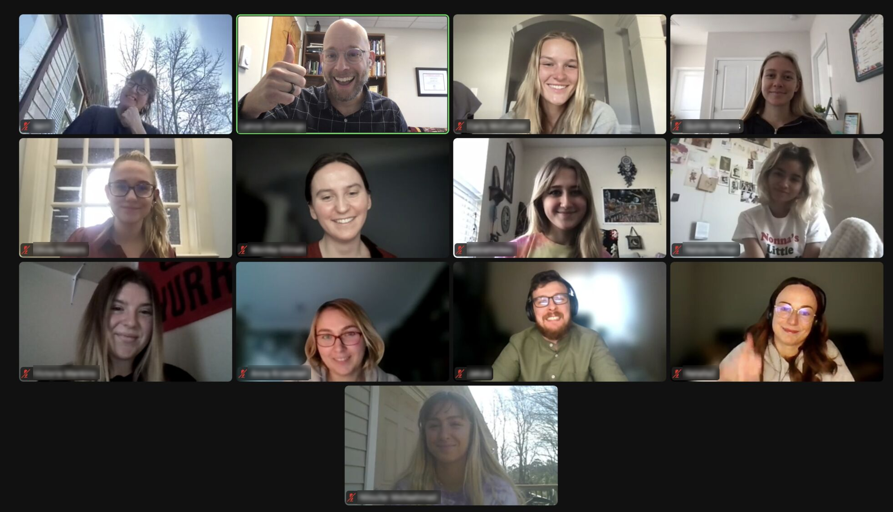
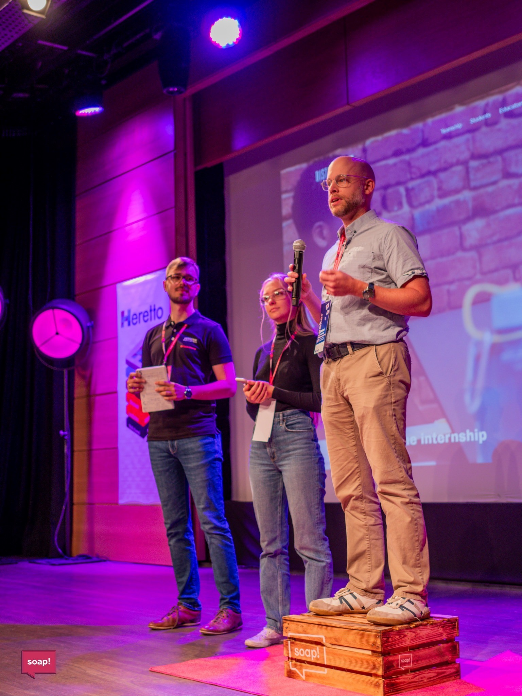
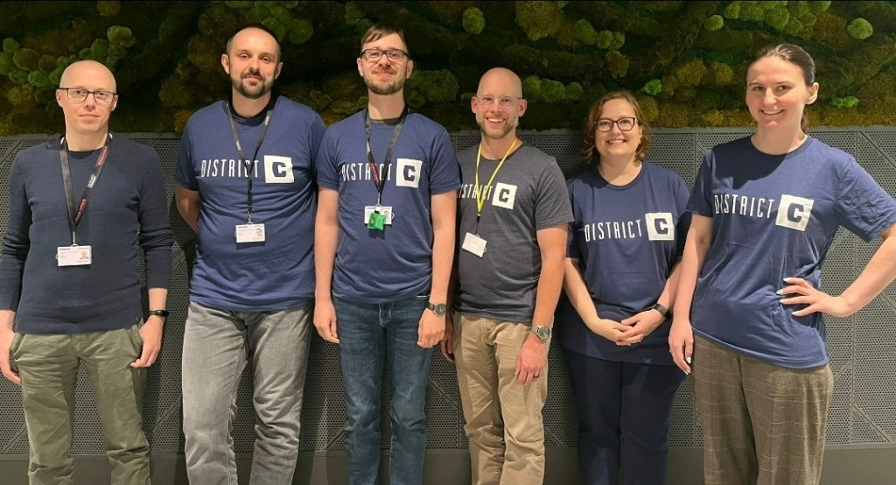
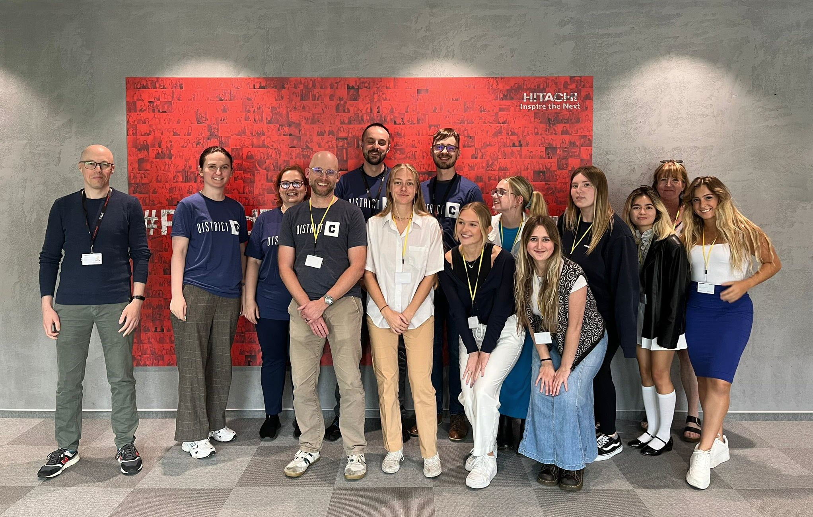

---
title:
  'Student insights - the Hitachi Energy and District C technical writing
  initiative'
authors: niewiarowski
date: '2024-11-13'
tags:
  - 'dobre-praktyki'
  - 'warsztat'
  - 'edukacja'
  - 'articles-in-english'
  - 'design-thinking'
coverImage: 'group_photo.jpg'
---

In 2023, the Technical Writing Team at
[Hitachi Energy](https://www.hitachienergy.com/pl/pl/about-us/company-profile/centrum-technologiczne)
in Kraków participated in [District C](https://www.districtc.co/), a project run
by the
[University of North Carolina Wilmington](https://www.linkedin.com/school/uncw/)
(UNCW) to inspire the next generation of energy professionals. This project was
a perfect storm of teamwork, where the Hitachi Energy employees gave the
students the glimpses of the day-to-day experiences of documentation developers.
The collaboration provided valuable insights into technical writing,
cross-cultural teamwork, and continuous improvement, which makes this story a
compelling read for those interested in education, design thinking, or
professional development.

<!--truncate-->

## Introduction

District C lets students explore a real-life company's business operations. They
learn about the unique aspects of an industry hands-on. In the end, students
offer practical advice to the given problem during a pitch meeting, often their
first experience presenting a business case to stakeholders. Read the story of
the collaboration between District C and Hitachi Energy in Kraków. The story is
told by Andrzej, on behalf of the Technical Writing Team.

 **Participants brainstorming over Zoom.**

## The participants

In 2023, our Technical Writing Team consisted of four people, two of whom were
new joiners. Each of us had a different set of experiences and knowledge to
share. It was in our best interest to think about how to collaborate better and
align our efforts.

We were happy to exchange thoughts with a group of American students of English
Studies at [UNCW](https://www.linkedin.com/school/uncw/) and the Polish
post-graduate students taking a technical writing course at the
[Vistula](https://vistula.edu.pl/kierunki-studiow/komunikacja-techniczna)
non-public university. The students participating in the project could interview
the Technical Writing Team about our team's role at Hitachi Energy. They used
design thinking principles to examine our work environment, aiming to analyze,
find opportunities, gather suggestions, and present them. All of that happened
under the watchful eye of
[Dr. Lance Cummings](https://www.linkedin.com/in/lance-cummings-phd/), an
English professor who specializes in applying AI in the realm of writing. He was
the originator of this unusual project.

## Intricacies of technical writing

We shared our experiences that gave the students an idea of what makes technical
writing rewarding and challenging:

- Processing high volume of information
- Gathering insights from experts and seeking feedback
- Building knowledge about complex products and systems developed at Hitachi
  Energy

 **Lance, Quinn, and Andrzej telling a story about the
project at the
[soap! content conference](https://www.linkedin.com/company/soap-techcomm/posts/?feedView=all)
in June 2023.**

## Project execution

First, there were two rounds of Zoom meetings where information was shared.

The members of the Hitachi Energy Team explained what it is like to be a
Technical Writer and why this role requires specialized expertise. Concise and
clear data gave insight into the organization's daily work and critical focus
areas.

Then, students reflected on what was said and came back with additional
questions to dig deeper. Each student group had a specific amount of time to ask
strategic questions. These were intense, focused sessions in which both sides
tried to use the available time as best they could.

This exercise had already proven beneficial to the Hitachi Energy Team. We all
knew the specifics of our daily operations well. Still, it was a useful exercise
to describe our role to someone outside of our working environment. Explaining
without relying on jargon, project names, and mental shortcuts was challenging.
It helped us to reflect on our needs and better understand them by clear
formulation.

## The big event

Student groups learned what operating in a modern global corporate workplace is
like. They gathered input, applied design thinking principles, identified
opportunities for growth, and suggested sound solutions, which were then
presented during the final **pitch meeting** held over Zoom.

**Pitch meeting** is a presentation where an individual or a team presents a
business idea or concept to potential investors, stakeholders, or clients to
secure funding, support, or interest in the project. The presentation usually
includes an overview of the product or service and the proposed solution.

## Recommendations

Each group presented its assessment of the opportunities and provided practical
recommendations. Fresh perspectives and solutions were appreciated, as they
logically tied to the identified areas for improvement. At the same time, the
Hitachi Energy Team offered practical feedback that was rooted in business
operations, experience, and practice.

Students focused mainly on the nature of the interactions between the Technical
Writers and the Subject Matter Experts (SMEs).

They then explored questions such as: "What is the most efficient way to get
insights from an SME and build product knowledge?" and "Are multiple team
members often asked the same questions?".

One suggestion was to invite all SMEs to a single session to get all their
answers. Alternatively, this could be resolved asynchronously through Teams or a
survey.

Other recommendations included:

- Conducting dedicated workshops to get product insights
- Incorporating short videos to distribute knowledge and information
- Using Scrum Master's advice to optimize the collaboration between the Tech
  Writers and the Dev team
- Establishing a more formalized review process

## The takeaways

Though we have not used every recommendation, we gained a clearer picture of our
needs and possibilities. The challenge allowed for the analysis of how we
operate on a daily basis. It emphasized the strategic and business objectives
that are key to the effectiveness of the processes we run in Kraków and the
global organization.

As part of continuous improvement, we regularly reevaluate our approach to
documentation process and collaboration. Even a year later, we still actively
use the good ideas we picked up during the District C project.

For example, District C inspired us to try Microsoft Loop to engage multiple
Subject Matter Experts quickly.

 **Happy participants at the Hitachi Energy Office in
Kraków.**

## The cross-cultural collaboration aspect

It is worth emphasizing the international nature of this project. To gain
insights into this aspect, shortly after the project was completed, we met the
US participants in the Kraków office and asked about their experiences.

The American view by
[Quinn Williams](https://www.linkedin.com/in/quinn-williams-/):

> This program was especially helpful in understanding how different people with
> different backgrounds can approach business issues. We got to work with Polish
> students, and sharing ideas required us to keep our communication skills at
> the forefront. If we had not practiced effective communication, we would not
> have successfully conveyed some implied thoughts from our American point of
> view. This foundation helped us understand the importance of creating a strong
> team bond and interpersonal practices.

> I also enjoyed experiencing the program's professional side, where we
> communicated with the Hitachi Energy team members. It was interesting to see
> where the Polish work culture differed from the American culture and where
> there was an overlap. I think our teams were able to use essential pieces from
> both sides to create an effective workflow.

We also received insights from the Polish perspective, provided by
[Monika Dąbrowska](https://www.linkedin.com/in/monika-dabrowska1/), a
participant in the technical writing postgraduate studies at
[Vistula](https://vistula.edu.pl/kierunki-studiow/komunikacja-techniczna)
non-public university:

> What I particularly liked about District C was that we could exchange our
> experiences regarding learning and creating projects. The Polish education
> system and culture lead to a general mindset somewhat contrasting that of
> American students.

> Also, the American view of the Poles is far from what we showed during the
> project. Similarly, the Poles also have certain misconceptions about the
> Americans. These assumptions and presuppositions were discussed and challenged
> during our cooperation, and we found power in our variety, creativity,
> exchanging experiences, and understanding one another.

The Technical Writing Team was happy to meet and get to know the US participants
during their visit to the Kraków office and at the soap! content conference,
where we also met some of the Polish students. After the intense cooperation,
bonding during that event was fun.

## Conclusion

The collaboration between Hitachi Energy and District C was a truly enlightening
experience. Students gained a deeper understanding of the technical writing
profession and the complexities of the energy sector. They provided valuable
recommendations to improve collaboration between Technical Writers and SMEs,
such as conducting dedicated workshops and using short videos for knowledge
distribution.

The project also highlighted the benefits of cross-cultural collaboration, with
American and Polish participants gaining insights into different work cultures
and communication styles.

The Hitachi Energy Team benefited from the fresh perspectives and practical
solutions provided by the students, emphasizing the importance of continuous
improvement. The ongoing impact of the collaboration is evident in the continued
use of some recommendations, such as using Microsoft Loop to engage multiple
SMEs quickly.

We are grateful to the students willing to listen to our stories and support us,
the practitioners of the obscure art of tech writing. One can always count on
the students to come up with fresh ideas! They were bright, open-minded, and not
burdened with presumptions. We wish you all the best!

And thank you, Dr. Cummings, for creating such a fruitful initiative — we really
enjoyed being a part of it.

## The 2024 edition and prospects

In 2024, District C returned to Hitachi Energy. This time, it was led by
[Karolina Harazim](https://www.linkedin.com/in/karolina-harazim-she-her/), our
Internal Communications Senior Specialist, and supported by the Technical
Writing Team.

Something tells us this wasn't the last time Hitachi Energy collaborated with
the University of North Carolina Wilmington. Until the next time!

## Additional information about District C

The District C program at UNCW (English Studies) aims to introduce students to
diverse career paths and opportunities while providing valuable real-world
experience collaborating with international companies. As an English professor
and a certified District C coach, Dr. Lance Cummings has been instrumental in
connecting his students with the vibrant tech writing community in Kraków,
Poland.

For more information about the program, visit the
[official District C website](https://www.districtc.co/).

Would you be interested in participating in a similar initiative? If so, get in
touch with
[Dr. Lance Cummings](https://www.linkedin.com/in/lance-cummings-phd/).
