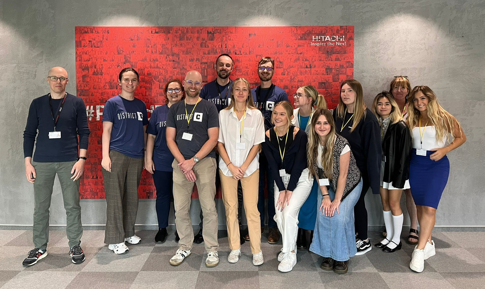

---
title:
  'Student insights - the Hitachi Energy and district C technical writing
  initiative'
authors: niewiarowski
date: '2024-10-17'
tags:
  - 'bez-kategorii'
  - 'dobre-praktyki'
  - 'warsztat'
  - 'praktyki'
  - 'articles-in-english'
coverImage: 'group_photo.jpg'
---

In 2023, the Hitachi Energy Technical Writing Team in Krakow participated in
District C, a project run by the University of North Carolina Wilmington (UNCW)
to inspire the next generation of energy professionals.

<!--truncate-->

District C lets students explore a real-life company\'s business operations.
They learn about the unique aspects of an industry hands-on. In the end,
students offer practical advice to the given problem during a pitch meeting,
often their first experience presenting a business case to stakeholders. Read
the story of the collaboration between District C and Hitachi Energy in Krakow,
written from the perspective of Andrzej, a member of the Technical Writing Team.

 **Participants brainstorm over Zoom.**\_

Our Technical Writing Team consisted of four people, out of which two were new
joiners. Each of us had a different set of experiences and knowledge to share.
It was in our best interest to think about how to collaborate better and align
our efforts.

The American and Polish students participating in the project could interview
the Technical Writing Team about our team's role at Hitachi Energy. Students
used design thinking principles to examine our work environment, aiming to
analyze, find opportunities, gather suggestions, and present them.

We shared our experiences that gave the students an idea of what makes technical
writing rewarding and challenging:

- Complex products and systems
- Volume of information
- Gathering insights from experts and seeking feedback
- Building knowledge about the Hitachi Energy products

 **Lance, Quinn, and Andrzej tell a story about the
project at the soap! content conference in June, 2023.**

## How it was done

First, there were two rounds of Zoom meetings and presenting information.

The members of the Hitachi Energy Team explained what it is like to be a
Technical Writer and why this role requires specialized expertise. Concise and
clear data gave insight into the organization's daily work and critical focus
areas.

Then, students pondered what was said and came back with additional questions to
dig deeper. Each student group had a specific amount of time to ask strategic
questions. These were intense, focused sessions in which both sides tried to use
the available time as best they could.

At that point, this exercise was already beneficial to the Hitachi Energy Team.
We all knew the specifics of our daily operations well. Still, it was a useful
exercise to describe our role to someone outside of our working environment.
Explaining without relying on jargon, project names, and mental shortcuts was
challenging. It helped us to reflect on our needs and better understand them by
clear formulation.

## The big event

Student groups learned what operating in a modern global corporate workplace is
like. They gathered input, applied design thinking principles to empathize,
identified opportunities for growth, and suggested sound solutions, which were
then presented during the final **pitch meeting** held over Zoom.

**Pitch meeting** is a presentation where an individual or a team presents a
business idea or concept to potential investors, stakeholders, or clients to
secure funding, support, or interest in the project. The presentation usually
includes an overview of the product or service and the proposed solution.

## Examples of solutions

Each group presented its assessment of the opportunities and provided practical
recommendations. Fresh perspectives and solutions were appreciated, as they
logically tied to the identified areas for improvement. At the same time, the
Hitachi Energy team offered practical feedback, rooting in business operations,
experience, and practice.

Students focused mainly on the nature of the interactions between the Technical
Writers and the Subject Matter Experts (SME).

They then explored many valid questions:

- What is the most efficient way to get SME insights and build product
  knowledge?
- Are multiple team members often asked the same questions?

One suggestion was to invite all SMEs to a single session to get all their
answers. Alternatively, this could be resolved asynchronously through Teams or a
survey.\
\
Personally, District C inspired me to use Microsoft Loop, allowing me to engage
multiple Subject Matter Experts quickly. I can reuse my Loop notes in bigger
collections. I can embed them in MS Teams chats, channels, Outlook e-mails, and
meeting invites. The same content appears in multiple places and can be edited
instantly by me and the SMEs involved.

Other recommendations included:

- Conducting dedicated workshops to get product insights
- Incorporating short videos to distribute knowledge and information
- Using Scrum Master's advice to optimize the collaboration between the Tech
- Writers and the Dev team
- Establishing a more formalized review process

Though we have not used every recommendation, we gained a clearer picture of our
needs and possibilities. The challenge allowed for the analysis of how we
operate on a daily basis, and it emphasized the strategic and business
objectives that are key to the effectiveness of the processes we run in Krakow
and for the global organization.

As part of continuous improvement, I regularly reevaluate my approach to
documentation process and collaboration. Even a year later, I still actively use
the good ideas I picked up during the District C project.

 **Happy participants at the Hitachi Energy Office in
Krakow.**

## Cross-cultural collaboration

Shortly after the project was completed, we met the US participants in the
Krakow office and asked about their experiences.

The American view by Quinn Williams:

> _This program was especially helpful in understanding how different people
> with different backgrounds can approach business issues. We got to work with
> Polish students, and sharing ideas required us to keep our communication
> skills at the forefront. If we had not practiced effective communication, we
> would not have successfully conveyed some implied thoughts from our American
> point of view. This foundation helped us understand the importance of creating
> a strong team bond and interpersonal practices.     I also
> enjoyed experiencing the program\'s professional side, where we communicated
> with the Hitachi Energy team members. It was interesting to see where the
> Polish work culture differed from the American culture and where there was an
> overlap. I think our teams were able to use essential pieces from both sides
> to create an effective workflow._

The Polish view by Monika Dąbrowska, a participant in the technical writing
postgraduate studies at Vistula non-public university:

> _What I particularly liked about District C was that we could exchange our
> experiences regarding learning and creating projects. The Polish education
> system and culture lead to a general mindset somewhat contrasting to that of
> American students._     _Also, the American view of the Poles is
> far from what we showed during the project. Similarly, the Poles also have
> certain misconceptions about the Americans. These assumptions and
> presuppositions were discussed and challenged during our cooperation, and we
> found power in our variety, creativity, exchanging experiences, and
> understanding one another._

## Kudos

We are grateful to the students willing to listen to our stories and support us,
the practitioners of the obscure art of tech writing. One can always count on
the students to come up with fresh ideas! They were bright, open-minded, and not
burdened with presumptions. We wish you all the best!

And thank you, Dr. Cummings, for creating such a fruitful initiative — we really
enjoy being a part of it.

## The 2024 Edition

In 2024, District C returned to Hitachi Energy. This time, it was led by
Karolina Harazim, our Internal Communications Senior Specialist, and supported
by the Tech Writing Team.

Something tells me this won't be the last time Hitachi Energy collaborates with
the University of North Carolina Wilmington. Until the next time!

## More details about District C

The District C program at UNCW (English Studies) aims to introduce students to
diverse career paths and opportunities while providing valuable real-world
experience collaborating with international companies. As an English professor
and a certified District C coach, Dr. Lance Cummings has been instrumental in
connecting his students with the vibrant tech writing community in Krakow,
Poland.

For more information about the program, visit the
[official District C website](https://www.districtc.co/).

That is all we have prepared for you. Would you be interested in participating
in a similar initiative? If so, please get in touch with
[Dr. Lance Cummings](https://www.linkedin.com/in/lance-cummings-phd/).
