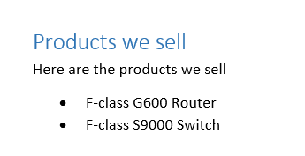
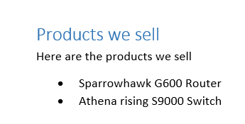
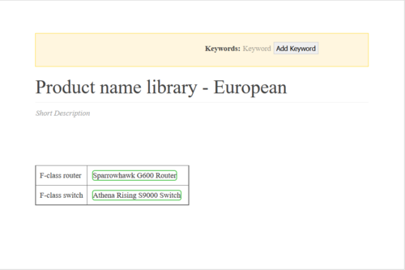

Pisaliśmy już o [podstawach](http://techwriter.pl/wszystko-o-dita-podstawy/) i tworzeniu [strategii](http://techwriter.pl/wszystko-o-dita-strategia/) dla DITA. Po tym łagodnym wprowadzeniu, postanowiliśmy Was rzucić na głęboką wodę, czyli zająć się zagadnieniem conkeyref. Dzięki temu zapoznacie się z koncepcją kluczy i pobierania treści w dicie. Dla ułatwienia posłużymy się praktycznym przykładem, który mamy nadzieję pozwoli Wam szybko zrozumieć o co w tym wszystkim chodzi.

# Czym jest conkeyref?

[Conkeyref](https://docs.oasis-open.org/dita/v1.2/os/spec/common/theconkeyrefattribute.html) to specjalny odsyłacz, który wstawia treść z innego topika znajdującego się w tej samej mapie ditowej. Na tym etapie prawdopodobnie ta definicja brzmi jeszcze zagadkowo. W dalszych sekcjach znajdziecie więcej szczegółów, które powinny rozjaśnić o co chodzi.

# Przykład użycia

Załóżmy, że mamy topik wymieniający produkty, które sprzedajemy. Ten topik jest używany we wszystkich naszych publikacjach i wygląda tak:

Nasze produkty nazywają się F-class G600 Router i F-class S9000 Switch. Jednak nasz zespół marketingowy na Europę stwierdził, że to nudne nazwy i postanowił sprzedawać te same produkty jako Sparrowhawk i Athena Rising.

Co teraz? W tej sytuacji możemy właśnie wykorzystać conkeyref do wstawienia nazw produktów, dzięki czemu będziemy mogli używać nowych nazw na rynku europejskim a starych nazw na wszystkich pozostałych rynkach.

## Dwa topiki

Żeby zastosować wspomniane powyżej rozwiązanie będziemy potrzebować dwóch topików.

Zaczynamy od topiku **product\_names.dita** dla starych dobrych nazw. Zawiera on następujące elementy:

<ph id="**G600**">F-class G600 Router</ph>
<ph id="**S9000**">F-class S9000 Switch</ph>

Każdy element ma swoje id, które odgrywa bardzo ważną rolę.

Następnie, kopiujemy ten topik i zapisujemy go jako **european\_product\_names.dita**. Zmieniamy w nim tylko nazwy produktów, a id pozostawiamy bez zmian. Dzięki temu otrzymujemy następujące elementy:

<ph id="G600">**Sparrowhawk** G600 Router</ph>
<ph id="S9000">**Athena Risin**g S9000 Switch</ph>

Te dwa topiki są naszym źródłem dla nazw produktów. Tego typu topiki nazywamy bibliotekami, bo zawierają zasoby wykorzystywane przez mechanizmy DITA. Nie są to topiki, które czytają nasi użytkownicy. Ich struktura wygląda dość roboczo, na przykład tak:

Topik, który rzeczywiście trafi do naszego manuala to inny topik opisany poniżej. Jest on wpięty do mapy na samym początku pierwszego rozdziału.

## Tak naprawdę, to jeden topik

Topik, który zostanie użyty w manualu zawiera odwołania do nazw produktów w odpowiednim miejscu:

<ph conkeyref="product-names/**G600**"></ph>
<ph conkeyref="product-names/**S9000**"></ph>

Odwołania używają id, które ustawiliśmy w naszych topikach-bibliotekach oraz klucza "product-names". Nasz topik włączamy do [mapy ditowej](http://techwriter.pl/wszystko-o-dita-podstawy/).

## Odwołanie do klucza jest kluczem do sukcesu

Ustawiając odwołanie w topiku, nie odwołaliśmy się do nazwy pliku biblioteki, ale do klucza. Klucz umieszczamy w mapie ditowej w następujący sposób:

<keydef keys="**product-names**" href="reuse/generic\_product\_names.dita" />

Element keydef zawiera naszą nazwę klucza "product-names" oraz odwołanie do pliku generic\_product\_names.dita, dlatego nasze odwołanie ma postać:

product-names/G600

Zamiast

generic\_product\_names.dita/G600

Dzięki temu możemy w innej mapie umieścić odwołanie do klucza z inną nazwą pliku:

<keydef keys="product-names" href="reuse/**european\_product\_names.dita**" />

# Próbka do pobrania

[Tutaj](http://techwriter.pl/wp-content/uploads/2016/09/product_catalogditamap-bundle.zip) możecie pobrać pliki DITA, które obrazują przykład użycia opisany powyżej. Poniżej opis paczki, którą możecie ściągnąć:

1. Mapa "generic" odwołuje się do tabeli nazw podstawowych.
2. Mapa "european" odwołuje się do tabeli nazw na Europę.
3. Folder "reuse" zawiera obie tabele nazw.
4. Plik topic.xml jest użyty w obu mapach.

W następnym odcinku napiszemy jak takie pliki otworzyć i jak wyprodukować z nich PDFa. Dajcie znać w komentarzach jak Wam się podoba i o czym chcielibyście przeczytać następnym razem.
