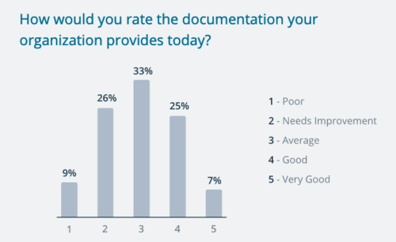
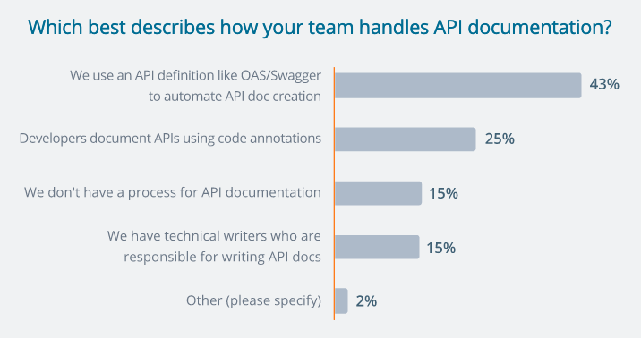

API nAPIera ;) Czego się spodziewać i na czym wzorować tworząc tego typu
dokumentację? Wygrzebaliśmy dla Was trochę przydatnych informacji.

Jeśli nie zetknęliście się jeszcze z tematyką - nieskromnie polecamy
[nasze wprowadzenie](http://techwriter.pl/dokumentacja-api-czesc-1-definicja-i-rodzaje-api/).

Będziemy o tym pisać coraz częściej. Dlaczego? Dlatego, że Application
Programming Interfaces to w tej chwili jeden z najbardziej gorących trendów w
świecie technologii.

> Three-quarters of organizations are developing both internal and public-facing
> APIs

To cytat z bardzo ciekawego raportu "The State of API 2019", publikowanego przez
firmę SmartBear. Podobnie jak ten:

> More investment in API documentation can help API providers offer a great
> developer experience

Polecamy ten dokument Waszej uwadze, a w szczególności strony 39-43, czyli
podrozdział "API Documentation and Usability"!

[Całość raportu jest dostępna całkowicie za darmo tutaj.](https://static1.smartbear.co/smartbearbrand/media/pdf/smartbear_state_of_api_2019.pdf)

Znając Wasze lenistwo wklejamy kilka najciekawszych wykresów ;)

Jak widać warto się zainteresować tematem.

Wśród techwriterskiej braci niekwestionowanym liderem, prekursorem i ekspertem w
dokumentowaniu API jest Tom Johnson, prowadzący
[stronę I'd Rather Be Writing](https://idratherbewriting.com), niejednokrotnie
już wspominany na naszych łamach.

Tom przeprowadza swoją ankietę wśród osób zajmujących się dokumentowaniem API i
na bieżąco publikuje jej rezultaty:

[Trends in developer documentation 2020](https://www.questionpro.com/t/PGhS9ZgCFE)

Przykładowe rezultaty dotyczące narzędzi wykorzystywanych podczas tworzenia
dokumentacji dla programistów:

Ależ Przydatne Informacje (API) chciałoby się krzyknąć! :)

Przy okazji - jeżeli tworzycie treści dla programistów, albo znacie kogoś kto
się tym zajmuje - pomóżcie zebrać więcej danych do tego raportu. Wystarczy kilka
minut aby wypełnić
[ankietę](https://www.questionpro.com/a/TakeSurvey?tt=qYKAPa%2BvYY4%3D) -
podeślij koleżance/koledze!

Na koniec łapcie kilka fajnych przykładów dokumentacji API wraz z uzasadnieniem
specjalisty:

https://nordicapis.com/5-examples-of-excellent-api-documentation/

Nie są może najświeższe, ale wciąż prezentują pewien (ponadprzeciętny) poziom,
do którego większość firm stara się dopiero dojść. Czego i Wam życzymy :)

P.S. Zapraszamy na nasz
[profil na LinkedIn](https://www.linkedin.com/company/techwriter-pl)!
