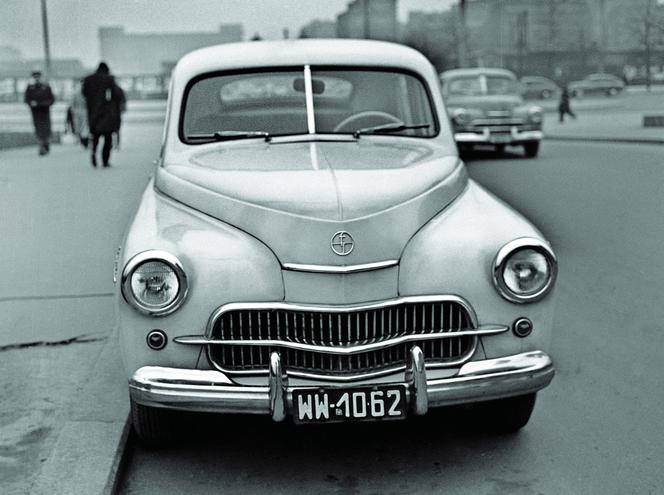
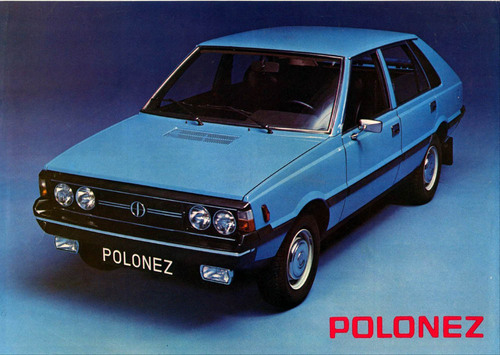

Cofniemy się w nieco w czasie do okresu PRL.

Szare domy, szare ulice, szaro ubrani obywatele. Tak często opisywana jest Polska powojenna. Jednocześnie był to czas niezwykłej kreatywności, również w dziedzinie motoryzacji.

Dlaczego nawiązujemy do tego okresu i tematyki? Co on ma wspólnego z dokumentacją techniczną? Otóż, wiąże się z nim ciekawa historia, która wpłynęła na kształtowanie się polskiego automobilizmu.

## Z archiwum

Po II wojnie światowej polska motoryzacja miała się nie najlepiej. Ze względu na sytuację polityczną wybór samochodów osobowych w naszym kraju był wąski, a nawet ograniczony, głównie do pojazdów rodzimej produkcji lub aut pochodzących z ZSRR.

W 1946 roku rząd wprowadził oficjalną zgodę na rejestrowanie prywatnych samochodów osobowych. Pozostała jeszcze decyzja gdzie one będą produkowane. W ostateczności postanowiono wybudować Fabrykę Samochodów Osobowych (FSO) na Żeraniu w Warszawie. Był to efekt wynegocjowanej umowy barterowej z Włochami w ramach, której mieliśmy otrzymać licencję na Fiata.

W 1951 roku z linii produkcyjnej nie zjechał jednak Fiat.

Co się stało?

Józef Stalin sprzeciwił się produkowaniu w kraju komunistycznym samochodów osobowych na licencji zachodniej. Umowa z Włochami została zerwana. W zamian miłościwy Stalin zaoferował ''darmową'' licencję na samochód [Pobieda M-20](https://pl.wikipedia.org/wiki/GAZ-M20_Pobieda)  - w późniejszym czasie nazwany Warszawą.

Na mocy podpisanej umowy polsko-radzieckiej, przekazano plany konstrukcyjne samochodu GAZ Pobieda M-20. Mieliśmy zapłacić jedynie za dokumentację techniczną oraz ponieść koszty przystosowania auta do warunków polskich. I tutaj niespodzianka, dokumentacja kosztowała nas **130 mln ówczesnych złotych**!!!

...co się działo dalej?

## Produkcja i eksploatacja

Pierwszy egzemplarz Warszawy został w całości wyprodukowany z podzespołów sprowadzonych z ZSRR. Samochód był drogi w utrzymaniu, palił 13 l/100 km, miał tylko 40 koni mechanicznych i często się psuł. Konstrukcja pojazdu była dość prosta dlatego w przypadku awarii nikt nie myślał o serwisie - Warszawę naprawiono samodzielnie.

Ponieważ Warszawa już w momencie rozpoczęcia produkcji była autem przestarzałym, jeszcze w latach 60. zaczęto szukać modelu, który miał ją zastąpić.

## Ewolucja samochodu

Pierwowzór auta ''podarowany'' przez Rosjan okazał się na tyle niedopracowany, że polscy konstruktorzy nieustannie Warszawę modernizowali (łącznie do zakończenia produkcji wprowadzono około 4 tysiące zmian).

Pierwsze Warszawy (M20, 200, 201 i 202) były czterodrzwiowe. Z czasem powstawały nowe wersje użytkowe jak sedan czy pickup, a także wersje specjalne. Więcej informacji na ten temat znajdziecie [(tutaj)](https://pl.wikipedia.org/wiki/FSO_Warszawa).

## Dalsze losy Warszawy

W następnych latach w odpowiedzi na ''potrzeby społeczeństwa'' zaczęto wprowadzać na rynek kolejne, stale poprawiane i ulepszane modele, bazujące na podzespołach Warszawy:

- [Syrena](https://pl.wikipedia.org/wiki/FSO_Syrena)
- [Tarpan](https://pl.wikipedia.org/wiki/FSR_Tarpan)
- [Żuk](https://pl.wikipedia.org/wiki/FSC_%C5%BBuk)

Kiedy w latach 60-tych konkurencyjność w branży motoryzacyjnej nieco wzrosła, można było importować pojazdy z zagranicy. Nasz rząd jednak dalej dbał o to, aby raczej nabywać auta rodzimej produkcji lub korzystać z komunikacji zbiorowej. W czasie tak zwanej ''odwilży gomułkowskiej'', postanowiono jednak przeprowadzić w kraju pewne reformy. Warszawskie FSO nabyło włoską licencję na model Fiata. I tak, następcą Warszawy zostało auto klasy średniej [Polski Fiat 125p](https://en.wikipedia.org/wiki/Polski_Fiat_125p). Ta decyzja zapewniła szybki transfer względnie nowej technologii w naszym kraju. Produkcję rozpoczęto już w 1967 roku.

Kilka lat później, w 1971 roku, podpisano kolejną umowę licencyjną z Włochami, tym razem na produkcję samochodu małolitrażowego. [Polski Fiat 126p](https://pl.wikipedia.org/wiki/Fiat_126), zwany ''Maluchem'', uznawany jest za samochód, który zmotoryzował nasze społeczeństwo :).

Jako następca Polskiego Fiata 125p pojawił się [Polonez](https://pl.wikipedia.org/wiki/FSO_Polonez). Jego produkcja przypadła na okres kryzysu gospodarczego w latach 80-tych, co nie pozwoliło na wdrożenie większej ilości nowoczesnych rozwiązań. Nie był on w stanie konkurować z autami zachodnimi, które stawały się coraz bardziej popularne w naszym kraju.

...i tutaj w wielkim skrócie historię polskiej motoryzacji należałoby zakończyć ;).

Dużo o motoryzacji to może teraz  trochę o dokumentacji.

## Instrukcje obsługi, katalogi i prospekty reklamowe

Popyt na samochody w okresie PRL był tak duży, że nie było potrzeby ich reklamowania, przynajmniej na rynku krajowym. Obywatele byli w stanie czekać nawet kilka lat aby otrzymać swój wymarzony pojazd.

Inaczej miała się sytuacja w momencie eksportu. Materiały reklamowe w tym przypadku miały zachęcić klienta zagranicznego do zapoznania się i zakupu naszych samochodów. Przykładano dużą wagę do tworzonych prospektów, które nie odstawały swoją jakością od tych z państw kapitalistycznych.

W związku z licznymi modyfikacjami rodzimych pojazdów, dokumentacja techniczna była niekiedy dość szczegółowa i musiała być stale aktualizowana.

Obecnie w sieci można znaleźć kolekcjonerskie instrukcje obsługi i prospekty naszych rodzimych modeli z dokładnymi opisami i rysunkami, tłumaczone również na wiele języków.

Jeśli jesteście zainteresowani, zachęcamy do zgłębienia tematu i przeglądania:

- [Instrukcja obsługi FSO Warszawa M20](https://gaz69.eu/biblioteka/pobieda/instrukcja-obslugi-fso-warszawa-m20/)
- [Katalog części zamiennych samochodu FSO Warszawa M20](https://gaz69.eu/biblioteka/pobieda/katalog-czesci-zamiennych-samochodu-warszawa-m20/)
- [Foldery reklamowe Syreny](https://autoarchiwum.blogspot.com/2014/04/trzy-foldery-syreny.html)
- [Prospekty reklamowe Polskiego Fiata 125p](https://autoarchiwum.blogspot.com/2014/10/prospekty-polskiego-fiata-125p-czesc-1.html)
- [Dokumentacja techniczna Polskiego Fiata 126p](https://autoarchiwum.blogspot.com/2014/03/literatura-techniczna-i-serwisowa-126p.html)

## Smutna prawda

Samochody z czasów PRL nie wyróżniały się niczym szczególnym na tle światowej motoryzacji i, z małymi wyjątkami, były dość przestarzałe. Rodzima technologia opierała się na tej z bloku wschodniego. Być może przyczynił się do tego panujący ustój polityczny i sam Stalin. Mimo licznych modernizacji nasze krajowe auta przegrały z autami zachodnimi, zarówno pod względem konstrukcyjnym jak i cenowym.

Niemniej jednak Polska z czasu PRL miała coś, czego już dzisiaj praktycznie nie mamy - masowo produkowane auta krajowe.

## ... i na koniec pozytywny akcent

Zagłębianie się w historię PRL wcale nie musi być smutnym doświadczeniem. Wśród godnych pochwały rzeczy są dobrze zaprojektowane prototypy samochodów krajowych. Polscy konstruktorzy nieustannie pracowali nad nowymi, ulepszonymi i bardziej nowoczesnymi wersjami samochodów, które można nazwać dziś perłami motoryzacji.

Może Stalin w pewnym sensie wyświadczył nam przysługę ''darując" nam tę dokumentację? A Wy co o tym myślcie?

Zapraszamy do komentarzy!!
