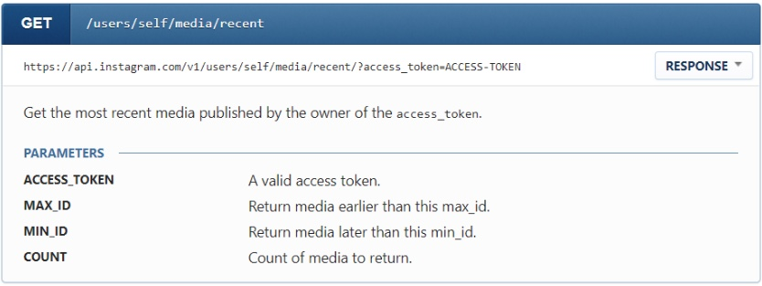
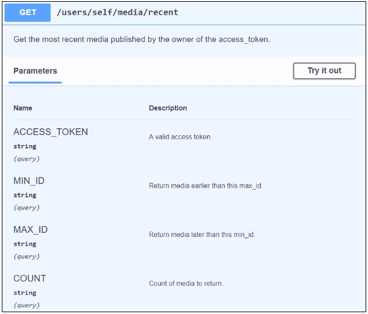

Kontynuujemy temat dokumentacji API - przed Wami drugi artykuł Marcina
Pierzchały. Tym razem skupiamy się na części referencyjnej dokumentacji.

<!--truncate-->

[W poprzedniej części cyklu omówiliśmy definicję API](../dokumentacja-api-czesc-1-definicja-i-rodzaje-api/index.md)
i wprowadziliśmy rozróżnienie na API webowe i natywne. Przyjrzeliśmy się także
prostemu zapytaniu HTTP, które wysłaliśmy do usługi Google Maps, co pozwoliło
nam wygenerować i zagnieździć na stronie mapkę wskazanego obszaru. W
przytoczonym przykładzie całą robotę wykonały serwery Google. Jedyne, co
musieliśmy zrobić, to wysłać odpowiednio skonstruowane zapytanie do właściwego
punktu dostępowego API. Jednak aby wiedzieć, jak to zrobić, musimy wpierw
sięgnąć do dokumentacji.

Dzisiaj pokażę Wam, jak wygląda dokumentacja API i z jakich części się składa.
Następnie przedstawię pewne specyficzne wyzwania, jakie za sobą niesie
dokumentowanie API, oraz omówię narzędzia, w które powinien uzbroić się
dokumentalista, aby podołać zadaniu.

### Na dwoje babka wróżyła

Pod pojęciem dokumentacji API w praktyce kryją się dwa odrębne byty –
dokumentacja koncepcyjna i dokumentacja referencyjna. Ta pierwsza tłumaczy
podstawowe pojęcia potrzebne do zrozumienia, jak działa dany interfejs
programistyczny, opisuje przebieg autentykacji i podaje proste przykłady, dzięki
którym użytkownik może zacząć szybko korzystać z API (“getting started”, “quick
start” itp.). Wyjaśnia ona też kwestie biznesowe, takie jak ograniczenia w
częstotliwości odpytywania endpointów (“rate limiting”) czy możliwość wykupienia
komercyjnego dostępu do API.

Z kolei dokumentacja referencyjna jest niczym innym jak listą wszystkich punktów
dostępowych wystawianych przez API wraz ze szczegółowym opisem wszystkich
parametrów, które są wymagane podczas wołania poszczególnych endpointów. Zwykle
możemy się w tym miejscu natknąć także na przykłady zapytań i odpowiedzi
(najczęściej w formatach XML i JSON). Bardziej interaktywne dokumentacje
referencyjne pozwolą nam nawet uzupełnić formatkę z parametrami dowolnymi
wartościami i wysłać zapytanie do API bezpośrednio ze strony internetowej!

Relacja między dokumentacją referencyjną a koncepcyjną jest analogiczna do tej
pomiędzy słownikiem a podręcznikiem gramatyki – sięgając po ten pierwszy możemy
co prawda poznać wszystkie słowa w danym języku, ale aby dowiedzieć się, jak je
składać w poprawne zdania, musimy poznać także reguły gramatyczne.

Skoro już mniej więcej wiemy, jakie rodzaje treści mogą występować w
dokumentacji API, przyjrzymy się przykładowemu wpisowi w “programistycznym
słowniku” API Instagrama:

\[caption id="attachment_7337" align="aligncenter"
width="834"\] Instagram API\[/caption\]

Powyższy przykład dokumentuje punkt dostępowy o nazwie users/self/media/recent,
który, zgodnie z opisem, zwraca ostatnie media opublikowane przez konto, z
którym jest powiązany podany _access token_ (czyli coś w rodzaju klucza, którym
się legitymujemy przed serwerem API). Poza nazwą endpointa i jego opisem,
poznajemy także wspieraną metodę (GET), przykładową odpowiedź serwera (kryjącą
się pod przyciskiem “Response”) oraz opis parametrów, które mogą się znaleźć w
łańcuchu zapytania.

Wyobraźmy sobie teraz, że mamy do utrzymania dokumentację referencyjną API,
które składa się z 50, 100 czy nawet 150 endpointów. Każdy z nich przyjmuje
szereg parametrów, dla których musimy określić, czy są one wymagane czy
opcjonalne, a także gdzie powinny się znaleźć (w ciele wiadomości, w łańcuchu
zapytania czy ścieżce?). Jeśli dany parametr przesyła się w ciele wiadomości w
formacie JSON, to musimy dodatkowo wskazać, jaki powinien być jego typ danych
(np. liczba całkowita, liczba dziesiętna, łańcuch znaków). Do tego dochodzi
olbrzymia ilość przykładowych zapytań i odpowiedzi, które również muszą być
zawsze aktualne. Utrzymanie takiej dokumentacji w ryzach potrafi być nie lada
wyzwaniem.

### To HAT or not to HAT?

Jak zatem podejść do utrzymania dokumentacji referencyjnej API, aby zapewnić
aktualność materiałów i nie postradać zmysłów? Wielu z nas sięgnęło by zapewne
po jakiś sprawdzony w boju program do tworzenia dokumentacji, na przykład MadCap
Flare albo coś ze stajni Adobe. Nie byłoby to jednak optymalne rozwiązanie.
Typowy HAT (_help authoring tool_) sprawdzi się świetnie podczas pisania
konwencjonalnej dokumentacji, takiej jak podręczniki użytkownika czy online
helps, lecz nie zda egzaminu w wypadku dokumentacji API. Dlaczego? Po pierwsze
programy tego typu nie są nastawione na tworzenie nowoczesnej, interaktywnej
dokumentacji. Dla użytkowników API możliwość wypróbowania funkcjonalności
bezpośrednio z poziomu portalu z dokumentacją jest niezwykle pomocna. Co więcej
HAT-y stanowią mur między dokumentalistą a programistą, ponieważ zazwyczaj tylko
ten pierwszy posiada odpowiednią licencję. Dla tych, którzy lubią mieć absolutną
kontrolę nad każdym aspektem dokumentacji, być może nie jest to wada, lecz
trzeba pamiętać, że dokumentacja API jest wysoce techniczna i ścisła współpraca
z ekspertami jest niezbędna.

Ostatnim, i chyba największym, niedomaganiem HAT-ów w kontekście dokumentowania
API jest brak możliwości zbudowania dokumentacji ze źródła. Chodzi tu o
automatyczne jej wygenerowanie na podstawie komentarzy w kodzie bądź z dokumentu
zawierającego definicję API. Gdzie w takim razie szukać ratunku? Tutaj do akcji
wkracza specyfikacja OpenAPI.

### OpenAPI & Swagger

OpenAPI to otwarty standard umożliwiający definiowanie REST-owych API. Opierając
się na nim możemy opisać całość funkcjonalności API w niewielkim dokumencie
tekstowym w języku [YAML](http://yaml.org/) (gdzie dane strukturyzuje się przy
pomocy wcięć). Przytoczony powyżej przykład z API Instagrama można by w nim
wyrazić w następujący sposób (innym dopuszczalnym formatem jest JSON, przy czym
jest on mniej popularny ze względu na gorszą czytelność):

paths: /users/self/media/recent: get: description: Get the most recent media
published by the owner of the access_token. tags: - user parameters: - name:
ACCESS_TOKEN in: query description: A valid access token. schema: type: string -
name: MIN_ID in: query description: Return media earlier than this max_id.
schema: type: string - name: MAX_ID in: query description: Return media later
than this min_id. schema: type: string - name: COUNT in: query description:
Count of media to return. schema: type: string

Taką definicję można wyciągnąć albo bezpośrednio z kodu przy użyciu specjalnego
generatora, albo stworzyć ją ręcznie. Zwłaszcza ten drugi wariant niesie ze sobą
dużo korzyści, szczególnie jeśli specyfikację opracujemy przed powstaniem API,
ponieważ już na samym starcie ujawni ona wiele błędów i niespójności. Dodatkowo
programiści otrzymują wtedy swego rodzaju kontrakt, którego muszą się trzymać
podczas rozwijania API.

Definicja zgodna ze standardem OpenAPI jest bardzo klarowna sama w sobie i, co
ważniejsze, nadaje się do odczytu maszynowego. Możemy nią “nakarmić” szereg
wyspecjalizowanych narzędzi, które stworzą dla nas dokumentację, pomogą
opracować testy, a nawet… automatycznie wygenerują kod wdrażający API w wybranym
języku! Oczywiście jest to tylko szablon, który trzeba już ręcznie uzupełnić o
zaprojektowaną funkcjonalność. Niemniej jednak jest to spora oszczędność czasu,
a sama idea _documentation-driven development_ jest bardzo intrygująca.

Wróćmy jednak do tematu tego wpisu. Ponieważ OpenAPI jest otwartym standardem
cieszącym się bardzo dużą popularnością, mamy do wyboru
[szeroką gamę](https://github.com/OAI/OpenAPI-Specification/blob/master/IMPLEMENTATIONS.md)
programów, które pozwolą nam wygenerować dokumentację referencyjną na podstawie
definicji API. Honorowe miejsce w tym gronie zajmują narzędzia z pakietu
Swaggera, za którego sprawą standard ten w ogóle powstał\*. Wśród nich chyba
najbardziej interesujące z punktu widzenia dokumentacji są dwa programy –
**Swagger Editor** i **Swagger UI**. Ten pierwszy umożliwia pisanie specyfikacji
OpenAPI bezpośrednio w przeglądarce, weryfikując w czasie rzeczywistym, czy
pisana definicja jest zgodna ze standardem. Od razu generuje też podgląd
dokumentacji, dzięki czemu łatwiej jest dostrzec ewentualne błędy merytoryczne.
Swagger Editor można sobie przetestować [tutaj](https://editor.swagger.io/).

\[caption id="attachment_7339" align="aligncenter"
width="737"\] Swagger Editor\[/caption\]

Gdy mamy już gotową definicję OpenAPI możemy skorzystać ze Swagger UI, który
wygeneruje nam na jej podstawie całkiem atrakcyjną dokumentację referencyjną
(która w wersji domyślnej będzie wyglądać [tak](https://petstore.swagger.io/)).
Powstałą w ten sposób stronę internetową możemy ostylować zgodnie z naszą
firmową paletą i umieścić na dowolnym serwerze, gdzie użytkownicy będą mogli z
niej korzystać. Na przykład opisaną wcześniej definicję punktu dostępowego w API
Instagrama Swagger UI przekształciłby w taką oto dokumentację:

\[caption id="attachment_7340" align="aligncenter"
width="611"\] Swagger UI\[/caption\]

Z punktu widzenia odbiorcy dokumentacja referencyjna wygenerowana przy użyciu
narzędzi Swaggera jest bardzo przejrzysta. Dodatkową zaletę stanowi możliwość
wypróbowania zapytań bezpośrednio w dokumentacji. Swagger prezentuje się bardzo
dobrze również od kuchni, choć wymaga nieco technicznej wiedzy. Jeśli jednak
dysponujemy dobrze napisaną lub wygenerowaną automatycznie z kodu definicją
OpenAPI, aktualizowanie dokumentacji referencyjnej będzie czystą przyjemnością.

Zarzutem często wysuwanym pod adresem Swaggera jest to, że generowana przez
niego dokumentacja wygląda nieco archaicznie. No i faktycznie – wystarczy
spojrzeć na dokumentację
[Spotify](https://developer.spotify.com/documentation/web-api/reference/albums/get-album/)
czy [Trello](https://developers.trello.com/v1.0/reference), żeby się przekonać,
że może być dużo lepiej. Ponadto Swagger nie daje możliwości zintegrowania
dokumentacji referencyjnej z koncepcyjną, którą musimy pisać osobno i jakoś
“doklejać” do części wygenerowanej przez Swaggera. Na szczęście narzędzi
wspierających standard OpenAPI nie brakuje, dzięki czemu każdy powinien znaleźć
rozwiązanie na miarę swoich potrzeb. Ciekawymi propozycjami są np.
[readme.io](https://readme.io/) i [Stoplight](https://stoplight.io/), które
kładą nacisk na pracę w chmurze. Warto też wspomnieć, że obok OpenAPI równolegle
istnieją też dwa inne, nieco mniej popularne standardy opisu REST-owych API  –
RAML i API Blueprint, które otwierają drzwi do kolejnych specjalistycznych
narzędzi.

Dzisiejszy wpis wyszedł dłuższy niż się spodziewałem, ale dokumentowanie API to
rozległy temat. Skupiliśmy się na dokumentacji referencyjnej, która obok
materiałów koncepcyjnych stanowi trzon każdej dokumentacji REST-owego API.
Następnie wkroczyliśmy w świat standardu OpenAPI i narzędzi Swaggera, które
oferują bardzo wygodny sposób na tworzenie dokumentacji referencyjnej. W
kolejnej części cyklu weźmiemy na warsztat dokumentację koncepcyjną, przyjrzymy
się narzędziom, które możemy zastosować podczas jej pisania, a na koniec omówimy
możliwości publikacji kompletnej dokumentacji API.

\*W 2015 roku firma SmartBear Software, do której należy Swagger, powołała do
życia OpenAPI Initiative, która to objęła pieczę nad specyfikacją OpenAPI
(dawnej funkcjonującą pod nazwą Swagger Specification) jako otwartym standardem,
który miał być od tej pory rozwijany przy współpracy wielu firm w ramach Linux
Foundation.
