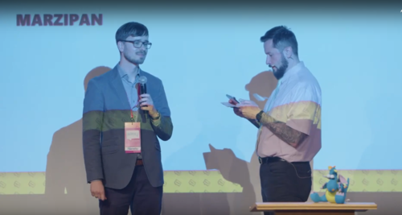
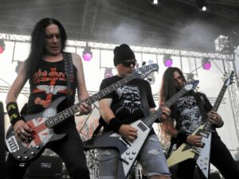
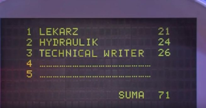
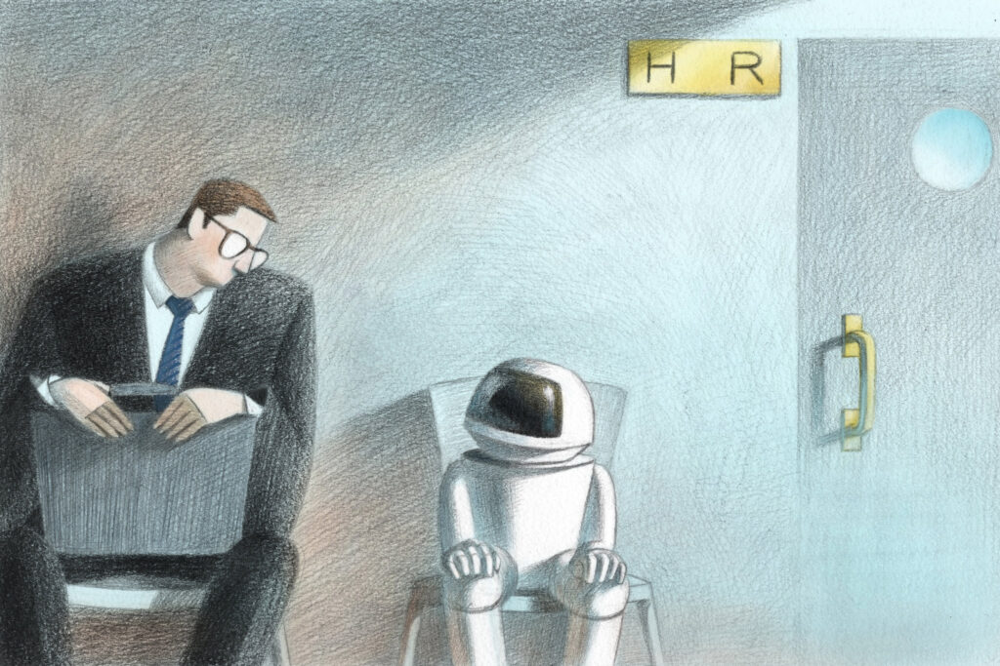
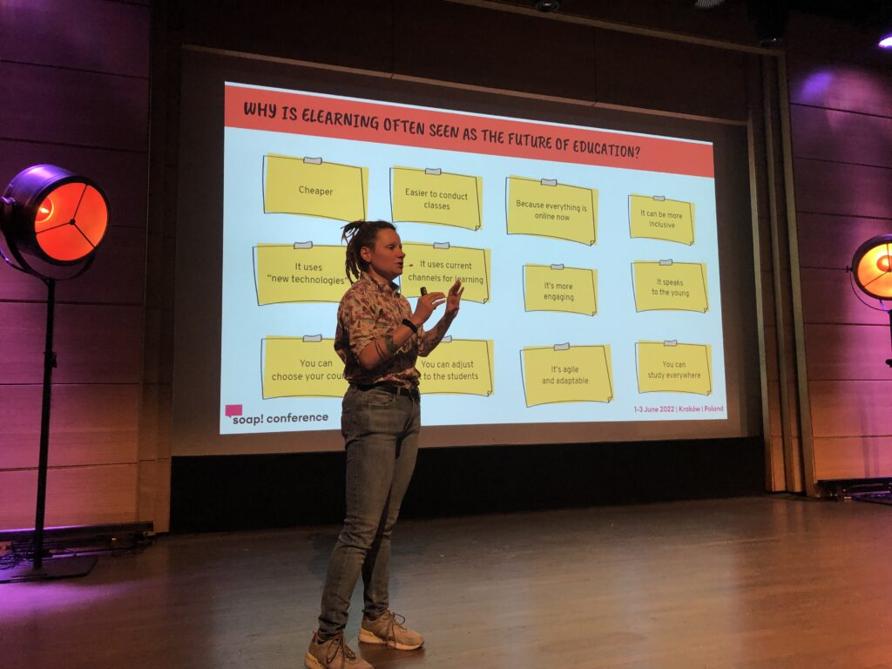
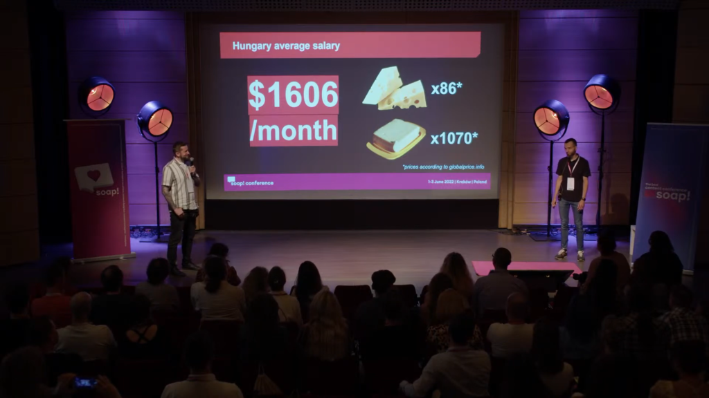

Lato trwa, a konferencja soap! już za nami. Jak było? Czy coś się zmieniło? A może pojawiły się jakieś nowości. Zapraszamy na relację!

Czerwiec 2022 okazał się właściwym i długo wyczekiwanym momentem dla wielu Soapersów i osób, które po raz pierwszy przybyły na konferencję lub połączyły się online. Po dwuletniej przerwie organizatorzy powrócili na scenę, bo [soap!](https://soapconf.com/) to nie tylko warsztaty i wykłady, ale także spotkania społeczności związanej z komunikacją techniczną, możliwość nawiązania nowych znajomości, miejsce, w którym ludzie chętnie dzielą się wiedzą i opowiadają o swoich doświadczeniach, pierwszych krokach, błędach i sukcesach w tech writingu. Konferencja daje również możliwość spotkania się twarzą w twarz i porozmawiania,  nie zawsze na tematy techniczne :).

## Informacje ogólne

Konferencja odbyła się w formie hybrydowej. Na scenie (i ekranie) w centrum [Manggha](https://manggha.pl/) wystapiło łącznie 21 prelegentów. Konferencję poprowadziła Aga Tkaczyk, która wcieliła się w rolę konferansjerki po raz pierwszy (z wielkim sukcesem) i z radością powitała uczestników oraz zadbała o atmosferę soap!, tak jak do tej pory robiła to Gosia Radymiuk.

Tematem przewodnim tegorocznej konferencji była sztuczna inteligencja (AI) we wszystkich jej odsłonach oraz doświadczenia związane z pracą w nowej rzeczywistości (nie koniecznie post-covidowej). Pełny program wykładów możecie znaleźć [tutaj](https://soapconf.com/schedule-2022/), a same prelekcje [tutaj](https://www.youtube.com/playlist?list=PLUY0lajb-kiaMB8XEOrdqE-BBLQmSfvCB).

## Coś nowego!

W tym roku organizatorzy postawili na urozmaicenie konferencji uczestnikom i przygotowali zupełnie nowe wydarzenie - S.U.P.E.R G.A.M.E.

Ochotnicy (przedstawiciele dwóch drużyn, każda składająca się z 5 osób), niczym w [Familiadzie](https://pl.wikipedia.org/wiki/Familiada), zgłaszali się do odpowiedzi na pytania, energicznie przechwytując maskotkę smoka. Pytania były podchwytliwe, czasem całkiem przypadkowe, ale wszystkie związane z dziedziną tech writingu. Więcej szczegółów o przebiegu i zasadach znajdziecie w tym [wideo](https://www.linkedin.com/feed/update/urn:li:activity:6930125198255874048/). W finale zwycięska drużyna otrzymała bilety wstępu na kolejną edycję konferencji!

Nasz kolega redakcyjny - Andrzej - został urzeczony ideą S.U.P.E.R G.A.M.E od momentu obejrzenia tego [zwiastuna na Linkedin](https://www.linkedin.com/posts/soap-techcomm_excitingnewsalert-supergame-soapconf-activity-6920791703234699264-6mUf).

Trafił on do drużyny o wdzięcznej nazwie _Marzipans_ - "Marcepany" :-)

Udział był niezwykle emocjonujący!

Dowcipy prowadzących były godne samego Karola Strasburgera :)

Co więcej, [Paweł Kowaluk i Michał Skowron](https://techwriterkoduje.pl/) opracowali prototyp sztucznej inteligencji wyświetlającej odpowiedzi uczestników zabawy i zliczającej punkty. W trakcie show okazało się, że uzyskała świadomość i czasem decydowała się wyświetlać na telebimie więcej niż należało i w przypadku nietrafionych odpowiedzi miała szczególną awersję do wyświetlania zer. Także obie drużyny pojedynkowały się ze sobą, a prowadzący z krnąbrną, sztuczną inteligencją :)  Nieprzewidywalność algorytmu dodawała rozgrywce jeszcze więcej rumieńców.

###### Smok mistrzem trzeciego planu.

W finale koleżanka z Marcepanów - [Barbara Czyż](https://www.linkedin.com/in/barbara-szwarc/) - odpowiadała na pytania, podczas gdy kolega z drużyny otrzymał do odsłuchania archaiczną [kasetę](https://pl.wikipedia.org/wiki/Kaseta_magnetofonowa) na starożytnym [walkmanie](https://pl.wikipedia.org/wiki/Walkman). Co więcej, o dziwo trafili w jego muzyczne gusta. Mimo, że taśma rozciągała się w trakcie odtwarzania, moc muzyki heavy metalowego zespołu [Acid Drinkers](https://www.google.com/url?sa=t&rct=j&q=&esrc=s&source=web&cd=&cad=rja&uact=8&ved=2ahUKEwi6uqip9u74AhXO1qQKHfF2DtkQFnoECAcQAQ&url=https%3A%2F%2Fpl.wikipedia.org%2Fwiki%2FAcid_Drinkers&usg=AOvVaw3Tg2KaZZ7acHEQ8_f5Bcup) i ich coveru "_I Can't Get No (Satisfaction)_" została podwojona, dzięki użyciu przycisku "_Super bass boost"_.

Moc nostalgii pomogła w zdobyciu kluczowych punktów. Pozdrowienia dla wszystkich uczestników zabawy! Po prostu super teleturniej! SUUUPER GRA!!!

###### Rok 2042, teleturniej "Familiada", odcinek 4815. "Podaj nazwę popularnego zawodu". Tak będzie!

## Pierwszy dzień

... to przede wszystkim warsztaty. Nie brakowało ciekawych tematów. Ja uczestniczyłam w dwóch, które najbardziej mnie zainteresowały i postanowiłam podzielić się z Wami moimi wrażeniami.

_"Don't Fear Skynet: Using Artificial Intelligence in the Writing Process"_, prowadzonym przez [Lance'a Cummingsa](https://www.linkedin.com/in/lance-cummings-phd/).

Podczas warsztatów uczestnicy poznali narzędzie do pisania w formacie AI,  [Open AI](https://openai.com/api/) i mieli szansę samodzielnie je przetestować. Bez wątpienia takie rozwiązanie może pomóc w generowaniu pomysłów oraz treści, zwłaszcza gdy tech writerowi brakuje weny twórczej lub gdy poszukuje alternatywnych pomysłów na tworzenie treści.

Na warsztatach _"Japanese calligraphy"_ poprowadzonych przez [Olgę Podsiadło](https://www.linkedin.com/in/olga-podsiad%C5%82o-969420225/) uczestnicy mieli okazję zdobyć podstawową wiedzę na temat kaligrafii japońskiej oraz przećwiczyć pisanie kilku zestawów kanji pod okiem prowadzącej. Całkiem ciekawe doświadczenie, zwłaszcza dla osób leworęcznych ;) .

A jeśli jesteście ciekawi, jakie były pozostałe tematy, zajrzyjcie [tutaj](https://soapconf.com/workshops-schedule/). Może ktoś z Was chciałby się podzielić swoimi doświadczeniami?

## Drugi i trzeci dzień

Dni pełne ciekawych prezentacji i rozmów przy kawie, aż trudno było się zdecydować, czym się z Wami podzielić ;). Wybraliśmy kilka tematów, które najbardziej nam się podobały.

### Wiarygodność informacji w internecie

Pierwszy dzień konferencyjnych wystąpień otworzył [Ray Gallon](https://www.linkedin.com/in/rgallon/) w swojej prezentacji  "_Technical communication, Marketing, and Truth'',_ gdzie w interesujący sposób poruszył kwestie budowania zaufania, relacji między prawdą a _fake newsami_ oraz naszej interpretacji wiadomości z mediów i tego, jak to na nas wpływa. Mówił też o znaczeniu bycia transparentnym i etycznym.

Dziś, w dobie mediów społecznościowych, otrzymujemy wiadomości nie tylko za pośrednictwem poczty elektronicznej, ale także na wielu innych platformach internetowych. Tradycyjni strażnicy zostali odsunięci na bok.

Ilość krążących w sieci fake newsów jest niepoliczalna. Ray zwrócił uwagę na źródła informacji i ich wiarygodność, jak szukamy informacji, czy robimy to, by potwierdzić swoje przekonania, lekceważąc prawdę? Czy weryfikujemy to, co czytamy? Przestrzegł nas, abyśmy nie dali się nabrać na "wirusa fake newsów" i filtrowali informacje, które do nas docierają i którymi będziemy chcieli się później podzielić.

Co jest warte zapamiętania: aby stworzyć zrównoważony system przekazywania informacji, warto pomyśleć o zbudowaniu trwałych relacji z otaczającym nas światem i społecznością. Przemyślcie to, zanim zaczniecie tworzyć swoje teksty. Zastanówcie się, po co to robicie i jaki jest ich cel. Bądźcie otwarci i nie bójcie się przyznać, że czegoś nie wiecie, reagujcie, jeśli uważacie, że dana informacja jest nieprawdziwa. Takie podejście pomoże w budowaniu empatii w społeczności.

### Rozwój creator economy

Lance Cummings i [Jacek Lawrecki](https://www.linkedin.com/in/jacek-lawrecki/) w swojej prezentacji  ["_The Rise of the Creator economy (and what that means for workplace content)"_](https://www.youtube.com/watch?v=d_zm060OYwE&list=PLUY0lajb-kiaMB8XEOrdqE-BBLQmSfvCB&index=6) przybliżyli temat [Creator economy](https://en.wikipedia.org/wiki/Creator_economy) i jej rozwoju w ostatnich latach. Coraz więcej osób tworzy filmy na Youtube podcasty, kursy i szkolenia. Niektórzy pewnie z nudy, inni z potrzeby dzielenia się wiedzą lub dla zabawy.

Kreatorzy treści nie tylko podzielili się swoimi pomysłami i innowacjami, ale także zachęcili wszystkich do bycia bardziej kreatywnymi, pomagając ludziom wspólnie rozwijać własne pomysły i realizować je bez pytania o zgodę, wchodzić w interakcję z czytelnikami i słuchaczami.

A jak zostać takim kreatorem? Kierujcie się tymi trzema magicznymi zasadami:

- pisanie to interakcja - to nie tylko przekazywanie informacji lub przekonywanie czytelników do swoich racji, ale także nawiązywanie dialogu!
- współtworzenie treści - zapraszajcie innych kreatorów do tworzenia, co dwie głowy to nie jedna, tworzenie w pojedynkę nie zawsze jest przyjemne i może być frustrujące.
- niedoskonałość jest atutem - początki zawsze są trudne, ale w miarę jak będziecie nabierać wprawy w tym rzemiośle, będziecie czuć się coraz pewniej

Wniosek jest jeden: nie bójcie się eksperymentować, trzeba próbować!

### STE w dokumentacji IT

Co kwalifikuje tekst jako zgodny z zasadami Simplify Technical English (STE)? Dlaczego odpowiednio dobrane słowa maja znaczenie? Jak stworzyć przyjazny dla czytelnika tekst? W swoim wykładzie [_"Sustainable Content Powerd by Simplified Technical English (STE)"_](https://www.youtube.com/watch?v=eFCuVa4GDJo&list=PLUY0lajb-kiaMB8XEOrdqE-BBLQmSfvCB&index=13) [Shumin Chen](https://twitter.com/ste_trainer) rozwinęła temat zastosowania STE w różnych branżach i biznesach. Mówiąc o zrównoważonym rozwoju, można by wyodrębnić kilka istotnych punktów z prezentacji:

- silny pozytywny wpływ na zespół i klientów - wszyscy pracują według tego samego standardu i operują tym samym słownictwem,
- rozwiązywanie problemów w tłumaczeniu - zredukowanie problemów z wieloznacznością wyrazów i zrozumieniu kontekstu (zmora tłumacza),
- efektywne zarządzanie treścią, ponowne wykorzystanie tłumaczeń i pamięci tłumaczeniowych - co tu dużo pisać, praca   zautomatyzuje się, a zainwestowany na początku czas zwróci się w postaci lepszej jakości.

Dla niektórych STE może być tekstem bez emocji, dziwnym lub nudnym. Shumin przekonywała, że poprzez uproszczenie języka może stać się on bardziej czytelny i praktyczny. STE może pomóc w oduczeniu się pisania długich, trudnych słów czy używania kwiecistego, jak łąka w lecie, języka oraz uniknąć wieloznaczności ;-) . Być może Wasze ciekawe projekty da się przekształcić w prostsze teksty.

A jeśli chcecie wiedzieć co jest ważne, warto zwrócić uwagę na trzy aspekty:

- spójność terminologii  - unikaj zbyt dużej liczby słów, staraj się używać w całym dokumencie tylko kluczowych terminów,
- w przypadku tłumaczeń i lokalizacji - STE sprzyja ujednoliceniu użycia słów, dzięki czemu tekst źródłowy będzie bardziej przetłumaczalny, a co za tym idzie tłumaczenie stanie się tańsze, a czas przetwarzania dokumentów krótszy,
- zmniejszenie objętości napisanych tekstów - daje wyższe wskaźniki zgodności w pamięci tłumaczeniowej.

''Why simple is smart''

> Smart people respect simple language not because simple words are easy, but because expressing interesting ideas in small words takes a lot of work.
> 
>  
> 
> Derek Thompson

Jeśli chcecie wiedzieć więcej o STE zajrzyjcie [tutaj](http://techwriter.pl/simplified-technical-english-ste-jak-go-uzywac-w-praktyce/)!

### Praca w dobie postępującego rozwoju sztucznej inteligencji i robotów

Czy roboty zabiorą nam pracę? Czy można wybrać kandydata za pomocą algorytmu? Jak odnaleźć się w nowej rzeczywistości?

Podczas swojego wystąpienia ["_Content's part in the Fourth Industrial Revolution"_](https://www.youtube.com/watch?v=p_t2E-Nj6ts&list=PLUY0lajb-kiaMB8XEOrdqE-BBLQmSfvCB&index=14)  [CJ Walker](https://www.linkedin.com/in/firehead/?locale=fr_FR) przekonywała, że nie ma co obawiać się automatyzacji w technologii, która tak czy inaczej technical writerów czeka. W dobie AI należy przygotować się na dynamiczne zmiany. Nowy model dostarczania informacji, gdzie zamiast procedur będziecie pisać dialogi/konwencje, dostarczać unikalnej odpowiedzi dostosowanej do indywidualnych potrzeb klienta, czy projektować mikro treści, które będą wykorzystane do tworzenia asystentów. Praca będzie polegała na ustalaniu/zatwierdzaniu i interpretacji danych. Trzeba będzie nauczyć się współpracować z robotami i wykorzystywać fakt, że maszyna jest szybsza obliczeniowo, ale nie ma intuicji czy kreatywności. Te ludzkie cechy można wykorzystać do tworzenia tekstów, a jednocześnie zaoszczędzić czas na zbieranie danych, które przygotuje dla Was maszyna ;-) Brzmi obiecująco!

Płynące z tego wnioski: przystosujcie się, aby przetrwać! W nowej rzeczywistości warto być bardziej elastycznym i otwartym na to, co Was (i nas) czeka. Sprawdźcie swoje umiejętności krytycznego i kreatywnego myślenia, zdolności adaptacyjne (nauczcie się umiejętności, których brakuje robotom ;) ), takich  właśnie cech, według CJ, będzie szukał pracodawca.

### Kursy i szkolenia w nowej rzeczywistości - plusy i minusy

Przeniesienie szkoleń i nauczania w szkołach do sieci nastąpiło dość szybko i niespodziewanie. E-learning umożliwił kształcenie się, ukończenie różnego rodzaju kursów i szkoleń, bez wychodzenia z domu, a tym samym przyniósł ze sobą określone korzyści. Byłoby  jadnak złudne przekonanie, iż e-learning nie ma wad. Czy szkolenia online staną się naszą codziennością?  [Kasia Lelonek](https://www.linkedin.com/in/kasia-lelonek/) i [Gosię Pytel](https://www.linkedin.com/in/malgorzata-gosia-pytel/) przedstawiły różne perspektywy na e-learning.

W swojej prezentacji ["_Virtual Insanity - How the Pandemic Put Us All in the Same Boat...and Where Are We Sailing?"_](https://www.youtube.com/watch?v=uaorPQgcwUE&list=PLUY0lajb-kiaMB8XEOrdqE-BBLQmSfvCB&index=17)  na podstawie ''case study'' Kasia opowiedziała, jak firma [Akamai](https://www.akamai.com/learn) poradziła sobie z wyzwaniem, jakim było przeniesienie szkoleń do sieci. Pokazała również z jakimi problemami borykali się trenerzy, developerzy oraz osoby zaangażowane w proces szkoleniowy, jakie rozwiązania zastosowano, aby zachęcić uczestników szkoleń do aktywnego uczestnictwa.

Co zostało poprawione? Oto kilka praktycznych usprawnień:

- opracowanie spójnej struktury kursu i wprowadzenie nowego szablonu prezentowania informacji - zgodnie z wytycznymi dotyczącymi marki, metodologii projektowania instruktażowego,
- poprawa funkcjonowania platformy szkoleniowej - ciągłości działania platformy, zapewnienie stabilności, stworzenie backupu w celu zapewnienia ciągłości, aby treści były dostarczane z mniejszym opóźnieniem. Jeśli podstawowa platforma zawiodła, przydatna była kopia zapasowa,
- zastosowanie [facilitatora](https://en.wikipedia.org/wiki/Facilitation_(business)) i systemu walidacji - przy dużej liczbie uczestników prowadzenie warsztatów i udzielanie odpowiedzi na wszystkie pytania było problematyczne, dzięki wprowadzeniu facilitatora udało się, na przykład przeprowadzać konfigurację na potrzeby użytkownika i rozwiązywać proste problemy,
- wprowadzenie lokalizacji i zwiększenie dostępności szkoleń dla różnych stref czasowych - ze względu na duże zainteresowanie uczestników treningami.

Jakie były korzyści z zastosowania e-learningu w firmie?

- możliwość objęcia szkoleniem uczestników z różnych stref czasowych  w tym samym miejscu na tej samej platformie,
- jednolity przekaz,
- możliwość kontrolowania postępów i szybsze rozwiązywanie problemów,
- znaczna redukcja kosztów (eliminuje na przykład koszty związane z dojazdem uczestników do miejsca szkolenia).

Z kolei wykład [_"Why eLearning ISN'T the future of education"_](https://www.youtube.com/watch?v=uaorPQgcwUE&list=PLUY0lajb-kiaMB8XEOrdqE-BBLQmSfvCB&index=17) poprowadzony przez Gosię stał w kontraście do tego, o czym mówiła Kasia. Ciekawie przedstawiła perspektywę tego, co jeszcze może nie działać lub nie będzie działać w prowadzeniu szkoleń online.

  Do kwestii, które w przeważającej liczbie przypadków są wadami można zaliczyć:

- niektórzy uczniowie mogą mieć problemy ze znalezieniem odpowiedzi na swoje pytania, mogą nie wiedzieć, jak korzystać z zasobów nowych technologii,
- poniesione wydatki związane z wdrożeniem systemu zdalnego nauczania - wiążą się z koniecznością dokonania zakupu określonego sprzętu, oprogramowania, również koszt opracowania konkretnego kursu jest większy niż w tradycyjnej metodzie,
- zdarza się, iż określona osoba nie może uczestniczyć w e-szkoleniu - na przykład z powodu posiadania zbyt wolnego łącza lub przerwy w dostawie Internetu, braku odpowiedniego sprzętu lub aplikacji,
- aby efektywnie uczestniczyć w e-learningu, konieczne jest rozwinięcie odpowiedniej motywacji do nauki, zaciekawienie uczestników i zaangażowanie ich w wykonywanie zadań. Niektórzy kursanci/studenci mają spore problemy z samodzielnym przygotowaniem się do zajęć czy utrzymaniem samodyscypliny,
- prowadzenie zajęć online nie zawsze jest efektywne dla uczniów, należy zastanowić się czy przekazywane informacje są dostosowane i zrozumiale przedstawione.

Wnioski dotyczące e-learningu: aby szkolenie okazało się skuteczne, konieczne są interakcje pomiędzy konkretnym nauczycielem (trenerem) a uczniem. Dialog jest podstawowym aspektem prawidłowych procesów nauczania. Dzięki zastosowaniu różnych form prezentacji można zainteresować słuchacza na wiele sposobów.

Należy pamiętać, że forma szkolenia online nie zawsze będzie odpowiadała potrzebom klientów/uczniów, niektórzy nadal wolą treningi twarzą w twarz i networking, także do tej formy szkolenia trzeba się przygotować. Warto zwrócić uwagę czego chcemy nauczyć naszych odbiorców i czy szkolenie jest odpowiednio dostosowane do różnego typu potrzeb.

Nie spoczywajcie na laurach, poszerzajcie swoją wiedzę, rozwijajcie się, dostosowujcie swoje podejście do dynamicznie zmieniającej się rzeczywistości.

### [Szkolenia traktowane niczym kod](https://youtu.be/by4v-L7rono) czyli jak dynamicznie generować materiały szkoleniowe

Jednym z powodów dla których cenię konferencję soap! jest to, że w trakcie każdej edycji można zapoznać się z przykładami ciekawych rozwiązań problemów, które trapią firmy sektora IT. Sam dobrze pamiętam wyzwania jakim musiałem stawiać czoła, gdy tworzyłem materiały treningowe i _online help_ dla dynamicznie zmieniającej się platformy. Posłuchajcie o tym, jak poradził sobie z tym Tomek Nowicki z Akamai, specjalista IT i trener techniczny, mogący się pochwalić 15-letnim doświadczeniem w rozmaitych rolach takich jak Technical Project Manager i Technical Enablement Architect (osoba odpowiedzialna za architekturę i utrzymanie środowisk testowych dla klientów, z angielska _sandboxes_).

Firma Akamai pośredniczy w dostarczaniu treści przez internet (_Content Delivery Network)._ Dostarcza ona rozwiązania z dziedziny bezpieczeństwa sieciowego (W_eb Security)_ i wydajności (_Web Performance_). Użytkownicy wewnątrz firmy i klienci zewnętrzni potrzebują pozyskiwać wiedzę na temat ciągle rozwijanej platformy. Otrzymują oni możliwość zastosowania tej wiedzy w praktyce, w kontrolowanych, bezpiecznych warunkach środowiska treningowego opartego o rozwiązania chmurowe.

Dzięki postępom w dziedzinie wytwarzania oprogramowania takim jak [_continuous_](https://thecamels.org/continuous-integration-continuous-delivery-oraz-continuous-deployment/) [_delivery_](https://thecamels.org/continuous-integration-continuous-delivery-oraz-continuous-deployment/) i [Dev Ops](https://pl.wikipedia.org/wiki/DevOps), współcześnie tworzone produkty aktualizowane są, w krótkich odstępach czasu a interfejs użytkownika często się zmienia. Jak upewnić się, że zarówno technical writerzy jak i odbiorcy ich materiałów szkoleniowych nadążają za wprowadzanymi zmianami? Odpowiedzią na to jest podejście _training-as-code,_ w którym tworzone treści traktowane są w podobny sposób jak kod tworzący współczesne produkty.

Tomek przedstawił rozwiązanie składające się z trzech elementów:

1. Repozytorium treści tworzone w formacie Markdown, przechowywane w Github.
2. [MarkDown ToolKit](https://github.com/ynohat/mdtk) - "silnik" generujący prezentacje, dokumenty i kursy na podstawie treści źródłowych z repozytorium.
3. Infrastruktura do zarządzania środowiskami treningowymi.

Takie podejście ma wiele zalet:

- możliwość użycia zmiennych w szablonach, by łatwo dostarczyć szkolenia dostosowane pod konkretnego odbiorcę (mogą zawierać branding docelowej firmy; informacje niezbędne do logowania; skrojone na miarę instrukcje prowadzące do większego zaangażowania),
- automatyczne formatowania fragmentów kodu zgodnie z szablonem, co minimalizuje potrzebę ręcznego stylizowania,
- utrzymanie konsekwentnego stylu we wszystkich szkoleniach; odbiorcy gdy nauczą się korzystania z materiałów i środowisk treningowych otrzymują za każdym razem podobnie działające i skonstruowane kursy,
- łatwość centralnej dystrybucji zmian w treściach dzięki edycji szablonów i fragmentów treści (_snippets_), które wykorzystywane są w wielu miejscach naraz,
- kontrola wersji, śledzenie zmian w materiałach i opcja przywracania wcześniejszej wersji,
- wygodne recenzowanie na GitHub pojedynczych fragmentów treści, które można użyć ponownie (_reuse_) w wielu kursach.

Sądzicie, że takie rozwiązanie byłoby pomocne w Waszej firmie? Osoby chętne mogą zapoznać się z [MarkDown ToolKit](https://github.com/ynohat/mdtk), który można ściągnąć z GitHub i wdrożyć u siebie!

Podsumowując, gdy chodzi o problemy dotyczące szkoleń i innych dziedzin, warto zainwestować w rozwiązania i narzędzia, które z powodzeniem są stosowane przez specjalistów IT. Czasem wymaga to zasobów i środków, a nowy sposób pracy może wydać się skomplikowany, ale dzięki temu jest szansa na zwiększenie elastyczności, ograniczenie nakładów na ręczne stylizowanie treści czy wdrażanie zmian w wielu miejscach metodą "kopiuj-wklej".

Nie bójcie się robić lepiej :)

### Mrożąca krew w żyłach opowieść o zwariowanym projekcie

[Anu Granroth](https://www.linkedin.com/in/anugranroth/) działa w branży tech comm już 20 lat. Założyła własną firmę specjalizującą się w komunikacji technicznej. Obecnie realizuje się jako Senior Project Manager w Etteplan Finland Oy (skądinąd jest to firma, w której pracuje współautorka artykułu - Martyna :) ). Jej specjalnością jest opracowywanie uporządkowanej, modułowej struktury dla dokumentacji (np.: w DITA).

W swojej prelekcji _["Modularizing content in a crazy schedule"](https://youtu.be/PpBz5teFJUQ)_ podzieliła się historią niezwykłego projektu, w którym brała udział. Anu niejeden raz określiła tę inicjatywę jako _horrible_ (okropną) i _doomed to fail_ (skazaną na porażkę) i trudno się z nią nie zgodzić.

Opowieść można zaklasyfikować jako dreszczowiec dla technical writera. Zleceniodawcą jest start-up a produktem są smartfony na licencji Nokii. Wyobraźcie sobie, że dostajecie projekt na stworzenie instrukcji w formie online help i PDF, macie masę istniejącej treści w MsWord do ponownego wykorzystania, a w rezultacie ma powstać 50 wersji językowych. Macie na to niewiele ponad pół roku: od ustalenia wymagań po publikację. Pierwszego miesiąca ustalacie wymagania, następnego musicie już wybrać narzędzie, z którego będziecie korzystać przez następnych kilka emocjonujących miesięcy.

- Jakie decyzje podejmujecie?
- Gdzie pójdziecie na skróty, by zaoszczędzić czas, a z czego zrezygnować nie możecie?
- Jak sprostacie terminom, mimo ograniczeń wybranego narzędzia?
- Jak skoordynujecie rozproszoną zdalną pracę wielu wykonawców?
- Jak unikniecie błędów jakie grożą podczas ręcznego przenoszenia treści do nowego systemu?
- Jak pogodzicie obowiązki technical writera i project managera?
- Co zrobicie, gdy rzeczy nie będą szły po Waszej myśli?
- Wybierajcie mądrze, bo czas biegnie nieubłaganie, a od Waszych wyborów zależy powodzenie projektu i liczba nieprzespanych nocy jakie Was czekają.

Jeden, dwa, trzy, start!

Anu z wielką szczerością opowiada o przygodzie swojego życia, w której, zgodnie z prawem Murphiego, większość niefortunnych zdarzeń, które mogły nastąpić, wystąpiły, a nieprzemyślane decyzje, na które zresztą technical writerzy nie zawsze mieli wpływ, zapadły i nie ma od nich odwrotu. Nie jest to kolejny wykład z cyklu „o tym jak najmądrzej i najgenialniej na świecie zaprojektowaliśmy nasz proces dokumentacyjny”. Jest to dobrze nam znana historia projektu, w którym popełniono strategiczne pomyłki, a zespół swoim sprytem i determinacją dokonuje cudów, by mimo wszystko dowieźć dokumentację na czas i w wymaganej jakości. Wiadomo, dobrze jest unikać błędów, ale gdy już nie ma czasu na usprawnianie procesu tworzenia dokumentacji pozostaje zagryźć zęby, ukończyć projekt i wyciągnąć wnioski na przyszłość.

Heroiczne osiągnięcie Anu, jej z zespołu technical writerów i specjalistów od tłumaczenia jest inspirujące i skłania do pewnej refleksji. Wystąpienie przypomniało mi o tym, że są momenty w pracy pisarza technicznego, gdy nieugięty optymizm, zawziętość i poczucie humoru są na wagę złota i pomagają przetrwać ciężki etap zadania.

Życzymy Wam wszystkim, żeby omijały Was takie projekty i żebyście zawsze mieli możliwość podejmowania optymalnych decyzji projektowych 😊 .

Zachęcamy do dzielenia się doświadczeniami, dobrymi czy tymi gorszymi bo dzięki temu wszyscy uczymy się jak wyciągać lepsze wnioski na przyszłość.

###### Zgroza! Zgroza! Pod tymi niewinnie prezentującymi się gwiazdkami kryje się dramatyczny obraz skrajnie wymagającego planu. W zwykłych okolicznościach wybór narzędzia do tworzenie dokumentacji potrafi zająć sporo czasu, ale zastosowano tu z zasadę króla Juliana z filmu animowanego „Madakaskar”: „_nie ma czasu się zastanawiać – należy biec, zanim do nas dotrze, że biegniemy w złym kierunku_”. A jednak się udało!

### Dla miłośników danych i statystyk - czyli europejska branża technical writingu w liczbach

[Paweł Kowaluk i Michał Skowron](https://techwriterkoduje.pl/) potrafiliby w zajmujący sposób zaprezentować treść z opakowania proszku do prania albo kostki masła. A skoro o maśle już mowa, czy zastanawialiście się kiedyś, ile kostek masła można kupić za przeciętną wypłatę technical writera na Węgrzech? Twórcy standardu ITCQF opracowali raport na temat zarobków w branży tech comm w poszczególnych krajach Europy Środkowej i Wschodniej (kraje Europy Zachodniej zostały uwzględnione dla porównania). Raport zawiera również informację o liczbie ofert pracy ze słowami kluczowymi "technical writer" względem roku ubiegłego w poszczególnych krajach. Okazuje się, że Polska jest bardzo atrakcyjnym miejscem dla pisarzy technicznych. To właśnie w ojczyźnie Słowackiego odnotowano jeden z największych wzrostów liczby ofert. Posiadamy również największą reprezentację zatrudnionych specjalistów. Chcesz dowiedzieć się, w którym kraju otrzymasz najlepszy wskaźnik siły nabywczej względem ceny masła? Odwiedź witrynę [ITCQF.com.](https://itcqf.org/materials/)

Raport przedstawia region Europy Środkowej i Wschodniej jako scenę niespotykanego rozwoju. Może rozważysz pracę w jednym z krajów o największej dynamice? Powszechność pracy zdalnej w Europie sprawia, że można skorzystać na intratnej ofercie bez zmiany kraju zamieszkania. Warto trzymać rękę na pulsie, bo będzie się działo!

## Kilka słów na zakończenie

Kończąc nasze  wywody i refleksje nie pozostaje nam nic innego jak tylko zachęcić Was do udziału w kolejnych edycjach konferencji!

Pozdrawiamy, Martyna i Andrzej!
