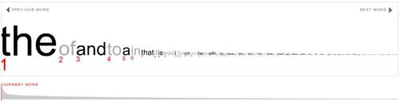

Dziś kilka słów o... słowach. Czy zastanawialiście się kiedyś których słów
używacie najczęściej podczas pisania?

<!--truncate-->

Jakiś czas temu namawialiśmy Was do sprawdzenia
[jak szybko piszecie na klawiaturze](http://techwriter.pl/umiesz-pisac/). Dziś
spróbujemy odgadnąć co piszecie. Zakładając, że w większości są to anglojęzyczne
teksty.

Zainspirował nas Ellis Pratt z firmy Cherryleaf, który na swoim
[blogu](http://www.cherryleaf.com/blog/2014/12/the-four-common-words-that-account-for-19-minutes-of-a-typical-technical-communicators-day/) podał
ostatnio informację, że prawie 17% tekstów w języku angielskim to tylko cztery
krótkie słówka: "**the**", "**of**", "**and**" oraz "**to**". Przy założeniu, że
piszemy przez połowę czasu naszej pracy pisanie tylko tych czterech słów zajmuje
nam podobno prawie 20 minut każdego dnia!

Jeżeli jesteście ciekawi jakie są następne słowa w kolejce, albo gdzie w
rankingu plasuje się Wasze ulubione słówko to kliknijcie w poniższy obrazek:

Dla tych którzy nie mają swoich ulubionych słówek, albo wstydzą się je wpisać,
polecamy zawsze politycznie poprawne zwroty publikowane w serii
[langłydż](http://techwriter.pl/category/langlydz/).

Co ciekawe, ranking zamieszczony w
[Wikipedii](http://en.wikipedia.org/wiki/Most_common_words_in_English), jest
trochę inny (różnice są już na pierwszych trzech pozycjach).

My jednak zmuszeni jesteśmy ogłosić, że dzisiejszy dzień będzie dniem w którym
słowa  "**the**", "**of**", "**and**" oraz "**to**" nie pojawią się w tworzonych
przez nas tekstach. Ani razu! Po prostu już zużyliśmy te 20 minut na napisanie
tego artykułu...
