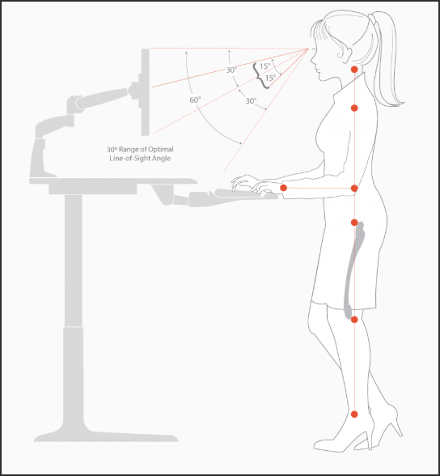

---
title:
  'Jak wyposażyć gabinet do pracy zdalnej? Biurka elektryczne i inne wynalazki'
authors: niewiarowski
date: '2025-03-23'
tags:
  - 'organizacja-pracy'
  - 'ergonomia'
  - 'praca-zdalna'
coverImage: 'upload_0005.png'
---

Swego czasu epidemiologiczne zawirowania sprawiły, że wiele osób poznało pracę
zdalną w większym zakresie niż kiedykolwiek wcześniej. Dla niektórych jest to
zapomniany epizod, a inni zaś świadomie postawili na taki styl pracy i życia.
Jak dostosować swój gabinet, żeby zapewnić sobie jak bardziej komfortową pracę
zdalną i hybrydową?

Dla mnie praca zdalna to codzienna rzeczywistość. Chętnie opowiem o tym, czego
dowiedziałem się o biurkach elektrycznych i innych akcesoriach ułatwiających
życie w biurze.

<!--truncate-->

Mam nadzieję, że po przeczytaniu tego artykułu łatwiej zdecydujesz czy warto
mieć biurko elektryczne i na co zwrócić uwagę, jeśli interesuje Cię taki zakup.
Temat ergonomii pracy jest bardzo rozległy i ten artykuł z pewnością go nie
wyczerpie. Dostaniesz garść obserwacji i odniesień do źródeł, z którymi możesz
się zapoznać, jeśli potrzebujesz więcej informacji.

Zaznaczam też, że nie jestem fizjoterapeutą, dzielę się garścią wskazówek, z
którymi się zetknąłem. Podejmuj decyzje dotyczące ergonomii biura w oparciu o
swój research i wiedzę specjalisty, zwłaszcza jeśli jesteś pod opieką
fizjoterapeuty. Mam nadzieję, że artykuł ten pomoże Ci w zrobieniu właściwego
rozeznania i podjęciu słusznych decyzji.

## Wstęp

Czy warto zainwestować w biurko elektryczne i dodatki, które będą Ci służyły w
gabinecie?

Widzę dwie drogi 🙂. Którą wybierzesz?

**Przykładowa ścieżka decyzyjna w kwestii ergonomii biura. Nie każdy gadżet jest
obowiązkowy, a doposażanie odbywa się stopniowo, na przestrzeni kilku lat.
Narysowałem to w DrawIO.**

Jeśli wybierzesz się tę długą, ekscytującą i finansowo nieobojętną podróż,
zapraszam Cię do przeglądu rozmaitych gadżetów, w które możesz wyposażyć swoje
biuro. Zacznijmy od największego gabarytowo sprzętu, czyli biurka. Opowiem o
aspektach, na które warto zwrócić uwagę i wrażeniach z użytkowania.

## Biurko elektryczne

### Aspekty zdrowotne i czy warto

Biurko elektryczne traktuję jako uzupełnienie zdrowego stylu życia. Doceniam
możliwość jednoczesnej pracy i pełnego wyprostowania się. Daje to urozmaicenie w
czasie dnia pracy. W wielu sytuacjach pozycja stojąca przychodzi naturalnie,
np.: podczas wideokonferencji lub webinarów. Do pewnych zadań jednak wolę
usiąść. Może to kwestia przyzwyczajenia i pewna bariera mentalna. Często mówię
sobie w myślach: "Muszę do tego przysiąść" - podczas rysowania notatek
graficznych na biuwarze czy gdy piszę dokumentację częściej siedzę. Przy
sprawdzaniu tego co napisałem, częściej podnoszę biurko. Z całą pewnością
elektryczne biurko na niewiele zda się, jeśli prowadzisz niezdrowy tryb życia.
Jest to tylko jeden z elementów, który może mieć pozytywny wpływ na Twoje
zdrowie, ale to od Ciebie zależy czy faktycznie wykorzystujesz okazje by,
pracować na stojąco.

### Kształt biurka

Na początek potrzebujesz wybrać kształt biurka. Zależnie od Twoich potrzeb,
preferencji i dostępnego miejsca w pokoju, decydujesz czy biurko ma być proste,
w kształcie litery L czy zakrzywione. Trafiłem gdzieś na informację, że biurka w
kształcie litery L nie są ergonomiczne, choć mają swoje zalety takie jak duża
przestrzeń blatu i możliwość wykorzystania ograniczonej przestrzeni w pokoju. Ja
wybrałem biurko proste.

### Szerokość i głębokość blatu

Tu nie ma wielkiej filozofii. Na bazie tego ile masz sprzętu, monitorów i
dostępnego miejsca w pokoju, wybierasz odpowiednią szerokość blatu. Głębokość
nie powinna być mniejsza niż 70 cm. Moje biurko na którym spokojnie mieszczą się
dwa monitory zewnętrzne i laptop ma wymiary 80 cm na 160 cm.

### Grubość i rodzaj blatu

Na rynku jest bardzo duży wybór materiałów. Ja wybrałem blat grubości 1,5 cm z
odpornego tworzywa sztucznego. Opcją tańszą byłaby płyta pilśniowa. Do
najdroższych opcji należy blat z drewna dębowego.

### Przycięcie blatu

Ja zdecydowałem się na przycięcie blatu od strony ściany, żeby można było
poprowadzić kable nawet jeśli biurko jest mocno dosunięte. Jeśli po Twoim domu
biegają dzieci, być może warto pomyśleć nad wyborem zaokrąglonych narożników
blatu. Bezpieczeństwo ponad wszystko!

### Szuflady i półki

Można też wybrać blat z szufladą lub podwieszaną półką, na której możesz ustawić
komputer stacjonarny. Warto przemyśleć gdzie będziesz trzymać laptopa czy
komputer. Niektórzy trzymają zamknięty laptop na półce pod blatem i polegają
tylko na monitorach zewnętrznych.

### Prowadzenie przewodów, organizer

Podstawowa zasada jest taka, że nie chcemy trzymać na widoku kabli, ładowarek,
stacji dokujących. W biurku konieczny jest organizer, czyli rodzaj koszyka pod
blatem, gdzie możesz bezpiecznie odłożyć stację dokującą i ładowarkę. Często pod
blatem zamocowana jest listwa zasilająca z wieloma gniazdami, do których
podłączysz laptop, monitory, lampkę i inne sprzęty, z jakich będziesz korzystać.
Do poprowadzenia kabli pomocne jest przycięcie biurka z tyłu lub otwory w
blacie, dzięki którym łatwo przeciągniesz kable od monitorów. Zwróć uwagę na ich
bezpieczne i estetyczne poprowadzenie.

### Moduł z gniazdami

Dodatkowo, na powierzchni biurka możesz mieć wyjście z gniazdami. Dzięki temu
możesz wygodnie skorzystać z ładowarki do telefonu, podłączyć lampkę czy
mikrofon.

### Biuwar i mazaki

Za element ergonomii uważam też leżący na blacie arkusz papieru, na którym robię
notatki i rysunki poglądowe. Jeśli interesuje Cię ten aspekt, zapraszam do
przeczytania artykułu Techwriter.pl o
[robieniu notatek wizualnych](https://techwriter.pl/notatki-graficzne/).

## Silniki

Jest to najdroższy i najistotniejszy element biurka, warto przemyśleć parę
kwestii zanim zdecydujesz się na zakup.

### Udźwig

Weź pod uwagę liczbę monitorów, wagę komputera i innych akcesoriów. Niektóre
silniki potrafią dźwignąć 70 kg! Mimo ich dużej siły, proszę nie używaj ich jako
windy i nie siadaj na blacie, zwłaszcza gdy jest on w ruchu 😉.

### Szybkość

Niby trywialny aspekt ale ważny. Niektóre silniki biurek działają powoli i długo
czekasz aż osiągnięta zostanie właściwa wysokość.

### Zakres wysokości

To jeden z ważniejszych parametrów. Pamiętaj, że dla ergonomicznego ustawienia
potrzebujesz móc pracować z łokciami pod kątem prostym. Jeśli będziesz wspólnie
z kimś korzystał z biurka, zwróć uwagę czy dla dostępny zakres wysokości pozwala
wygodnie pracować na siedząca i na stojąco.

### Kontrola wysokości, nastawy

To wygodna opcja. Zamiast trzymać przycisk góra/dół aż blat osiągnie właściwą
wysokość, możesz zdefiniować kilka potrzebnych wysokości. Wciskasz przycisk z
numerem, a blat wędruje na zdefiniowana wysokość. Nie wyobrażam sobie biurka bez
tej opcji 🙂.

### System antykolizyjny

To bardzo ważna opcja, szczególnie, jeśli po domu kręcą się zwierzęta lub
dzieci. Gdy w trakcie opuszczania blatu wykryty zostanie opór, urządzenie
zatrzyma się i cofnie. Jest to ważne z punktu widzenia bezpieczeństwa. Już kilka
razy zdarzyło mi się postawić np.: kubek na szafce pod blatem i opuszczając
biurko o mały włos bym go zmiażdżył (o czym trudno się zorientować, jeśli masz
założone słuchawki wygłuszające). Na szczęście jednak dla mnie, system
antykolizyjny za każdym razem zadziałał jak należy.

### Gwarancja

Warto też zwrócić uwagę na gwarancję, żeby się nie okazało, że po roku
użytkowania silnik wyzionie ducha i nie będziesz móc dostosować blatu bez
wymiany silnika.

### Instrukcja stania przy biurku

**[Źródło obrazka.](https://workriteergo.com/facts-about-standing-desks/)**

To ciekawe, ale okazuje się, że większość ludzi nie potrafi stać prawidłowo
przez dłuższy czas na dwóch nogach. Garbią się, stoją na jednej nodze,
przekrzywiają się i wyciągają szyję do przodu, bo ustawili monitor za daleko od
oczu i mają klawiaturę zbytnio wysuniętą w przód. Łokcie powinny być pod kątem
prostym (większość ludzi ma je uniesione wyżej co skutkuje nadmiernym napięciem
mięśni). Najlepiej wystawić jedną nogę w przód i delikatnie balansować
przód-tył. Po jakimś czasie zamień nogi. Staraj się nie przeciążać jednej ze
stron. Barki powinny być trzymane naturalnie, bez przesadnego wypinania klatki i
nadmiernego ściągania łopatek. Odpowiednie ustawienie odcinka szyjnego zależy od
wysokości na jakiej znajduje się monitor, co omówimy za chwilę.

## Monitory

Większość osób pracujących nad dokumentacją potrzebuje więcej niż jednego
monitora. Ile ich potrzeba i jak je ustawić? Dowiesz się tego z następnego
rozdziału.

### Więcej niż jeden

Dużo czasu zajęło mi wybranie odpowiednie ustawienia monitorów. Korzystam z
monitora laptopa po lewej stronie i dwóch monitorów na statywach: jeden
ustawiony na wprost i drugi po prawej. Czasem na początku można się pogubić, bo
nie wiesz gdzie patrzeć i zdarzy Ci się dłużej szukać odpowiedniej aplikacji na
jednym z monitorów. Dobrze jeśli monitory mają specjalizację, np.: większość
komunikatorów obsługujesz na laptopie, główną treść oglądasz na monitorze na
wprost, a po prawej masz materiał do porównywania z główna treścią. Monitory
ustawione są po półkolu i te boczne są pod kątem, żeby obracając głowę mieć
monitory w podobnej odległości od oczu.

**[Źródło obrazka.](https://conwork.pl/pns-15-stanowisko-pracy-z-wieloma-monitorami/)**

### A może jeden ale za to duży?

Podobno lepszą opcją niż mieć obszar roboczy podzielony między wieloma ekranami,
lepie jest mieć jeden bardzo szeroki monitor. Są też dostępne monitory o
zakrzywionej powierzchni, niemniej nie testowałem ich. Podobno też dobrze się na
nich gra w gry komputerowe.

### Monitor w orientacji pionowej

Większość nowych monitorów można obrócić do orientacji pionowej. Ta opcja dobrze
sprawdza się przy czytaniu PDFów. Treść główną czytam na monitorze z przodu i
porównuję PDF po prawej stronie - przyjemnie się to wtedy wyświetla. Zbliża się
czas recenzji materiału? Czas obrócić monitor! 😉

### Wysokość monitora względem oczu

**[Źródło obrazka.](https://www.gvsu.edu/officeergonomics/computer-monitor-8.htm)**

Ważne, żeby górne krawędzie monitorów były nieco poniżej linii wzroku. Ma to
wpływ na mięśnie karku i zmęczenie mięśni poruszających oczami. Jeśli korzystasz
z monitora laptopa, postaraj się ustawić go na podobnej wysokości co reszta
monitorów. Pomoże Ci w tym podstawka pod laptopa albo kilka encyklopedii 🙂 W
przypadku monitorów zewnętrznych można zakupić ramię dla lepszej regulacji
wysokości.

### Odległość blatu od łokci

Podczas pisania łokcie powinny być pod kątem prostym, nadgarstki proste. Ciężko
osiągnąć optymalną wysokość blatu i monitorów jeśli korzystasz z tradycyjnego
biurka (chyba, że blat jest na właściwej wysokości i masz do dyspozycji ramię do
regulacji wysokości monitorów, bo fabryczne statywy nie zawsze mają wtedy
właściwy zakres).

### Ustawienie monitorów względem okna

O ile nie pracujesz w piwnicy, musisz wziąć pod uwagę okno. Wiadomo, że każdy ma
różne warunki lokalowe, warto natomiast pamiętać, że monitor na tle okna będzie
problematyczny. Latem światło będzie wpadać i będzie różnica jasności między
monitorem i tłem, co jest męczące dla wzroku. Można stosować zasłony i rolety,
ale wtedy siedzisz w ciemni, bo unikasz problematycznych blasków światła. Lepiej
jeśli okno masz po lewej lub prawej stronie od Twoich monitorów.

## Pozostałe akcesoria

### Klawiatura

Swego czasu uświadomiłem sobie, że nie byłem zadowolony z ówczesnej klawiatury.
Zajmowała dużo miejsca, klawisze były płaskie i bolały mnie palce po całym dniu
pisania. Poszukałem klawiatury bez sekcji klawiszy numerycznych, bo na co dzień
prawie z nich nie korzystałem. Musiałem przewartościować moje życie i
odpowiedzieć sobie na takie pytania:

- Klawiatura ze wszystkimi klawiszami, 85%, 70% a może 65%?
- Klawiatura membranowa (cicha) czy mechaniczna (bardzo głośna)?
- Jak wysokie powinny być klawisze i jaki powinny mieć kształt?
- W przypadku klawiatur mechanicznych: jaki wybierasz typ mechanizmu klawisza?
  [Switch](https://www.pcmag.com/explainers/guide-to-mechanical-key-switches-which-kind-is-right-for-you)
  niebieski, czerwony czy niebieski?
- Czy potrzebujesz podświetlenia klawiszy, jeśli tak, to w ilu kolorach?

Ostatecznie wybrałem mechaniczna klawiature z głośnym klikiem i podświetleniem
jak choinka na święta. Dźwięk kliknięcia i odczucie wciśnięcia klawisza
informują Cię o tym, że faktycznie poprawnie wcisnąłeś klawisz. Ma to znaczenie
przy szybszym pisaniu, gdy łatwiej o pomyłki, jeśli omsknie Ci się palec.
Zrezygnowałem z klawiszy numerycznych, bo rzadko z nich korzystałem i wygodniej
mi jest robić notatki i rysunki na biuwarze, klawiatura jest bardziej
kompaktowa.

**[Źródło obrazka.](https://goblintechkeys.com/blogs/news/type-of-keyboard-and-sizes)**

Gdzie ustawić klawiature na blacie? Powinna być blisko krawędzi, litera V
wycelowana w pępek.

### Mysz

Miałem ten prozaiczny problem, że pod dłuższym użytkowaniu przycisk przewijania
stracił swoją dokładność. Gdy przewijałem strony internetowe i PDFy albo
przeskakiwałem na daleko, albo mysz nie rejestrowała moich ruchów w ogóle.
Wybrałem jakąś mysz gamingową, co poprawiło moje doświadczenia w tym zakresie.
Kółko myszy znów zaczęło mnie słuchać i odzyskałem pełną kontrolę przewijania
ekranu. Mysz jest też wyposażona w dwa dodatkowe przyciski, które skrzętnie
ustawiłem, by uruchamiały aplikacje Obsidian i Snagit (zaznaczanie obszaru
zrzutu ekranu) 🙂. Nie próbowałem jeszcze mysz pionowych, nie odczuwam zresztą
problemów z nadgarstkami. Podstawową sprawą gdy korzystasz z myszy i klawiatury
jest zapewnienie neutralnej pozycji nadgarstka.

### Krzesło

Przede wszystkim warto wypróbować takie krzesło przed zakupem. Gdy je prawidłowo
ustawisz, nogi będą pod kątem prostym podczas gdy siedzisz. Z tego co się
dowiedziałem, ręce nie powinny spoczywać na podłokietnikach kiedy pracujesz,
służą one za podparcie gdy odchylasz się do tyłu. Podczas odchylania się można
użyć podparcia na głowę. Im więcej opcji regulacji ma Twoje krzesło, tym wyższa
jego cena. Dobrą opcją jest siedzieć na nadmuchanej poduszce, co pozwala plecom
na większy zakres ruchu. Niektórzy okresowo siadają na piłce fitness. Są też na
rynku różne narzędzia tortur, takie jak klęcznik, które podobno nie są wcale
zdrowe.

Ciekawą propozycją jest produkt o nazwie Dragonfly, pozwalający na aktywne
siedzenie i przyjmowanie różnych pozycji, dzięki czemu możesz rozciągać i
wzmacniać różne partie mięśni.

**[Źródło zdjęcia](https://www.dragonflychair.com/dragonflychair-classic-black).**

### Podnóżek

### Mata relaksacyjna

Do stania na ziemi przyda się mata relaksacyjna.

### Słuchawki wygłuszające

Korzystam ze słuchawek z opcją wygłuszania hałasu. Nie wiem zdrowe dla uszu jest
bombardowanie ich szumem. Efekt uboczny jest taki, że jak zdejmiesz słuchawki to
zaczynasz słyszeć każde najmniejsze stuknięcie. Tak czy inaczej, słuchawki takie
pomagają Ci przetrwać dzień, gdy za oknem ogrodnik kosi trawę albo słyszysz
hałas pobliskiej budowy czy też sasiad z kolegami testują nowe wiertła.

## Linki do materiałów

### Playlista

Ustawianie wielu monitorów, ergonomia pracy przy biurku:

https://www.youtube.com/watch?v=GywwAnQj-kA&list=PLWT2ANgf6EmKgfeF2dvwPZxDxEjII2UuC&pp=gAQB

Szczególnie warto zwrócić uwagę na film
[Best Way to Setup My Dual Monitors?](https://www.youtube.com/watch?v=l1N3jlgqcQ4)
Davida Zhanga: 

Polecam kanał [Oliviera Girarda](https://www.youtube.com/@OlivierGirard), który
jest fizjoterapeutą i dzieli się fachową wiedzą na każdy możliwy temat związany
z pracą przy biurku. W wielu miejscach tego artykułu oparłem się o jego
zalecenia.

Nie wiesz czy potrzebujesz zagłówka w fotelu? Czy potrzebujesz podłokietników i
jak z nich korzystać? Jak wybrać podnóżek? Jak prawidłowo siedzieć przy biurku i
przy nim stać? Jak ustawić monitory dla najlepszego widzenia i postawy? Na te i
inne pytania znajdziecie odpowiedzi na jego kanale.

### Artykuły

Lista w większości angielskich artykułów, które okazały się pomocne.

#### Genialny przewodnik o ustawianiu wielu monitorów obok siebie

https://www.crypticbutter.com/arrange-dual-monitors-ergonomics

#### Pozostałe artykuły o ustawianiu wielu monitorów

https://www.autonomous.ai/ourblog/full-guide-for-a-triple-monitor-desk-setup

https://thenaturehero.com/triple-monitor-desk-setup/

https://homeofficeapproved.com/desk-size-for-two-or-three-monitors/

https://www.brateck.com/en/news&blog-detail/2024-diy-workspace-upgrade-step-by-step-guide-to-achieving-the-optimal-monitor-positioning

https://conwork.pl/stanowisko-pracy-z-wieloma-monitorami/

#### Postawa przy biurku

https://www.gvsu.edu/officeergonomics/computer-monitor-8.htm

#### Ustawienie biurka względem okna

https://www.thesmarterhomeoffice.com/home-office-desk-facing-the-window-no/

https://thenaturehero.com/desk-facing-window/

#### Fakty o staniu przy biurku i badania

https://workriteergo.com/facts-about-standing-desks/

https://workriteergo.com/sit-stand-study/

https://workriteergo.com/ergonomics-research/

https://workriteergo.com/good-posture-guide/

https://workriteergo.com/workrite-care/

#### Przewodnik po rodzajach klawiszy do klawiatury

https://keebnews.com/keycap-profiles/

#### Rodzaje klawiatur

https://keyspace.store/blogs/blog/keyboard-size-guide
