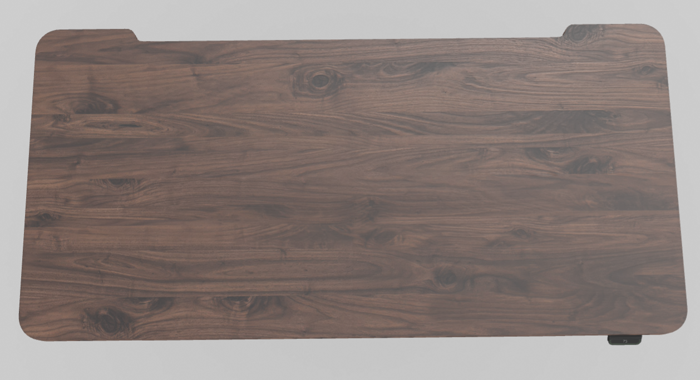
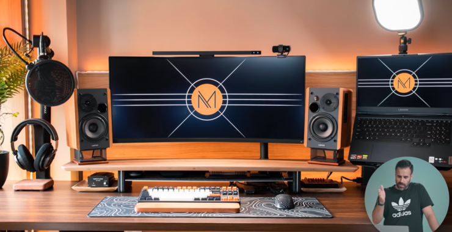
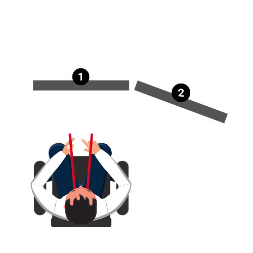
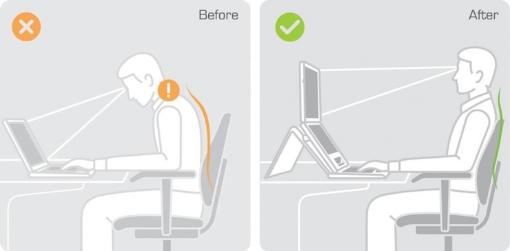
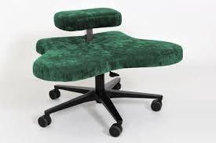
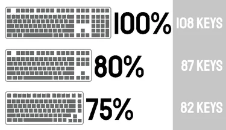
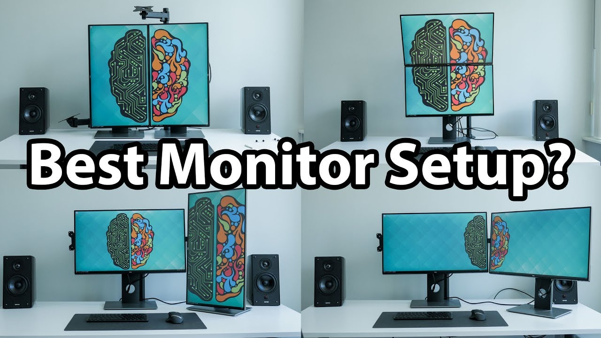

---
title:
  'Jak wyposażyć gabinet do pracy zdalnej? Biurka elektryczne i inne wynalazki'
authors: niewiarowski
date: '2025-06-11'
tags:
  - 'organizacja-pracy'
  - 'ergonomia'
  - 'praca-zdalna'
coverImage: 'upload_0005.png'
---

Swego czasu epidemiologiczne zawirowania sprawiły, że wiele osób poznało pracę
zdalną w większym zakresie niż kiedykolwiek wcześniej. Dla niektórych jest to
zapomniany epizod, a inni zaś świadomie postawili na taki styl pracy i życia.
Jak dostosować swój gabinet, żeby zapewnić sobie komfortową pracę zdalną i
hybrydową?

Dla mnie praca zdalna to codzienna rzeczywistość. Chętnie opowiem o tym, czego
dowiedziałem się o biurkach elektrycznych i innych akcesoriach ułatwiających
życie w biurze. Stoi za mną 15 lat doświadczenia pracy biurowej 😉.

<!--truncate-->

Mam nadzieję, że po przeczytaniu tego artykułu łatwiej zdecydujesz czy warto
mieć biurko elektryczne i jakie powinno ono być. Będzie Ci też łatwiej wybrać
kilka gadżetów, które będą Ci służyć w gabinecie. Przy okazji dowiesz się jak
ten sprzęt ustawić i jak zadbać o zdrową postawę. Temat ergonomii pracy jest
bardzo rozległy i ten artykuł z pewnością go nie wyczerpie. Dostaniesz garść
obserwacji i odniesień do źródeł, z którymi możesz się zapoznać.

Nie jestem fizjoterapeutą, dlatego decyzje dotyczące ergonomii gabinetu podejmuj
w oparciu o swoje preferencje i research. Konsultacja ze specjalistą może być
wskazana, zwłaszcza jeśli jesteś pod opieką fizjoterapeuty.

## Wstęp

Czy warto zainwestować w biurko elektryczne i dodatki, które będą Ci służyły w
gabinecie?

Widzę dwie drogi 🙂. Którą wybierasz?
![Diagram przedstawia ścieżki decyzyjne na temat wyposażania gabinetu. Punkt startowy: "Ergonomia Gabinetu" z pytaniem: "Czy inwestujesz w nią?". Ścieżka negatywna: "Nie inwestuję w nią". Komentarz: "Brawo! Brawo! Oszczędziłeś / oszczędziłaś sporo pieniędzy".
Ścieżka pozytywna z serią kroków: "Tak, inwestuję w Ergonomię Gabinetu", "Jestem tego wart, warta!", "Kup biurko elektryczne", "Zadbaj o monitory", "Zadbaj o oświetlenie naturalne i sztuczne", "Kup ramię do monitora", "Wybierz podstawkę pod laptop", "Kup biuwar i mazaki", "Kup słuchawki wygłuszające", "Wybierz ergonomiczne krzesło", "Kup ergonomiczną mysz z klawiaturą", "Kup matę relaksacyjną, żeby wygodnie się stało", "Jak głęboko sięga ta królicza nora gadżetów???", "Ciesz się z wygodnej i efektywnej pracy!😃".](images/Pasted_image_20250323115915.png)

**Przykładowa ścieżka decyzyjna w kwestii ergonomii biura. Nie każdy gadżet jest
obowiązkowy, a doposażanie odbywa się stopniowo, na przestrzeni kilku lat.
Narysowałem to w DrawIO.**

Jeśli wybierzesz się w tę długą, ekscytującą i finansowo nieobojętną podróż,
zapraszam Cię do przeglądu rozmaitych gadżetów, w które możesz wyposażyć swoje
biuro. Zacznijmy od największego gabarytowo sprzętu, czyli biurka.

## Biurko elektryczne

### Aspekty zdrowotne i czy warto

Doceniam możliwość jednoczesnej pracy i pełnego wyprostowania się. Stanowi to
dla mnie urozmaicenie w czasie dnia pracy. W wielu sytuacjach pozycja stojąca
przychodzi naturalnie. Do pewnych zadań jednak wolę usiąść. Może to kwestia
przyzwyczajenia i pewna bariera mentalna. Często mówię sobie w myślach: "Muszę
do tego przysiąść". Hmm. Może pora zacząć mówić sobie: "Czas **stanąć** na
wysokości zadania?"😉

Podczas tworzenia notatek graficznych na biuwarze czy gdy piszę dokumentację
najczęściej siedzę. Przy sprawdzaniu tego co napisałem, częściej podnoszę
biurko. Webinary i wideokonferencje to kolejne okazje, by rozprostować kości.

Biurko elektryczne traktuję jako uzupełnienie zdrowego stylu życia. Trudniej
będzie Ci wykorzystać potencjał tego sprzętu, jeśli masz słabe mięśnie, bo praca
na stojąco potrafi być męcząca.

### Kształt biurka

Zależnie od Twoich potrzeb, preferencji i dostępnego miejsca w pokoju, wybierz
czy biurko ma być proste, w kształcie litery L, czy zakrzywione. Trafiłem gdzieś
na informację, że biurka w kształcie litery L nie są ergonomiczne.

### Szerokość i głębokość blatu

Tu nie ma wielkiej filozofii. Na bazie tego ile masz sprzętu, monitorów i
dostępnego miejsca w pokoju, wybierasz odpowiednią szerokość blatu. Głębokość
nie powinna być mniejsza niż 70 cm. Na moim biurku 80 cm na 160 cm spokojnie
mieszczą się dwa monitory zewnętrzne i laptop.

### Grubość i rodzaj blatu

Na rynku jest bardzo duży wybór materiałów. Ja wybrałem blat grubości 1,5 cm z
tworzywa sztucznego i jestem z niego zadowolony, bo wygląda minimalistycznie.
Charakteryzuje się dużą sztywnością i odpornością. Opcją tańszą byłaby płyta
pilśniowa. Do najdroższych opcji należy blat z drewna dębowego.

### Przycięcie blatu i zaokrąglenie rantów

**[Źródło obrazka.](https://mobiusdesk.pl/)**

Ja zdecydowałem się na przycięcie blatu od strony ściany, żeby można było
poprowadzić kable z tyłu nawet gdy biurko jest mocno dosunięte. Jeśli po Twoim
domu biegają dzieci, być może warto pomyśleć nad wyborem zaokrąglonych
narożników blatu. Bezpieczeństwo ponad wszystko!

### Szuflady i półki

Można też wybrać blat z szufladą lub podwieszaną półką, na której możesz ustawić
komputer stacjonarny. Warto przemyśleć gdzie będziesz trzymać laptopa czy
komputer. Niektórzy trzymają zamknięty laptop na półce pod blatem i polegają
tylko na monitorach zewnętrznych.

### Prowadzenie przewodów, organizer

Dobrze jest minimalizować ilość kabli, ładowarek, stacji dokujących jakie
widzisz na biurku. Do takich wniosków zainspirował mnie
[kanał YouTube Matthew Moniza](https://youtube.com/playlist?list=PLpJp7C9f0ZkQPB91ug26SAaUgbGCyYOnJ&si=C_kfeCkbH-elr3WT),
gdzie kwestię aranżacji biurka podniesiono do rangi sztuki.

Pomoże Ci w tym organizer, czyli rodzaj koszyka pod blatem, gdzie możesz
bezpiecznie odłożyć stację dokującą i ładowarkę. Często pod blatem zamocowana
jest listwa zasilająca z wieloma gniazdami, do których podłączysz laptop,
monitory, lampkę i inne sprzęty. W doprowadzeniu kabli od monitorów, pomoże
otwór w środkowej części w blatu.

### Moduł z gniazdami

Dodatkowo, na powierzchni biurka możesz mieć wyjście z gniazdami. Dzięki temu
możesz wygodnie skorzystać z ładowarki do telefonu, podłączyć lampkę czy
mikrofon.

### Biuwar i mazaki

Za element ergonomii uważam też leżący na blacie arkusz papieru, na którym robię
notatki i rysunki poglądowe. Jeśli interesuje Cię ten aspekt, zapraszam do
przeczytania artykułu na Techwriter.pl o
[robieniu notatek wizualnych](../notatki-graficzne/index.md).

## Silniki

Jest to najdroższy i najistotniejszy element biurka, warto przemyśleć parę
kwestii zanim zdecydujesz się na zakup.

### Udźwig

Weź pod uwagę liczbę monitorów, wagę komputera i innych akcesoriów. Niektóre
silniki potrafią dźwignąć 70 kg! Mimo ich dużej siły, proszę nie używaj ich jako
windy i nie siadaj na blacie, zwłaszcza gdy jest on w ruchu 😉.

### Szybkość

Niby trywialny aspekt ale ważny. Niektóre silniki biurek działają powoli i długo
czekasz aż osiągnięta zostanie właściwa wysokość.

### Zakres wysokości

To jeden z ważniejszych parametrów. Pamiętaj, że dla ergonomicznego ustawienia
potrzebujesz móc pracować z łokciami pod kątem prostym i neutralnie ustawionymi
nadgarstkami, niezależnie od tego czy stoisz, czy siedzisz. Jeśli będziesz
wspólnie z kimś korzystał z biurka, zwróć uwagę czy dostępny zakres wysokości
będzie odpowiedni dla obu osób.

### Kontrola wysokości, nastawy

To wygodna opcja. Zamiast trzymać przycisk góra/dół tak długo aż blat osiągnie
właściwą wysokość, możesz zdefiniować kilka potrzebnych wysokości. Jedno
kliknięcie przycisku, a blat wędruje na zdefiniowaną wysokość. Nie wyobrażam
sobie biurka bez tej opcji 🙂.

### System antykolizyjny

To bardzo ważna opcja, szczególnie, jeśli po domu kręcą się zwierzęta lub
dzieci. Gdy w trakcie opuszczania blatu wykryty zostanie opór, urządzenie
zatrzyma się i cofnie. Jest to ważne z punktu widzenia bezpieczeństwa. Dwa razy
zdarzyło mi się postawić kubek na szafce pod blatem i opuszczając biurko prawie
go zmiażdżyłem. Trudniej się zresztą zorientować o takiej sytuacji, gdy masz
założone słuchawki wygłuszające. Na szczęście jednak dla mnie i dla kubka,
system antykolizyjny za każdym razem zadziałał jak należy.

### Gwarancja

Warto też zwrócić uwagę na gwarancję, żeby się nie okazało, że po roku
użytkowania silnik wyzionie ducha i nie będziesz móc dostosować wysokości blatu
bez wymiany silnika.

## Monitory

Większość osób pracujących nad dokumentacją potrzebuje więcej niż jednego
monitora. Ile ich potrzeba i jak je ustawić? Dowiesz się tego z następnego
rozdziału.

### Więcej niż jeden

Dużo czasu zajęło mi wybranie odpowiedniego ustawienia monitorów. Korzystam z
monitora laptopa po lewej stronie i dwóch monitorów na podstawkach od
producenta: jeden ustawiony na wprost i drugi po prawej.

Na początku można się pogubić, bo zdarza Ci się dłużej szukać odpowiedniej
aplikacji czy informacji na Twoich monitorach. Dobrze jeśli monitory są
przeznaczone do określonych celów, np.: większość komunikatorów obsługujesz na
laptopie, główną treść oglądasz na monitorze na wprost, a po prawej masz
materiał do porównywania.

Monitory ustawione są po półkolu i te boczne są pod kątem, żeby obracając głowę
mieć monitory w podobnej odległości od oczu. Upewnij się, że możesz dotknąć
czubkami palców do górnych krawędzi każdego z monitorów.

**[Źródło obrazka.](https://conwork.pl/pns-15-stanowisko-pracy-z-wieloma-monitorami/)**

### A może jeden ale za to duży?

Podobno lepszą opcją niż mieć obszar roboczy podzielony między wieloma ekranami,
jest mieć jeden bardzo szeroki monitor. Są też dostępne monitory o zakrzywionej
powierzchni, nie testowałem ich. Podobno też są polecane dla miłośników gier
komputerowych.

### Monitor w orientacji pionowej

Większość nowych monitorów można obrócić do orientacji pionowej. Ta opcja dobrze
sprawdza się przy czytaniu PDFów. Treść główną czytam na monitorze z przodu i
porównuję PDF po prawej stronie - przyjemnie się to wtedy wyświetla. Zbliża się
czas recenzji materiału? Czas obrócić monitor! 😉

## Zdrowe warunki pracy i właściwa postawa

### Ustawienie monitorów względem okna

O ile nie pracujesz w piwnicy, musisz wziąć pod uwagę okno. Zwróć uwagę na
warunki lokalowe, bo warto natomiast pamiętać, że widok monitora na tle okna
będzie problematyczny. Latem silne światło będzie wpadać i będzie znaczna
różnica jasności między monitorem i tłem, co jest męczące dla wzroku. Można
stosować zasłony i rolety, co pozwoli uniknąć problematycznych blasków ale
skutek jest taki, że siedzisz w ciemni. Lepiej jeśli okno jest prostopadle
względem monitorów, po lewej lub prawej stronie.

### Wysokość monitora względem oczu

**[Źródło obrazka.](https://www.gvsu.edu/officeergonomics/computer-monitor-8.htm)**

Ważne, żeby górne krawędzie monitorów były nieco poniżej linii wzroku.
Nieprawidłowo dobrana wysokość skutkuje zmęczeniem karku i oczu. Jeśli
korzystasz z monitora laptopa, postaraj się ustawić go na podobnej wysokości co
reszta monitorów. Pomoże Ci w tym podstawka pod laptopa albo kilka encyklopedii
🙂 W przypadku monitorów zewnętrznych można zakupić ramię dla lepszej regulacji
wysokości.

### Na czym siedzieć? I jak robić to zdrowo?

Przed zakupem krzesła warto je wypróbować. Gdy je prawidłowo ustawisz, nogi będą
pod kątem prostym. Kiedy pracujesz, ręce nie powinny spoczywać na
podłokietnikach. Podłokietniki służą tylko do opierania rąk podczas odpoczynku i
powinny być ustawione poniżej wysokości blatu.

Podczas odchylania się dobrze jak możesz oprzeć głowę o zagłówek. Im więcej
elementów i opcji regulacji ma Twoje krzesło, tym wyższa jego cena. Zwróć też
uwagę na dobre wsparcie dolnej partii pleców.

Dobrym urozmaiceniem jest też usiąść na nadmuchanej poduszce, co pozwala plecom
na większy zakres ruchu. Niektórzy na jakiś czas siadają na piłce fitness. Są
też na rynku różne narzędzia tortur, takie jak klęczniki, które podobno nie są
wcale takie zdrowe.

Ciekawą propozycją jest produkt o nazwie Dragonfly, pozwalający na aktywne
siedzenie i przyjmowanie różnych pozycji, dzięki czemu rozciągasz i wzmacniasz
mięśnie.

**[Źródło zdjęcia](https://www.dragonflychair.com/dragonflychair-classic-black).**

### Instrukcja poprawnego stania

**[Źródło obrazka.](https://workriteergo.com/facts-about-standing-desks/)**

Okazuje się, że większość ludzi nie potrafi stać prawidłowo przez dłuższy czas
na dwóch nogach. Garbią się, stoją na jednej nodze, przekrzywiają się i
wyciągają szyję do przodu, bo ustawili monitor za daleko od oczu i mają
klawiaturę zbytnio wysuniętą w przód.

- Najlepiej wystawić jedną nogę w przód i delikatnie balansować przód-tył. Po
  jakimś czasie zamień nogi.
- Staraj się nie przeciążać jednej ze stron.
- Barki powinny być trzymane naturalnie, bez przesadnego wypinania klatki i
  nadmiernego ściągania łopatek.

### Mata antyzmęczeniowa

Do czego potrzebujesz maty antyzmęczeniowej? Każdy kto pracował cały dzień na
stojąco za kontuarem wie jak po tym bolą stopy. Twarda podłoga wywiera swój
wpływ na Twoje stopy. Miękka gumowa mata antyzmęczeniowa sprawia, że możesz
dłużej i bardziej komfortowo pracować na stojąco. Niektóre modele wyposażone są
w wypustki, które dodatkowo masują stopy.

## Pozostałe akcesoria

### Klawiatura

Swego czasu uświadomiłem sobie, że nie byłem zadowolony z ówczesnej klawiatury.
Zajmowała dużo miejsca, klawisze były płaskie i bolały mnie palce po całym dniu
pisania. Poszukałem klawiatury bez sekcji klawiszy numerycznych, bo z nich nie
korzystałem. Musiałem przewartościować moje życie i odpowiedzieć sobie na takie
pytania:

- Klawiatura ze wszystkimi klawiszami, 85%, 70% a może 65%?
- Klawiatura membranowa (cicha) czy mechaniczna (bardzo głośna)?
- Jak wysokie powinny być klawisze i jaki powinny mieć kształt?
- W przypadku klawiatur mechanicznych: jaki wybierasz typ przełącznika klawisza?

  - **Niebieski** (najgłośniejszy z odczuwalnym kliknięciem)

  - **Czerwony** (najcichszy z najlżejszym kliknięciem)

  - **Brązowy** (opcja kompromisowa w porównaniu z dwiema poprzednimi)

  - Więcej informacji o przełącznikach klawiszy (z angielska _switch_)
    znajdziesz
    [tutaj](https://www.pcmag.com/explainers/guide-to-mechanical-key-switches-which-kind-is-right-for-you).

- Czy potrzebujesz podświetlenia klawiszy, jeśli tak, to w ilu kolorach?

**[Źródło obrazka.](https://goblintechkeys.com/blogs/news/type-of-keyboard-and-sizes)**

Ostatecznie wybrałem mechaniczną klawiaturę z głośnym klikiem i podświetleniem
jak choinka na święta. Oprócz świątecznego nastroju na co dzień, umożliwia to
też pracę po ciemku, kiedy jestem w pomieszczeniu gdzie nie chcę zapalać świateł
bo np.: śpi tam członek rodziny 🙂.

Dźwięk kliknięcia i odczucie wciśnięcia klawisza informują Cię o tym, że
faktycznie poprawnie wcisnąłeś klawisz. Ma to znaczenie przy szybszym pisaniu,
kiedy jest większe ryzyko, że omsknie Ci się palec.

Teraz wygodniej robi mi się notatki i rysunki na biuwarze, bo klawiatura jest
bardziej kompaktowa.

Gdzie ustawić klawiaturę na blacie? Powinna być blisko krawędzi, litera V
wycelowana w pępek.

### Mysz

Miałem ten prozaiczny problem, że po dłuższym użytkowaniu przycisk przewijania
stracił swoją dokładność. Gdy przewijałem strony internetowe i PDFy
przeskakiwałem za daleko, albo mysz nie rejestrowała moich ruchów w ogóle.
Wybrałem jakąś mysz gamingową, co poprawiło moje doświadczenia w tym zakresie.
Kółko myszy znów zaczęło mnie słuchać i odzyskałem pełną kontrolę nad
przewijaniem ekranu i moim życiem.

Mysz jest też wyposażona w dwa dodatkowe przyciski, które skrzętnie ustawiłem,
by uruchamiały aplikacje Obsidian i Snagit (komenda zaznaczania obszaru zrzutu
ekranu) 🙂.

Nie próbowałem jeszcze myszy pionowych, nie odczuwam zresztą problemów z
nadgarstkami. Podstawową sprawą gdy korzystasz z myszy i klawiatury jest
zapewnienie neutralnej pozycji nadgarstków.

### Słuchawki wygłuszające

Korzystam ze słuchawek z opcją wygłuszania hałasu. Działają na zasadzie
emitowania "antyszumu", który niweluje hałas. Efekt uboczny jest taki, że jak
zdejmiesz słuchawki to zaczynasz słyszeć każde najmniejsze stuknięcie. Tak czy
inaczej, słuchawki takie pomagają Ci przetrwać dzień, gdy za oknem ogrodnik kosi
trawę albo słyszysz hałas pobliskiej budowy czy też sasiad z kolegami testują
nowe wiertła.

## Zakończenie

W tym miejscu stawiam kropkę. Życzę Ci wielu lat wygodnej i zdrowej pracy.
Zapraszam do dalszego poznawania tajników ergonomii pracy. Jeśli jeszcze czujesz
niedosyt, zapoznaj się z poniższymi materiałami.

## Polecane materiały

Poniżej znajdziesz pogrupowane linki.

### Do obejrzenia

- Wiedza w pigułce:
  [film edukacyjny "Ergonomia w biurze"](https://www.youtube.com/watch?v=RkfwYQhsAeQ)
  dobrze przedstawia wszystkie zagadnienia. Może co do jednej rzeczy bym się
  przyczepił, jest to wciąż solidny materiał.

- Polecam film:
  ["Best Way to Setup My Dual Monitors?"](https://www.youtube.com/watch?v=l1N3jlgqcQ4)
  Davida Zhanga:
  

- Polecam kanał YouTube
  [Oliviera Girarda](https://www.youtube.com/@OlivierGirard), który jest
  fizjoterapeutą i dzieli się fachową wiedzą na każdy możliwy temat związany z
  pracą przy biurku. W wielu miejscach tego artykułu oparłem się o jego
  zalecenia.

  - [Playlista na YouTube](https://www.youtube.com/watch?v=GywwAnQj-kA&list=PLWT2ANgf6EmKgfeF2dvwPZxDxEjII2UuC&pp=gAQB)
o ustawianiu kilku monitorów i ergonomii pracy przy biurku.

### Do przeczytania

Lista w większości angielskich artykułów, które okazały się pomocne.

#### Genialny przewodnik o ustawianiu wielu monitorów obok siebie

https://www.crypticbutter.com/arrange-dual-monitors-ergonomics

#### Pozostałe artykuły o ustawianiu wielu monitorów

https://www.autonomous.ai/ourblog/full-guide-for-a-triple-monitor-desk-setup

https://thenaturehero.com/triple-monitor-desk-setup/

https://homeofficeapproved.com/desk-size-for-two-or-three-monitors/

https://www.brateck.com/en/news&blog-detail/2024-diy-workspace-upgrade-step-by-step-guide-to-achieving-the-optimal-monitor-positioning

https://conwork.pl/stanowisko-pracy-z-wieloma-monitorami/

#### Ustawienie biurka względem okna

https://www.thesmarterhomeoffice.com/home-office-desk-facing-the-window-no/

https://thenaturehero.com/desk-facing-window/

#### Postawa przy biurku

https://www.gvsu.edu/officeergonomics/computer-monitor-8.htm

#### Fakty o staniu przy biurku i badania

https://workriteergo.com/facts-about-standing-desks/

https://workriteergo.com/sit-stand-study/

https://workriteergo.com/ergonomics-research/

https://workriteergo.com/good-posture-guide/

https://workriteergo.com/workrite-care/

#### Rodzaje klawiatur

https://keyspace.store/blogs/blog/keyboard-size-guide

#### Przewodnik po rodzajach klawiszy do klawiatury

https://keebnews.com/keycap-profiles/

#### Działanie słuchawek wygłuszających

https://produktowranking.pl/guide/sluchawki-wygluszajace/
