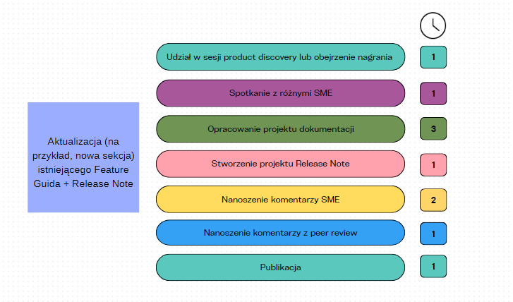

Estymacja w IT jest dobrze wszystkim znana, szczególnie w świecie programistów. Dostępne są przeróżne metody dochodzenia do odpowiedzi na zasadnicze pytanie: ile potrzebuję czasu, żeby ukończyć to zadanie?

<!--truncate-->

W świecie Technical Writerów sprawa wygląda nieco inaczej. Dostajemy funkcjonalność, którą trzeba opisać i nie wybieramy sobie zazwyczaj, że w danym sprincie sobie to opiszemy. Wynika to z tego, że może nas gonić termin releasu i po prostu musimy skończyć dane zadanie w określonym przedziale czasowym. 

Wszyscy zasadniczo wiemy po co się estymuje - przynajmniej tak się wydaje. Jednak, żeby robić to rozsądnie, powinniśmy zastanowić się czy problemy, z którymi się borykamy mogą być rzeczywiście rozwiązane przy pomocy estymacji, czy lepiej szukać innego narzędzia?  

W zależności od modelu, w którym pracujemy, estymacja może pomóc nam odpowiedzieć na pytanie: czy jestem w stanie realnie się zobowiązać, że wykonam to zadanie na czas?

Estymacja może też oferować bardziej przejrzyste i obiektywne kryteria raportowania ryzyka, czyli informacji, że jednak nie jestem w stanie dostarczyć dokumentacji zgodnie z wcześniejszą deklaracją.

Ponadto, możemy spróbować poszukać odpowiedzi na następujące pytania:
* Ile godzin tak naprawdę Technical Writer spędza na tworzeniu dokumentacji?
* Czy zostaje czas na inne zajęcia, takie jak: szkolenia, ulepszanie istniejącej dokumentacji, czy inicjatywy wewnętrzne? 

Pośrednio, odpowiedzi na te pytania mogą pomóc w diagnozie, kiedy przydałoby się zatrudnić nową osobę oraz jak zmienia się nakład pracy w czasie.

Jako manager zespołu dokumentacyjnego, wielokrotnie zmagałam się z wyzwaniem określenia możliwości mojego zespołu.

Było to bardzo trudne, szczególnie, że pracowaliśmy w systemie *continous delivery*, a więc nie mieliśmy określonego czasu releasu, na przykład kwartalnego. Releasy funkcjonalności nad którymi pracowali pisarze mogły zdarzać się nawet kilka razy dziennie. 

W moim zespole, który składa się z czterech Technical Writerów, każdy był odpowiedzialny za dokumentację z innego obszaru. Czasem terminy goniły tylko po to, żeby raptownie zwolnić po wykryciu nieoczekiwanych bugów w funkcjonalności. 

Ciężko nam było też określić jak zmienia się nakład pracy z kwartału na kwartał. Proste porównanie ilości zamkniętych zadań na koniec kwartału nie było zbyt dokładne, ponieważ nie uwzględniało różnic w nakładzie pracy niezbędnym do ukończenia poszczególnych zadań.

Postanowiliśmy to ogarnąć 💪

## Proces

Inicjatywa wyszła ode mnie. Po szybkiej rozmowie z Agile Coachem, który pomógł mi nazwać i doprecyzować moje problemy, zabraliśmy się do pracy. 

Pracę zorganizowaliśmy w formie warsztatu. Niestety, każdy z nas uczestniczył w tym warsztacie zdalnie, ale dzięki narzędziom do kolaboracji, daliśmy radę go skutecznie przeprowadzić.

Przyjęliśmy kilka założeń wyjściowych, które dla wszystkich były akceptowalne:
* Niektóre zadania dokumentacyjne wymagają więcej pracy niż inne.
* Jesteśmy w stanie stworzyć listę czynności, które stale przewijają się w pracy każdego Writera.

### KROK 1: Lista zadań dokumentacyjnych

Stworzyliśmy listę różnych zadań dokumentacyjnych, które powtarzają się w naszej pracy. Na przykład:
* Nowy atrybut dodany do istniejącego endpointa w API
* Customowy event Google Analytics
* Ulepszenie istniejącej funkcjonalności
* Nowe pole w aplikacji webowej wspierające nową funkcjonalność

Do każdego z tych zadań dodaliśmy również stworzenie dokumentu Release Note, ponieważ każda zmiana w naszym produkcie wymagała bezpośredniego poinformowania klientów. 

### KROK 2: Lista czynności, które powtarzają się w naszej pracy

Możemy zidentyfikować i wyodrębnić powtarzalne czynności w naszej pracy, które stanowią części składowe różnych zadań dokumentacyjnych. 

Z pewnością zaraz po tym jak dowiesz się, że jest nowa funkcjonalność do opisania, nie zabierasz się za pisanie! 

Co więc robisz? 

Najpierw musisz się nieco rozeznać w temacie! A więc czytasz opis w Jirze lub innym systemie. 
Potem z pewnością będziesz chciał choćby przez chwilę porozmawiać ze swoim SME, czy to z Product Managerem czy z Deweloperem, aby potwierdzić, że dobrze rozumiesz wymagania i dowiedzieć się czy mają coś więcej do dodania. Dopiero potem tworzysz pierwszy szkic swojego dokumentu. I tak dalej…

My też zabraliśmy się za tworzenie takiej listy. Umieściliśmy na niej między innymi:

* Własny research - na podstawie dostępnych informacji, czyli opisu w Jirze, różnych dokumentów i prezentacji, stworzonych przez Product Managera czy wręcz raportu z UX research. 
    Dodaliśmy tu również research domeny w Internecie, jeśli na przykład musisz napisać o nowej funkcji w obszarze SEO, o którym nic nie wiesz - dobrze by było trochę poczytać, prawda? 😉
* Rozmowa z SME
* Tworzenie projektu dokumentacji wraz z Release Note
* Stworzenie nazwy dla nowego atrybutu w API lub pola w interfejsie
* Sprawdzenie tekstów dodanych przez Deweloperów na nowych ekranach aplikacji
* I tak dalej

Naturalnie, nie każde zadanie wymaga zaliczenia wszystkich tych czynności. Niektóre zadania wymagają  ukończenia tylko kilku, inne, bardziej skomplikowane nawet kilkunastu. To wszystko oczywiście będzie zależało od specyfiki twojego produktu i sposobu pracy w danej firmie. 

### KROK 3: Połączenie zadań z czynnościami

Następnie wzięliśmy na warsztat każde z zadań dokumentacyjnych, jedno po drugim i przypisywaliśmy do każdego z nich listę czynności, które musi wykonać pisarz, aby ukończyć dane zadanie. 

Każde zadanie opisaliśmy w takim formacie:

Do tej pory szło gładko, nie pojawiały się żadne kwestie sporne 😉

### KROK 4: Dodanie czynnika czasu

W kolejnym kroku, mieliśmy podjąć próbę wyceny każdej czynności w kontekście zadania w ramach którego będzie wykonywana. 

Oczywiście, jeśli mamy całkiem nową aplikację umożliwiającą klientom konfigurację jakiegoś obszaru, to czynność polegająca na sprawdzeniu *UI copy* zajmie znacznie dłużej niż w przypadku, gdy zespół dodał jedno nowe pole w istniejącym interfejsie. 

Ku mojemu zaskoczeniu, i tu byliśmy całkiem zgodni. Tam gdzie pojawiały się rozbieżności, w stylu: "ale mi ta czynność zajmuje więcej czasu" - głosowaliśmy i wyciągaliśmy średnią.  

Na koniec tego kroku, każde z zadań dokumentacyjnych mieliśmy opracowane mniej więcej w takiej postaci:

### KROK 5: Zsumowanie ilości godzin dla każdego zadania

Zsumowaliśmy czas zadeklarowany na wykonanie danego zadania. 
Następnie ułożyliśmy nasze zdania dokumentacyjne w kolejności, od najmniej do najbardziej czasochłonnych. 

Okazało się, że mamy typy zadań dokumentacyjnych, które zajmują odpowiednio: 3, 5, 15 i 25 godzin. No dobra, nie wyszło tak równo, trochę zaokrągliliśmy 😉

Użyliśmy rozmiarów koszulek (*t-shirt size*) i przyporządkowaliśmy każdemu rozmiarowi odpowiednią estymatę. W rezultacie otrzymaliśmy listę rozmiarów zadań z ich prawdopodobną czasochłonnością:

* XS - 3 godziny
* S - 5 godzin
* M - 15 godzin
* L - 25 godzin

Rozmiary koszulek były najbardziej intuicyjne, a dodatkowym atutem był fakt, że Jira pozwala na dodanie takiej estymacji z automatu, bez zbędnych zabiegów konfiguracyjnych.

## Koszulki w praniu

Po warsztacie pełni zapału ruszyliśmy estymować. Dodatkowo uzgodniliśmy, że:
* Nie będziemy rejestrować godzin faktycznie spędzonych na danym zadaniu - wystarczy określić jaki to typ zadania dokumentacyjnego i przyporządkować mu rozmiar. 
    Uznaliśmy, że rejestrowanie godzin zbytnio nas obciąży, szczególnie gdy nasza praca wymaga częstego przełączania się między zadaniami. 
* Jeśli w trakcie pracy okaże się, że przeszacowaliśmy lub niedoszacowaliśmy, poprawialiśmy oryginalną estymatę tak, żeby była bliższa rzeczywistości.
* Będziemy patrzeć na rezultaty kwartalnie.

Po pierwszym kwartale wyszło nam, że potrafimy już zmierzyć ile czasu poświęciliśmy na zadania dokumentacyjne łącznie.

Po drugim kwartale zaobserwowaliśmy nie tylko znaczny wzrost zadań, ale też i ich rozmiarów. 

Trzeci kwartał przyniósł nam więcej na temat tego ile średnio zadań i jakiej wielkości jesteśmy w stanie wykonać w ciągu kwartału. 

### Rekalibracja

Ponadto, ustaliliśmy z zespołem, że potrzebna będzie rekalibracja naszego oryginalnego systemu. 
Na przykład doszliśmy do wniosku, że mamy za duży przeskok pomiędzy zadaniem S (5 godzin) a M (15 godzin). 
Planujemy kolejny warsztat 😅

## Tak czy nie? (wnioski)

Ten eksperyment nadal trwa, ale już stał się stałym elementem naszego procesu. Daje nam, jako zespołowi informacje, które z czasem będzie można wykorzystać w rozmowach z różnymi *stakeholderami*.

Znamy rozmiar zadań ukończonych i zadań w przygotowaniu oraz ich wartość godzinową. 

Znamy również realne obłożenie pracą - w wymiarze godzinowym. To daje nam możliwość dalszej analizy, czy to się wszystko jeszcze spina, po uwzględnieniu liczby godzin dostępnych na pracę (odejmując urlopy, spotkania zespołowe, 1:1, itd.). 

Nadal jednak, zaczynając nowy kwartał nie mamy pełnej pewności jak ostatecznie się on rozwinie. Budowa produktu przebiega wielotorowo i często zależymy od precyzji planowania i estymacji zespołów produktowych i deweloperskich. 

Co innego w krótszej perspektywie, kiedy wiemy:
* Ile mamy dostępnego czasu Technical Writera? 
* Ile jakiego typu zadań jest do udokumentowania? 
* Na kiedy?

Wtedy jak najbardziej możemy lepiej określić czy jest ryzyko opóźnień, czy też damy radę zrealizować wszystko na czas.

Estymacja może być niezwykle przydatnym procesem, jeśli wiemy po co chcemy ją wdrożyć. W naszym przypadku, pierwotna potrzeba czyli zdolność określenia czy zobowiązujemy się do dostarczenia dokumentacji okazała się niemożliwa w perspektywie kwartału, ale zadziałała w kontekście krótszych ram czasowych i bliższych deadlinów. 

Dodatkowo mamy mocne, obiektywne, bo oparte na danych argumenty przydatne w przypadku rozmów dotyczących zatrudnienia nowych Writerów. 

Pewnym nieplanowanym elementem było również to, że zespół miał okazję wspólnie skatalogować i przedyskutować każdy typ zadania dokumentacyjnego, wypowiedzieć się na temat czasu jaki im on zajmuje, porównać swoje argumenty z innymi i wymienić się *best practices* na optymalizację poszczególnych etapów 🙌

