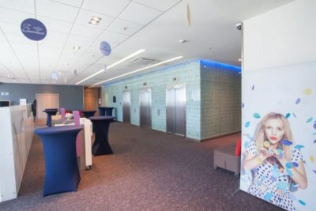
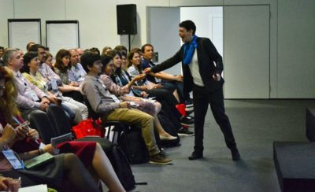
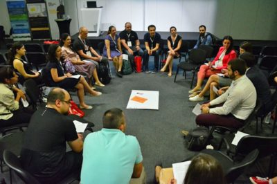

Z wielką przyjemnością zapraszamy Was na jedno z najważniejszych wydarzeń w naszej branży w tej części Europy - konferencję [Evolution of TC 2018](https://evolution-of-tc.com/). To kolejna impreza związana z komunikacją techniczną, którą objęliśmy patronatem medialnym. Poniżej znajdziecie garść najważniejszych informacji.

### O Evolution of TC 2018

Evolution of TC zostało zapoczątkowane w 2010 roku przez członków grupy, w której centrum zainteresowania była, i jest, komunikacja techniczna. Od 2015 roku gospodarzem konferencji jest [tekom Bułgaria](http://www.technical-communication.org/bg/technical-communication-bulgaria.html) - silna grupa zrzeszająca profesjonalistów z branży. Jej wpływ coraz bardziej rozszerza się poza granice Bułgarii. Obecnie wśród organizatorów znajduje się także [tcworld GmbH](http://www.tcworld.info/footer/about-tcworld/).

Dwudniowa konferencja Evolution of TC odbywa się co roku w stolicy Bułgarii, Sofii. Jej uczestnicy mają możliwość wzięcia udziału w prelekcjach, a także warsztatach. Tematyka jest zazwyczaj dość obszerna i bazuje na najnowszych trendach w tech commie. W tym roku motywem przewodnim konferencji są nowinki w dokumentacji oprogramowania.

### Czego się spodziewać?

Podczas wystąpień tegorocznej edycji międzynarodowa grupa specjalistów przybliży nam nowe rozwiązania, które wkrótce mogą być codziennością dla osób związanych z komunikacją techniczną. Poza prelekcjami będziecie mieli wiele okazji, by bezpośrednio z uczestnikami oraz ekspertami, wymienić się własnym doświadczeniem w tym obszarze, a także poznać nieznane wam dotąd praktyki.

Program konferencji jest tak opracowany, by poruszyć następujące tematy:

- Information Modeling
- Intelligent Content
- DITA
- User Experience − UX
- Multimedia and video documentation
- Writing standards
- Content strategy.

### Dla kogo?

W centrum zainteresowania organizatorów są profesjonaliści związani z branżą komunikacji technicznej, którzy chcą się doszkolić, a jednocześnie podzielić się z innymi swoją wiedzą.

### Termin

Konferencja odbędzie się w dniach 31 maja - 1 czerwca 2018 roku.

### Miejsce

Sofijski oddział Novotelu mieści się w biznesowej części miasta zwanej The Mall. Jest to nowoczesny hotel zapewniający wygodne i funkcjonalne pokoje, sale konferencyjne oraz szereg atrakcji zapewniających udany pobyt. Mieści się w centrum, z którego blisko jest do najciekawszych turystycznie miejsc w Sofii - Starego Miasta czy Teatru Narodowego.

### Program

Wstępny program konferencji jest już dostępny, mamy zatem wgląd w to, co będzie się działo i już teraz możemy zdecydować w czym weźmiemy udział. Zwróćcie uwagę, że pierwszego dnia, 31 maja, będą miały miejsce tylko prelekcje. Mamy do wyboru 10 tematów, które zostaną zaprezentowane w 2 równoległych ścieżkach. Drugi dzień to warsztaty i tu również możemy wybrać z 10 tematów, które będą odbywać się po 2 lub 3 jednocześnie. Organizator informuje, że niektóre warsztaty mogą być powtórzone, jednak nie wiadomo na jakiej zasadzie.

Przeglądając agendę zwróciliśmy uwagę, że organizatorzy niejako połączyli wykłady z warsztatami. Mamy na przykład prelekcje o automatyzacji tworzonej dokumentacji oraz warsztaty, podczas których poznamy konkretne strategie i narzędzia, które pomogą nam zautomatyzować proces. Kolejny temat, jaki zwrócił naszą uwagę to coraz większy nacisk na tworzenie materiałów wizualnych (video). I, podobnie jak w przypadku automatyzacji, poznamy problem od strony teoretycznej - kto potrzebuje takich materiałów i dlaczego - oraz praktycznej, ucząc się tworzenia materiału video podczas warsztatów.

Szczegółowy program konferencji znajdziecie na stronie ([link](https://evolution-of-tc.com/program-2018/)).

Pomiędzy poszczególnymi blokami organizatorzy przewidzieli przerwy na kawę oraz lunch, a patrząc na legendę opisującą oznaczenia w programie, czeka nas jeszcze impreza oraz uroczyste zamknięcie. Możliwe więc, że program wydarzenia nie jest jeszcze w pełni zamknięty.

### Ceny

Poniżej przedstawiamy ceny wejściówek na konferencję:

<table style="width: 620px; height: 240px;"><tbody><tr><td style="width: 78.96px;"></td><td style="width: 97.52px; text-align: center;">Przedsprzedaż <strong>dla członków tekom Europe</strong> (do 26 kwietnia)</td><td style="width: 66.8px; text-align: center;">Cena po 26 kwietnia <strong>dla członków tekom Europe</strong></td><td style="width: 98.16px; text-align: center;">Przedsprzedaż (do 26 kwietnia)</td><td style="width: 55.28px; text-align: center;">Cena po 26 kwietnia</td></tr><tr><td style="width: 78.96px; text-align: center;"><strong>2 dni</strong></td><td style="width: 97.52px; text-align: center;">75 €</td><td style="width: 66.8px; text-align: center;">85 €</td><td style="width: 98.16px; text-align: center;">100 €</td><td style="width: 55.28px; text-align: center;">115 €</td></tr><tr><td style="width: 78.96px; text-align: center;"><strong>1 dzień&nbsp;</strong></td><td style="width: 97.52px; text-align: center;">55 €</td><td style="width: 66.8px; text-align: center;">65 €</td><td style="width: 98.16px; text-align: center;">80 €</td><td style="width: 55.28px; text-align: center;">90 €</td></tr><tr><td style="width: 78.96px; text-align: center;"><strong>Networking</strong></td><td style="width: 97.52px;"></td><td style="width: 66.8px;"></td><td style="width: 98.16px;"></td><td style="width: 55.28px; text-align: center;">&nbsp;35 €</td></tr></tbody></table>

Z danych przedstawionych przez organizatorów wynika, że poza programem głównym jest przewidziany także wieczór z networkingiem, na który będzie obowiązywała dodatkowa opłata i rejestracja. Informacje na ten temat możecie śledzić na stronie rejestracji, którą znajdziecie [tutaj](https://evolution-of-tc.com/register/).

Dla Czytelników chcących wziąć udział w konferencji mamy kod rabatowy dający **10% zniżki**. W formularzu rejestracji wystarczy wpisać **18ETC20.**

### Dlaczego warto wziąć udział?

Naszym zdaniem jest kilka powodów, dla których warto wziąć udział w Evolution of TC 2018. Po pierwsze, międzynarodowi eksperci oraz tematyka konferencji pozwolą na zorientowanie się w nowinkach na rynku (narzędzia, rozwój nowoczesnych technologii, najnowsze trendy w tworzeniu dokumentacji, to tylko kilka przykładów). Kolejną rzeczą wartą uwagi to ścisły związek prelekcji i warsztatów, co przy wybraniu konkretnej tematyki daje nam swego rodzaju kurs z obszaru, który nas interesuje. Poza zdobyciem nowej wiedzy lub poszerzeniem tego, co już wiemy, mamy szansę na poznanie wielu osób, które na co dzień spotykają się z podobnymi problemami w pracy, a dzięki wzajemnemu doświadczeniu można poznać nowe strategie ich rozwiązywania. A poza samą konferencją mamy możliwość zwiedzenia ciekawych miejsc i spróbowania smacznych trunków, z których słynie Sofia ;-).

Jeśli nadal nie możecie zdecydować, zapraszamy do zapoznania się z [podsumowaniiem zeszłorocznej edycji](https://evolution-of-tc.com/the-event/event-report/) oraz na [Fanpage](https://www.facebook.com/evolutiontc/?fref=ts) konferencji.
