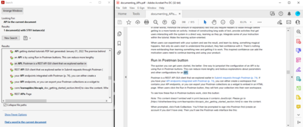
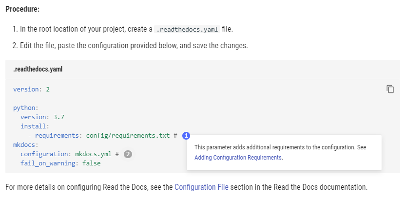

Dziś zajmiemy się tematem formatów i kanałów dystrybucji dokumentacji.
Zastanowimy się także, który z nich będzie najlepszym wyborem.

<!--truncate-->

No właśnie — jak to jest? Lepsza dokumentacja dystrybuowana w formacie PDF czy
dostępna online w formie strony WWW? Wydrukowana i dostarczana w pudełku czy
może dostępna wyłącznie w formie elektronicznej? Każdy z formatów może mieć
swoich zwolenników pomimo tego, że żaden z nich w gruncie rzeczy nie jest
doskonały.

Jakie zatem mogą być powody, żeby wybrać jedno zamiast drugiego? A może układ
idealny to taki, kiedy dokumentacja trafia do odbiorcy w wielu formatach?
Wszakże od przybytku głowa nie boli. Spróbujmy zatem przyjrzeć się temu
zagadnieniu w kontekście aspektów powiązanych z dostarczeniem i odbiorem
dokumentacji technicznej.

#### Dostępność offline czy online?

Ale jak to offline, kiedy wszystko dzisiaj odbywa się w Sieci? — zapytacie.
Wbrew pozorom dostęp do treści technicznej poza zasięgiem Internetu może być
istotny w wielu różnych przypadkach. Może na przykład istnieć wymóg, aby
instrukcja była dostarczana w pudełku wraz z produktem lub nasz odbiorca może
życzyć sobie dostępu do treści technicznej bez konieczności łączenia się z
Internetem celem większego zabezpieczenia przed cyberatakiem. Jeśli nie ma
wyraźnych przeciwwskazań, warto jednak zadbać o to, aby dokumentacja była
dostępna również w wersji online. Należy wtedy pamiętać, by umieścić stosowną
informację w dokumentacji dystrybuowanej offline — tak na wszelki wypadek.

Warto też przy doborze odpowiedniego kanału dystrybucji rozważyć dość śmiałą
aczkolwiek prawdopodobną teorię, że jeśli dostarczamy dokumentację techniczną
użytkownikowi końcowemu do rąk własnych, istnieje większe prawdopodobieństwo, że
się w nią zagłębi. Wprawdzie nie zakładamy, że ktoś podjąłby się samodzielnego
składania mebli z Ikei gdyby ta nie dawała instrukcji w pudełku, ale już przy
nauce obsługi sprzętu AGD lub RTV w człowieku z reguły budzi się większy empiryk
i odkrywca. Sztuka czytania jakby idzie na dalszy plan.

A jaki format dokumentacji wybrać przy dystrybuowaniu bez użycia zasobów
Internetu? Logika podpowiada, że jeśli dostępny offline, to zapewne będzie to
dokument w formacie PDF. I trudno się nie zgodzić: idealnie sformatowany pod
wydruk, łatwo się go daje dystrybuować na dowolnym nośniku, a przy okazji nie
wymaga dodatkowego oprogramowania, bo najczęściej PDF-y można otworzyć w
najprostszej przeglądarce internetowej. I nic nie stoi na przeszkodzie, aby taki
dokument uzupełnić o link lub kod QR odnoszący do szerszej bazy wiedzy dostępnej
online.

Nie skreślajmy jednak w tym miejscu możliwości użycia treści utrzymywanej w
formacie HTML. Warto zauważyć, że jeżeli opisujemy oprogramowanie, to będzie ono
często miało wbudowany tutorial lub inną pomoc, która w gruncie rzeczy opiera
się o format HTML. Jeśli zaś treść techniczna dystrybuowana jest do użytkownika
docelowego na nośniku danych, to nic nie stoi na przeszkodzie, aby znalazły się
na nim instrukcje dostępne jako strona WWW otwierana offline. A już najlepiej,
kiedy zaoferujemy na starcie dostęp do obu formatów. Istnieje ryzyko
_zwiększenia effortu podczas finalnego releasu_ dokumentacji, lecz hej — uśmiech
klienta wynagradza wszystkie tech writerów znoje, czyż nie?

Przy doborze odpowiedniego formatu może pomóc wzięcie kilku kryteriów opisanych
poniżej.

#### Personalizacja

Skoro już o zadowolonym kliencie mowa, to dobrze jest wziąć pod uwagę to, w
jakim zakresie użytkownik dostarczanej przez nas dokumentacji technicznej może
ją dostosować do własnych potrzeb. Czy może na niej zanotować dodatkowe
informacje, wykreślić zbędne szczegóły lub zaznaczyć postępy w wykonywaniu
procesów? Przy obszernych instrukcjach do skomplikowanych produktów, taka
możliwość jest nie do przecenienia.

Wiadomo, że w tym przypadku prym wiodą treści drukowane. Jak to się mówi: papier
wszystko przyjmie. Ale adnotacji nie boją się też PDF-y, które przy otwarciu ich
z użyciem odpowiednich — często darmowych narzędzi — pozwalają na zaznaczanie i
komentowanie fragmentów treści. Z resztą jak praktyka pokazuje, taka możliwość
przydaje się nie tylko odbiorcom końcowym, lecz także samym tech writerom.
Odpowiednio oznaczone zmiany zamieszczone w pliku PDF można podesłać do oceny
związanemu z tematem zmian _Subject Matter Expertowi_.

\[caption id="attachment*10766" align="aligncenter"
width="820"\]
\_Narzędzia do zaznaczania i przeglądania treści dostępne w Adobe
Reader*\[/caption\]

Pomoc online spisuje się w tym aspekcie nieco gorzej, ponieważ tutaj musimy sami
zadbać o wbudowanie mechanizmów pozwalających na personalizację treści. Wszystko
tak naprawdę zależy tu od inwencji i zaawansowania tech writera w budowaniu
stron WWW. Jeżeli ktoś wprawny weźmie się za zbudowanie dokumentacji w takim
formacie, to naprawdę może zdziałać istne cuda: dodać narzędzia pozwalające na
zaznaczenie przez użytkownika ważnych fragmentów czy sekcji, wykorzystać
bardziej interaktywną naturę stron HTML do prezentowania fragmentów kodu,
zaimplementować interaktywne narzędzia do zwiększenia przystępności dla
odbiorców z niepełnosprawnościami, wbudować mechanizm dodawania zakładek, czy
też zadbać o dobrą wyszukiwarkę. Możliwości jest co nie miara. A zaletą jest to,
że dostępność i mnogość takich funkcjonalności zależy wyłącznie od nas.

#### Przeszukiwanie i przeglądanie

W przypadku przeszukiwania i przeglądania treści, oba formaty właściwie idą łeb
w łeb (czy jak ktoś woli — nagłówek w nagłówek). W przypadku PDF-ów korzystamy z
przeszukiwarki wbudowanej w przeglądarkę tychże dokumentów. Zazwyczaj już przy
przeglądaniu PDF-a za pośrednictwem zwykłej przeglądarki internetowej
wynajdziemy względnie szybko potrzebną nam treść. Przy użyciu bardziej
zaawansowanego narzędzia typu Acrobat Reader istnieje możliwość skorzystania z
bardziej rozbudowanego narzędzia przeszukiwania, które usprawni pracę z
dokumentem technicznym.

\[caption id="attachment*10773" align="aligncenter"
width="590"\]
\_Zaawansowana wyszukiwarka Acrobat Readera*\[/caption\]

Pomoc online w gruncie rzeczy nie ustępuje tu niczym PDF-owi. Przy korzystaniu z
gotowych rozwiązań pozwalających na generowanie stron z dokumentacją, wbudowana
wyszukiwarka jest standardem. Uzupełnieniem może być wyszukiwarka oferowana
przez samą przeglądarkę internetową, która to dodatkowo pozwoli przeszukać
wyświetlaną stronę. Tutaj zatem można uznać, że oba formaty są sobie równe.

Przy doborze formatu końcowego dokumentacji technicznej warto również wziąć pod
uwagę rozmiar kompletnej rodziny dokumentów, która jest dedykowana opisywanemu
przez nas produktowi. Jeśli w skład takiej rodziny wchodzi kilka lub
kilkadziesiąt odrębnych instrukcji, które siebie nawzajem uzupełniają, wówczas
strona WWW — dostępna online lub offline — zdecydowanie ułatwi użytkownikowi
przechodzenie przez kolejne fragmenty poszczególnych dokumentów. Przy
konieczności przełączania się pomiędzy nawet dwoma PDF-ami istnieje ryzyko
pogubienia się. A gdzie w tym wszystkim miejsce na jakąkolwiek radość z czytania
i konfigurowania?

#### Przystępność

Skoro już zahaczamy o tematykę interakcji i wygody użytkownika przy konsumpcji
dokumentacji technicznej, warto też zastanowić się, jak format tej treści wpływa
na jej przystępność. Jak wcześniej wspomnieliśmy, w format online łatwiej
wbudować mechanizmy ułatwiające dostęp dla osób z niepełnosprawnościami. Możemy
zadbać o przyciski zmieniające wielkość i styl czcionki, zmieniające schemat
kolorów lub cały motyw strony. Zdecydowanie łatwiej odpowiedzieć na potrzeby
użytkownika, kiedy nie tylko tworzymy treść, ale też mamy wpływ na to jak można
ją przeglądać.

\[caption id="attachment*10764" align="aligncenter"
width="831"\]
\_Elementy strony WWW ułatwiające przeglądanie*\[/caption\]

W przypadku PDF-a takich możliwości jest zdecydowanie mniej, bo z reguły takie
dokumenty są mniej dynamiczne. Dostępu do zmiany wyglądu dokumentu ma się tu
tyle, ile oferuje program, w którym ten dokument otworzymy. No dobrze — można
dodać adnotację o rekomendowanym oprogramowaniu, którego należałoby użyć do
przeglądania danego dokumentu, lecz jest to bardziej sposób na obejście problemu
niż jego uniknięcie.

Oczywiście nie da się wyjść na przeciw wszystkim potrzebom odbiorcy, bo wtedy do
drukowanej dokumentacji trzeba by było dostarczać lupę, ołówek, a najlepiej też
technika-asystenta, który by przeczytał i wytłumaczył o co tak naprawdę chodzi.
Trzeba przyznać, że w tym względzie dokumentacja dostępna online jest
zdecydowanie lepszym rozwiązaniem. Zwłaszcza, że tę można w każdej chwili
unowocześnić. PDF-a, którego ktoś już sobie ściągnął lub instrukcję, którą
dostarcza się w formie wydrukowanej trudniej zastąpić nowszą wersją.

Z drugiej jednak strony to z wydrukowaną instrukcją łatwiej podejść do produktu,
żeby na przykład sprawdzić układ otworów na śruby, rozstaw guzików lub portów.
Nie wyobrażamy sobie raczej też możliwości składania mebli przy użyciu
instrukcji przeglądanej na telefonie lub tablecie.

#### Przechowywanie

Oba formaty dobrze czują się w kwestii przechowywania — plik PDF opatrzony
odpowiednią rewizją lub paczka ZIP zawierająca dokumentację HTML z odpowiednią
wersją builda w nazwie mogą sobie leżeć spokojnie na dysku twardym użytkownika
niczemu przy tym nie wadząc. Przy dostępie do treści dostępnej wyłącznie online
problem zupełnie znika, ponieważ nie ma potrzeby martwienia się o to, aby
zapisywać dokumentację lokalnie na dysk.

Niemniej jednak wiadomo, że dokumentacja techniczna ma to do siebie, że zdarza
się jej zagubić, zwłaszcza w momencie, kiedy najbardziej jej potrzebujemy.
Wówczas można zawrzeć w jakiś sposób w/na produkcie informację o tym jak uzyskać
dostęp do pomocy technicznej, a w przypadku formatu dostępnego offline, jaką
wersję dokumentacji należy pobrać. Jest to praktyka dość popularna i pewnie
każdy z nas miał już możliwość taką procedurę wykonać.

#### Poprawki i aktualizacja

Unowocześnianie i wprowadzanie poprawek jest jednym z istotniejszych etapów
życia każdego dokumentu technicznego. Zdecydowanie na tym poletku wygrywa
dokumentacja online, najlepiej oparta o formę strony WWW. Możemy tu wprowadzić
dowolne zmiany i aktualizacje, które będą dostępne dla wszystkich w momencie
zbudowania nowej odsłony strony z dokumentacją. W przypadku treści
dystrybuowanych kanałami offline jest duże ryzyko, że w momencie styczności
użytkownika z dokumentem, będzie on już w pewnym sensie przeterminowany, gdyż
nie będzie posiadał potrzebnych poprawek.

Nie ma tutaj reguły — aktualne poprawki będą równie ważne w dokumencie
opisującym konfigurację i obsługę systemu teleinformatycznego co w instrukcji
objaśniającej zasady gry planszowej. Jeśli zatem wiemy, że podstawowy kanał
dystrybucji odbywa się poza dostępem do Sieci i jest to dokumentacja techniczna
w postaci wydrukowanego podręcznika lub pliku dystrybuowanego na fizycznym
nośniku danych, warto na samym początku takiego dokumentu poinsutrować odbiorcę,
aby sprawdził czy nie istnieje jakaś nowsza wersja dokumentu, z którego ma
zamiar skorzystać.

#### Podsumowanie

Trudno o jednoznaczną odpowiedź na pytania postawione we wstępie. Forma końcowa
dokumentacji jest niejako powiązana ze specyfiką opisywanego produktu, sposobem
konfiguracji i obsługi, miejsca użytkowania czy nawet profilem odbiorcy
docelowego. Wiele leży też po stronie strategii producenta. Niektórzy stawiają
na nowoczesność, inni zaś na tradycję. Jedni przywiązują uwagę do prostoty, inni
do konwencji.

Jeśli zatem stoisz przed wyborem formy i formatu dokumentacji technicznej, weź
pod uwagę opisane przez nas kryteria — nawet jeśli to nie pomoże, to na pewno
nie zaszkodzi. A jeśli masz dodatkowe spostrzeżenia lub doświadczenia dotyczące
tego zagadnienia, śmiało wyraź się w sekcji z komentarzami.
