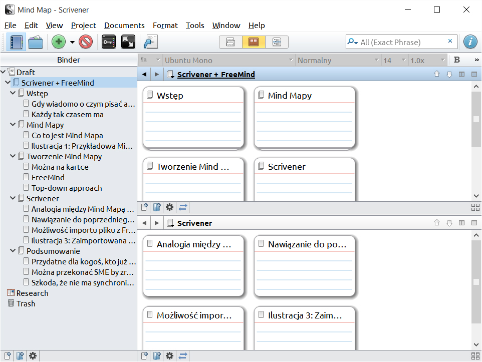
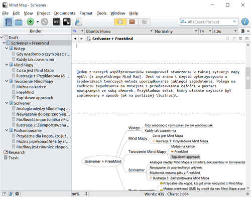

Znacie to uczucie, gdy w Waszym umyśle formuje się ogólny zarys jakiegoś tekstu,
ale gdy siadacie do komputera nijak nie możecie ugryźć tematu? Niby wiemy co
powinniśmy napisać, ale jak byśmy nie zaczynali, wychodzi nieciekawie? Fakty są
pomieszane, sami sobie przeczymy, dublujemy informacje, nagle zaczynamy
poprawiać jeszcze nieskończony tekst i w rezultacie klawisze Backspace i Del
odwalają jakieś osiemdziesiąt procent roboty?

Nam się to czasem zdarza.

Jeden z naszych współpracowników zasugerował stworzenie w takiej sytuacji
[mapy myśli](https://pl.wikipedia.org/wiki/Mapa_my%C5%9Bli) (z angielskiego mind
map). Jest to znana i często wykorzystywana w środowiskach twórczych metoda
uporządkowania jakiegoś zagadnienia. Polega na rozbiciu wątku na mniejsze i
przedstawieniu całości w postaci powiązanych ze sobą chmurek. Przykładowo tekst,
który właśnie czytacie był zaplanowany w sposób jak na poniższej ilustracji.

Oczywiście mapę taką można zbudować na wiele sposobów. Możemy użyć kartki
papieru (lub tablicy) i mazaków, ale w naszej ocenie lepiej jest skorzystać, z
któregoś z licznych programów służących do konstruowania tego typu diagramów.

My osobiście polecamy [FreeMind](http://freemind.sourceforge.net/) bo jest
darmowy, prosty w obsłudze i wystarczający.

Jak wygląda praca nad tekstem z wykorzystaniem mapy? Podejście takie sprawia, że
pracujemy “od ogółu do szczegółu”. Zaczynamy więc od tematu, rozbijamy go na
mniejsze fragmenty, sortujemy je, dalej dzielimy, znowu sortujemy i tak w kółko.
Dość naturalne wydaje się zejście do poziomu pojedynczych akapitów. Zwijając i
rozwijając kolejne węzły diagramu możemy łatwo wyrobić sobie pogląd na spójność
i kompletność tekstu. Stopniowo twórczy chaos jaki mamy w głowie zostaje
uporządkowany i możemy przystąpić do pisania właściwego tekstu.

Ale, ale… Taka organizacja tekstu coś nam przypomina…

Uważni czytelnicy zapewne pamiętają opisywane przez nas narzędzie
[Scrivener](http://techwriter.pl/scrivener-opis-narzedzia/). Pozwalał on dzielić
tekst na drobne kawałki, a następnie dowolnie je reorganizować podczas pracy nad
tekstem - zasada bardzo podobna do wspomnianych powyżej map. Odpaliliśmy program
(no dobra, najpierw wyguglaliśmy co i jak…) i... okazało się, że może on
najzwyczajniej w świecie zaimportować plik o rozszerzeniu “mm” stworzony w
FreeMind. W ten sposób gotową mapkę możemy bardzo łatwo i wygodnie zamienić w
szkielet tekstu.

Tak nasza mapa wygląda już po zaimportowaniu.

Spodobała nam się możliwość bezpośredniego importu mapy. Kombinacja obu narzędzi
pozwala wygodnie wizualizować zagadnienie, umożliwiając jednocześnie efektywną
pracę nad tekstem, gdy już go zaplanujemy. Jeżeli ktoś jest zwolennikiem
stosowania map umysłu (a są one dość popularne choćby w branży IT), może teraz
korzystać z nich efektywniej. Dodatkowo, jeżeli uda się przekonać naszego
[SME](http://techwriter.pl/kim-jest-sme/), żeby zrobił dla nas taki diagram,
zalążek tekstu dostajemy niejako w bonusie.

Nie zapomniano również o osobach, które chciałyby urządzić burzę mózgu w
odniesieniu do już istniejących dokumentów Scrivenera. Istnieje możliwość
eksportu do pliku zarówno struktury całego tekstu (nawet z dodatkowymi notatkami
i całym zgromadzonym materiałem) jak i poszczególnych jego fragmentów.

Na koniec ten sam tekst, już podczas edycji.

Jeżeli pracujesz nad dużym, skomplikowanym zagadnieniem i masz problem z
wyobrażeniem sobie całości, warto spróbować stworzyć najpierw mapę tekstu. Dużo
wygodniej jest operować pojedynczymi pojęciami niż całymi akapitami, łatwiej
zauważyć, gdy pewnych informacji brakuje lub są zdublowane. Gdy taka mapa już
powstanie i postanowimy użyć jej jako bazy przy pisaniu samego tekstu, Scrivener
ułatwi nam to pozwalając po prostu ją zaimportować. A potem zostaje nam już
pisanie reszty 😉.
