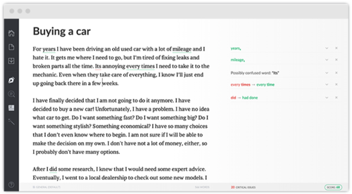

Brakuje Wam sprytnego narzędzia do korekty? Spellcheck w przeglądarce zawodzi? Ten w Wordzie daje niemądre sugestie? Dodaliście coś do jednego słownika, ale teraz używacie drugiego? Być może rozwiązaniem tych wszystkich problemów jest Grammarly? A być może Grammarly to wielka klapa?

# O co chodzi?

[Grammarly](https://www.grammarly.com) to usługa sprawdzania pisowni i gramatyki języka angielskiego dostępna jako szereg aplikacji. Po zapisaniu się do serwisu dostajemy imienne konto, które będzie zarządzało naszą historią poprawek i wyjątkami, które dodajemy do słownika. Możemy wybrać wersję darmową i płatną, przy czym dopiero ta druga daje pełen zakres funkcjonalności. Dostępne są także licencje edukacyjne i biznesowe dla firm.

Następnym krokiem jest zainstalowanie aplikacji, które nas interesują. A to będzie zależało od tego gdzie i jak piszemy. Dostępne są:

- Dodatek do Microsoft Office
- Wtyczki do przeglądarek
- Aplikacja na Windows i Mac - dedykowany edytor tekstu
- Wykrywacz plagiatów - [dostępny tutaj](https://www.grammarly.com/plagiarism-checker)

\[caption id="attachment_6011" align="aligncenter" width="735"\] Aplikacja Grammarly na Mac OS\[/caption\]

# Wersja darmowa i płatna

Aplikacje w **wersji darmowej** pomogą nam wykryć i naprawić krytyczne błędy w pisowni i gramatyce.

A w **wersji płatnej** pomogą także:

- Wykryć błędy w kontekście słów, interpunkcji i budowie zdania
- Lepiej dobrać słownictwo
- Wprowadzić poprawki zależnie od tego czy piszemy na przykład prozę lub list motywacyjny
- Sprawdzić czy nie popełniamy plagiatu

# Wrażenia z testów

Ta usługa nie przypadła nam do gustu. Ale zaznaczamy, że korzystaliśmy tylko z wersji darmowej. Zainstalowaliśmy dodatek do MS Office i wtyczkę do Firefoxa.

Sugestie poprawek w tej wersji były dosyć podstawowe i Microsoft Word dawał nam już takie same lub lepsze. Dodatkowo aplikacja utrudniała nam pisanie maili przez to, że okienko z mailem przemieszczało się pod myszką, ładowało się długo i czasem się zawieszało. Zarówno dodatek do MS Office jak i wtyczka do Firefoxa wchodziły nam w drogę i bardzo szybko zmęczyliśmy się ich używaniem.

Odinstalowaliśmy aplikacje po trzech dniach. Ale newslettery dostajemy do dziś.

Chcecie poznać zdanie innych? Zapraszamy do [recenzji na stronie Articulate Marketing](https://www.articulatemarketing.com/blog/review-of-grammarly-com#moved).

A Wy? Macie jakieś wrażenia odnośnie Grammarly? A może polecacie inną aplikację tego typu?
