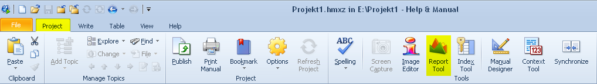
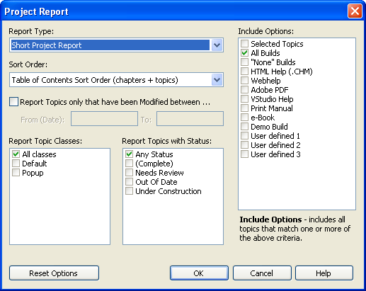
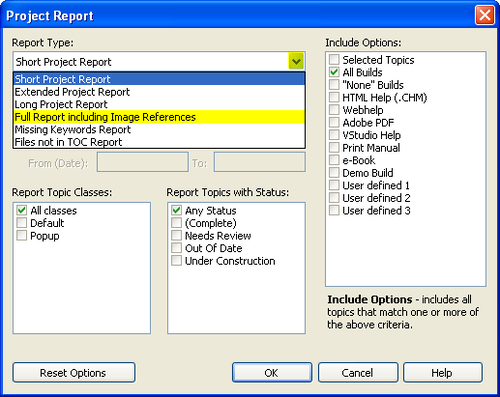
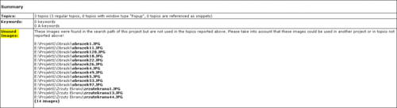

[Help and Manual](http://techwriter.pl/help-and-manual-opis-narzedzia/ "Help and Manual – opis narzędzia") posiada dużo przydatnych funkcji, których nie widać gołym okiem. Jedną z nich jest możliwość sprawdzenia, które obrazki nie są używane w projekcie.

Rzadko kiedy dokument, który stworzyliśmy pozostaje niezmieniony przez dłuższy okres czasu. Przeważnie jest on regularnie aktualizowany, zmieniany i ulepszany. To prowadzi do sytuacji gdzie mamy mnóstwo starych zrzutów ekranu, które nie są nam potrzebne, ale nie za bardzo mamy ochotę przeglądać je i usuwać. Jest to bardzo czasochłonne i po prostu nudne. W takiej sytuacji możemy skorzystać z narzędzia do tworzenia raportów, które jest częścią Help and Manuala. Raport wygenerowany za pomocą opcji **Full Report including Image References** zawiera sekcję z nieużywanymi obrazkami. Poniżej krótka instrukcja.

1. Otwórz projekt w Help and Manual. 2) W zakładce **Project** wybierz **Report Tool**.

Pojawi się okno z wyborem opcji generowania raportu.

3. W polu **Report Type**, wybierz opcję **Full Report including Image References**.

Opcjonalnie, zmień pozostałe parametry. Naciśnij _OK_.

W przeglądarce otworzy się wygenerowany raport.

4. Przewiń raport do końca i znajdź sekcję **Unused Images**.

 W tej sekcji wyświetlone są obrazki, które nie są wykorzystywane w projekcie. Sprawdzane są tylko katalogi dodane w ustawieniach projektu, w Configuration -> Common Properties -> Project Search Path. Odniesienia dodane ręcznie do szablonu HTML oraz pliki dołączone do projektu (baggage files) nie są uzwględniane w raporcie.

Miłego korzystania :)
