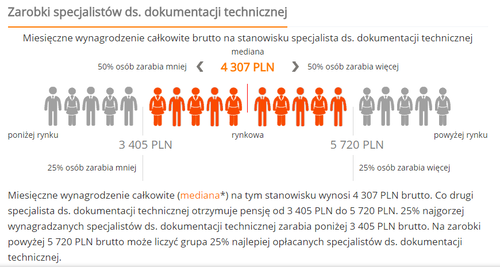

Dzisiaj po raz kolejny postaramy się Wam podpowiedzieć skąd możecie czerpać
wiedzę o zarobkach Technical Writerów.

## Wynagrodzenia.pl

Jednym z pierwszych miejsc, które kojarzy się z informacjami o zarobkach jest
portal [wynagrodzenia.pl](http://wynagrodzenia.pl/). W sekcji
[Moja Płaca](http://wynagrodzenia.pl/moja-placa) znajdziemy dane o zarobkach na
750 stanowiskach. Nasza zacna profesja została uwzględniona w zestawieniu pod
nazwą "specjalista ds. dokumentacji technicznej". Mediana zarobków dla tego
stanowiska wynosi **4 307 zł brutto**. Ta kwota została ustalona na podstawie
odpowiedzi 714 osób. Dane były ostatnio aktualizowane w styczniu 2016.

Więcej szczegółów znajdziecie
[tutaj](http://wynagrodzenia.pl/moja-placa/ile-zarabia-specjalista-ds-dokumentacji-technicznej).
Jeśli takie ogólne dane nie są dla Was wystarczające, to możecie wziąć udział w
[Ogólnopolskim Badaniu Wynagrodzeń](http://wynagrodzenia.pl/ogolnopolskie-badanie-wynagrodzen)
w zamian za co otrzymacie pełny raport płacowy dla swojego stanowiska.

## Raport płacowy

W
[poprzednim artykule](http://techwriter.pl/ile-zarabia-technical-writer-odslona-druga/)
opisującym zarobki Technical Writerów, powoływaliśmy się na
[raport płacowy za rok 2013](http://cpljobs.pl/Documents/CPL%20Jobs%20-%20Raport%20P%C5%82acowy%202014%20-%20Podsumowanie%202013.pdf),
przygotowany przez CPL Jobs. Sprawdziliśmy czy istnieje nowsza wersja tego
raportu. Niestety, jedyne co udało nam się znaleźć
to [raport płacowy podsumowujący rok 2014](http://cpljobs.pl/CPL/Upload/CPL%20Jobs%20-%20Salary%20Report%202015%20-%20PL%20-%20pl.pdf).
Po porównaniu stawek z tymi z raportu za rok 2013 okazało się, że są one
identyczne. Poniżej przypominamy jak kształtowało się miesięczne wynagrodzenie
brutto Technical Writerów w poszczególnych miastach.

1. **Warszawa** – 6000-7000
2. **Gdańsk** – 6000-7000
3. **Łódź** – 5000-6000
4. **Katowice** – 4500-6000
5. **Wrocław** – 4500-5500
6. **Kraków** – 4500-5500
7. **Poznań** – 4500-5500
8. **Szczecin** – 4000-5000

## Pracuj.pl

Niedawno odkryliśmy w
[aplikacji Pracuj.pl dla Androida](https://play.google.com/store/apps/details?id=pl.pracuj.android.jobsearcher&hl=pl)
ciekawą funkcję - pod niektórymi ogłoszeniami podane są średnie zarobki
dla stanowiska i województwa, których dotyczy ogłoszenie. Warto wspomnieć, że
tej samej funkcji nie udało nam się znaleźć w pełnej wersji portalu
[Pracuj.pl](http://www.pracuj.pl/). Po wpisaniu w wyszukiwarkę "Technical
Writer" znaleźliśmy kilka ogłoszeń na stanowisko Technical Writer i specjalista
ds. dokumentacji technicznej oraz jedno ogłoszenie na stanowisko Junior
Technical Writer. Wyniki naszych poszukiwań znajdziecie poniżej. Jak zauważycie,
dla specjalisty ds. dokumentacji technicznej w woj. mazowieckim otrzymaliśmy
dwie zupełnie różne kwoty. Być może różnica wynika z tego, że osoby raportujące
swoje wynagrodzenie używały w różny sposób wielkich i małych liter.

Jak oceniacie przedstawione przez nas dane? Czy są według Was bliskie
rzeczywistości czy raczej mają z nią niewiele wspólnego? Czekamy na Wasze
komentarze i życzymy Wam, żebyście nigdy po wypłacie nie czuli się w sposób
przedstawiony na filmiku poniżej 😉

https://www.youtube.com/watch?v=dR4nSfI\_EfQ
