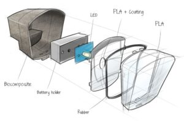
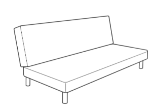
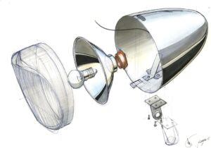
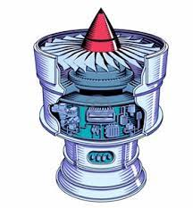

Zastanawialiście się kiedyś dlaczego istnieje tak duży popyt na przeglądanie
obrazów i wideo? Dlaczego wolimy oglądać infografiki, zdjęcia czy krótkie filmy
niż czytać, nawet niezbyt długi tekst? Dlaczego ten trend wydaje się narastać w
ostatnich latach?

<!--truncate-->

Czy dodanie ilustracji lub wizualizacji do instrukcji zwiększa zainteresowanie
odbiorcy i wpływa na ilość zapamiętanych przez niego informacji?

O tym przeczytacie w dzisiejszym artykule!

### **Trochę danych**

Ludzki mózg przetwarza obrazy
[60 000 razy szybciej niż tekst, a 90% informacji przekazywanych do mózgu ma charakter wizualny](https://mycompanypolska.pl/artykul/13-milisekund-do-obrazu-czyli-jak-mozg-przetwarza-informacje-w-komunikacji-wizualnej/1825).
Regularnie oglądane zdjęcia i filmy zapamiętywane są szybciej, niż to co
czytamy. Wynika z tego, że przeciętny człowiek reaguje znacznie lepiej na
informacje wizualne niż na zwykły tekst.

Dodatkowo, według
[badań przeprowadzonych przez Nielsen Norman Group](https://www.nngroup.com/articles/how-little-do-users-read/),
większość ludzi czyta zaledwie 20% – 28% słów na przeciętnej stronie
internetowej z tekstem. Według innych badań
[80% uczestników obejrzy video](https://www.omnicoreagency.com/digital-marketing-statistics-2018/),
a zaledwie 20% z nich przeczyta tekst.

Ponieważ z natury większość z nas jest wzrokowcami, możemy wykorzystać tę
umiejętność do poprawy przetwarzania danych i efektywności w pracy, a co za tym
idzie, także poprawy jakości dostarczanej dokumentacji.

Jak i z kim to zrobić?

Tutaj z pomocą może przyjść ilustrator!

### **Ilustrator - kim jest?**

Ilustrator techniczny lub visual designer to specjalista, który dysponuje
kombinacją odpowiedniego wykształcenia i doświadczenia. Ilustratorzy, poza
znajomością podstawowych systemów operacyjnych, powinni znać różne programy
komputerowe przydatne w obróbce materiałów wizualnych. Ich lista jest bardzo
długa, dlatego wybraliśmy te najbardziej znane.

Programy do obróbki graficznej:

- [AutoCAD](https://www.autodesk.com/products/autocad/overview),
- [Blender](https://www.blender.org/),
- [Adobe Illustrator](https://www.adobe.com/products/illustrator.html),
- [Solidworks](https://www.solidworks.com/product/solidworks-composer),
- [Photoshop](https://www.adobe.com/products/photoshop.html),
- [Affinity Designer](https://affinity.serif.com/en-gb/).

Programy do przechwytywania ekranu, tworzenia video i dalszej obróbki materiału:

- [Camtasia](https://www.techsmith.com/store/camtasia?utm_source=google&utm_medium=cpc&utm_campaign=1537281055&utm_content=86522591441&utm_term=camtasia%20software&gclid=Cj0KCQjwub-HBhCyARIsAPctr7yOi212FuOguF2mdY51kynWiTxWQKaFhAmql1UGOjPl0DvOtb3G6ZoaApSaEALw_wcB),
- [Apowersoft](https://www.apowersoft.com/edit-video.),
- [DaVinci Resolve](https://www.blackmagicdesign.com/products/davinciresolve/),
- [Adobe Premiere](https://www.adobe.com/products/premiere.html),
- [Final Cut Pro](https://www.apple.com/final-cut-pro/).

Poza znajomością oprogramowania, w pracy ilustratora pożądane są dobre
umiejętności komunikacyjne. Dlaczego? Ponieważ, podobnie jak autor techniczny
potrzebuje on zebrać informacje, które będą przydatne przy tworzeniu rysunków.

Dobrze, jeśli Ilustratorzy mają wykształcenie kierunkowe na przykład dyplom
inżyniera lub stopień naukowy. Przydatna może być także wiedza z dziedziny
architektury czy projektowania przemysłowego.

### **Co robi?**

Praca visual designera (ilustratora), polega w dużej mierze na tworzeniu
obrazów, diagramów, rysunków 2D i 3D lub wideo tak, aby skutecznie przekazać
określone informacje zarówno odbiorcom technicznym, jak i nietechnicznym.

Wizualizacja obiektu powinna być dokładna pod względem wymiarów i proporcji oraz
poprawna pod względem kompozycji, gdyż łatwiej przyswajamy treść gdy jest podana
w atrakcyjnej formie.

### Rysunki

Zagłębiając się w temat rysunków w dokumentacji można podzielić je na różne
kategorie.

Istnieją trzy główne kategorie ilustracji technicznych w zależności od ich
odbiorcy:

- **ilustracje dla ogólnego odbiorcy** - można  je znaleźć w instrukcjach
  obsługi dla ''przeciętnego'' odbiorcy, zawierają one proste symbole i
  terminologię, która może być zrozumiana przez każdego.

_Przykład\_\_: Wektorowy rysunek pralki_

- **ilustracje specjalistyczne** -  przeznaczone dla inżynierów lub osób, które
  specjalizują się w danym zakresie. Ilustracje specjalistyczne zawierają
  zazwyczaj złożoną terminologię i symbole zrozumiałe dla danej grupy odbiorców.

_Przykład:_ _Rysunek przekrojowy lampy_

- **ilustracje dla wysoko wykwalifikowanych ekspertów** - są używane przez
  ekspertów w danej dziedzinie do komunikacji z ludźmi, którzy mają dużą wiedzę
  i umiejętności w danym temacie. Takie ilustracje można znaleźć w dokumentacji
  użytkownika / operatora.

_Przykład: Rysunek zawierający szczegóły specjalistyczne_

Poniżej podstawowe typy ilustracji spotykanie najczęściej w dokumentacji
technicznej:

- **konwencjonalne rysunki liniowe** - składają się z wyraźnych prostych lub
  zakrzywionych linii bez gradacji odcienia lub barwy w celu przedstawienia
  dwuwymiarowych lub trójwymiarowych obiektów

_Przykład: Rysunek przedstawiający składane łóżko_

- **rysunki z widokiem eksplodującym** - ich celem jest przedstawienie widoku
  rozłożonego obiektu i wyjaśnienie związku pomiędzy jego częściami lub ich
  zamierzonej kolejności

_Przykład: Rysunek przedstawiający widok poszczególnych części_

- **rysunki wycinkowe** - grafiki 3D, rysunki, schematy lub ilustracje, w
  których elementy powierzchniowe modelu trójwymiarowego są selektywnie usuwane,
  aby uwidocznić cechy wewnętrzne

_Przykład: Rysunek przedstawiający widok wnętrza śmigła_

- **symbole i ikony** - są bardzo cenne w komunikacji technicznej i na rynku
  globalnym. Wiele z nich  uznawanych jest jako "międzynarodowe" i są one
  używane w wielu branżach. Włączenie symboli i ikon do dokumentacji technicznej
  może znacznie zmniejszyć liczbę słów potrzebnych do opisania czegoś.

_Przykład: Symbol kierunku wyjścia ewakuacyjnego_

- **zrzuty ekranu lub zdjęcia** - wykorzystanie fotografii w dokumentacji
  technicznej  nadaje dokumentowi realizmu i wiarygodności

_Przykład: Jak zrobic zrzut ekranu na komputerze Mac_

### Wideo

Dzięki wideo w ciągu kilku sekund można pokazać to, co najważniejsze!  Wszystkie
informacje są dokładnie wyselekcjonowane i skomponowane w taki sposób, żeby
potencjalny odbiorca nie musiał sam szukać.

Można je podzielić na trzy kategorie:

- **filmy instruktażowe** -  najczęściej pojawiają się w formie serii, aby pomóc
  użytkownikom w przyswojeniu produktu i wyjaśnić bardziej złożone
  funkcjonalności
- **filmy z opisami funkcji**  - są one dodawane do odpowiednich tematów pomocy,
  zwłaszcza w dokumentacji IT
- **przegląd produktu** - są to najczęściej filmy promocyjne, tworzone przez
  zespoły marketingowe, a ich celem jest krótkie wyjaśnienie czym jest produkt,
  przedstawienie jego głównych funkcjonalności oraz wzbudzenie zainteresowania
  odbiorców.

### **Co jest ważne i o czym pamiętać?**

Bez względu na to, czy chcecie komuś wytłumaczyć, jak wdrożyć nową procedurę,
naprawić drukarkę, czy złożyć meble – pamiętajcie o ilustracjach. Dołączenie do
tekstów odpowiednio dobranych obrazów lub filmów pozwala go lepiej zrozumieć i
zastosować w praktyce.

Wyzwaniem jest uchwycenie cech charakterystycznych danego obiektu, ale dla
doświadczanego ilustratora to nie problem. Poniżej garść dobrych praktyk:

- jeżeli chcemy ułatwić zrozumienie naszej wizualizacji, musimy dodać do niej
  adekwatny podpis (obrazy zwiększają rozumienie tekstu tylko, jeśli się do
  niego odnoszą),
- ilustracje nie mogą być zbyt szczegółowe, powinny zwracać uwagę na
  najważniejsze elementy wyszczególnione w tekście,
- ograniczenie  elementów*,* które mogą rozpraszać,
- wraz ze wzrostem poziomu trudności i skomplikowania instrukcji warto
  rozpatrzyć stworzenie filmu instruktażowego, jak na przykład instrukcję
  montażu części silnika,
- warto użyć ilustracji z odnośnikami literowymi wtedy tłumaczenie ilustracji
  nie będzie koniecznie,
- opis sposobu korzystania z oprogramowania może być lepiej wyjaśniony poprzez
  dodanie zrzutów ekranu, co zmniejszy  ilość użytych słów.
- użycie rysunków jest skuteczne gdy wspierają, zastępują lub rozszerzają tekst
  w lepszy sposób niż sam tekst,
- przy tworzeniu wideo można skupić uwagę widza na konkretnym szczególe
  powiększając go efektywnie wykorzystując "zoom",
- wysokiej jakości materiały wideo pomagają Waszym odbiorcom w  zrozumieniu
  informacji.

### **Na co uważać?** 

- sama ilustracja lub wideo nie zawsze będzie dobrym wyjaśnieniem. Czasami
  adekwatny podpis obrazu pomaga go zrozumieć.
- odtwarzanie wideo wymaga zazwyczaj szybkiego internetu, użytkownicy nie zawsze
  mają dostęp do internetu, gdy szukają konkretnych informacji o produkcie.
- produkty, które są aktualizowane lub w trakcie rozwoju, mogą być mniej
  odpowiednie dla dokumentacji wideo. Aktualizacja filmów wideo dla nowych
  wersji jest bardziej niewygodna i kosztowna niż aktualizacja obrazów i tekstu.

### Wnioski

Obrazy i filmy mogą pomóc w tworzeniu lepszej dokumentacji. Jednak trzeba
pamietać kim jest Wasz odbiorca i czego dokładnie potrzebuje. O ile wideo może
prowadzić użytkownika przez optymalnie zaprojektowane środowisko nauki, o tyle
instrukcja w formie tekstu  z rysunkami pozwala użytkownikowi samodzielnie
decydować, czy chce czytać tekst szybko czy wolno, w całości czy częściowo oraz
czy chce powtarzać fragmenty czy nie.

A Wy co o tym sądzicie? Zapraszamy do komentarzy!
