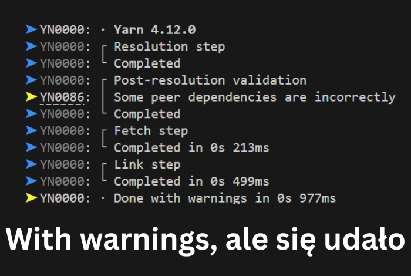

Rzeczywistość współczesnego tech writingu to docs-as-code: Git, Markdown i
static site generators (SSG). Jak ma się w tym wszystkim odnaleźć technical
writer? Moja odpowiedź brzmi: najlepiej tak, żeby nie stać się programistą.

<!--truncate-->

W przypadku dokumentacji do oprogramowania, a zwłaszcza bardzo technicznych rozwiązań dla deweloperów, tech writer wkomponowany jest w zespół programistów i używa ich narzędzi. Ale nasza unikalna cecha, nasza wartość dodana, leży właśnie w tym, że **nie**
jesteśmy programistami. Tech writerzy to ludzie słowa. Lubimy czytać i wyrażamy
się poprzez pisanie. Interesuje nas człowiek i jego problemy. Dlatego zatrudnia
się właśnie nas do pisania dokumentacji: żebyśmy mieli jedno oko na technologię 
a drugie na człowieka.

Ale narzędzia dla programistów moga nam bardzo ułatwić pracę i pozwalają lepiej
wpasować się w pracę zespołu. W tym artykule chciałbym podzielić się moimi
poradami na temat pracy z narzędziami deweloperskimi.

## Zmiana mindsetu: nie musisz być ekspertem

Umieć programować, to brzmi dumnie. Ludzie spędzają wiele lat, żeby posiąść tę
umiejętność. Jedni od małego tworzą strony i piszą gry na komputerze taty. Inni
idą na studia i uczą się analizy matematycznej, żeby potem przekuć zaawansowane
zdolności intelektualne na mistrzowskie opanowanie algorytmiki i wzorców w
programowaniu. To nie jest łatwa ścieżka, choć jest wielu, którzy nią podążają.

Ale, tak jak pisałem na wstępie, to nie jest ścieżka dla nas. My skupimy się na
tym, że **nie trzeba** być programistą, żeby skutecznie używać narzędzi dla
deweloperów. A co trzeba? Dwóch rzeczy.

Po pierwsze, zaakceptuj krzywą uczenia się (ang. _learning curve_). Z początku
nie będzie łatwo, bo nie będziesz rozumieć całej perspektywy. Nie będziesz
wiedzieć po co masz za każdym razem wykonywać krok X, albo dlaczego coś nie
działa. Będziesz widzieć na ekranie tajemnicze słowa typu "_execution error_"
albo "_XYZ is not recognized as the name of a cmdlet, function, script file, or
operable program_". Nie będziesz wiedzieć czym się różni Node.js od React.js. I
to jest okej. Uwierz mi: w końcu wszystko zrozumiesz. Potrzebujesz czasu i
wprawy, a zrozumienie przyjdzie naturalnie.

Po drugie, ucz się publicznie. Graj z innymi w otwarte karty; mów, że nie wiesz,
nie rozumiesz, nie umiesz. Nie rób z siebie ofiary i nie podkreślaj swojej
niewiedzy na każdym kroku. Nie przyjmuj postawy defensywnej. Nie przybieraj
maski wyuczonej bezradności. Nie stań się osobą bezradną. Po prostu mów,
rzeczowo, otwarcie i zwięźle, czego nie wiesz, czego nie rozumiesz i czego nie
umiesz. Zadawaj konkretne pytania typu "jak mam rozwiązać ten problem?" Zespół
Ci chętnie pomoże, bo ludzie lubią pomagać ludziom i lubią czuć się pomocni.


Jeżeli zrobisz te dwie rzeczy, zaakceptujesz krzywą uczenia i będziesz się uczyć
publicznie, będziesz na jak najlepszej drodze do opanowania narzędzi
deweloperskich.

## 2. Git i kontrola wersji - podstawy, które wystarczą

Najbardziej podstawowym narzędziem w zespole programistów jest Git. Git to
rozproszony system kontroli wersji bla, bla, bla, i tak dalej. Teoria jest
ważna, ale wcale nie musisz jej rozumieć. Bo 90% pracy z Gitem to 5 (słownie
"pięć") komend. Jakich?

clone, pull, branch, commit, push

Naprawdę nie przesadzam kiedy powiem, że te pięć słówek to podstawa. Naucz się
ich i używaj. A jak trafisz na skomplikowaną sytuację, z którą nie możesz sobie
poradzić, zapytaj kogoś, zapytaj AI, albo, jeśli lubisz totalny old school,
wgooglaj to.

Przez większość czasu będziesz powtarzać ten sam workflow. Czasem zdarzą się
**konflikty**, ale nie daj się ponieść negatywnym emocjom sugerowanym przez to
słowo. Konflikt w Gicie to nic złego. Nie oznacza, że popełniasz bład, albo, że
będzie jakaś kara. Konflikt jest drogą do współpracy. Powinien się może nazywać
jakoś inaczej, ale nazywa się jak się nazywa.

No i zacząłem tę sekcję od wypisania kilku komend, ale tak naprawdę nie musisz
używać komend. Możesz używać GUI, na przykład tego, które jest wbudowanie z VS
Code czy inne IDE. Właściwie, to powiem więcej: **zachęcam** do używania GUI.
Jeżeli masz świadomość co stoi za każdą komendą, to o wiele łatwiej jest
pracować używając GUI. No i tysiąc razy łatwiej rozwiązuje się konflikty w
three-way merge editorze niż "z palca" w jakimś przedpotopowym interfejsie w
terminalu.

## 3. Markdown i inne języki znaczników

Markdown jest naprawdę łatwy do opanowania. Nagłówki, listy, cytaty, próbki
kodu. Do tego pogrubienia, kursywa, i `słowa` `kodowe`, that's it! Gratulacje,
masz w małym palcu 90% tego, co potrzebujesz.

Dla bardziej zaawansowanych, lub gdy potrzebujesz więcej, jest MDX, AsciiDoc,
czy reStructuredText. Każdy z nich ma swoje mocne strony w zależności od
potrzeb. Na przykład, jeśli pracujesz w zespole, w którym React to chleb
powszedni, MDX to świetny wybór. MDX pozwala wstawiać działające komponenty
Reactowe do tekstu.

Ale co z reusem? Słyszę pytanie, które zadajesz mi nieśmiało przez ekran.
Oczywiście są na to sposoby i na pewno znajdziesz źródła, które powiedzą Ci jak
z nich korzystać. Na przykład w Docusaurusie, dzięki pomocy MDXa, możesz
[zaimportować Markdown z innego pliku](https://docusaurus.io/docs/markdown-features/react#importing-markdown).

No i w Docusaurusie i innych możesz bardzo łatwo pracować z **interaktywnymi**
próbkami kodu w dokumentacji. Możesz podglądać zmiany na żywo, blogować i
hostować stronę "za darmo".
[Pisaliśmy o tym już wcześniej](../docusaurus-zielony-przyjaciel/index.mdx),
jeśli chcesz zgłębić temat.

## 4. Static Site Generators - korzystanie bez głębokiego rozumienia

Ale o Docusaurusie już było, więc może napiszę coś o innych Static Site
Generators (SSG). Te narzędzia służą do generowania stron, które relatywnie
rzadko wymagają zmian. Co to znaczy, kiedy codziennie publikujesz jakieś zmiany
w docsach? Otóż to jest nadal "relatywnie rzadko" z punktu widzenia aplikacji
webowych. Strony, które zmieniają się często, to na przykład Twitter (czy jak to
się tam teraz nazywa), albo TikTok, gdzie co sekundę pojawia się kwadrylion
nowych treści. I te nowe treści są prezentowane za pomocą zaawansowanych
algorytmów poleceń, które są lepiej dopracowane niż praktycznie każdy inny
system na tej planecie, bo jesteśmy gatunkiem małpy, która doskonale opanowała
priorytetyzację.

Ale o czym to ja pisałem? A tak, SSG. Każda strona z dokumentacją jest stroną
statyczną. Raz napisane treści są prezentowane w stały sposób, zaprojektowany za
pomocą statycznej architektury informacji. Treści są indeksowane do wyszukiwania
i hostowane do długoterminowej eksploatacji. Dlatego zespoły dokumentacyjne w
softwarze tak uwielbiają SSG.

Nie musisz znać całej teorii za tym wszystkim, musisz tylko nauczyć się pracować
z konkretnym narzędziem. W świecie Pythona jest to na przykład Sphinx lub
MkDocs. Dla miłośników Reacta jest wspomniany Docusaurus albo Gatsby. Jeśli
lubisz Go (taki język programowania, nie że lubisz "Jego") to pewnie sięgniesz
po Hugo albo Docsy. Jeśli chcesz wiedzieć ile jest opcji obecnie na rynku, to
polecam
[wyszukiwarkę SSG na stronie Jamstack](https://jamstack.org/generators/).

**Spoiler**: w momencie pisania artykułu, w wyszukiwarka pokazuje 375 SSG.

Czego potrzebujesz, żeby pracować z SSG? Musisz zrozumieć strukturę projektu,
żeby wiedzieć gdzie dopisywać nowe docsy. Poznaj sposoby na odpalenie lokalnego
preview, żeby kontrolować jakość strony w czasie pisania. Na koniec, naucz się
gdzie szukać pomocy. I to wystarczy. Poradzisz sobie z każdym SSG.

## 5. Terminal/wiersz poleceń - oswajanie czarnego okienka

Czasem jednak musisz otworzyć to czarne okienko, żeby zadziała się komputerowa
magia. Ale w codziennej pracy potrzebujesz kilku prostych komend i nie musisz
się w to bardziej zagłębiać.

Na przykład pracując z Docusaurusem, otwierasz czarne okienko i piszesz tak:

```
yarn
```



Potem czekasz trochę aż proces zakończy się powodzeniem i piszesz:

```
yarn start
```

Czekasz momencik i otwiera się przeglądarka z podglądem strony na żywo.

Jeżeli chcesz zrobić coś bardziej zaawansowanego, to dla 99% przypadków
znajdziesz gotową komendę w Internecie. A pozostały 1% przypadków? Możesz
poprosić osoby z zespołu programistów, lub spytać AI. Tylko najlepiej
wykorzystać te momenty do uczenia się. Prowadź sobie **ściągawkę** ze starymi i
nowymi komendami. A jeżeli tworzysz jakieś skrypty przy pomocy innych, postaraj
się je zrozumieć, żeby móc je potem modyfikować. Przez lata zgromadzisz wiedzę,
która zrobi z Ciebie power usera\kę. 💪

## 6. CI/CD i automatyzacja - zrozumieć, nie budować

Programiści używają CI/CD, czyli aplikacji, które budują i publikują
oprogramowanie. Tech writerzy też mogą używać CI/CID, żeby budować i publikować
dokumentację. Ale tech writerzy nie muszą (najczęściej) wiedzieć bardzo dużo o
tych CI/CD. Co Cię powinno interesować?

Dobrze jest wiedzieć ogólnie co jest budowane i gdzie jest publikowane (np.
dokumentacja z Markdowna budowana do strony HTML i publikowana na serwer na
AWSie). Reszta nie będzie Cię dotyczyła w 99% przypadków. A jeżeli zdarzy się
ten 1%, to na pewno pomogą Ci koleżanki/koledzy/AI.

Pewnie mozesz coś modyfikować w konfiguracji, ale często da się to zrobić w
jakimś GUI, co się nie różni bardzo od ustawiania budzika na telefonie.

Gorzej jeśli zdarzają się błędy. Musisz wtedy czytać logi i zaaplikować
wyczytaną informację, żeby naprawić problem. Tutaj może się przydać znajomość
np. Markdowna i jakim strukturom w HTMLu on odpowiada, oraz jak jest do HTMLa
kompilowany. Odpowiedzialność za błędy w AWSie i tym podobnych nie powinna leżeć
po Twojej stronie, ale jeżeli tak się stanie, to wszystko jest do wygooglania.

Najważniejszą umiejętnością, jakiej możesz się tu nauczyć, to skuteczna
komunikacja z DevOps, czyli z ludźmi, którzy utrzymują infrastrukturę. Naucz się
precyzyjnie wyjaśniać swoje problemy i najlepiej prezentuj symptomy, a nie swoje
przypuszczenia na temat przyczyn.

"Strona nie działa" to zbyt ogólne - co jest nie tak na stronie? Klikanie
przycisku nic nie daje? Czy co się nie układa na ekranie tak jak oczekujesz?

Z drugiej strony "na stronie jest puste miejsce bo chyba coś skopałem w
Markdownie" to trochę za dużo przypuszczeń i osoba utrzymująca stronę może Cię
spuścić po kablu odpowiadając "to napraw sobie w Markdownie".

## 7. Praca ze środowiskami deweloperskimi

Deweloperzy pracują na czarnym ekranie z kolorowymi literkami. To się nazywa
IDE, albo jest to jakiś zaawansowany edytor tekstu. Może firma nie da Ci drogiej
licencji na Jetbrains tak jak programiście, ale zawsze możesz sobie ściągnąć VS
Code'a za darmo. Poza tym i tak polecam VS Code'a, bo jak się nauczysz go
obsługiwać, to będzie Ci służyć i w domu, i na wakacjach, i na weselu szwagra.

VS Code ma też masę rozszerzeń, które mocno ułatwiają pracę tech writera. Na
start polecam:

- **Code Spell Checker**, który jest dostępny także dla języka polskiego. Możesz
  z nim zapisywać słowa, które ma ignorować na poziomie projektu lub we
  wszystkich projektach. To bardzo przydatne w gęstwinie nazw własnych i żargonu
  firmowego.
- **Markdown All in One**, który dodaje skróty klawiszowe i komendy związane z
  pisaniem w Markdownie.
- **Git Lens**, który bardzo pogłębia zrozumienie zmian i historii. Jak
  zaczynałem z Gitem, bardzo mi ułatwił robienie tych trochę bardziej
  skomplikowanych rzeczy jak _interactive rebase_. Chociaż w dzisiejszych
  czasach VS Code sam sobie też sobie nieźle z tym radzi.
- **Prettier**, który automatycznie formatuje. Ustaw sobie "prose wrap", "format
  on save" i default formatter na "Prettier". Naciśnij Ctrl+S. Zobaczysz jak
  każda linijka ładnie się zawija, jak robią się odstępy pod tytułami, jak
  formatują się listy. _Absolute cinema!_

Spróbuj używać VS Code (lub czegoś innego) przez miesiąc, aż osiągniesz w nim
biegłość. Zobaczysz, nie będziesz mógł/mogła żyć bez niego.


## 8. API i dokumentacja techniczna

Teraz dochodzimy do tego na czym się zarabia. API to jest waluta Internetu. API
to jedwabny szlak, którym pomykają niebieskie i zielone dolary. Jeżeli aplikacja
a darmowy interfejs dla konsumenta, to na pewno ma płatne API dla programistów.
👛🪙

Jako tech writer, możesz poznać podstawy API bez umiejętności programowania. Na
pewno znajdziesz kursy o API, zapoznaj się z nimi i wyłów to, co dla Ciebie
ważne. Potem, poproś AI o napisanie kodu, który działa z Twoim API, a następnie
poproś go o wyjaśnienie. Zrozum to wyjaśnienie i postaraj się je zweryfikować.
Najlepiej odpal ten kod.

Brzmi jak za dużo dla Ciebie?

Cofnij się o krok. Nie pisz kodu i zamiast tego naucz się wysyłać zapytania z
Postmana. Albo jak nie masz pieniędzy na licencję Postmana, zainstaluj
rozszerzenie "REST Client" w VS Code. Wysyłaj zapytania do API aż zrozumiesz o
czym mówię. Potem możesz zgłębić teorię.

Jedna informacja jest kluczem do sukcesu. Oto ona: Dokumentacja do API jest
generowana z OpenAPI/Swaggera. Ale ta naprawdę ciekawa dokumentacja jest pisana
ręcznie przez tech writera. Ta dokumentacja pisana ręcznie jest wartościowa,
jeżeli dodaje informacje, których nie ma w samym OpenAPI. Czyli jest
wartościowa, jeśli opisuje praktyczne zastosowania API, które pozwalają
użytkownikom (programistom) osiągnąć pożyteczne cele biznesowe. Twoje zadania
jako tech writera to dowiedzieć się jakie są te cele i wybrać z nich te, które
przynoszą użytkownikom największe korzyści. Potem wybierz jeszcze te, które
najtrudniej osiągnąć.

Poradzisz sobie, bo research to jest właśnie Twoja mocna strona.

## 9. Strategie uczenia się i rozwoju

Strategia, czyli plan na długofalowe działanie. Nie trać sił na to, co nie
przyniesie korzyści w długim terminie, to jest właśnie myślenie strategiczne. A
pierwsza rada strategiczna ode mnie brzmi: **ucz się tego, czego aktualnie
potrzebujesz**. Nie ucz się na zapas. Twoim celem powinno być "just-in-time
learning". Tak jak "just-in-time manufacturing", nie masz miejsca na
magazynowanie towaru i nie masz na niego zbytu. Jeżeli nie możesz użyć nabytej
wiedzy wkrótce, to po pierwsze nie masz okazji jej przetestować i przez to
pogłębić, a po drugie wiedza odłożona na zakurzoną półkę w mózgu szybko obrośnie
pajęczynami, albo wyparuje.

Druga rada: **używaj AI**. Wiem, AI jest niemoralne i nieekologiczne i też się
go brzydzę. Ale jeżeli jednak zdecydujesz się go użyć, to okaże się świetnym
sposobem wyszukiwania wiedzy na temat, którego akurat potrzebujesz. Traktuj AI
jak partnera technicznego a w rezultacie dostaniesz artykuły na tematy, które
Cię najbardziej interesują. Tylko zweryfikuj informacje, które czytasz, bo
zmyślanie to poważny problem z AI.

Dodam na boku, że co krok polecam używanie AI, ale jednocześnie wydaje mi się,
że używanie AI może człowieka ogłupić i rozleniwić. Chyba, że każdą wygenerowaną
informację sprawdzimy i użyjemy jako szczebelek w drodze do zdobywania wiedzy.
Jeżeli spodziewasz się, że będziesz potrzebować pisać sporo kodu na potrzeby
dokumentacji, nie polegaj na AI, tylko naucz się ten kod pisać samodzielnie.
Nigdy nie używaj AI do syntezowania wiedzy czy "analizy danych". AI w takiej
postaci jak istnieje w styczniu 2026 **nie potrafi analizować danych**.

Trzecia rada: **dokumentacja i tutoriale to Twoi przyjaciele**. Czy to
dokumentacja wewnętrzna w firmie, czy oficjalna dokumentacja do React czy
Docusaurusa, czy specyfikacja standardu OpenAPI. Naucz się znajdować wiedzę u
źródła, żeby potwierdzić to, czego się uczysz. A jeżeli masz dostęp do Udemy,
Pluralsight, albo Linkedin Learning, to też bardzo dobrze. Przeszukaj ich
katalog szkoleń i zobacz czy coś tam odpowiada Twoim potrzebom. Przyjemny głos
instruktora przeprowadzi Cię przez zagadnienie i pokaże przykłady, a praktyczne
ćwiczenia pomogą Ci ugruntować wiedzę. Nie masz dostępu do żadnej z tych
platform? Poszukaj darmowych tutoriali na Youtube.

Czwarta rada: **zbuduj sieć kontaktów z developerami w firmie**. Łaczy Was to,
że pracujecie w jednej firmie, ale czy coś jeszcze? Może macie podobne
zainteresowania? A może zajawiasz się na technologię, w której ktoś pracuje? Tak
czy siak, warto poznawać ludzi i wiedzieć w czym możecie sobie nawzajem pomóc.
Buduj zdrowe, partnerskie relacje z kolegami i koleżankami, a nie tylko zyskasz
dostęp do źródeł wiedzy i pomocy, ale też może poznacz przyjaciół. No i człowiek
najłatwiej znajduje własną wartość w oczach innych.

## 10. Praktyczne wskazówki na co dzień

Mam dla Ciebie jeszcze kilka szybkich porad na codziennie ułatwienia.

- Stwórz sobie bibliotekę snippetów i komend.
- Naucz się często robić backup, żeby nie stracić owoców swojej pracy.
- Naucz się rozróżniać kiedy poprosić o pomoc, a kiedy spróbować samodzielnie -
  jedno pytanie może Ci zaoszczędzić godziny prób i błędów, ale czasem godzina
  spędzona ucząc się czegoś pomoze Ci zaoszczędzić sto pytań. Ważne jest, żeby
  znaleźć równowagę między samodzielnością a efektywnością.

## Podsumowanie

Nie chcę Cię dłużej zatrzymywać nad tym artykułem, bo na pewno palisz się już do
roboty! W takim razie pozwól, że podsumuję.

Po pierwsze, tech writer nie powinien być deweloperem, ale musi zachować
elastyczność i czasem jednak bywać takim **trochę** deweloperem.

Po drugie, narzędzia są środkiem nie celem. To jak szukasz informacji i jak
podchodzisz do problemów, a przede wszystkim to z kim pracujesz znaczy więcej
niż Twoje opanowanie komend, skryptów, czy tooli.

Po trzecie, nie przestawaj się uczyć. Nasz zawód to przekazywanie wiedzy, a nie
można jej przekazywać, kiedy się jej nie posiada.

Po czwarte, wartość tech writera leży w umiejętnościach komunikacyjnych, nie
technicznych.
