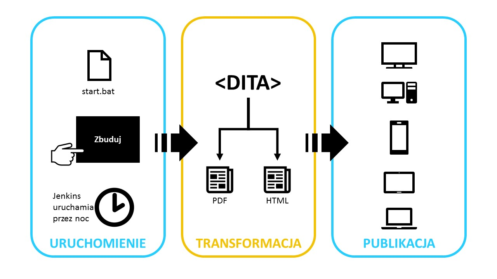

W sieci można natknąć się na całkiem sporo materiałów dotyczących DITA, jednak
znalezienie czegoś w języku polskim jest dość trudne. Chcąc zmienić ten stan
rzeczy, postanowiliśmy stworzyć dla Was niniejsze kompendium wiedzy o tym
standardzie.

<!--truncate-->

W tym artykule pytanie „Czym?” przoduje nad pozostałymi, ważkimi pytaniami
natury egzystencjalno – dokumentacyjnej. Oczywiście na pytanie „Jak?” również
staramy się odpowiedzieć. Na pytanie „O czym?” z pewnością odpowie wam wasz SME,
na pytanie „Na kiedy?”, wasz project manager zaś na pytanie „Za ile?” z radością
odpowie wasz team leader.

### Oprócz dobrej strategii...

...potrzebne będą następujące rzeczy:

- Edytor, czyli narzędzie w którym piszemy
- CCMS lub system zarządzania wersjami plików
- Linia produkcyjna, czyli coś co tworzy PDFy, HTML, helpy, i inne rzeczy, które
  będziemy publikować

Przy czym każda z nich będzie wyglądała inaczej, jeżeli chcemy po prostu nauczyć
się pisać w dicie, a inaczej jeżeli myślimy o komercyjnym wdrożeniu dla zespołu
dokumentacji.

### Edytor

Do pisania w DITA potrzebny jest edytor, i to najlepiej taki, który nie pozwoli
nam wstawić niedozwolonych tagów, czy wręcz zepsuć XMLa. Taki edytor powinien
kontrolować dostęp użytkownika do edytowania kodu źródłowego i bardzo pomagać w
ustawianiu wartości atrybutów. Dla początkujących najlepsze są dedykowane
edytory XML i DITA, takie jak [oXygen](http://oxygenxml.com/), czy
[FrameMaker](https://en.wikipedia.org/wiki/Adobe_FrameMaker). Użytkownicy
bardziej zaawansowani mogą użyć do tego celu Eclipse, ale o tym może napiszemy
innym razem.

Edytor, taki jak oXygen czy FrameMaker, to najlepsza opcja dla początkujących,
bo posiada interfejs graficzny podobny do MS Word czy innych powszechnych
edytorów. Jednocześnie edytor tego typu posiada cały szereg funkcji odpowiednich
dla zaawansowanych użytkowników, ale nie przeszkadzają one początkującym
wykonywać najprostszych zadań. Dobrym przykładem jest tutaj oXygen, który wręcz
posiada wersje Author (dla tych, którzy chcą się skupić na pisaniu), Editor (dla
bardziej zaangażowanych w ditę) i Developer (dla programistów i innych
zaawansowanych użytkowników, którzy chcą na przykład
[specjalizować ditę](https://docs.oasis-open.org/dita/v1.0/archspec/ditaspecialization.html)
lub pisać walidacje w [Schematronie](https://en.wikipedia.org/wiki/Schematron)).

Ostatnią opcją jest tworzenie i edytowanie plików DITA w notatniku lub innym
prostym narzędziu. Ta opcja wymaga bardzo dużo wprawy, więc jest zalecana tylko
w bardzo wyjątkowych okolicznościach. Co warto pamiętać o używaniu notatnika: w
czasie pisania nic nas nie ostrzeże, że nie domknęliśmy gdzieś taga i
znalezienie potem tego błędu to frustrujące zadanie.

Niektóre edytory mają opcję uruchomienia w przeglądarce, na przykład oXygen czy
XMetal. To bardzo wygodne, bo nie trzeba niczego instalować na komputerze i
można kontynuować zaczętą pracę z dowolnego urządzenia, na przykład w podróży.
Jednakże wersje działające w przeglądarkach mają zazwyczaj okrojony zakres
funkcjonalności, więc będą się sprawdzać tylko w bardzo konkretnych sytuacjach.
Ciekawą opcją jest też easyDITA, CMS i edytor w jednym, w całości dostępny w
przeglądarce. To dobra opcja dla dużych organizacji, które stać na opłacenie
dosyć drogiej subskrypcji.

### (C)CMS

W świece tech commu często operuje się pojęciem CMS mając na myśli CCMS
([Component Content Management System](https://en.wikipedia.org/wiki/Component_content_management_system)).
CCMS w tym kontekście to system do zarządzania treścią, ale nie taki jak
WordPress czy Joomla. CCMS do dity łączy w sobie zarządzanie plikami,
tłumaczeniami, workflow, publikację i często szereg innych drobnych rzeczy. Na
przykład workflow może wyglądać tak, że:

1. PM zleca konkretnemu autorowi napisanie topiku w DITA (autor dostaje
   powiadomienie email)
2. Autor tworzy topic i przesyła go do weryfikacji ekspertowi (teraz SME dostaje
   powiadomienie)
3. SME czyta topic jako stronę w przeglądarce i nanosi komentarze bezpośrednio w
   treści
4. Autor widzi komentarze w edytorze podpiętym do CCMSa, wprowadza zmiany i
   prosi SME o zatwierdzenie
5. SME zatwierdza topic
6. Topic trafia automatycznie do publikacji

Ponadto, CCMS musi nam zapewnić odpowiednią kontrolę wersji, która pasuje do
naszej strategii pisania i publikacji. Na przykład ważne jest:

- czy publikujemy często i potrzebna jest automatyczna publikacja
- czy edytujemy poprzednie wersje plików i rozwidlamy je na nowe edycje
  (jesteśmy w wersji 2.0, ale musi powstać wersja 1.1 dla konkretnego klienta)
- jak wiele treści podlega wielokrotnemu użyciu (reuse)

Na rynku istnieje pewna liczba CCMSów dedykowanych do dity, jak
[SDL Knowledge Center](http://www.sdl.com/solution/knowledge-delivery/documentation-management-dita/what-is-dita.html),
[Astoria](http://www.astoriasoftware.com/), [Vasont](https://www.vasont.com/),
czy [easyDITA](http://easydita.com/). Ceny tych systemów są dosyć wysokie,
czasem sięgają setek tysięcy dolarów rocznie. Co więcej, sam proces wyboru CCMSa
może potrwać miesiące, nie mówiąc już o zdobywaniu pieniędzy na jego zakup. Może
się okazać, że znalezienie i wyliczenie ROI (zwrotu z inwestycji) będzie
projektem samym w sobie.

Niektóre zespoły nie korzystają z CCMSów, lecz z dużo prostszych VCSów
([Version Control System](https://en.wikipedia.org/wiki/Version_control)),
takich jak [Git](https://git-scm.com/) czy
[SVN](https://subversion.apache.org/). Tego typu rozwiązania skupiają się na
zarządzaniu wersjami plików, ale nie dają nam funkcjonalności z zakresu
zarządzania workflow, publikacją, czy tłumaczeniami. To może wystarczyć, jeżeli
nie mamy skomplikowanych potrzeb projektowych.

Używanie VCSów może się bardzo dobrze sprawdzić, ale musimy przeprowadzić
dokładną symulację wprowadzania zmian w treści dokładnie tak, jak to będziemy
robić naprawdę, z włączeniem procesu tłumaczenia i publikacji. Jeżeli coś
pójdzie nie tak, to właśnie wersjonowanie, tłumaczenie i publikacja treści, a
potem robienie zmian w treści publikowanej tak, żeby nie zrobić tych zmian tam
gdzie nie trzeba, na przykład w treści reusowanej.

Problemem z użyciem VCSa może mieć na przykład następujący scenariusz:

1. Tworzymy mapę ditową, która używa 100 topików.
2. Publikacja, która powstaje z tej mapy musi trafić do klienta w Niemczech,
   tłumaczymy więc wszystkie 100 topików na niemiecki.
3. Tworzymy nową mapę ditową, która używa 20 z tych topików oraz 80 innych. Mamy
   teraz 180 topików.
4. Pojawia się klient na nowa publikację i musimy ją przetłumaczyć na język
   francuski.

W takim scenariuszu, VCS nie da nam listy plików, które podlegają tylko tej
drugiej mapie ditowej, bo dla niego są to tylko pliki w folderach. Możemy teraz
przetłumaczyć wszystkie 180 topików na francuski, co kosztuje więcej, albo
napisać jakiś skrypt, który wyodrębni te właściwe 100 topików. Przy czym im
więcej czasu spędzimy w projekcie, tym więcej takich skomplikowanych scenariuszy
odkryjemy. Dlatego warto przeprowadzić projekt pilotażowy z użyciem VCSów zanim
postanowimy, że to w jednym z nich będziemy utrzymywać naszą treść.

Oczywiście dużo łatwiej jest używać Gita czy SVNa jeżeli nie planuje się
lokalizacji ani żadnych innych skomplikowanych scenariuszy. Ale bardzo często
jest tak, że **teraz** nie planuje się skomplikowanych scenariuszy, a w
przyszłości okaże się, że musimy je wdrożyć. Dlatego wybierając system
zarządzania plikami lub CCMSa, warto pomyśleć o tych mało prawdopodobnych
scenariuszach na przyszłość.

Z kolei pisanie własnego CCMSa nie jest zadaniem trywialnym i będzie wymagało
zespołu programistów żeby go stworzyć i utrzymać. Jeżeli ktoś Wam mówi, że
napisze CCMSa  po godzinach, albo, że zajmie mu to miesiąc i będzie gotowe, nie
wierzcie mu. Ma dobre intencje, ale to co widzi jako listę wymagań to tylko
wierzchołek góry lodowej.

Żeby po prostu zacząć pisać w DITA dla potrzeb nauki, VCS w zupełności
wystarczy. Jeżeli jednak myśli się o tym, żeby cały zespół pisał w DITA,
najlepiej poradzić się wyspecjalizowanego konsultanta.

### Linia produkcyjna

Linia produkcyjna zamieni nasze źródłowe pliki DITA w wynikowe pliki PDF, HTML,
czy jeszcze jakieś inne. Zwykle składa się ona z silnika **konwertującego** XML
do postaci wynikowej, oraz dwóch mechanizmów: jednego, który **uruchomi**
transformację, i drugiego, który **opublikuje** pliki w docelowej lokalizacji.
Pierwszy mechanizm może być plikiem bat, na który musimy kliknąć, guzikiem na
stronie, albo skryptem, który uruchamia się automatycznie w określonym czasie
(dwie ostanie opcje pozwoli nam spełnić na przykład
[Jenkins, o którym już pisaliśmy](http://techwriter.pl/jenkins-opis-narzedzia/)).
Drugi mechanizm przenosi pliki wynikowe na serwer FTP, serwer webowy, wysyła je
mailem, itp.

\[caption id="attachment_5327" align="aligncenter"
width="1280"\]
Schemat publikacji DITA\[/caption\]

Najpopularniejszym narzędziem do publikacji dity jest DITA Open Toolkit. Nie ma
on dedykowanego interfejsu, choć takie istnieją, np. w CMSach, albo
[napisane przez pomocnych programistów](https://sourceforge.net/projects/ditaotgui/).
Musimy sobie zadać pytanie czy możemy użyć jednego z nich, czy potrzebujemy
czegoś bardziej zautomatyzowanego i kto nam to napisze. Poza tym, oprócz
darmowego DITA OT możemy potrzebować software'u do transformacji grafik
(istnieją darmowe opcje, jak
[ImageMagick](https://www.imagemagick.org/script/index.php)) oraz osadzania
czcionek w PDFach (istnieją darmowe opcje, np.
[FOP](https://xmlgraphics.apache.org/fop/) i
[XEP](http://www.renderx.com/tools/xep.html), oraz płatny
[AntennaHouse Formatter](https://www.antennahouse.com/antenna1/formatter/)). Czy
mamy do dyspozycji serwery, na których będzie możliwa produkcja, czy chcemy
kopiować środowisko na komputery naszych autorów? Potrzebujemy tutaj strategii.

Nie wolno też zapomnieć o warunkach licencji oprogramowania, którego używamy.
Musimy dokładnie sprawdzić czy można go używać w celach komercyjnych, jak wiele
osób może z niego korzystać, oraz czy dozwolone jest używanie go w ramach
procesów automatycznych.

Do tego dochodzi temat stworzenia arkuszy stylów (stylesheets) dla DITA OT,
które wygenerują odpowiedni dla naszych potrzeb PDF, HTML, czy cokolwiek innego.
W niektórych zespołach potrzebna jest osobna rola dla osoby, która utrzymuje
całą linię produkcyjną, w tym arkusze stylów. Taka osoba powinna znać XSL i
Javę, a także sprawnie operować plikami ANT, które służą do automatyzacji
budowania.

Dla początkujących, którzy dopiero się uczą, najlepiej skorzystać z silnika
budowania wmontowanego w oXygen. Pozwala on na tworzenie wszelkiej maści PDFów,
HTMLi, itp., w intuicyjnym interfejsie. Dodatkowym bonusem jest tutaj bardzo
ładnie wyglądający i sprawnie działający format webhelp, który skaluje się do
urządzeń mobilnych.

## Co dalej?

Nie ma szybkiej recepty na to by zacząć pisać w dicie jako zespół. Tak jak
napisaliśmy w tym artykule, jest bardzo wiele czynników, które trzeba wziąć pod
uwagę. Wdrożenie sposobu pisania w dicie dla całego zespołu jest tak naprawdę
projektem samo w sobie.

Co innego jeżeli, chcemy po prostu sami zacząć pisać w dicie, na przykład, żeby
się nauczyć. Najlepszą opcją w momencie pisania tego artykułu (początek 2017
roku) jest oXygen, edytor XMLa, który ma w sobie narzędzia do zarządzania
plikami (jak CCMS), edytowania i publikacji. Aplikacja nie należy do
najtańszych, ale wersja trial powinna wystarczyć, żeby przećwiczyć podstawy.

(Ten artykuł nie był w żaden sposób sponsorowany przez twórców edytora oXygen,
ani żadnego innego narzędzia. Rekomendacje narzędzi opierają się na naszych
opiniach i preferencjach.)

- [Wszystko o DITA — Wprowadzenie (1)](http://techwriter.pl/wszystko-o-dita-wprowadzenie-1/)
- [Wszystko o DTA — Podstawy (2)](http://techwriter.pl/wszystko-o-dita-podstawy/)
- [Wszystko o DITA — Strategia (3)](http://techwriter.pl/wszystko-o-dita-strategia/)
- Wszystko o DITA — Narzędzia (4)
- [Wszystko o DITA — Struktura topików (5)](http://techwriter.pl/wszystko-o-dita-struktura-topikow-5/)
