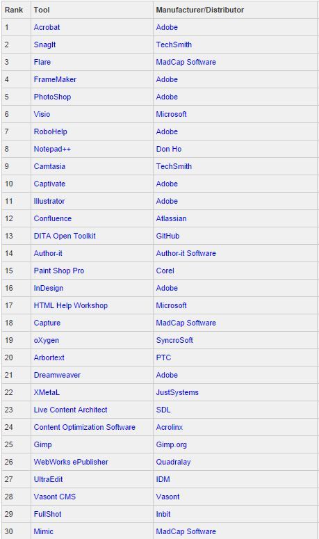

Ilustracja jest tylko po to, żebyście mogli sobie chwilkę pomarzyć...😊. A już
serio - mamy dla Was ranking najczęściej używanych w naszym fachu narzędzi.
Sprawdź czego warto się nauczyć.

<!--truncate-->

Na stronie [ditawriter.com](http://www.ditawriter.com/) natknęliśmy się na
[następujące zestawienie](http://www.ditawriter.com/which-tech-writing-tools-are-the-most-used/).

Poniżej wklejamy tylko pierwszą trzydziestkę - warto zajrzeć na stronę i
przejrzeć całą listę oraz zrozumieć w jaki sposób została stworzona.

Wnioski wyciągnijcie sami.
