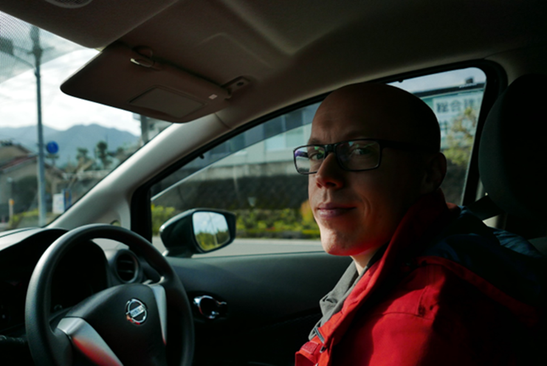

Our guest today is [Mateusz Barszcz](https://www.linkedin.com/in/mattbarszcz/),
a Chief Software Technical Writer at
[Hitachi Energy](https://www.linkedin.com/company/hitachienergy/) in Krakow,
Poland. Let's hear his story, this time in English. For the Polish version,
[click here](https://techwriter.pl/kilka-pytan-do-czesc-31). In this interview,
you will learn about his extensive experience in technical writing and the
respects in which this domain resembles competitive sports. Mateusz shares his
invaluable observations and thoughts, which will be helpful for those
considering a step toward technical communication as well as anyone interested
in it.

<!--truncate-->

## Introduction

### Hi, thank you for agreeing to this interview. To start, could you tell us something about yourself?

My name is Mateusz Barszcz, and I work at Hitachi Energy, where I create
technical documentation. I have been a member of the Technical Writers team
since late 2022, when I joined as a Senior Technical Writer. Initially, I worked
on a smaller project called
[Network Manager Wide Area Monitoring System (WAMS)](https://www.hitachienergy.com/products-and-solutions/grid-and-generation-management-network-manager/network-manager-wide-area-monitoring-system-wams),
a backend solution for monitoring the state of the power grid.

Currently, I’m involved in a much larger project with five development teams
engaged in the process, serving as the lead technical writer. In that role, I
create the documentation plan and ensure we have all the essential information
needed to proceed with writing. As a writer, I describe user documentation for
our internal teams and the end customers receiving the solution. These documents
include installation guides, functional descriptions, and release notes. I also
support the creation of engineering documentation that lives alongside the code,
such as administration guides or readme files.

### How would you summarize the essence of the role of a technical writer or technical communication specialist?

For me, it is mainly the role of a technical translator. It is a person who
gathers information from an engineer or engineers. The engineer’s statements can
be emotional, full of jargon, or incomplete. The technical writer translates
this information into a universally understandable language, helping to achieve
the user’s goals. The essential elements of technical writing are understanding
the technical context, translating it into comprehensible language, and
logically arranging the content.

## Career before Hitachi Energy

### How long have you worked in a technical writer role?

Recently, while browsing LinkedIn, I was reminded that I started my technical
career 15 years ago, during which I took on various roles. My tasks have always
been related to technical content that included visuals. I have been strictly
involved in technical writing since 2010. I have created e-learning materials
for over three years. As a contractor at Google, for six years I had the
opportunity to work in a role that combined both these areas.

### How did you become a technical writer?

It’s an interesting story because, after graduation, I had part-time jobs and
was wondering what to do next. In 2010, I found a contractor job posting for a
so-called junior one-year assignment at Motorola Solutions. They were looking
for someone without experience, and as I read the job description, which I
accidentally came across, I researched what a technical writer does, and it
intrigued me a lot. I have a technical education; I have always liked playing
with technology. What prompted me to become a technical writer was the fact that
I’m bilingual. I’m a native speaker of English and Polish and have technical
skills, so these two aspects helped me fit into the role. I applied to Motorola
Solutions, completed the recruitment process, and got the role. That was my
beginning.

### So, by reading this offer, you were building awareness of who a technical writer is.

I was building that awareness. I was one of those people who had instructions in
their hands many times but never thought about who wrote them and who was
responsible for creating them. It was only then that this world began to open up
to me. I started discovering it, as initially I was unaware of the people and
teams responsible for this documentation. I also did not know at all that
documentation was a large area requiring dedicated roles and expertise. In the
end, it drew me in.

### What projects have you been involved in, and what experiences have you gained?

What I like about my career is that it has been dynamic from the very beginning.
My responsibilities frequently expanded or evolved, so I couldn’t complain about
stagnation. I started with Motorola Solution products related to radio
infrastructure. Several technical writers were responsible for the system's
features. After two years, I started describing radio devices mounted in police
cars, which allowed me to learn another aspect of radio communication.

 **A police radio
device in a police car similar to the one Mateusz dealt with.**
[Link to the original photo](https://www.flickr.com/photos/peigov/31808990565/in/photostream/).
Author:
[Government of Prince Edward Island](https://www.flickr.com/photos/peigov/).

Then, I wrote training materials for e-learning, which involved managing content
in a different format. I created materials for self-paced learning and
instructor-led training about the radio infrastructure I learned initially. I
was managing well-known content in a different format. As an instructional
designer, I designed trainings for enablement and business topics. The scope of
content I operated on changed dynamically.

Then, I accepted an offer to work as a contractor at Google. I joined a small
team writing technical content and creating online training for internal project
management products. It was a new and completely unknown area for me. I needed
to learn many tools designed for employees. It was a dynamic role which I spent
over six years in. As the product portfolio developed, my responsibilities
expanded. Ultimately, the contracted project ended, and I had to look for
something new.

## Career at Hitachi Energy

### Let’s return to your current role at Hitachi Energy. How is your work organized?

Teams work based on the
[Scrum](<https://en.wikipedia.org/wiki/Scrum_(software_development)>)
methodology. The products I work on are new, so we create documents and
processes related to their creation from scratch. Since I joined the project, I
started working on large documents. My daily work does not strictly fit into the
team’s
[sprints](<https://en.wikipedia.org/wiki/Scrum_(software_development)#Sprint>).
I sometimes get tasks to supplement or review engineering documentation.
Although my tasks are loosely related to sprints, I’m bound by deadlines for
delivering the product with documentation. I attend project meetings to achieve
that, so I frequently contact the team.

### What type of documents do you create?

I create highly technical installation guides and functional descriptions. These
documents often include instructions for the end user who wants to know how to
set up the backend of the feature or product. Another aspect that I cover is a
description of product operations, such as calculations of current changes,
phase shifts of voltages, and deviations in readings. These topics are so
complex that I feel like I’m writing a doctoral thesis. I also create smaller
documents, such as release notes.

### What tools do you use, and what do you think about them?

I work with various tools depending on the needs. Initially, I used Word –
mainly because it allowed collaboration on the document with the engineers.
Still, I’m not a fan of this tool due to problems with style templates,
formatting, and sometimes loss of content. I try to use it as little as
possible.

Currently, when I have gathered the content and want to publish the material, I
work in [Markdown](https://en.wikipedia.org/wiki/Markdown) and
[MadCap Flare](https://en.wikipedia.org/wiki/MadCap_Software#MadCap_Flare).
MadCap Flare is excellent, although learning it takes some time and effort.
However, once you master the basics, prepare style templates, and set up the
work environment, the tool becomes very user-friendly. Nevertheless, I enjoy
working in Markdown the most. I can synchronize the content with the repository
and do anything I want with it. I can publish a website or import it into MadCap
Flare. I have developed an import process that I’m satisfied with due to its
flexibility. Markdown’s advantages are its simplicity and the content being
created in an environment familiar to developers.

### How do you gather the information needed to create documentation?

I ask people and remind them that I need information for the documents.
Engineers are willing to contribute to the documentation. They are often
necessary links for creating documentation because I do not understand certain
aspects. As a technical writer, I constantly learn about technology and
products, and eventually, I become an expert. This reduces the amount of
involvement needed from engineers as the project advances.

However, in the beginning, new technologies used in the product require more
reliance on what someone tells me. Initially, my task is to piece it together
into sentences and achieve the appropriate order of information to get the
message across. Sometimes, I find content in repositories that I later include
in my documentation. Such discoveries give me great satisfaction.

### What is your superpower as a technical writer?

I write witty e-mails that are acceptable in a corporate environment. This skill
comes in handy both in technical writing and daily communication.

### What are the biggest challenges you face in your work?

Sometimes, you must convince someone that the path you propose is correct and
make it clear to someone that they might not be right themselves. It is not
pleasant to impose your opinion on someone. Still, there are specific standards
to maintain, and it is necessary. Occasionally, you also have to remind
engineers about delivering input. Everyone is busy, and in such cases,
one-on-one meetings work well.

### What do you like most about your job?

I like our Technical Writing team. In the beginning, there were only a few of
us, and now the team is growing rapidly and is very diverse. I will compliment
our team leader, Piotrek Sroka. I really like his approach to team management.
Another thing is the technology in which the project is created and the openness
of the development team to new techniques. This team proposes interesting
solutions that can be built on Markdown.

## Interests

### What are your interests outside of documentation and technology?

My passions are traveling, reading (sci-fi especially), automotive, and cooking.
Recipes also relate to instructions.

### Speaking of cooking, when you buy new household appliances, such as a food processor, do you go with the flow and spontaneously start using it, or do you read the entire manual from cover to cover?

I go with the flow because I prefer to try something out. My memory retention is
better if I use something practically or possibly break it 😉. When needed, I reach
for the manual, and then I read it from cover to cover.

### What are your interests related to technology and science?

I have always been fascinated by science, astronomy, and engineering topics,
such as how something is constructed, types of car engines, and the like. I like
reading articles about quantum physics and other scientific issues in the
[New Scientist](https://www.newscientist.com/). It relaxes me and keeps my mind
curious about the world.

## Well-being

### How do you maintain peace of mind and a broad smile as a technical writer? How do you achieve zen?

Sometimes, switching to another task helps me. If I feel stuck, I try to focus
on another part of the task that gives me pleasure or allows for quick success.
It is also important not to try to do 100 percent of everything that can be
done. After releasing the material, there may be something to improve. It is
better to release something 80-90 percent ready and make corrections later.

### Everyone has better and worse days; do you have any insights on what can be done to feel better at work? Or are there things to avoid?

When I face a task that overwhelms me, sometimes the fact that there are tasks
to choose from helps me. Writer’s block is a real thing. Sometimes, I like to
set aside a problematic task and focus on something else that gives me joy, such
as working on graphics or the content import process. Playing with techniques or
things that are not my primary task relieves the mind. For a while, I do not
feel the pressure of time, which calms me down, and after a moment I continue
with the previously started thread.

### One realizes that documentation is iterative.

A principle says the last 10 percent of perfecting the material can take 90
percent of the time. It is about refining details. Where 10-20 percent of your
efforts generate 80 percent of the gains, the rest is less important. Focusing
on the key issues is crucial. _[It’s about the
[Pareto principle](https://en.wikipedia.org/wiki/Pareto_principle)]_. Sometimes,
it is good to leave some room for later improvements. The rules that apply in
technical writing can be observed even in sports. The best athletes fight for
tenths and hundredths of a second, and the effort they have to make to achieve
them takes years of hard work.

### Yes, it is years of hard work, but every athlete does not exert maximum effort daily. They spread it out so that they also train at moderate intensity and rest to do something big at the very end. Sometimes, we only think about moments of maximum effort, but to get there, they also had to train at low intensity and rest.

It is worth thinking long-term. It is not easy, and it may be against our nature
because we focus on what is happening now, but seeing the longer perspective can
help.

## Advice for beginners

### What advice can you give people who want to start their adventure with writing documentation?

I recommend familiarizing yourself with some standards and style guides, working
on templates, tackling the description of a technical topic, and sharing this
work. You need a portfolio to start the conversation during UX writing and UX
design recruitment. In technical writing, I do not encounter this very often.
Usually, candidates do not have a sample showing how someone thinks and
approaches the documentation. I recommend trying your hand and posting samples
on the Internet (for example, on [GitHub](https://github.com/) or your website)
to showcase your knowledge of technology, share this work, and take pride in it.

Also, do not worry about not being an English major. I know many people in the
industry with various backgrounds, such as biologists or theater studies’
graduates. It is worth seeing how you feel about it if it interests you. The
work of a technical writer is primarily based on contact with people, so it is
also worth getting involved in some technical writing or engineering
environments where you can try your hand at communication and extracting
information that is used later. It is worth, for example, being interested in
events like hackathons or various meetups, where you can network with new people
and get familiar with technical language.

## The last question

### Do you have room for professional development at Hitachi Energy?

Definitely yes! This company motivates employees to develop and take on new
challenges. I take part in many training sessions, including technical and soft
skills. We have the freedom to try new solutions and take on more tasks. Such
involvement does not go unnoticed; I’m probably a good example. Starting in
January, I was promoted from Senior Technical Writer to Chief Software Technical
Writer (equivalent to Principal Technical Writer).

**Congratulations on the well-deserved promotion! And thank you for sharing your
thoughts.**
