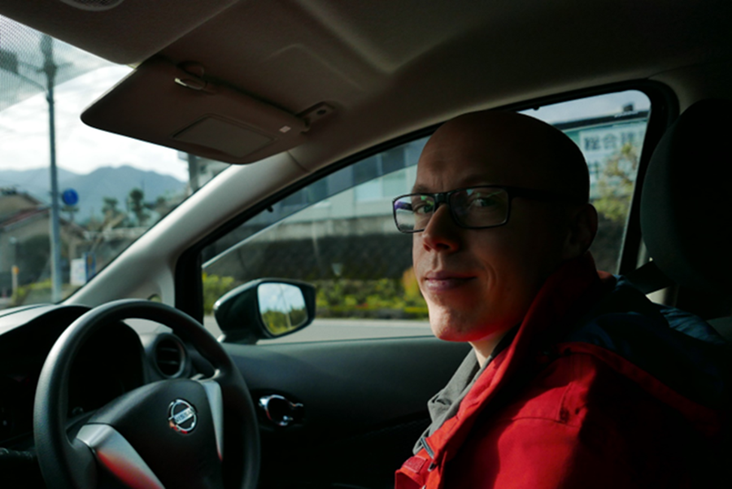

Naszym dzisiejszym gościem jest Mateusz Barszcz, główny specjalista ds.
dokumentacji technicznej oprogramowania (Chief Software Technical Writer) w
Hitachi Energy w Polsce. 

Z wywiadu dowiecie się o jego bogatym doświadczeniu oraz o tym, w czym technical
writing (tworzenie dokumentacji technicznej) przypomina sport wyczynowy. Mateusz
dzieli się w nim również swoimi obserwacjami i przemyśleniami, które mogą być
pomocne dla osób, które rozważają zrobienie kroku w kierunku komunikacji
technicznej, jak i ciekawe dla tych, którym już jest ona bliska.

<!--truncate-->

## Przedstawienie

### Cześć Mateuszu, dziękuję, że zgodziłeś się na ten wywiad. Na początek, opowiedz nam proszę coś o sobie.

Nazywam się [Mateusz Barszcz](https://www.linkedin.com/in/mattbarszcz/) i
pracuję w firmie
[Hitachi Energy](https://www.linkedin.com/company/hitachienergy/), gdzie zajmuję
się tworzeniem dokumentacji technicznej. W październiku 2022 roku dołączyłem do
zespołu dokumentacji jako Senior Technical Writer (starszy specjalista ds.
dokumentacji). Początkowo pracowałem przy mniejszym projekcie
[Network Manager Wide Area Monitoring System (WAMS)](https://www.hitachienergy.com/products-and-solutions/grid-and-generation-management-network-manager/network-manager-wide-area-monitoring-system-wams),
który jest backendowym rozwiązaniem do monitorowania stanu sieci energetycznej.
Obecnie jestem zaangażowany w znacznie większy projekt z udziałem pięciu
zespołów deweloperskich, gdzie pełnię rolę projektową lead technical writera
(koordynatora dokumentacji technicznej). Odpowiadam za tworzenie planu
dokumentacyjnego i dbam o to, abyśmy mieli niezbędne do przygotowywania opisów
informacje. Jako pisarz przygotowuję dokumentację dla użytkownika, który jest
zarówno wewnętrznym klientem firmy, jak i klientem docelowym otrzymującym
finalne rozwiązanie. Są to dokumenty typu: instrukcja instalacyjna (installation
guide), opis funkcji (functional description) i noty wydania (release notes).
Wspieram też tworzenie dokumentacji inżynieryjnej, która żyje razem z kodem,
takiej jak instrukcja dla administratorów systemowych (administration guide)
albo plik tekstowy z opisem obsługi programu (readme).

### Jak streściłbyś istotę roli technical writera lub specjalisty ds. komunikacji technicznej?

Dla mnie jest to głównie rola technicznego tłumacza. Jest to osoba, która zbiera
informacje od inżynierów – a ich wypowiedzi mogą być pełne emocji, zdawkowe albo
pełne żargonu – i tłumaczy je na ogólnie zrozumiały i czytelny język, który
można łatwo przyswoić i wykorzystać do własnych potrzeb.

Najważniejszymi elementami pisania technicznego są: zrozumienie kontekstu
technicznego, przetłumaczenie wyjściowej wersji na przystępny język oraz
logiczne ułożenie treści.

## Kariera przed dołączeniem do zespołu Hitachi Energy

### Jak długo trwa twoja kariera techniczna?

Przeglądając dziś LinkedIn, pojawiło mi się wspomnienie sprzed 15 lat, kiedy
zacząłem karierę techniczną. Jest ona przeplatana różnymi rolami, ale zadania, z
którymi się mierzyłem, zawsze wiązały się z pisanymi treściami technicznymi oraz
graficznym przekazem informacji.

Stricte technical writingiem zajmuję się od 2010 roku; e-learningiem zajmowałem
się przez ponad trzy lata, a pracując przez sześć lat w Google miałem okazję
łączyć oba te nurty.

### W jaki sposób zostałeś technical writerem?

To jest ciekawa historia, bo po studiach, pracując dorywczo, zastanawiałem się,
co robić dalej. W 2010 roku znalazłem ofertę pracy dla kontraktora na roczne
zadanie do Motorola Solutions. Szukali tzw. juniora, czyli kogoś bez
doświadczenia, a mnie w miarę czytania tego ogłoszenia bardzo zainteresowało,
czym zajmuje się technical writer. Mam wykształcenie techniczne, zawsze lubiłem
bawić się technologiami. Dodatkowo moja dwujęzyczność – jestem _native
speaker'em_ angielskiego i polskiego. Te wszystkie bliskie mi aspekty wtedy
zgrały się i złożyłem aplikację. Przeszedłem rekrutację i dostałem tę pracę.
Taki więc był mój początek w tym obszarze.

### Czyli czytając tę ofertę budowałeś swoją świadomość tego, kim jest technical writer?

Tak. Podobnie jak wiele osób i ja korzystałem z instrukcji, ale nigdy nie
myślałem o tym, kto i w jaki sposób właściwie je tworzy, kto jest za nie
odpowiedzialny. Wcześniej nie miałem świadomości, że są ludzie i zespoły
odpowiedzialne za tego typu dokumentację, że jest to duży obszar wymagający
specjalnych ról i eksperckiej wiedzy. Spodobało mi się to i w efekcie mocno mnie
pochłonęło.

### W jakich projektach brałeś udział i jakie doświadczenia w nich zdobyłeś?

W mojej karierze podoba mi się to, że od samego początku było dynamicznie. Co
pół roku coś się zmieniało – nie mogłem narzekać na stagnację. Zacząłem od
produktów Motoroli Solutions związanych z infrastrukturą radiową. W zespole było
kilkanaścioro osób odpowiedzialnych za dokumentację techniczną i każde z nas
trzymało pieczę nad daną funkcją systemu. Po dwóch latach zacząłem opisywać
urządzenia radiowe zamontowane w radiowozach policyjnych, dzięki czemu poznałem
kolejny aspekt komunikacji radiowej.

 **Urządzenie
radiokomunikacyjne w radiowozie policyjnym, podobne do tego, którym zajmował się
Mateusz**.
[Link do oryginału](https://www.flickr.com/photos/peigov/31808990565/in/photostream/).
Autor zdjęcia:
[Government of Prince Edward Island](https://www.flickr.com/photos/peigov/).

Następnie pisałem materiały szkoleniowe dla e-learningu, co było kolejnym
aspektem zarządzania treścią. Opracowywałem materiały szkoleniowe dla kursów
odbywanych we własnym tempie oraz tych prowadzonych przez instruktorów pod
infrastrukturę radiową, którą poznałem na początku. Było to operowanie znanymi
mi treściami w innym formacie. Jako projektant szkoleń tworzyłem treningi z
takich dziedzin jak wspieranie sprzedaży i tematy biznesowe. Dynamicznie
zmieniał się zakres treści, którymi operowałem.

Po jakimś czasie dołączyłem do Google, do niewielkiego zespołu, w którym pisałem
treści techniczne i tworzyłem szkolenia online dotyczące wewnętrznych produktów
do zarządzania projektami. Był to nowy i zupełnie nieznany mi wcześniej obszar.
Musiałem nauczyć się wielu narzędzi stworzonych na potrzeby pracowników. Była to
rozwojowa rola. W miarę poszerzania portfolio produktów, zakres mojej
odpowiedzialności również się poszerzał.

## Kariera w Hitachi Energy

### Wróćmy teraz do Twojej obecnej roli w Hitachi Energy, o której wspomniałeś na wstępie. W jaki sposób zorganizowana jest Twoja praca?

Zespoły pracują w oparciu o metodologię
[Scrum](https://pl.wikipedia.org/wiki/Scrum). Produkty, nad którymi pracujemy,
są nowe, a więc dokumenty i niekiedy procesy związane z ich powstawaniem
tworzymy od zera. Odkąd dołączyłem do firmy pracuję nad dużymi dokumentami. Moja
codzienna praca nie wpisuje się w konwencjonalne scrumowe
[sprinty](https://pl.wikipedia.org/wiki/Scrum#cite_note-:1-1) zespołu, chociaż
czasami trafiają do mnie zadania, w ramach których jestem proszony o
uzupełnienie dokumentacji lub zrecenzowanie istniejącej dokumentacji
inżynieryjnej. Choć jak wspomniałem, moje zadania mają luźny związek ze
sprintami, to wiążą mnie terminy, w których produkt musi być dostarczony razem z
dokumentacją. Uczęszczam na spotkania projektowe, więc jestem w stałym kontakcie
z zespołem.

### Jakiego typu dokumenty tworzysz?

Obecnie najczęściej tworzę installation guides i functional descriptions, które
są mocno technicznymi dokumentami, a niektóre ich fragmenty są instruktażowe.
Czasami czuję się, jakbym pisał pracę doktorską lub coś podobnie złożonego. Są
to dokumenty dla użytkownika końcowego, z treścią związaną z postawieniem
backendu funkcjonalności czy produktu oraz opisem jego działania, np.:
kalkulacje zmian w natężeniu prądu, przesunięcia fazowe napięć i jakie są
odchylenia w odczytach. Tworzę też mniejsze dokumenty, takie jak release notes.

### Z jakich narzędzi korzystasz i jakie masz wrażenia z ich używania?

Pracuję z różnymi narzędziami, w zależności od potrzeb i specyfiki projektu.
Początkowo korzystałem z MS Word, głównie dlatego, że umożliwiało to wielotorową
współpracę nad dokumentem z inżynierami. Nie jestem fanem tego narzędzia z
powodu problemów z szablonami stylów, formatowaniem i utratą treści. Staram się
z niego korzystać jak najmniej.

Obecnie pracuję w [Markdown](https://pl.wikipedia.org/wiki/Markdown) i
[MadCap Flare](https://en.wikipedia.org/wiki/MadCap_Software#MadCap_Flare).

MadCap Flare jest całkiem użyteczny, choć nauczenie się go wymaga trochę czasu i
wysiłku. Kiedy już opanuje się podstawy, przygotuje szablony stylów i środowisko
do pracy, to narzędzie okazuje się bardzo przyjazne.

Mimo wszystko, najprzyjemniej pracuje mi się w Markdown. Mogę synchronizować
treść do repozytorium i z tą treścią mogę zrobić multum rzeczy, m.in.
opublikować stronę internetową albo zaimportować treść do MadCap Flare.
Opracowałem proces importowania, z którego jestem zadowolony z racji jego
elastyczności.

Zalety Markdownu to jego prostota oraz fakt, że treści powstają w środowisku
znanym deweloperom.

### W jaki sposób zdobywasz informacje potrzebne do tworzenia dokumentacji?

Opiera się to na współpracy z inżynierami, którzy są skorzy włączyć się w proces
tworzenia dokumentacji. Są często koniecznym ogniwem, aby powstała, bo ja sam
nie znam bądź nie rozumiem pewnych szczegółów czy aspektów. Jako technical
writer natomiast stale uczę się technologii oraz produktów samych w sobie,
stając się stopniowo ekspertem w danej dziedzinie. Zmniejsza to ilość
zaangażowania potrzebnego po stronie inżynierów i zwiększa moją efektywność.
Natomiast zastosowanie całkowicie nowych technologii w produkcie wymaga
większego opierania się na tym, co jest mi przekazane. Początkowo moim zadaniem
jest więc posklejanie otrzymanych informacji w zdania i ułożenie ich w
odpowiedniej kolejności tak, żeby przekaz można było łatwo i jednoznacznie
odczytać.

Czasami natrafiam na treści w repozytoriach, które później uwzględniam w mojej
dokumentacji. Takie znaleziska sprawiają mi sporą satysfakcję.

### Jaką masz super moc jako technical writer?

Podobno piszę błyskotliwe (_witty_) wiadomości e-mail, które są równocześnie
czytelne w środowisku korporacyjnym. Myślę, że to umiejętność przydająca się
zarówno w technical writingu, jak i w codziennej komunikacji.

### Jakie są największe wyzwania, które napotykasz w swojej pracy?

Zdarza mi się przekonywać kogoś, że proponowana przeze mnie ścieżka jest
właściwa i trzeba dać do zrozumienia tej osobie, że ona sama nie ma racji.
Narzucanie komuś swojego zdania nie jest przyjemne, ale potrzebujemy zachować
pewne niezbędne standardy. Sporadycznie należy też przypominać inżynierom o
przekazywaniu ich wkładu. Wiadomo, że każdy jest zajęty, więc w takich
przypadkach dla mnie najlepiej sprawdzają się spotkania 1 na 1. Są
najefektywniejsze.

### Co najbardziej lubisz w swojej pracy?

Najbardziej lubię nasz wspólny zespół tech writerski. Na początku była nas
garstka, a teraz zespół rośnie jak na drożdżach i jest bardzo różnorodny.
Posłodzę również trochę naszemu Team Leaderowi, Piotrkowi Sroce, bo podoba mi
się jego podejście do zarządzania zespołem.

Kolejna rzecz to technologia, w której projekt jest stworzony, oraz otwartość
ludzi z zespołu deweloperskiego na nowe podejścia. Zespół ten proponuje ciekawe
rozwiązania, które można nabudować na Markdown.

## Zainteresowania

### Czym się interesujesz poza dokumentacją i technologią?

Moimi pasjami są podróże, czytanie (szczególnie fantastyki naukowej),
motoryzacja i gotowanie. To ostatnie też nawiązuje do instrukcji!

### _A propos_ gotowania: czy kiedy kupujesz nowy sprzęt AGD, na przykład robota kuchennego, idziesz na żywioł i spontanicznie zaczynasz go używać, czy też czytasz całą instrukcję od deski do deski?

Na pewno idę na żywioł, bo jestem z natury osobą, która woli coś wypróbować.
Retencja pamięci jest lepsza jeżeli czegoś praktycznie użyję, ewentualnie –
zepsuję 😉. Ale kiedy zachodzi taka potrzeba, sięgam po instrukcję – i wtedy
czytam ją od deski do deski.

### Jakie są Twoje zainteresowania związane z technologią i naukami ścisłymi?

Zawsze fascynowała mnie nauka, tematy astronomiczne i inżynierskie, to jak coś
jest skonstruowane, rodzaje silników samochodowych i tym podobne. Lubię czytać
ciekawe artykuły o fizyce kwantowej i innych naukowych tematach, zwłaszcza w
[New Scientist](https://www.newscientist.com/). To mnie odpręża i sprawia, że
mój umysł pozostaje ciekawy świata.

## Dobrostan

### Jak zachować spokój ducha i szeroki uśmiech jako technical writer? Jak osiągnąć zen?

Czasami pomaga mi w tym zmiana zadania. Jeżeli czuję zastój, staram się skupić
na innej jego części, takiej, która sprawia mi przyjemność lub pozwoli na szybki
i namacalny sukces. Ważne jest też, żeby nie zawsze starać się zrobić na raz
100% wszystkiego, co jest do zrobienia. Po wypuszczeniu materiału może być coś
do poprawienia – i to jest ok. Lepiej opracować coś, co jest w 80–90% gotowe i
wprowadzić poprawki później niż uparcie walczyć o perfekcję.

### Każdy ma lepsze i gorsze dni. Czy masz jakieś spostrzeżenia na temat tego, co można zrobić, aby czuć się lepiej w pracy? A może są rzeczy, których warto unikać?

Gdy mierzę się z zadaniem, które mnie przytłacza, pomaga mi czasami fakt, że są
zawsze inne zadania do wyboru. Zastój pisarski to realna rzecz. Czasem lubię na
chwilę takie uporczywie trudne zadanie odstawić na bok i zająć się czymś co
sprawia mi przyjemność, jak na przykład praca nad grafikami lub procesem
importowania treści. Bawienie się technikami lub rzeczami, które nie są w danej
chwili obowiązkiem, odciąża umysł. Choć przez chwilę nie czuję presji czasu, co
uspokaja mnie i po jakimś czasie kontynuuję wcześniej rozpoczęty wątek z nową
energią.

### To, co mówisz uzmysławia, że dokumentacja jest iteracyjna.

Jest jakieś prawo, które mówi, że ostatnie 10% doskonalenia materiału może zająć
90% czasu. To jest tzw. dopieszczanie szczegółów. Tam, gdzie 10–20% twoich
wysiłków generuje 80% zysku, reszta jest mniej ważna. Skupienie się na
kluczowych sprawach jest istotne. _[Chodzi o
[zasadę Pareta](https://pl.wikipedia.org/wiki/Zasada_Pareta)]_. Czasem dobrze
jest zostawić coś do późniejszego ulepszenia. Warto działać perspektywicznie w
ramach zespołu.

Myślę, że reguły obowiązujące w technical writingu można wytropić nawet w
sporcie. Najlepsi sportowcy walczą o dziesiąte i setne sekundy, a wysiłek, który
wkładają w to by je zdobyć, to lata ciężkiej pracy.

### Tak, są to lata ciężkiej pracy, ale nie każdego dnia każdy sportowiec dokonuje maksymalnego wysiłku. Rozkładają to tak, że ćwiczą też na średnim poziomie intensywności i odpoczywają, by zrobić coś dużego na samym końcu. Czasami myślimy tylko o momentach maksymalnego wysiłku, ale by do tego doszło, trzeba też trenować na niskiej intensywności i realnie odpoczywać.

Warto myśleć długoterminowo. Nie jest to łatwe i może być to nawet wbrew naszej
naturze, bo skupiamy się na tym, co się dzieje w danej chwili – ale widzenie
dłuższej perspektywy pomaga.

## Wskazówki dla początkujących

### Co możesz poradzić osobom, które chciałyby zacząć przygodę z pisaniem dokumentacji?

Poleciłbym zaznajomienie się ze standardami, style guidami (podręcznikami
stylu), pracą na szablonach, zmierzenie się z opisaniem jakiegoś tematu
technicznego i wtedy udostępnienie rezultatów tej pracy.

Przy rekrutacjach w dziedzinach
[UX writingu](https://semcore.pl/ux-writing-poradnik/#Co_to_jest_i_na_czym_polega_UX_writing)
i
[UX designu](https://coderslab.pl/pl/blog/kim-jest-ux-designer-i-jak-wyglada-jego-praca)
zauważyłem, że trzeba mieć portfolio, żeby w ogóle zacząć rozmowę. W technical
writingu nie spotykam się z tym zbyt często, a zazwyczaj brakuje takiej próbki
pokazującej jak ktoś myśli, jaki ma styl pracy i jak podchodzi do opracowywania
dokumentacji.

Polecam spróbować własnych sił i umieścić próbki w Internecie (np. na
[GitHubie](https://github.com/) albo własnej stronie internetowej), żeby pokazać
swoją znajomość technologii, udostępnić tę pracę i się nią pochwalić. To dobry
pierwszy krok i nie warto obawiać się tego, że np. nie jesteś po anglistyce.
Znam wiele osób w branży z różnym wykształceniem takim jak biologia czy
teatroznawstwo. Jeśli Cię to ciekawi, to warto spróbować i przekonać się, jak
się w tym czujesz.

Praca technical writera w dużym stopniu opiera się na kontakcie z ludźmi. Warto
też zaangażować się w jakieś środowiska techwriterskie lub inżynierskie, gdzie
można spróbować sił w komunikacji i wydobywaniu informacji, z których później
realnie się korzysta. Warto zwrócić uwagę na spotkania typu hackathony czy
wszelakie meet-upy, gdzie można poznać dużo nowych osób o podobnych
zainteresowaniach i osłuchać się z językiem technicznym w praktyce.

## Ostatnie pytanie

### Pytanie na zakończenie: czy w Hitachi Energy masz miejsce na rozwój zawodowy?

Zdecydowanie tak! Cenię w tej firmie to, że motywuje się w niej pracowników do
rozwoju i podejmowania nowych wyzwań. Organizowana jest duża liczba szkoleń,
rozwijających umiejętności zarówno techniczne, jak i miękkie. Mamy swobodę
próbowania nowych rozwiązań i brania na siebie większej odpowiedzialności. Takie
zaangażowanie nie pozostaje niedostrzeżone, czego jestem chyba dobrym
przykładem. Mogę oficjalnie się tym samym pochwalić, że w styczniu 2025 roku
awansowałem z Senior Technical Writera na Chief Software Technical Writera
(głównego specjalistę ds. dokumentacji technicznej oprogramowania) na poziomie
Principal Technical Writera.

**Gratuluję zasłużonego awansu! I dziękuję Ci za podzielenie się Twoimi
przemyśleniami.**
