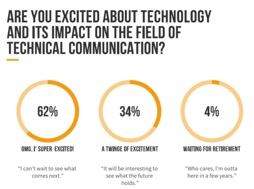
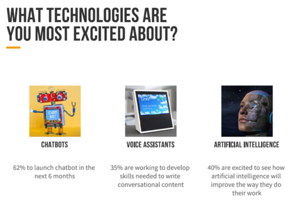
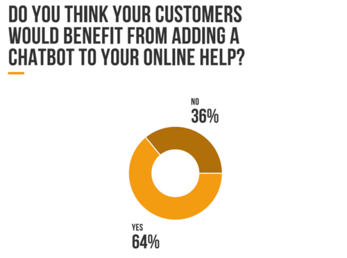

W czasach zarazy można usiąść z filiżanką kawy lub zimnego piwa i obserwować co
się dzieje u sąsiada w ogrodzie lub obejrzeć film, albo... sprawdzić najnowsze
trendy w branży.

<!--truncate-->

Zadbaliśmy o to drugie, pierwszym musicie się zając sami. Dbając o Waszą higienę
umysłu, polecamy **podsumowanie roku 2019 – „THE STATE OF TECHNICAL
COMMUNICATION”,** który znajdziecie
[pod tym linkiem](http://public2.brighttalk.com/resource/core/217857/the-state-of-technical-communication_474463.pdf).
Raport  ten ma jedynie 78 stron 😊 i  przedstawia wyniki praktycznie z każdej
dziedziny komunikacji technicznej.

Autorem jest Scott Abel, postać znana w świecie techcommu, jako
[The Content Wrangler](https://thecontentwrangler.com/). Trzeba przyznać, że
wykonał tytaniczną pracę, z której teraz wszyscy możemy czerpać garściami.

Żeby Was zainteresować wybraliśmy trzy najciekawsze (naszym zdaniem) wątki
pojawiające się w raporcie:

- _#Chat Boty i sztuczna inteligencja\_\_,_
- _#Dokumentowanie API\_\_,_
- _#Narzędzia_

Jeśli jednak uznacie, że temat jest już Wam znany a szukacie czegoś innego,
mocno zachęcamy do zapoznania się z całym raportem!

### #Chat Boty i sztuczna inteligencja

Czy jesteście ciekawi jaki wpływ na komunikację techniczną będą miały nowe
technologie?

Czy chat boty mogą być korzyścią w tworzeniu online helpów?

Czy czat boty są przydatne?

Poniżej dane zebrane w koliste diagramy 😊

### #Dokumentowanie API

Co zrobić żeby dokumentacja była wartością dodaną zarówno do oferowanego
produktu jak i dla zespołu?

Jakie potrzeby szkoleniowe mają zespoły tworzące dokumentację?

...i więcej kolistych diagramów 😊

Co tu dużo pisać liczby nie kłamią, przed menadżerami dokumentacji API stoi nie
lada wyzwanie.

### #Narzędzia

Jak zawsze życzeń co do użytych narzędzi jest kilka; uniwersalność, prostota
użycia, automatyzacja. Co zatem jest najbardziej popularne?... Odsyłamy do
raportu 😊.

Czy w waszej pracy są podobne problemy lub spostrzeżenia?

Zachęcamy do komentarzy!
