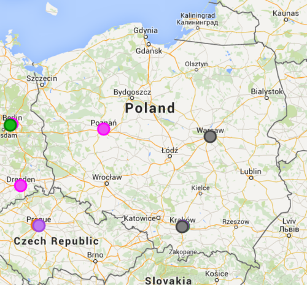

Minęło całkiem sporo czasu odkąd
[pisaliśmy](../komunikacja-techniczna-geograficznie/index.md) o projekcie pod
nazwą [Tech Comm on a Map](http://sarahmaddox.github.io/techcomm-map/). Pora
sprawdzić co się wydarzyło w tym temacie przez ostatni rok.

<!--truncate-->

### Nowe kategorie

Początkowo informacje na mapie były podzielone na trzy kategorie:

- Konferencje
- Stowarzyszenia
- Inne

W przeciągu pół roku od uruchomienia mapy zostały dodane kolejne trzy:

- **Firmy** - wszelkiej maści organizacje specjalizujące się w komunikacji
  technicznej, takie jak firmy konsultingowe, agencje rekrutacyjne, wydawcy czy
  wolni strzelcy.
- **Grupy** - mniejsze grupy oraz regularne spotkania specjalistów z dziedziny
  komunikacji technicznej, zarówno te organizowane pod szyldem większych
  stowarzyszeń jak i samozwańcze inicjatywy.
- **Kursy** - kierunki studiów, certyfikaty i wszelkie inne szkolenia.

Dodatkowo, kategoria **Konferencje** została podzielona na **Konferencje 2014**
i **Konferencje 2015**.

### Wygodniejsze dodawanie informacji

Jednym z ostatnich usprawnień było dodanie
[formularza online](https://docs.google.com/forms/d/1uIEpAu0vpiDwNqwQcr-912TD1_nG_PND9J3NDCPvEXI/viewform),
dzięki któremu możemy zgłaszać nowe obiekty do zaznaczenia na mapie. Po
pomyślnej weryfikacji ze strony autorki, są one dodawane do mapy. Przypomnijmy
tylko, że wcześniej propozycje nowych informacji były zgłaszane za pośrednictwem
komentarzy do artykułów dotyczących projektu.

### Osadzanie mapy

Za pomocą pływającej ramki (iframe) w języku HTML, można wstawić interaktywną
wersję mapy na własną stronę. W tym celu można użyć na przykład tego kodu:

`<html>` `<iframe` `width="100%"` `height="98%"` `style="border:0"`
`src="http://sarahmaddox.github.io/techcomm-map/">` `</iframe>` `</html>`

### Współautorzy

W projekcie regularnie udziela się kilka osób. Wśród nich można znaleźć takie
nazwiska ze światka tech commu jak
[Sarah O’Keefe](http://www.scriptorium.com/about/sarah-okeefe/),
[Ellis Pratt](http://www.cherryleaf.com/blog/author/ellis/) czy
[Tom Johnson](http://idratherbewriting.com/aboutme/).

### Co słychać na rodzimym podwórku?

Na tą chwilę w Polsce zgłoszone są następujące obiekty:

- 1 grupa
- 2 konferencje z 2014
- 1 konferencja z 2015
- 1 firma

### Jedno małe "ale"

Niestety, zauważyliśmy też jeden "kwiatek" - zdarza się, że przy pierwszym
załadowaniu mapy nie pojawiają się na niej żadne znaczniki. Często pomaga po
prostu przeładowanie strony.

Aktualne informacje na temat projektu możecie znaleźć w specjalnej
[kategorii](https://ffeathers.wordpress.com/tech-comm-on-a-map/) na blogu
[ffeathers](https://ffeathers.wordpress.com/).
