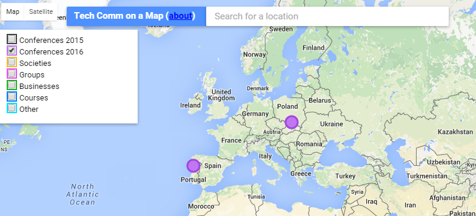

Projekt [Tech Comm on a Map](http://sarahmaddox.github.io/techcomm-map/) wkracza
w kolejną fazę. Niedawno została udostępniona aplikacja mobilna dla systemu
Android.

<!--truncate-->

Przypomnijmy, Tech Comm on a Map to interaktywna mapa stworzona przez
[Sarah Maddox](http://www.linkedin.com/in/sarahmaddox), która pomaga zorientować
się w tym co się dzieje w komunikacji technicznej na całym świecie. Jeśli
chcielibyście dowiedzieć się więcej na ten temat, możecie zajrzeć do naszych
wcześniejszych wpisów o tym projekcie
([Komunikacja techniczna geograficznie](http://techwriter.pl/komunikacja-techniczna-geograficznie/),
[Komunikacja techniczna geograficznie v2](http://techwriter.pl/komunikacja-techniczna-geograficznie-v2/))
lub do specjalnej
[kategorii](https://ffeathers.wordpress.com/tech-comm-on-a-map/) na blogu
[ffeathers](https://ffeathers.wordpress.com/).

### Instalacja

Aplikację mobilną można pobrać z
[Google Play](https://play.google.com/store/apps/details?id=com.techcomm.map.mobile&utm_source=global_co&utm_medium=prtnr&utm_content=Mar2515&utm_campaign=PartBadge&pcampaignid=MKT-Other-global-all-co-prtnr-py-PartBadge-Mar2515-1).
Jest ona przeznaczona dla telefonów z systemem Android 4.0 lub nowszym.

### Możliwości

Dzięki aplikacji możemy w wygodny sposób wyszukiwać konferencje, grupy, firmy,
stowarzyszenia i kursy związane z komunikacją techniczną oraz zgłaszać nowe
obiekty do zaznaczenia na mapie za pomocą opcji "Add event", która dostępna jest
w menu aplikacji. Po pomyślnej weryfikacji są one dodawane do mapy.

### Dla programistów

Aplikacja jest projektem z otwartym kodem źródłowym dostępnym na stronie
[GitHub](https://github.com/sarahmaddox/techcomm-map-android). Może jest wśród
Was ktoś kto chciałby dodać jakieś nowe opcje?

### Założenie dobre, gorzej z wykonaniem

Pomimo tego, że bardzo podoba nam się ten projekt, to jednak jego tempo rozwoju
jest dość kiepskie. Nie mówimy tutaj o rozwoju funkcjonalności, ale o ilości
dostępnych danych. Na początku roku opublikowaliśmy
[listę konferencji z pierwszego półrocza 2016](http://techwriter.pl/konferencje-2016-pierwsze-polrocze/),
na której znalazło się całkiem sporo europejskich konferencji. W momencie
tworzenia tego wpisu (koniec lutego) na mapie zaznaczone były zaledwie dwie
konferencje w Europie na ten rok.

Najwyraźniej w niespełna dwa lata od uruchomienia projektu nie udało się zebrać
pokaźnej grupy użytkowników przez co liczba dodawanych obiektów jest znikoma.
Nie lepiej wygląda sytuacja z aplikacją mobilną. Odkąd została udostępniona
(niecałe trzy tygodnie temu), pobrało ją zaledwie kilkanaście osób. Tak słaba
popularność tego projektu jest dla nas tym większym zaskoczeniem, że mają w nim
swój udział takie nazwiska ze światka tech commu jak
[Sarah O’Keefe](http://www.scriptorium.com/about/sarah-okeefe/),
[Ellis Pratt](http://www.cherryleaf.com/blog/author/ellis/) czy
[Tom Johnson](http://idratherbewriting.com/aboutme/). Dlatego tym bardziej
zachęcamy Was do pobrania aplikacji i zgłaszania nowych wydarzeń.
