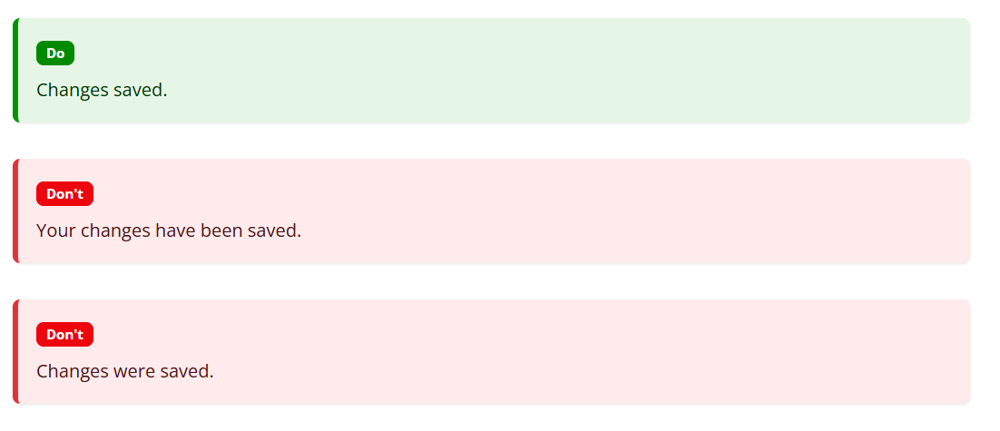
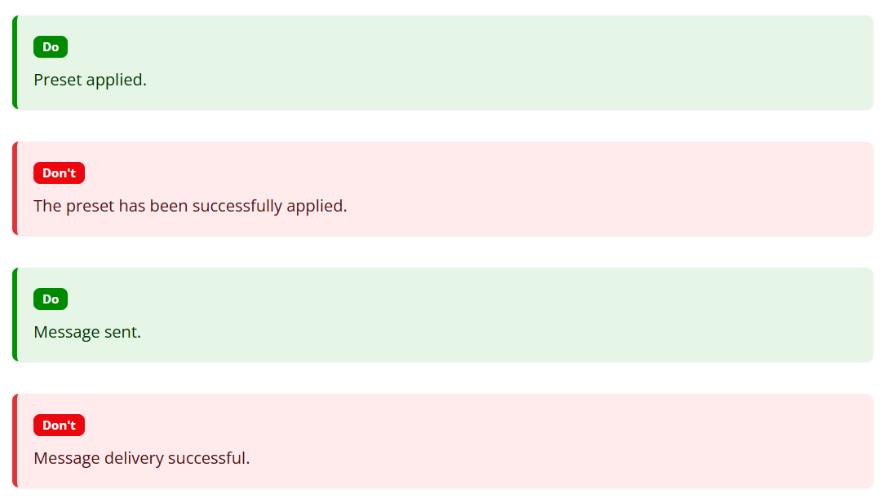
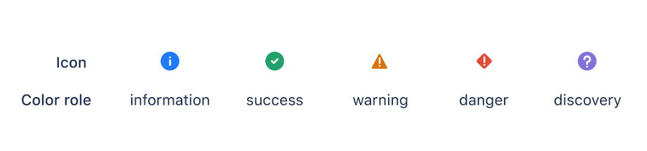
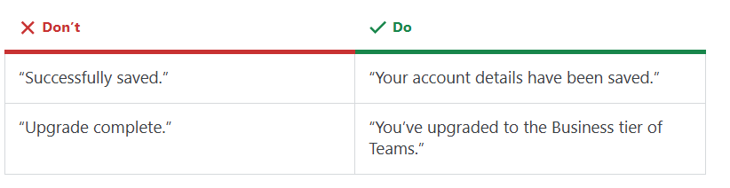
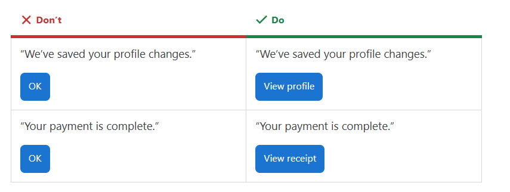

Komunikaty o sukcesie potwierdzają poprawne wykonanie działania i wzmacniają zaufanie użytkownika do produktu. 

W tym artykule dowiesz się, jak tworzyć je w sposób jasny i spójny.

<!--truncate-->

## Po co nam komunikaty o sukcesie?

Komunikaty o sukcesie (success messages) to jedne z najważniejszych treści, z którymi spotykają się użytkownicy produktów cyfrowych. 

Wyobraź sobie, że wykonujesz przelew i nie otrzymujesz żadnego potwierdzenia. Jak wyglądałyby nasze doświadczenia, gdyby nagle wyłączyć komunikaty o sukcesie w produktach cyfrowych, z których korzystamy na co dzień? Z pewnością nie czulibyśmy się ani pewnie, ani spokojnie. 

Komunikaty o sukcesie są tak oczywistym i nieodłącznym elementem produktu, że często nie zwracamy na nie uwagi. Tymczasem ich projektowanie i pisanie to nie lada wyzwanie.

W tym artykule przeczytasz o tym, dlaczego komunikaty o sukcesie są tak ważne, poznasz przykłady z różnych firm oraz dowiesz się, o czym warto pamiętać pisząc takie treści. 

## Definicja komunikatów o sukcesie

Komunikaty o sukcesie informują użytkowników, że dana akcja została wykonana w sposób prawidłowy. Dzięki nim nie muszą się zastanawiać, czy wszystko przebiegło zgodnie z planem. 
Takie komunikaty wzmacniają poczucie pewności i satysfakcji z korzystania z produktu, pokazując, że wszystko działa tak, jak powinno. Pojawiają się po pomyślnym wykonaniu akcji w interfejsie i potwierdzają, że została ona wykonana bez żadnych zakłóceń.

To jeden z tych komunikatów, na które użytkownicy często czekają i który sprawia, że czują się pewnie korzystając z danego produktu. Dobrze skonstruowane komunikaty dają im również poczucie kontroli i zaufania do produktu.

## Przykłady

Poniżej znajdziesz kilka sytuacji, w których pojawiają się komunikaty o sukcesie. Z pewnością widziałeś je niejednokrotnie korzystając z różnych rozwiązań i produktów cyfrowych.

- Zakupy na platformach internetowych
- Zapisanie się lub rezygnacja z newslettera
- Wysłanie zgłoszenia
- Importowanie lub eksportowanie danych
- Dodanie załącznika
- Odzyskanie hasła
- Zaakceptowanie zaproszenia do znajomych
- Potwierdzenie wysłania przelewu lub płatności internetowej

Przyjrzyjmy się teraz konkretnym przykładom.  
Platforma e-learningowa Moodle preferuje krótkie i proste komunikaty o sukcesie. Poniżej kilka przykładów z ich [poradnika](https://moodledev.io/general/contentguidelines/productwriting/success-msg). Co ciekawe, zespół Moodle celowo unika użycia słowa “successfully” (po polsku “pomyślnie”). Komunikaty są zwięzłe, a tam gdzie jest taka potrzeba, informują o następnych krokach, które użytkownik może wykonać. 

_Źródło:
[https://moodledev.io/general/contentguidelines/productwriting/success-msgtps](https://moodledev.io/general/contentguidelines/productwriting/success-msg)_

Spójrzmy teraz na komunikaty o sukcesie od [Atlassiana](https://developer.atlassian.com/platform/forge/ui-kit/components/section-message). To co je wyróżnia to przede wszystkim ikona, która wizualnie sygnalizuje, że akcja została pomyślnie zakończona. Atlassian ma ściśle określone [typy komunikatów i ikony](https://atlassian.design/patterns/messages), których należy używać. W przeciwieństwie do Moodle, Atlassian często wykorzystuje czas Present Perfect (np. has been completed), co nadaje komunikatom bardziej formalny ton.

_Źródło:
[https://moodledev.io/general/contentguidelines/productwriting/success-msgtps](https://moodledev.io/general/contentguidelines/productwriting/success-msg)_

_Źródło:
[https://developer.atlassian.com/platform/forge/ui-kit/components/section-message/#action](https://developer.atlassian.com/platform/forge/ui-kit/components/section-message/#action)_

_Źródło:
[https://developer.atlassian.com/platform/forge/ui-kit/components/section-message/#success](https://developer.atlassian.com/platform/forge/ui-kit/components/section-message/#success)_

Z kolei [Slack](https://stackoverflow.design/content/examples/success-messages) stosuje podobne do Atlassiana zasady, takie jak użycie czasu Present Perfect. To, co wyróżnia zespół Slacka, to zauważalny trend w kierunku bardziej opisowych komunikatów, które nie tylko potwierdzają wykonane czynności, ale też precyzują, jaka dokładnie akcja została zakończona. 

_Źródło:
[https://stackoverflow.design/content/examples/success-messages](https://stackoverflow.design/content/examples/success-messages)_

Ważnym okazuje się także to, co możemy zrobić po pomyślnym zakończeniu akcji. W poniższym przykładzie, Slack sugeruje sprawdzenie szczegółów dokonanych zmian w profilu lub potwierdzenia wpłaty. Zamiast prostego przycisku OK, użytkownik otrzymuje propozycję wykonania konkretnej, logicznej akcji, co pozytywnie wpływa na doświadczenie użytkownika.

_Źródło:
[https://stackoverflow.design/content/examples/success-messages](https://stackoverflow.design/content/examples/success-messages)_

Po przeanalizowaniu powyższych przykładów, wiele osób zapewne ma w głowie jedno zasadnicze pytanie - “Jak właściwie pisać komunikaty o sukcesie?”. Warto pamiętać, że każda firma powinna mieć swoje własne zasady i wytyczne dotyczące stylu oraz tonu komunikacji. Nie ma jednego uniwersalnego wzorca, który sprawdzi się w każdym produkcie. Najważniejsze jest zachowanie spójności. Komunikaty o sukcesie powinny być jednolite w całym produkcie. Nic tak nie psuje wrażenia profesjonalizmu, jak przypadkowe i niespójne treści.

## Dlaczego warto uspójnić komunikaty o sukcesie?

Uspójnienie komunikatów o sukcesie ma służyć nie tylko użytkownikom (choć im przede wszystkim), ale także osobom pracującym nad produktem. Brzmi to banalnie, jednak w praktyce takie nie jest. Proces ten powinien zacząć się od audytu istniejących już komunikatów,, następnie od określenia preferowanego  stylu, a na końcu od wdrożenia spójnych zasad w całym produkcie.

Dla użytkownika spójność treści ma ogromne znaczenie. Wszyscy cenimy intuicyjność i przewidywalność w produktach, z których korzystamy. Chcemy mieć pewność, że firma komunikuje się z nami w sposób jednolity i zrozumiały.

Nikt nie chce się zastanawiać czy komunikat “Transakcja wygląda na zakończoną.” oznacza to samo co “Płatność powiodła się”. Brak spójności prowadzi do niepewności, a ta obniża zaufanie do produktu.

Spójne komunikaty podnoszą jakość doświadczenia użytkownika i wpływają pozytywnie na odbiór marki.
Zyskuje na tym również zespół. Gotowe szablony i wytyczne pisania komunikatów konsekwentnie skracają czas przygotowywania takich treści, co wpływa korzystnie na pracę zespołu. 

## Dobre praktyki

Choć chciałoby się stworzyć uniwersalną listę dobrych praktyk, które gwarantują stworzenie najlepszych komunikatów o sukcesie, w rzeczywistości jest to niemożliwe. Każdy produkt i każda firma mają inne potrzeby, co doskonale widać na przykładach opisanych wcześniej.

Poniżej przedstawiam tabelę, która prezentuje kluczowe elementy komunikatu o sukcesie  oraz zalecenia, które mogą okazać się pomocne w przygotowywaniu spójnych i skutecznych treści

| Element komunikatu o sukcesie | Zalecenia |
|-------------------------------|-----------|
| **Tytuł** | - Używaj tytułów tylko wtedy, kiedy są niezbędne.   - Nie powielaj treści z tytułu. Tytuł powinien być odrębną informacją, a nie tym samym co treść główna.   - Unikaj używania wykrzykników. |
| **Treść główna** | - Uwzględnij powód sukcesu. Poinformuj użytkownika jaka czynność zakończyła się powodzeniem   - Unikaj pisania więcej niż dwa zdania.   - Unikaj zbyt skomplikowanych zwrotów technicznych. |
| **Wezwanie do działania (CTA)** | - Wezwanie do działania w takim rodzaju komunikatów jest opcjonalne, chyba że podjęcie dalszego działa jest istotne.   - Daj użytkownikowi możliwość zamknięcia komunikatu. |
| **Dostępność** | - Nie stosuj żargonu.   - Jeśli w komunikacie znajdują się linki, upewnij się, że są wystarczająco opisowe i zrozumiałe.   - Zadbaj, aby tekst był łatwy do skanowania i skupiał uwagę użytkownika na kluczowych informacjach. |

## Co warto zapamiętać?

Komunikaty o sukcesie nie tylko potwierdzają, że czynność została wykonana, ale także odgrywają ważną rolę w doświadczeniu użytkownika. 

Jak pokazały przykłady Moodle, Atlassiana czy Slacka, forma i styl komunikatów może być różna. Co jednak jest najważniejsze to spójność w pisanych treściach. Użytkownicy chcą korzystać z produktów, które są intuicyjne i komunikują się z nimi w sposób spójny i zrozumiały. 

Spójne komunikaty przynoszą korzyść nie tylko użytkownikom, ale także wewnętrznym zespołom w firmie. Jasne wytyczne i spisane zasady skracają czas pracy pisarzy nad takimi komunikatami. 