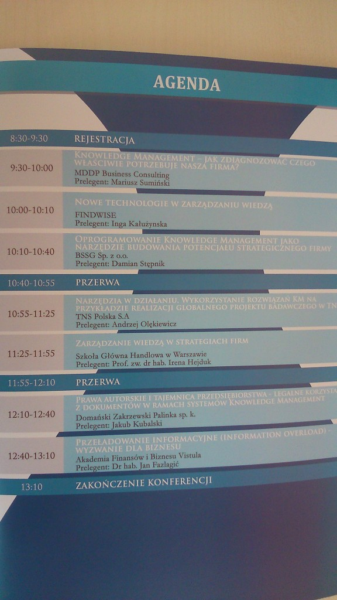

Jakiś czas temu [informowaliśmy Was o tej konferencji](http://techwriter.pl/konferencja-knowledge-management-solutions/), dziś krótka relacja i wrażenia z punktu widzenia uczestnika.

Na początek, z kronikarskiego obowiązku, kilka informacji organizacyjnych:

- Czas: **29 października** **2014**, 9:30-13:00
- Miejsce: **Warszawa**, biurowiec Millenium Plaza, Al. Jerozolimskie 123A
- WWW: [http://knowledgemanagementsummit.pl/](http://knowledgemanagementsummit.pl/)
- Liczba uczestników: około 50
- Agenda:

Kluczowe rzeczy, które udało nam się wyłapać z poszczególnych prezentacji przedstawiamy poniżej. Niecierpliwych od razu uprzedzamy, że najlepsze było na końcu.

## Knowledge Management - jak zdiagnozować czego właściwie potrzebuje nasza firma?

Weź pod uwagę:

- Kluczowe kompetencje
- Zasoby wiedzy
- Problemy do rozwiązania i możliwe usprawnienia
- Planowanie projektów
- Inne...

Pomyśl o tym jaką wiedzę potrzebujesz mieć i STOSOWAĆ w:

- Projektach
- Pracy z klientami
- Przygotowywaniu ofert
- Walce z konkurencją
- Wewnętrznej organizacji
- Codziennym zarządzaniu pracownikami
- Inne...

Po czym zadzwoń do MDDP Business Consulting, a światowej klasy specjaliści zajmą się całą resztą :)

## Nowe technologie w zarządzaniu wiedzą.

Bardzo ciekawe wyniki globalnych badań, nam najbardziej zapadły w pamięć dwa fakty:

- "Pracownicy biurowi spędzają od 15% do 35% czasu na poszukiwaniu informacji."
- "Pracownicy biurowi spędzają więcej czasu na odtwarzaniu informacji niż na ich tworzeniu".

Brzmi znajomo? Firma FINDWISE ma na to rozwiązanie :)

## Oprogramowanie Knowledge Management jako narzędzie budowania potencjału strategicznego firmy.

Po tym wystąpieniu został nam link do strony [Knowledge Management World](http://www.kmworld.com/), oraz przemyślenia na temat poziomów zaawansowania zarządzania wiedzą w firmach:

- Najniższy poziom to poziom IT - mamy super system do zarządzania wiedzą i wszyscy liczą, że dzięki temu wszystkie problemy się rozwiążą ;)
- Poziom HR i kultury korporacyjnej - dział kadr i menedżment współtworzą, zachęcają i używają zasobów wiedzy dostępnych w firmie przechowywanych w wyżej wspomnianym systemie IT.
- Poziom kategoryzacji i zarządzania zawartością - niestety rzadko spotykany :).

Na jakim poziomie funkcjonuje Wasza firma? Jeżeli chcecie wejść na poziom pierwszy - firma BSSG ma dla Was gotowy produkt :)

## Narzędzia w działaniu. Wykorzystanie rozwiązań KM na przykładzie realizacji globalnego projektu badawczego w TNS.

Ciekawy przykład z życia i ciekawy projekt, w którym zarządzanie wiedzą okazało się kluczowe. Wykorzystano takie narzędzia jak:

- Maile :)
- Szkolenia on-line
- Intranet
- Webinaria
- Warsztaty
- Quizy

Prowadzący prezentację w przekonujący sposób przedstawił zalety poszczególnych rozwiązań i kilka ich wad. Nam najbardziej spodobało się stwierdzenie, że kluczem jest uczynienie każdego menedżera odpowiedzialnym za zarządzanie wiedzą w jego projekcie i organizacji. Jak to zrobić? Pokazać mu, jaki to może mieć wpływ na jego karierę!

## Prawa autorskie i tejemnica przedsiębiorstwa - legalne korzystanie z dokumentów w ramach systemów Knowledge Management.

Prawnik z kancelarii DZP skupił się na dwóch tematach:

- Ustawie o prawie autorskim.
- Tajemnicy przedsiębiorstwa oraz ochronie tzw. know-how (na przykład za pomocą umów NDA - non-diclosure agreements).

Do tej pory zastanawiamy się, co chciał nam przekazać i dochodzimy do wniosku, że codziennie łamiemy jakieś prawo, a jeśli nawet nie, to na pewno ktoś i tak może nas pozwać. Ale z drugiej strony zawsze ktoś inny może nas wybronić.

## Zarządzanie wiedzą w strategiach firm.

Tak, istnieją firmy, które robią coś takiego! Można też o tym ciekawie opowiadać! Pani profesor Irena Hejduk ze Szkoły Głównej Handlowej szczyci się ponad 20-letnim doświadczeniem w zarządzaniu (nie tylko wiedzą) - i to było widać. Naszym skromnym zdaniem jedna z dwóch najlepszych prezentacji całej konferencji.

Dowiedzieliśmy się czym różnią się dane od informacji, co to jest wiedza, czym różni się od pozostałych dwóch i dlaczego wiedza to nie mądrość. Odświeżające.

Wystąpienie na dużym poziomie (również abstrakcji). Ale można było wychwycić także bardzo praktyczne wskazówki. Na przykład taką - planując projekt dotyczący przekazywania wiedzy, koniecznie upewnij się, że w zespole projektowym są nie tylko posiadacze wiedzy, ale również odbiorcy. To oni wiedzą najlepiej jakie są ich potrzeby!

## Przeładowanie informacyjne (information overload) - wyzwanie dla biznesu.

Ostatnia prezentacja - profesora Jana Fazlagica z Akademii Finansów i Biznesu Vistula - miała najładniejszą szatę graficzną a prowadzący najbardziej się spieszył :). Ale było bardzo ciekawie. Odwrotnie niż wszyscy poprzednicy, wykładowca skupił się na tym, jak ograniczyć przepływ informacji i ograniczyć efekt [przeciążenia wiedzą](http://en.wikipedia.org/wiki/Information_overload), którego przecież wszyscy na co dzień doświadczamy.

Kilka haseł które zapadły nam w pamięć:

- W smartfonie jest około 250 000 patentów
- [Data smog](http://en.wikipedia.org/wiki/Data_Smog)
- 90% zawartości Internetu to opinie, a tylko 10% to fakty
- [Information Fatigue Syndrom](http://www.naturalnews.com/041057_internet_fatigue_information_overload_news.html) (IFS)
- [Cognitive Overload](http://www.teachingenglish.org.uk/knowledge-database/cognitive-overload)
- [Quizzics](http://leife.wordpress.com/2008/04/12/knowledge-navigation-quizzics/)

Wszystko to efekty niesamowicie niskiego kosztu produkcji i przekazywania informacji w dzisiejszych czasach. Jesteśmy zarzucani newsami, analizami, opiniami, książkami, a do tego, paradoksalnie, cały czas rośnie konsumpcja papieru na świecie. Jak się przed tym bronić? - stosować filtry, personalizować wyszukiwanie, ćwiczyć siłę woli, czytać streszczenia. Dokładna diagnoza problemu i recepty - w dwóch książkach pana profesora, których nie omieszkał polecić słuchaczom :)

## Podsumowanie

Nasza relacja jest chyba dłuższa niż konferencja :), która wydaje się być głównie wydarzeniem marketingowo-sprzedażowym. Trudno ją polecać, ale i trudno odradzić, biorąc pod uwagę zerowy koszt uczestnictwa (poza czasem). Niektórym uczestnikom udało się nawet wygrać ciekawe nagrody w końcowym losowaniu. Większość prezentacji bardzo powierzchownie ślizgało się po tematach, ale wynikało to zapewne z ograniczonych możliwości czasowych.

Dlaczego o niej w ogóle piszemy? Przede wszystkim dlatego, że praca techwritera to właśnie praca z wiedzą, nad wiedzą i jej przekazywaniem. To jest sedno i esencja naszej pracy - przekazywanie wiedzy. Chcemy również, abyście przez moment zastanowili się nad tym, jak wygląda zarządzanie wiedzą w Waszej firmie. I - jeśli nie jest idealnie - spróbowali coś zmienić. Warto.

A dodatkowo, oczywiście, chcieliśmy zamieścić w Internecie jeszcze jedną opinię, zwiększyć Wasz IFS oraz cognitive overload oraz zagęścić data smog ;).
