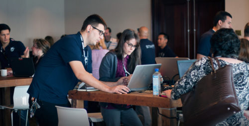
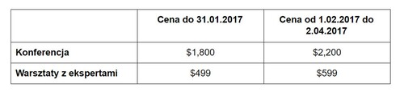

Początek kwietnia coraz bliżej, a wraz z nim termin konferencji MadWorld, o
której pisaliśmy już
[jakiś czas temu](http://techwriter.pl/konferencja-madworld/). Najwyższa więc
pora na uzupełnienie informacji i ponowne zachęcenie Was do wycieczki za ocean.

<!--truncate-->

Przypominamy, że konferencja odbędzie się w dniach 2-5 kwietnia i będzie
wypełniona po brzegi zarówno mnóstwem informacji, jak i atrakcjami dodatkowymi,
o których piszemy poniżej 😉

#### Prelekcje i nie tylko

Konferencja MadWorld łączy w sobie kilka elementów, dzięki którym uczestnicy
wyjadą z niej bogatsi o szereg informacji z branży tech commu. Standardowo będą
miały miejsce prelekcje, które odbędą się 3 i 4 kwietnia. W tym roku będzie ich
co najmniej 40, podczas których wystąpią eksperci z wieloletnim doświadczeniem.
Należy tu choćby wymienić Nitę Beck, która podzieli się z nami umiejętnościami w
tworzeniu projektów za pomocą MadCap Flare, a także będzie miała wystąpienie na
temat szablonów - ich funkcjonalności, sposobu tworzenia oraz jeszcze lepszego
wykorzystania w codziennych obowiązkach. Naszą uwagę zwrócił także temat
"Breaking the Silence: How to Build Influence as a Tech Writer", zaproponowany
przez Jacoba Mosesa, Technical Writera, którego misją jest przełamanie
stereotypu przedstawiającego nasz zawód jako bardzo nudny. Z uwagi na dużą ilość
wystąpień zostały one podzielone na 4 ścieżki - szczegóły znajdziecie w
[harmonogramie konferencji](http://www.madcapsoftware.com/events/madworld/schedule/conference-day-1/).
Jeśli nie jesteście do końca przekonani, to
[tutaj](http://www.madcapsoftware.com/events/madworld/speakers/) znajdziecie
listę wszystkich prelegentów oraz wystąpień, jakie będą miały miejsce. Jest w
czym wybierać, prawda?

Każdego pełnego dnia konferencji przewidziane są trzy półgodzinne spotkania z
ekspertami
([Hospitality Lounge](http://www.madcapsoftware.com/events/madworld/hospitality-lounge.aspx)),
podczas których można będzie rozwiązać problem z własnym projektem, porozmawiać
na interesujące nas tematy lub poznać bliżej specjalistów i pogawędzić z nimi w
bardziej komfortowych warunkach niż pozwala na to sala konferencyjna.

Poza standardowymi prezentacjami, MadWorld oferuje także dwa panele dyskusyjne z
ekspertami. Choć są one dodatkowo płatne, warto je wziąć pod uwagę. Odbędą się w
środę, 5 kwietnia, już po zakończeniu konferencji. Na cały dzień zaplanowane
jest 8 warsztatów, z których można wybrać cztery tematy. Każdy warsztat trwa 2
godziny, co daje każdemu uczestnikowi dzień pełen intensywnych zajęć z
ekspertem. Jak zapewnia organizator, każdy z uczestników będzie miał możliwość
dostępu do wszystkich prezentacji. Szczegółowe informacje na temat warsztatów
znajdziecie
[tutaj](http://www.madcapsoftware.com/events/madworld/workshop.aspx).

A podczas przerw oraz wieczorów czeka Was sporo okazji do tego, by się poznać,
zawrzeć nowe znajomości, a także dobrze się bawić w gronie ciekawych osób 😉

#### Rejestracja i ceny

Poniżej ceny, które pewnie Was teraz najbardziej interesują:

A co dostaniecie płacąc za bilet?

- Wejście na wszystkie prelekcje, wystąpienia i warsztaty, które oferuje
  organizator w dniach 3-4 kwietnia
- Wstęp do Hospitality Lounge, gdzie znajdziecie wsparcie techniczne oraz
  spotkacie ekspertów
- Aplikacja mobilna stworzona specjalnie na potrzeby konferencji dedykowana
  zarówno na Androida jak i iOS (szczegóły pojawią się wkrótce)
- Napoje i przekąski podczas wszystkich wieczornych imprez, czyli: - niedzielnej
  imprezy powitalnej - poniedziałkowej imprezy integracyjnej - wtorkowej imprezy
  pożegnalnej
- Śniadania i obiady w formie bufetu (poniedziałek i wtorek)
- Kawa i przekąski w trakcie wszystkich przerw, jakie będą miały miejsce w
  trakcie paneli konferencyjnych
- Torba z gadżetami (koszulka, program, materiały promocyjne i inne)

Wszystkie szczegóły na temat rejestracji są dostępne
[tutaj](http://www.madcapsoftware.com/events/madworld/pricing.aspx), a jeśli
przejdziecie na dół tej strony to znajdziecie informacje na temat noclegów w San
Diego. Organizator pomaga w ich zorganizowaniu, jednak nie pokrywa kosztów z
nimi związanych.

I co o tym myślicie? Nam bardzo podoba się zakres tematyczny prelekcji, a także
oferta wydarzeń poza nimi. Ponadto udział w konferencji daje nam możliwość
spędzenia kilku dni w słonecznej Kalifornii przez co możemy połączyć kwestie
zawodowe z wakacjami. Dlatego nie ma co zwlekać - najwyższy czas zacząć
organizować budżet na wyjazd 😊

_Zdjęcia pochodzą ze
[strony organizatora](http://www.madcapsoftware.com/events/madworld/)_
