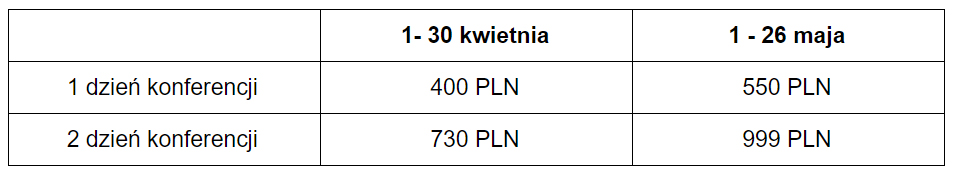

Aż trudno uwierzyć, że w tym roku odbędzie się już piąta edycja konferencji
soap!. Cieszy nas, że to wydarzenie na stałe zagościło w kalendarzu europejskich
konferencji tech comm i że z roku na rok nabiera coraz większego rozpędu. Stało
się już niemal tradycją, że sprawujemy patronat medialny nad soap! i w tym roku
będziemy go z przyjemnością kontynuować. W związku z tym zebraliśmy dla Was
najważniejsze informacje dotyczące konferencji.

<!--truncate-->

### Termin i miejsce

Piąta edycja konferencji odbędzie się w dniach **7-9 czerwca** w
[Muzeum Sztuki i Techniki Japońskiej Manggha](http://manggha.pl/) zlokalizowanym
przy ul. Marii Konopnickiej 26 w Krakowie.

### Rejestracja i cena

Rejestracja już trwa, a jej termin upływa 26 maja.

Ceny biletów:

W przeciwieństwie do lat poprzednich, w tegorocznej edycji nie ma darmowego
dnia. Warto jednak zwrócić uwagę, że mimo to koszt uczestnictwa w konferencji
nie wzrósł, a nawet jest bardziej korzystny niż w zeszłym roku 😉.

W cenę wliczone są wszystkie prezentacje oraz warsztaty (poza Edu Summit), a
także rozrywki przewidziane przez organizatorów - przerwy na kawę, przerwy
obiadowe, ceremonia otwarcia, networking po pierwszym dniu konferencji, party
zamykające wydarzenie, a także zwiedzanie wszystkich wystaw w Muzeum Sztuki i
Techniki Japońskiej Manggha.

Cena nie zawiera noclegu.

### Prezentacje

Tematem tegorocznej edycji soap! jest _Rozwiązywanie problemów_ bez względu na
rodzaj tworzonej treści. Prelegentów jest w tym roku sporo, bo swój udział
potwierdziło już 28 ekspertów. Wśród nich są zarówno rodzimi przedstawiciele
branży, jak również goście z zagranicy. Cieszy nas fakt, że swój udział
zadeklarowało aż 13 prelegentów z Polski. Oznacza to, że na naszym, ciągle
rozwijającym się rynku tech commu pojawia się coraz więcej osób, które chcą (i
nie boją się) dzielić się wiedzą z innymi. Z pełną listą prezenterów możecie się
zapoznać [tutaj](http://soapconf.com/). Nas szczególnie zaciekawiły poniższe
prezentacje:

- _User documentation vs loser documentation: Great content, no readers?_ (Dirk
  Göhmann i Cate Mackenzie) - skuteczna dokumentacja to nie tylko dobry tekst.
  To także szereg działań, które powinien wykonać Tech Writer, by jego super
  tekst został zauważony w całej masie wciąż tworzonych treści. Co zrobić, by
  nasz dokument został zauważony, a praca w niego włożona doceniona?
- _Finding your way back from Documentation Mordor_ (Natalia Katryńska) - w
  pracy Technical Writera zdarzają się wyzwania wykraczające poza tworzenie
  dokumentacji. W szybko zmieniających się projektach trzeba wykazać się
  elastycznością i odpornością, radząc sobie z kłodami rzucanymi nam pod nogi.
  Autorka opowie nam o własnej walce z "demonami dokumentacji".
- _Need more problems? Start localizing videos!_ (Anton Bollen) - w dzisiejszym,
  zglobalizowanym świecie często musimy trafić z naszą dokumentacją do
  międzynarodowego odbiorcy. Punktem wyjścia jest zazwyczaj tłumaczenie treści
  na obcy język. A co gdy chcemy wykorzystać coraz popularniejsze filmy
  instruktażowe? Jaka jest skala dodatkowych wyzwań translatorskich i
  realizatorskich, jeśli zdecydujemy się na lokalizowanie materiałów wideo?

Plan konferencji znajdziecie na
stronie [soapconf.com](http://soapconf.com/#schedule).

### Warsztaty Edu Summit

Na dzień poprzedzający konferencję (7 czerwca 2017) organizatorzy zaplanowali
szereg warsztatów. Dzięki nim poznacie nie tylko teorię, ale także praktykę
związaną z tematyką tegorocznej edycji soap! Warsztaty te są dodatkowo płatne i
wymagają rejestracji. Szczegółowe informacje na temat kosztów, rejestracji oraz
samych warsztatów pojawią się wkrótce na stronie konferencji.

### Więcej informacji

Aktualności na temat konferencji można śledzić na
[Facebooku](https://www.facebook.com/soapconf),
[Twitterze](https://twitter.com/SoapConf) lub
[Google+](https://plus.google.com/+SoapconfPage/posts). A niezdecydowanych
zachęcamy do zapoznania się z naszymi relacjami z poprzednich edycji soap!:

- [Soap! 2016](http://techwriter.pl/konferencja-soap-2016-podsumowanie/)
- [Soap! 2015](http://techwriter.pl/namydleni-po-raz-trzeci/)
- [Soap! 2014](http://techwriter.pl/mydlo-lubi-zabawe/)
- [Soap! 2013](http://techwriter.pl/soap-technical-communication-conference-relacja/)

Do zobaczenia!
