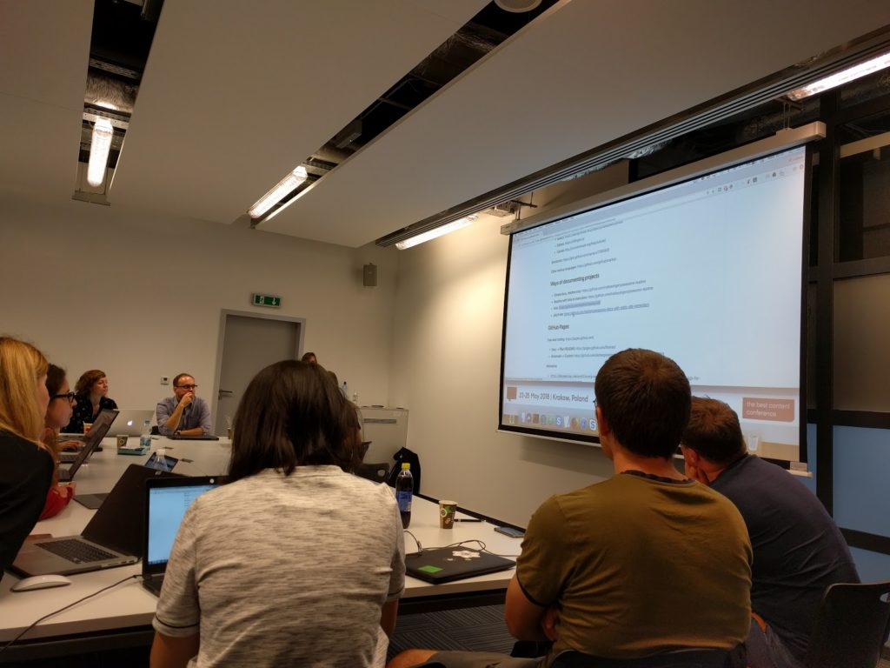
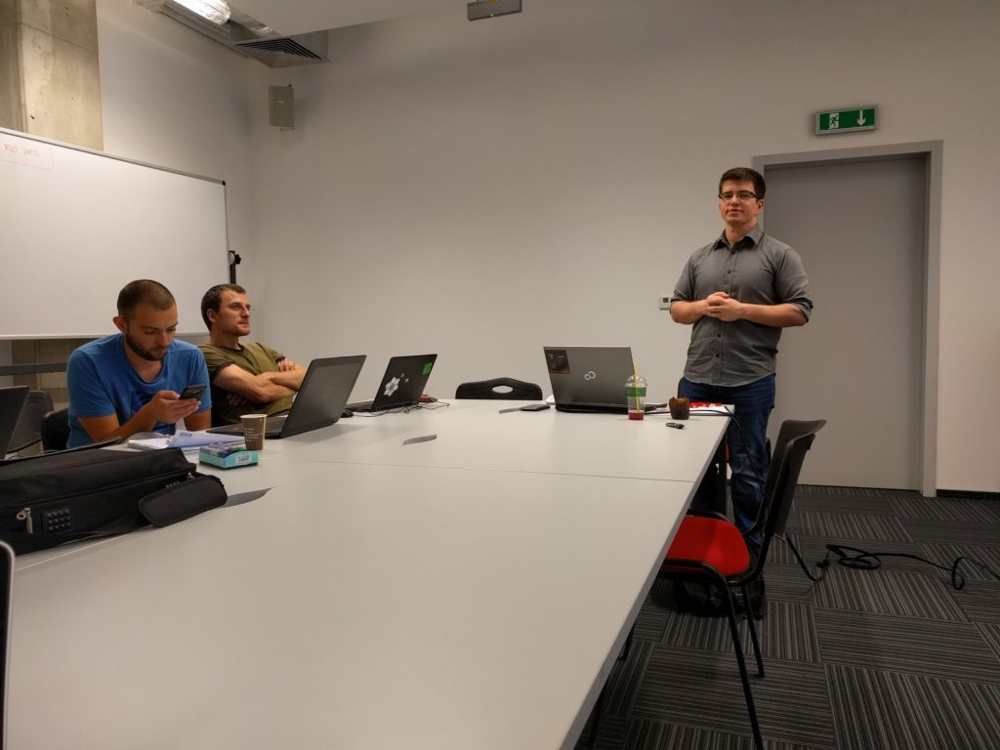
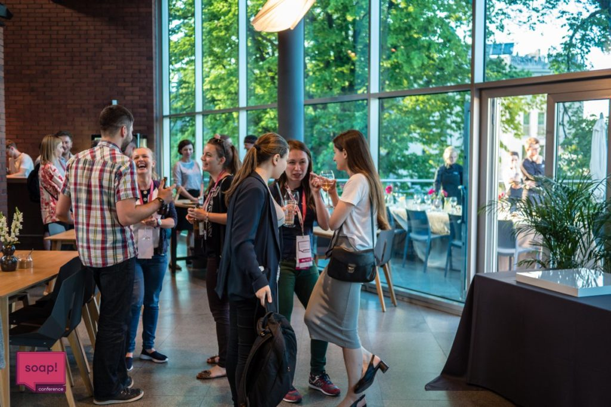

W dniach 23-25 maja w Muzeum Sztuki Japońskiej Manggha w Krakowie odbyła się już
po raz szósty [konferencja soap!](http://soapconf.com/). W tym roku również
mieliśmy przyjemność sprawować patronat medialny nad tym wydarzeniem, dlatego
nie mogło nas tam zabraknąć.

<!--truncate-->

Konferencja trwała w sumie trzy dni, z czego jeden dzień poświęcony był na
warsztaty a kolejne dwa dni na prezentacje. Mieliśmy okazję sporo się nauczyć,
wysłuchać wielu ciekawych wystąpień i przy okazji dobrze się bawić. Zapraszamy
na nasze podsumowanie z tego co się działo.

# Dzień pierwszy - warsztaty

Każdy kto zarejestrował się jako uczestnik konferencji mógł wziąć udział w
warsztatach organizowanych dzień przed głównym wydarzeniem. Warunkiem było
wniesienie niewielkiej opłaty dodatkowej (40 zł za warsztat). Do wyboru było 10
spotkań, które dotyczyły tematów takich jak narzędzia, chatboty, myślenie
projektowe, DITA czy UX copy. Jak widać wachlarz tematyczny był dość szeroki,
więc łatwo było wybrać coś dla siebie. My zdecydowaliśmy się na udział w dwóch
warsztatach związanych z narzędziami.

## Tech Writerzy też mogą być cool

Warsztaty "GitHub for Technical Writers" poprowadzili Łukasz Górnicki i
Małgorzata Świeca. Pierwsza część była poświęcona teorii. Trenerzy pokazali
korzyści płynące z używania [GitHuba](https://github.com/), jego zastosowania
oraz jak to narzędzie zmieniło świat IT. Wyjaśnili również wszystkie podstawowe
terminy związane z GitHubem, Gitem i Markdownem.

GitHub zmienił życie Tech Writerów poprzez promowanie statycznych generatorów
stron i sprawił, że [Markdown](https://pl.wikipedia.org/wiki/Markdown) stał się
bardziej popularny. Zwiększyła się również świadomość na temat tego jak ważne są
dobrej jakości dokumenty. Programiści chcą mieć nie tylko dobre oprogramowanie,
ale też solidną dokumentację i czytelne wprowadzenie do tematu za pomocą pliku
README. Trenerzy użyli interesującej terminologii do opisana czym jest GitHub.
Porównali go do Instagrama - ludzie lubią chwalić się na Instagramie, a
programiści na GitHubie 😊

Druga część warsztatów została spożytkowana na ćwiczenia praktyczne. Trenerzy
wyjaśnili jak wygląda podstawowy workflow w GitHubie. Dowiedzieliśmy się m.in.

- jak utworzyć nową gałąź, a następnie dodać pull request wraz z wprowadzonymi
  zmianam
- jak utworzyć nowe repozytorium i dodać nowe pliki Markdown
- jak włączyć GitHub Pages dla danego repozytorium
- jak używać narzędzia ciągłej integracji, takiego jak Travis CI i CircleCI
- jak połączyć DITA z Markdown. George Bina z Syncro Soft (dostawca OxygenXML)
  stworzył przykładowe rozwiązanie, które łączy DITA, Lightweight DITA i
  Markdown. Można o nim przeczytać
  [tutaj](https://github.com/georgebina/ghd-wiki).

Warsztaty były dobrym wstępem do zagadnień związanych z Gitem i GitHubem.
Zabrakło nam jednak trochę bardziej obiektywnego spojrzenia na temat. Trenerzy
nie wspomnieli o żadnych minusach GitHuba. Według nas korzystne byłoby
przedstawienie szerszej perspektywy, tak aby ludzie mogli bardziej świadomie
decydować, czy to narzędzie jest dla nich użyteczne, czy też nie. Również
dodanie kilku scenariuszy wykorzystania GitHub w świecie dokumentacji
(przykładowe workflowy, przypadki użycia) zachęciłoby uczestników bardziej do
bliższego przyjrzenia się temu narzędziu. Niemniej jednak warsztaty oceniamy
bardzo pozytywnie i sami jesteśmy gorącymi zwolennikami stosowania narzędzi typu
GitHub w świecie dokumentacji.

## Wymarzona praca - kawka i memy

Warsztaty "Drink coffee and browse memes while your computer does the work for
you – ApacheANT in action!" poprowadził Paweł Krentowski, który w przystępny
sposób wprowadził nas w [Anta](https://ant.apache.org/). Prowadzący bardzo
dobrze wyjaśnił wszystkie zagadnienia związane z tym narzędziem i pokazał sporo
kodu XML wyjaśniając go krok po kroku.

Ant to program napisany w Javie, który uruchamiamy z wiersza poleceń. Pliki
build wykorzystywane przez to narzędzie są zapisywane w formacie XML. W skrócie,
plik build to zbiór czynności, które chcesz, żeby komputer wykonał. Task jest
pojedynczą czynnością. Z kolei target jest to zbiór tasków. Proste, prawda?

Oprócz podstawowej struktury pliku build, Paweł przybliżył nam również
properties, które mogą być zawarte w pliku build lub w zewnętrznym pliku. Nie
będziemy się za dużo rozpisywać, ponieważ cały warsztat zawierał w sobie dużo
technicznych zagadnień, które ciężko zrelacjonować.

Ogólnie, warsztat był bardzo solidnym wstępem do Anta, z którego sporo się
dowiedzieliśmy. Postaramy się sprawdzić w praktyce czy rzeczywiście to narzędzie
pozwoli nam na kilka kaw i memów więcej w ciągu dnia pracy 😉

# Dzień drugi i trzeci - wykłady

Główna część konferencji to dwa dni wypełnione prezentacjami, podczas których
przewijał się motyw przewodni: prostota a innowacyjność.

Ogółem odbyły się 23 prezentacje, które poruszały tematy takie jak chatboty,
e-learning, myślenie projektowe, tłumaczenie maszynowe, DITA czy zrzuty ekranu.

Imprezę, tradycyjnie już, otworzyła Gosia Radymiak, przewodnicząca społeczności
soap!. Podczas swojego krótkiego wystąpienia przybliżyła nam profil uczestników
i zachęciła do nawiązywania nowych znajomości. Uczestnicy konferencji pochodzili
z 22 krajów, takich jak Polska, Australia, Czechy, Niemcy, Finlandia, Francja,
Węgry, Izrael, Malta, Malezja, Ukraina, USA i Wielka Brytania oraz
reprezentowali ponad 100 firm. Jak widać, wieść o konferencji soap! niesie się
po świecie i co roku przyciąga nad Wisłę coraz bardziej zróżnicowane
towarzystwo. Jest to jak najbardziej pozytywny trend, który mamy nadzieję będzie
się utrzymywał. A teraz już bez zbędnego przedłużania zapraszamy na skrót
najciekawszych, według nas, prezentacji.

## Mylić się jest rzeczą nie tylko ludzką

Na początek od razu dostaliśmy mocne uderzenie. Rahel Anne Baile w swojej
prezentacji "Examining cognitive bias in bots" mówiła o botach z perspektywy
kryjących się za nimi algorytmów. Musimy pamiętać, że algorytm jest tak dobry,
jak zbiór danych, który został użyty do jego kalibracji. Dlatego boty również
cierpią z powodu błędów poznawczych.

Boty domowe zazwyczaj mają kobiecy głos, często przepraszają oraz w różny sposób
reagują na nękanie. Wiele botów posiada również widoczne cechy danej kultury.
Alexa reaguje w niektórych przypadkach inaczej niż Google Home. Aby zmniejszyć
liczbę błędów poznawczych, należy testować boty z użytkownikiem, upewnić się, że
reaguje odpowiednio w różnych kontekstach, uwzględnia różnorodność kulturową i
etykę. Algorytmy są podatne na uprzedzenia ich twórców, dlatego starajmy się,
aby zespoły, które je tworzą były zróżnicowane a treść i kod były odpowiednio
recenzowane. Warto zaangażować też etyka w tworzenie treści dla botów.

Sama treść to tylko wierzchołek góry lodowej - trzeba też uważać na idiomy,
tłumaczenia i poziom umiejętności czytania i pisania. Wszystkie te rzeczy
występują w botach, dlatego projektując je musimy wiedzieć dokładnie kto będzie
ich używał. Nasze relacje z inteligentnymi maszynami powinny być bardziej
podobne do relacji rodziców z dziećmi. Efektem dobrego rodzicielstwa jest
dziecko, które potrafi myśleć, a nie dziecko, które robi to samo, co my. Krótko
mówiąc, mamy masę danych, które możemy wykorzystać w botach, ale odpowiednie
dobranie treści to już poważne wyzwanie.

Prezentację Rahel uważamy za bardzo udaną. Dzięki dużej ilości przykładów oraz
licznym anegdotom była bardzo wciągająca, a przekazane przez nią treści
łatwiejsze do zapamiętania.

https://twitter.com/kdhowald/status/999563361540083712?s=19

## Tradycyjne szkolenia odchodzą do lamusa

Justyna Tofilska w swojej prezentacji "The future of e-learning" starała się
udowodnić, że e-learning jest przyszłością szkoleń.

Jest kilka powodów, dla których e-learning jest dobrym rozwiązaniem. Po
pierwsze, skraca czas potrzebny na przeszkolenie grupy osób. Tradycyjne
szkolenie może być nieefektywne z powodu ograniczeń czasowych. Mniej czasu
poświęconego na szkolenia to więcej zaoszczędzonych pieniędzy. Po drugie, trener
potrzebuje odpowiednich umiejętności, aby poprowadzić dobre szkolenie.
E-learning usuwa ten problem, bo pracuje nad nim grupa osób i dostęp do
odpowiednich umiejętności jest łatwiejszy. Po trzecie, uczenie się przez
działanie jest najskuteczniejsze. W e-learningu możemy łączyć różne bodźce, aby
uzyskać jak najlepszy efekt - patrzenie, słuchanie, robienie.

Najliczniejszą grupą odbiorców e-learningu jest obecnie pokolenie Y (urodzone w
latach 1980-2000), znane również jako "milenialsi". Nowoczesna organizacja
powinna spotykać swoich klientów tam, gdzie już są, czyli w mediach
społecznościowych. Najlepszą formą dla e-learningu jest obecnie microlearning,
który koncentruje się na konkretnym problemie i trwa do 5 minut.

Przygotowując szkolenie w formule e-learning, pamiętajmy o następujących
wskazówkach:

- Unikajmy nieporozumień. Na przykład skróty mogą być mylące.
- Używajmy animacji zamiast opisu tam gdzie to możliwe. Na przykład, zamiast
  pisać "Naciśnij Enter", użyjmy znaku wizualnego, takiego jak strzałka. Żyjemy
  w czasach ikonek i emotek, więc tego typu przekaz będzie łatwiej przyswojony
  przez docelowych odbiorców.
- Zazwyczaj w e-learningu najpierw jest teoria, a dopiero po niej ćwiczenia.
  Lepiej odwrócić kolejność, ponieważ przeważnie uczący się pomijają teorię i
  przechodzą od razu do praktyki.
- E-learning przygotujmy na podstawie prawdziwej aplikacji. W ten sposób damy
  kursantom realny punkt zaczepienia i podkreślimy wartość przekazywanej wiedzy,
  poprzez bezpośrednie odniesienie jej do czegoś istniejącego.

Bardzo praktyczna prezentacja, pełna dobrych wskazówek. Teraz tworzenie
e-learningu powinno nam pójść gładko 😊

https://twitter.com/AdinaSolutions/status/999563997065220096?s=19

## Trzystu

Rafał Pawlicki podczas swojej prezentacji "How did over 300 skeptics start
writing docs?" pokazał, jak wraz z kolegami starał się rozwiązać problemy z
dokumentacją w środowisku, w którym nie było żadnego Tech Writera i 300
programistów mało optymistycznie nastawionych do pisania dokumentacji.

Deweloperzy pracujący w firmie Rafała są różni, pracują w różny sposób, ale
wszyscy skarżyli się na jedno - na dokumentację. Pomimo powszechnego
niezadowolenia, tylko nieliczni chcieli coś z tym zrobić. Ale to wystarczyło,
chociaż musieli wykazać się dużą kreatywnością, aby znaleźć sposób na pisanie
bez pisarza 😊

Pierwszym wyzwaniem, któremu musieli stawić czoła, było posprzątanie
dokumentacji. Stworzyli oni specjalny zespół ds. dokumentacji, którego zadaniem
było zdefiniowanie standardów. Dokumenty niskopoziomowe i wysokopoziomowe były
pomieszane. Żeby to naprawić, powiązali dokumentację z produktami, które
dostarczają, przenieśli informacje we właściwe miejsca i zaczęli stosować tę
samą strukturę we wszystkich dokumentach. Aby ułatwić życie deweloperom,
stworzyli checklistę dla dokumentów. W rezultacie udało się pozbyć bałaganu i
pokazać deweloperom jak tworzyć dokumentację we właściwy sposób.

Drugim wyzwaniem była nauka pisania. Deweloperzy uważali, że nie potrafią pisać
dla ludzi. Nie mieli żadnych wytycznych ani szablonów. Ponadto wszyscy skarżyli
się, że nie mają czasu na dokumentację. Żeby temu zaradzić, w firmie przyjęli
prostą strategię - opisuj rzeczy jako zadania do wykonania. Dodatkowo wymyślili
biuletyn toaletowy, czyli niewielkie plakaty naklejone na ścianach w
toalecie, które przedstawiają wskazówki dotyczące tworzenia dobrej dokumentacji.

Trzecie wyzwanie polegało na zintegrowaniu procesu tworzenia dokumentacji z
procesem rozwoju oprogramowania i pracowaniu w tym samym cyklach. Wcześniej
dokumentacja były tworzona (lub nie) po zakończeniu tworzenia oprogramowania.
Teraz, tworzą dokumentację pomiędzy etapem planowania i kodowania, gdy wciąż
mają w głowach wszystkie potrzebne informacje. Zastosowano również strategię
"docs as code" - prosty format tekstowy przechowywany obok kodu źródłowego.
Stworzyli też nowe narzędzie do publikacji dokumentacji, DreamDoc.

Myślą przewodnią prezentacji było podkreślenie, że kreatywność nie dotyczy tylko
tworzenia nowych rzeczy, ale może być również wykorzystana do wprowadzenia
zmian. Rafał nie próbował udowodnić, że Tech Writerzy nie są potrzebni. Pokazał
tylko, że jeśli trzeba, można znaleźć prosty sposób, który umożliwia pisanie
dokumentacji, nawet jeśli w zespole nie ma dedykowanych specjalistów od
dokumentacji. Wszystkie zmiany, które wprowadzili wzbudziły zainteresowanie
innych zespołów, co było ciekawym efektem ubocznym.

Była to ciekawa prezentacja, unikalna o tyle, że przedstawiała kwestię tworzenia
dokumentacji z perspektywy dewelopera. Dodatkowo redakcja techwriter.pl
przyznaje dodatkowy punkt za sam fakt, że deweloper miał odwagę opowiadać o
dokumentacji przed publicznością wypełnioną po brzegi specjalistami zajmującymi
się dokumentacją na co dzień 😉

https://twitter.com/RayGallon/status/999596768882036736?s=19

## Warto zaprzyjaźnić się z robotem

Marta Bartnicka i Wojciech Froelich w swojej prezentacji "Dear Mr. Robot"
poruszyli tematy deep learning i tłumaczenia maszynowego (MT). Na początku
przedstawili nam pokrótce ewolucję tłumaczenia maszynowego - od tłumaczenia
opartego na regułach, poprzez statystyczne, aż po neuronowe tłumaczenie
maszynowe imitujące zachowanie dziecka uczącego się języka.

Następnie przybliżyli nam podstawowe pojęcia związane z MT. Dowiedzieliśmy się,
że korpus to zestaw danych w dwóch językach, a szkolenie to proces uczenia
silnika MT jak zamieniać elementy z języka źródłowego na język docelowy na
podstawie korpusu. Najlepsze korpusy to wysokiej jakości pamięci tłumaczeniowe.

Pomimo szybkiego rozwoju tłumaczenia maszynowego, tłumacze jeszcze długo nie
muszą martwić się o swój los. Mogą za to skorzystać z dobrodziejstw rozwoju
technologicznego. Edycja tłumaczenia maszynowego jest zdecydowanie szybsza niż
tłumaczenie od zera. Wydajność tradycyjnego tłumaczenia to maksymalnie 300 słów
na godzinę. Edytując tłumaczenie maszynowe możemy dojść do 1000 słów na godzinę.

Okazuje się, że nawet surowe tłumaczenie maszynowe może być również użyteczne.
Można go użyć w chatbotach albo na rzadziej odwiedzanych stronach dokumentacji.
Na przykład, niektóre strony w pomocy Microsoftu są tłumaczone automatycznie.

Aby zwiększyć dokładność tłumaczenia maszynowego trzeba skupić się na swojej
domenie. Google nie jest w stanie zapewnić dokładnych tłumaczeń, ponieważ
zaciąga morze zróżnicowanych danych z internetu. Ponadto kiedy tworzymy tekst
pod MT powinniśmy pamiętać o stosowaniu pełnych zdań o prostej strukturze
gramatycznej, które mają maksymalnie 25 słów i używaniu słów z konkretnego
słownika związanego z daną domeną. Warto też poprosić osoby, które redagują
tłumaczenia maszynowe, aby zbierały powtarzające się błędy, które mogą być
później wykorzystane do dostrojenia silnika.

Prezentacja była pełna ciekawych i przydatnych informacji. Dodatkowo
dowiedzieliśmy się o alternatywie dla Google Translate - narzędziu
[DeepL](https://www.deepl.com/translator). Podobno całkiem dobrze radzi sobie z
tłumaczeniem i co najlepsze obsługuje język polski. Spróbujcie i oceńcie je
sami, a jeśli macie ochotę, podzielcie się wnioskami w komentarzach.

https://twitter.com/rahelab/status/999925675858452483?s=19

## Nowy wymiar screeshotów

Anton Bollen w trakcie swojego wystąpienia "Rethink your screeshots and
tutorials with a Simplified User Interface" zaproponował użycie "uproszczonego
interfejsu użytkownika" zamiast tradycyjnych zrzutów ekranu. Ten termin można
zdefiniować jako reprezentację interfejsu, który skupia się na kluczowych
elementach i pomija te nieistotne.

Jednym z problemów zrzutów ekranu jest to, że przedstawiony interfejs
użytkownika pokazuje za dużo szczegółów przez co rozprasza uwagę. Dlatego musimy
zaznaczać elementy, które są ważne. Innym problemem jest to, że musimy
aktualizować screeny, gdy produkt się zmienia. Problematyczne jest również
lokalizowanie treści na zrzutach ekranu oraz różnice między systemami
operacyjnymi.

"Uproszczony interfejs użytkownika" stara się sprostać tym wyzwaniom zapewniając
kontekst wizualny, który pozwala zorientować się w produkcie bez idealnego
odzwierciedlenia wszystkich szczegółów.

Anton pokazał nam wiele przykładów z filmów wideo i samouczków i dał parę
wskazówek jak stworzyć zrzuty ekranu pokazujące uproszczony interfejs. Recepta
jest prosta - robimy zrzut ekranu, usuwamy niepotrzebne elementy, zakrywamy
nieistotne elementy i eksportujemy grafikę do formatu docelowego. Raz dwa i po
sprawie. W rzeczywistości jest to całkiem sporo pracy, ale wydaje się, że ten
wysiłek może się opłacić, bo nie będziemy musieli aktualizować dokumentacji za
każdym razem jak coś się zmieni w interfejsie.

Na koniec Anton ujawnił, że TechSmith już pracuje nad dodaniem do
[SnagIta](https://www.techsmith.com/screen-capture.html) funkcji do szybkiego
tworzenia zrzutów ekranu pokazujących "uproszczony interfejs użytkownika".
Prezentacja pobudziła nasz apetyt, dlatego czekamy z niecierpliwością na nową
wersję SnagIta.

Poniżej znajdziecie link do GIFa pokazującego prezentację w przyspieszonym
tempie.

https://twitter.com/antonbollen/status/999992866989633536

https://twitter.com/Ancsur2002/status/999996373855621120

## Prosty tekst to dobry tekst

Wyborna prezentacja wygłoszona przez naszego dobrego znajomego, Pawła Kowaluka,
który opowiadał o tym jak uprościć język, którym posługujemy się w dokumentacji.
W swojej prezentacji "Readability - what it is and how do I improve it?" pokazał
nam wiele przykładów, w jaki sposób można modyfikować zdania, aby były bardziej
czytelne. Na przykład, zamiast pisać "Aby przejść do następnego kroku, na
interfejsie kliknij przycisk Dalej", wystarczy napisać "Kliknij Dalej".

Możemy używać terminów specyficznych dla naszej branży, ale musimy je opakować w
prosty język. Paweł wyjaśnił też, czym jest "wskaźnik czytelności" (readability
index). Mówiąc krótko wskaźnik ten pokazuje jak łatwo przeczytać tekst. Do
pomiaru czytelności możemy zastosować następujące metody:

- Gunning fog index
- Flesch-Kincaid
- SMOG
- Coleman-Liau

Należy jednak pamiętać, że zdania pasywne, klastry rzeczowników, przysłówki czy
wyrażenia złożone nie są identyfikowane przez te algorytmy. Jeśli chcemy znaleźć
te problemy, możesz użyć narzędzi takich jak aplikacja
[Hemingway](http://www.hemingwayapp.com/). Nie jest to rozwiązanie idealne bo
takie narzędzie nie rozpoznaje żargonu, którego używamy w naszej dokumentacji. W
tym celu można skorzystać z programu Acrolinx, który pozwala na uwzględnienie
słownictwa technicznego w ocenie czytelności. Możemy również użyć HyperSTE lub
narzędzia open source do oceny czytelności dostępnego na
[GitHubie](https://github.com/wimmuskee/readability-score).

A co z problemami takimi jak podawanie za dużo informacji czy dygresje? Niestety
algorytmy mogą nie wyłapać takich rzeczy. W tym celu może być konieczne użycie
"metody tradycyjnej", czyli wiedzy zaczerpniętej z książki
["The Elements of Style"](https://en.wikipedia.org/wiki/The_Elements_of_Style).

Prezentacja Pawła była zarówno pouczająca jak i rozrywkowa. Doskonały przykład
zastosowania strategii "baw się i ucz".

https://twitter.com/AdinaSolutions/status/1000023890914152451?s=19

# Część nieoficjalna

Konferencja to nie tylko mnóstwo wiedzy, to także sporo dobrej zabawy. Po każdym
dniu wykładów mieliśmy okazję rozluźnić się i spędzić miło czas na rozmowach,
nie tylko o sprawach branżowych. Można było spotkać starych znajomych, nawiązać
nowe kontakty, posłuchać muzyki na żywo i napić się dobrego piwa. Podczas
nieoficjalnej części jak zwykle panowała luźna atmosfera i widać było, że
wszyscy dobrze się bawili.

# Podsumowanie

Konferencja soap! jest jak wino - im starsza tym lepsza. Szósta edycja
udowodniła, że jest to wydarzenie w pełni dojrzałe, stojące na wysokim poziomie
zarówno pod względem organizacji jak i prelekcji. Nie myślcie jednak, że przez
to soap! usztywnił się i stracił swój młodzieńczy luz i energię. Wręcz
przeciwnie. I nie jest to tylko nasze zdanie. Uczestnicy cenią sobie
swobodną atmosferę, bo dzięki niej są w stanie łatwiej nawiązywać nowe
znajomości i przełamać się, żeby zadawać pytania podczas wykładów. Po sześciu
latach soap! stał się nieodłączną częścią polskiego tech commu. Mamy nadzieję,
że organizatorom nie zabraknie energii do dalszej pracy, bo tegoroczna edycja
według nas wypadła po prostu świetnie i już nie możemy się doczekać kolejnej.
Jeśli nie mieliście jeszcze okazji wziąć udziału w tym wydarzeniu to gorąco Was
zachęcamy, bo naprawdę warto.

Zdjęcia z konferencji dostarczone przez organizatora znajdziecie
[tutaj](https://web.facebook.com/pg/soapconf/photos/?tab=album&album_id=965987283571340).
