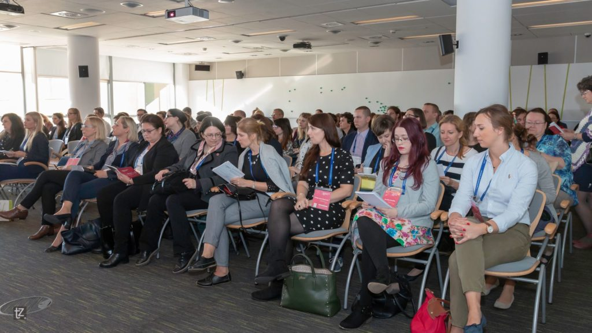
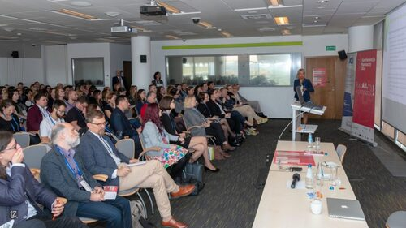
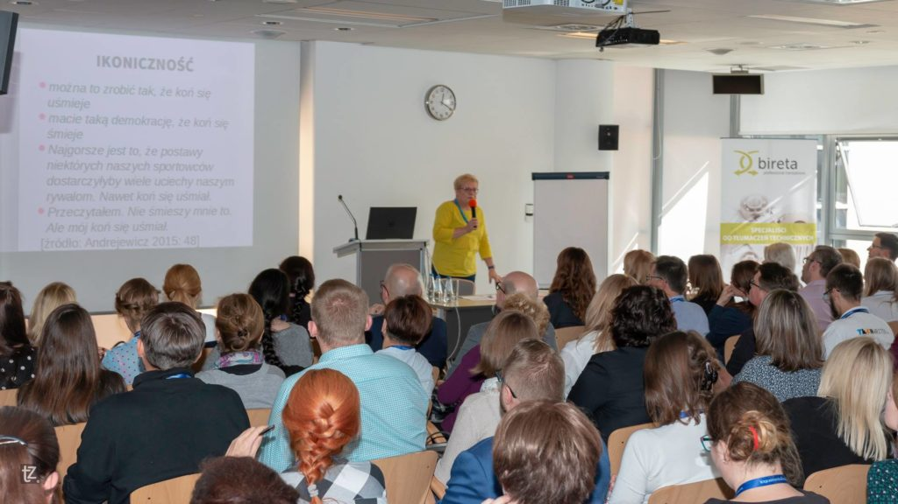
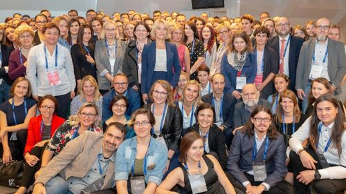

Niedawno, a dokładniej 29 września 2018, mieliśmy okazję gościć na [Konferencji Tłumaczy](https://www.konferencjatlumaczy.pl/). Nie ukrywamy, że czekaliśmy z niecierpliwością na to wydarzenie, ponieważ byliśmy ciekawi "jak to się robi w branży tłumaczeniowej". Dlatego ochoczo wybraliśmy się do Centrum Konferencyjnego Zielna w Warszawie, żeby szukać inspiracji. Jak przystało na partnera medialnego wydarzenia, uprzejmie donosimy, co się wydarzyło.

# Zaczynamy

Konferencję otworzył Agenor Hofmann-Delbor, współautor książki "Programiści i tłumacze. Wprowadzenie do lokalizacji oprogramowania" oraz, jak udało nam się wywnioskować, bardzo dobrze znana postać w środowisku tłumaczy. Krótkie przywitanie oraz podziękowania dla partnerów i zespołu organizacyjnego były dobrą rozgrzewką przed pierwszymi prelekcjami.

\[caption id="attachment\_7288" align="aligncenter" width="590"\] Źródło: zasoby organizatora Konferencji Tłumaczy\[/caption\]

# Technologie tłumaczeniowe z innej perspektywy

Przy mównicy ponownie pojawił się Agenor z prezentacją pt. **"Od troglodytów do kosmitów, czyli krótka historia technologii tłumaczeniowych"**. Wbrew temu, co moglibyśmy wywnioskować z tytułu, nie była to mocno techniczna prezentacja omawiająca wszelakiej maści oprogramowanie tłumaczeniowe. Prowadzący postanowił pokazać nam, że technologia tłumaczeniowa to coś więcej niż narzędzia i że tłumaczenia mają mocne powiązanie z historią i kulturą.

Cofnęliśmy się do zamierzchłych czasów, kiedy podstawowym sposobem komunikacji naszych przodków był przekaz ustny. Niestety, ta forma jest narażona w dużym stopniu na powstawanie nieścisłości, ponieważ nasza pamięć biologiczna jest zawodna. Dlatego zaczęto stosować różne sposoby utrwalania informacji, zaczynając od rycia w kamieniu poprzez pisanie na pergaminie, a kończąc na współczesnych metodach cyfrowego zapisu danych.

Kolejnym ważnym krokiem w zmianie postrzegania przez nas świata było pojawienie się radia na początku XX wieku. Ten wynalazek sprawił, że przekaz ustny stał się bardziej dostępny, przez co ludzie zaczęli mieć kontakt z innymi językami i kulturami. Z biegiem lat zaczęły pojawiać się również nowe środki transportu, przez co otworzyły się nowe możliwości podróżowania, takie jak rejsy statkiem. Zwiększona mobilność miała także ogromny wpływ na poszerzenie naszych horyzontów.

Agenor pokazał nam również [Eniaca](https://pl.wikipedia.org/wiki/ENIAC), maszynę obliczeniową, która na tamte czasy miała ogromne możliwości i zdecydowanie przetarła szlaki dla cyfryzacji. Do połowy lat siedemdziesiątych, Eniac uznawany był za pierwszy komputer. Maszyna ta była programowana za pomocą kart perforowanych, a zajmowały się tym osoby pracujące na stanowisku [“computer”](https://pl.wikipedia.org/wiki/Obliczeniowiec), co po polsku można przetłumaczyć na “obliczeniowiec”. Zawód ten był wykonywany głównie przez kobiety. Eniac był projektem militarnym. Jak się okazuje, branża tłumaczeniowa na przestrzeni lat rozwijała się znacząco właśnie dzięki inwestycjom wojskowym. Za czasów [Josepha McCarthiego](https://pl.wikipedia.org/wiki/Joseph_McCarthy) w USA zainwestowano masę pieniędzy w technologie tłumaczeniowe umożliwiające sprawniejsze tłumaczenie z rosyjskiego na angielski. Prowadzący wspomniał o firmie Language Weaver, która ma również swoje korzenie w świecie militarnym.

Ostatnie lata to ewolucja w kierunku nowych technologii i świata multimediów oraz próby odnalezienia wzorców w otaczającej nas rzeczywistości, które umożliwią nam stworzenie sztucznej inteligencji. Swoją drogą tłumaczenia maszynowe to gorący temat w świecie tłumaczeń, który jest powodem wielu ożywionych dyskusji. Ale o tym za chwilę.

Ciekawe podejście do tematu technologii tłumaczeniowych pokazujące, że warto spojrzeć na to zagadnienie przez pryzmat kultury i historii. Dzięki temu będziemy w stanie sobie uświadomić szerszy kontekst, w jakim osadzona jest branża tłumaczeniowa.

# Tłumaczenia maszynowe - wchodzisz w to?

Kolejnym wystąpieniem, które wzbudziło nasze zainteresowanie była prezentacja Arety Kempińskiej z Bireta Professional Translations pt. "**Przejść na ciemną stronę mocy? Czyli: łódź o nazwie tłumaczenia maszynowe odpływa. Kto z nas zdąży do niej wsiąść?"**. Była to próba spojrzenia na tłumaczenia maszynowe z perspektywy tłumacza oraz właściciela firmy tłumaczeniowej.

Tłumaczenie maszynowe nie jest prawdziwym tłumaczeniem - to tylko zbliżony do języka źródłowego ekwiwalent stworzony na podstawie dostępnych danych. Z tego powodu tłumacze nie powinni się stresować, że maszyny pozbawią ich części albo całości dochodów. Pomimo rosnącej jakości tłumaczeń maszynowych, przed nami jeszcze daleka droga do perfekcji. Dlatego też, tłumaczenia wykonane automatycznie potrzebują postedycji, czyli ostatecznej redakcji tekstu, kiedy poprawiane są błędy i struktura. Istnieje nawet norma, ISO 18587:2017, która definiuje wymagania dotyczące tego procesu.

Podczas postedycji powinniśmy uzupełnić braki w tekście i poprawić błędy wykorzystując maksymalnie podpowiedzi maszyny. W przypadku neuronowego tłumaczenia maszynowego trzeba przygotować dobrze tekst źródłowy (np. zwrócić szczególną uwagę na literówki i podwójne spacje) a w trakcie sprawdzania wygenerowanego tekstu być czujnym na użycie różnych słów do przetłumaczenia tego samego terminu.

Musimy również pamiętać, że postedycja nie może zająć więcej niż przetłumaczenie tekstu, bo wtedy względy ekonomiczne stosowania tłumaczeń maszynowych przestają istnieć. A statystyki przemawiają zdecydowanie na korzyść stosowania automatyzacji w tłumaczeniu. Średnia prędkość tłumaczenia to 2000-3000 słów dziennie, a średnia prędkość postedycji to 4000-5000 słów dziennie.

\[caption id="attachment\_7282" align="aligncenter" width="590"\] Źródło: zasoby organizatora Konferencji Tłumaczy\[/caption\]

Po prezentacji wywiązała się ożywiona dyskusja, co dowodzi iż wśród tłumaczy temat ten budzi sporo emocji. Nie brakowało zarówno zwolenników, jak i przeciwników automatyzacji. Pojawiły się głosy, że tłumaczenia maszynowe mają jeszcze przed sobą daleką drogę i że od kilku lat głosi się rychły upadek tradycyjnych tłumaczeń, a wbrew tym przepowiedniom pracy nie brakuje. Jeden z uczestników podał też informację, że według badania z 2017, które przeprowadzono w USA, automatyzacja pozbawi pracy 19 milionów osób, ale jednocześnie spowoduje powstanie 21 milionów innych miejsc pracy, więc ogólny rozrachunek wychodzi na plus. Oczywiście będą to inne stanowiska wymagające innych umiejętności, dlatego warto zacząć się dokształcać i rozpoznawać nowe możliwości.

Niezależnie od tego, czy jesteśmy zwolennikami, czy przeciwnikami tłumaczeń maszynowych, to nie zmienimy tego, że ta dziedzina rozwija się bardzo dynamicznie. Warto przyjrzeć się temu, co oferuje rynek, nawet jeśli kilka miesięcy temu już to robiliśmy, bo w tym krótkim czasie naprawdę sporo mogło się zmienić.

# Tabloidyzacja przejmuje świat

Profesor Katarzyna Kłosińska, którą możecie kojarzyć z radiowej Trójki, uraczyła nas bardzo ciekawą prezentacją pt. "**Od tabloidyzacji przekazu do tabloidyzacji języka"**. Na początek prowadząca przeprowadziła nas przez historię słowa “tabloid”, które na przełomie XIX i XX wieku oznaczało treść zawartą w małej formie, a na początku XX wieku gazetę o wymiarach mniejszych niż standardowe, którą często czytali robotnicy w czasie dojazdów do pracy ze względu na chwytliwą i nieskomplikowaną treść. Następnie, ukształtowała się pełna definicja słowa tabloid jako gazety, której główne cechy to wyrazista szata graficzna, prosty język i historie opisujące zwykłe sprawy zwykłych ludzi.

Z kolei “tabloidyzacja” to prostota przekazu, specyficzna tematyka oraz sensacyjność. Obecnie jesteśmy świadkami postępującej tabloidyzacji języka i przekazu, czyli nastawienia na ikoniczność, symplifikacje oraz ludyczność.

Ikoniczność uwidacznia się w trendzie stosowania emotikonów. Zamiast opisywać swoje emocje słowami, wyrażamy je za pomocą kilku znaków, co niestety często upraszcza i spłyca nasz przekaz. Okazuje się, że niektórzy tak bardzo lubią emotki, że stosują je nawet w oficjalnych pismach urzędowych. Raczej nie polecamy podążania w tym kierunku. Błędy frazeologiczne są również oznaką przesuwania się z logosfery w ikonosferę. Jesteśmy nastawieni na “tu i teraz”, szybko chcemy wyrazić jakieś emocje, ale robimy to nieudolnie, w związku z czym powstają takie osobliwe konstrukcje językowe jak "można to tak zrobić, że koń się uśmieje”.

Kolejną cechą tabloidyzacji jest ludyczność, czyli nastawienie na zabawę. Przejawem ludyczności jest tworzenie form mających odświeżyć repertuar językowy i ich powszechna akceptacja, a skutkiem ludyczności jest traktowanie języka jako przedmiotu gry. Stąd pojawiają się reinterpretacje słowotwórcze jak “le Targ” i “but elka” (but w rozmiarze L) czy pseudoanglicyzmy jak “grobbing”, “churching” i “bikejka”. Prowadząca poleciła nam stronę [Schronisko dla słów](http://www.schroniskodlaslow.pl/), na której znajdziecie więcej przykładów.

\[caption id="attachment\_7280" align="aligncenter" width="590"\] Źródło: zasoby organizatora Konferencji Tłumaczy\[/caption\]

Symplyfikacja to trzeci filar tabloidyzacji. Jest to korzystanie z technik słowotwórczych, które nie wymagają wysiłku. Ten trend widać we wzroście liczby złożeń bezafiksalnych (“seksmasaż”, “teleświęta”), wzroście liczby derywatów, których utworzenie nie wymaga wysiłku (“ziobrysta” zamiast “ziobrzysta”, “forumowy” zamiast “forowy”), braku odmiany nazwisk, niepoprawnej odmianie rzeczowników oraz konstrukcjach przypominających język angielski (“Ochota ser festiwal” zamiast “Ochocki festiwal serów”, “media patronat” zamiast “patronat medialny”).Przyczyną tabloidyzacji może być życie w nadmiarze informacji. Jednostka dąży do naruszenia norm, bo to pozwala przeżyć w świecie. Ikoniczność i skrótowość to obrona przed nadmiarem informacji.

Bardzo ciekawa prezentacja z mnóstwem przykładów, które uświadomiły nam, jak słabo niekiedy posługujemy się językiem ojczystym i, co najgorsze, nie jesteśmy tego świadomi. Celem prowadzącej było zwrócenie naszej uwagi na pewne zjawiska, które zachodzą w języku i przekazie, ale nie ich wartościowanie. Swoją drogą, nie jest łatwo ocenić czy np. wspomniana wyżej ludyczność przejawiająca się w nowych i często ciekawych wyrażeniach to oznaka kreatywności i zabawy językiem, czy naruszenie fundamentalnych zasad poprawnej polszczyzny. Tabloidyzacja może być groźna, jeśli nie jesteśmy świadomi, że takie zjawisko istnieje, i kiedy nie umiemy ocenić, które formy są poprawne.

# Co ma UX do tłumaczeń

Na koniec konferencji pojawił się akcent z komunikacji technicznej. Ewa Dacko w swojej prezentacji "**UX w tłumaczeniach – hit, kit czy mit?"**, starała się nam pokazać, że zasady UX powinny być również stosowane w tłumaczeniach. Prowadząca zawodowo zajmuje się tłumaczeniami technicznymi, ale posiada też doświadczenie w marketingu, projektowaniu stron i UX.

Na początku dowiedzieliśmy się czym jest UX. Krótko mówiąc, jest to całość interakcji użytkownika z firmą oraz jej usługami i produktami. Jeśli potrzebujecie bardziej wyszukanej definicji, to możecie sięgnąć do normy ISO 9241-210:2010.

\[caption id="attachment\_7278" align="aligncenter" width="590"\] Źródło: zasoby organizatora Konferencji Tłumaczy\[/caption\]

Im bardziej personalizujemy produkt, tym drożej i łatwiej można go sprzedać. Producenci zorientowali się, że to kura znosząca złote jaja i że warto inwestować w ulepszanie doświadczeń użytkownika. Do Starbucksa idziemy nie tylko po to, żeby wypić kawę, ale też dlatego, że jest to modne.

Ważne jest to, że nie można postawić znaku równości pomiędzy UI (interfejs użytkownika) i UX. Interfejs to istotny czynnik w UX, ale to nie wszystko. Prowadząca zwróciła też uwagę na to, jak ważną częścią UX są badania - badania potrzeb, badania ewaluacyjne, badania optymalizacyjne, oraz desk research. Są one podstawą podejmowania właściwych decyzji, jeśli chodzi o odpowiadanie na potrzeby użytkowników.

Po ogólnym wprowadzeniu prowadząca starała się pokazać, dlaczego tłumacze powinni zaprzątać sobie głowę dobrymi praktykami UX. Tłumaczenie jest dobre, jeśli jest funkcjonalne, przydatne i budzi pozytywne emocje. W swojej pracy, tłumacze powinni pamiętać o takich aspektach UX jak komunikatywność, architektura informacji oraz personalizacja.

Oprócz dużej ilości teorii zobaczyliśmy też ciekawe przykłady ze stron internetowych, aplikacji i urządzeń, które ilustrowały problemy wynikające z braku stosowania zasad UX w tłumaczeniach.

W jaki sposób tłumacze mogą sobie ułatwić pamiętanie o zasadach UX? Na przykład, poprzez stworzenie briefu UX, czyli krótkiego dokumentu z wymaganiami i założeniami projektu tłumaczeniowego oraz poprzez definiowanie persony, czyli odbiorcy naszego tłumaczenia i jego potrzeb.

Dla osób zajmujących się komunikacją techniczną na co dzień, zasady przedstawione w prezentacji to chleb powszedni. Niemniej jednak słuchaliśmy wystąpienia z dużym zainteresowaniem, ponieważ spojrzenie na UX z perspektywy tłumaczeń było czymś nietuzinkowym.

Materiały z prezentacji znajdziecie na stronie prelegentki:

- [Slajdy](https://drive.google.com/open?id=1uTojyQGdppMeaczQVSoAsMQKvph1NCI9)
- [Brief UX](https://drive.google.com/open?id=1xgfgNgBp9yQpciayeRe74FSilWsMT4I_)
- [Szablon persony](https://drive.google.com/open?id=18iig5KmUpb6098KW1-PGOOYN0zKhHQGl)

# Porozmawiajmy o przyszłości

Między prezentacjami odbyła się dyskusja, w której specjaliści od tłumaczenia i komunikacji technicznej połączyli siły, żeby porozmawiać o komunikacji przyszłości i jej wpływie na warsztat tłumacza. Przedstawiciel naszego portalu, Michał Skowron, miał przyjemność być częścią panelu dyskusyjnego, w którym zasiedli również Marta Bartnicka z firmy IBM, Areta Kempińska z Bireta Professional Translations oraz nasz dobry znajomy, Tomasz Prus z Unit4.

\[caption id="attachment\_7279" align="aligncenter" width="590"\] Źródło: zasoby organizatora Konferencji Tłumaczy\[/caption\]

Po ożywionej dyskusji, w której brali aktywnie udział również uczestnicy konferencji, wysnuł się jeden główny wniosek - tłumacze i tech writerzy powinni stać po tej samej stronie barykady. Tech writerzy, wywierając wpływ na programistów w celu podnoszenia jakości treści, która znajduje się w oprogramowaniu, pomagają nie tylko użytkownikom, ale również tłumaczom. Mając dobre źródła, specjaliści od przekładu są w stanie dostarczać tłumaczenia o dużo lepszej jakości.

Stosowanie dobrych praktyk tworzenia dokumentacji, takich jak spójność i jasność przekazu, powoduje, że tłumaczenia maszynowe są dokładniejsze, pamięć tłumaczeniowa jest w stanie pokryć większą część tekstu, przez co tłumaczenia dostarczane mogą być szybciej i taniej. To powoduje, że zysk jest zarówno po stronie zleceniodawcy, jak i wykonawcy tłumaczenia.

Z kolei tłumacze mogą pomóc tech writerom poprzez systematyczne raportowanie problemów, z jakimi spotykają się podczas swojej pracy. Dzięki temu tech writerzy będą w stanie dostarczać lepszą treść i unikać powielania tych samych błędów, które są kosztowne dla wszystkich.

Metodą osiągnięcia takiej owocnej współpracy jest oczywiście… komunikacja. Obie strony muszą zadbać o systematyczną wymianę wiedzy i doświadczeń oraz nie bać się konstruktywnej krytyki.

# Podsumowanie

Konferencja Tłumaczy nie była wydarzeniem związanym bezpośrednio z komunikacją techniczną. Jednak dużą częścią naszego zawodu jest budowanie mostów komunikacyjnych pomiędzy różnymi grupami, dlatego też wychodzenie poza obręb naszej profesji powinno być dla nas rzeczą naturalną. Z tego właśnie powodu zdecydowaliśmy się na udział w konferencji.

Było to wzbogacające doświadczenie dla obu stron. My, jako Tech Writerzy mieliśmy okazję zobaczyć, z jakimi wyzwaniami mierzą się tłumacze i jakie trendy obecnie panują wśród specjalistów od przekładu. Była to również dla nas doskonała okazja, żeby zobaczyć, jakie konsekwencje może mieć niestosowanie się do dobrych praktyk tworzenia treści. To, co dla nas wydaje się błahostką, może być sporym utrudnieniem dla osób, które muszą tłumaczyć, to co wychodzi spod naszego techwriterskiego pióra. Z kolei tłumacze mogli dowiedzieć się o istnieniu naszej profesji i o tym, czym zajmujemy się na co dzień.

Dziękujemy organizatorom za zaproszenie a wszystkim uczestnikom za ciepłe przyjęcie i cierpliwość w słuchaniu naszych, czasem przydługich, wywodów na temat tech commu. Mamy nadzieję, że nawiązana nić współpracy zaowocuje kolejnymi spotkaniami, podczas których tech writerzy i tłumacze będą mogli dzielić się wiedzą.

Gratulujemy też zdobywcom nagród branżowych oraz zwycięzcom naszego quizu, w którym uczestnicy musieli wykazać się nie tylko wiedzą na temat naszego portalu, ale również kreatywnością.

\[caption id="attachment\_7277" align="aligncenter" width="590"\] Źródło: zasoby organizatora Konferencji Tłumaczy\[/caption\]

Zdjęcia z wydarzenia znajdziecie pod linkami poniżej:

- [Konferencja](https://www.facebook.com/pg/KonferencjaTlumaczy/photos/?tab=album&album_id=1179027058921839&__tn__=-UC-R)
- [Networking](https://www.facebook.com/pg/KonferencjaTlumaczy/photos/?tab=album&album_id=1179980872159791)
