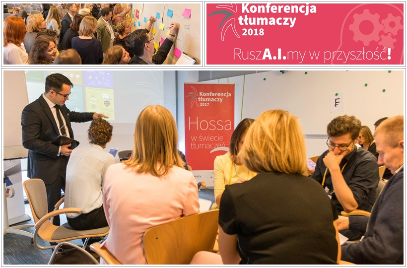
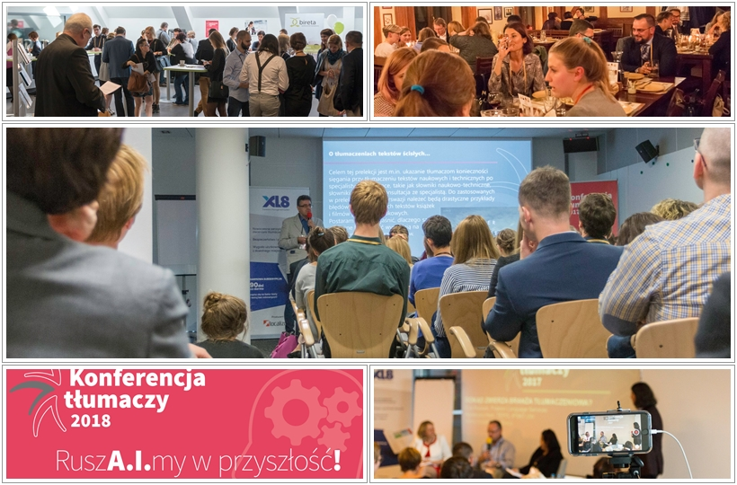

Z ogromną przyjemnością przedstawiamy Wam kolejne wydarzenie, nad którym objęliśmy patronat medialny. Tym razem w centrum zainteresowania mamy branżę tłumaczeniową. Poniżej najważniejsze informacje.

### O jakie wydarzenie chodzi?

Konferencja Tłumaczy, to według organizatorów, największe wydarzenie w branży tłumaczeniowej w Polsce. Każdego roku bierze w niej udział około 200 specjalistów - tłumaczy ustnych i pisemnych, tłumaczy przysięgłych, przedstawicieli biur tłumaczeń, kierowników projektów, pracowników instytucji publicznych, akademików i specjalistów od narzędzi wspomagania tłumaczeń oraz technologii tłumaczeniowych. Jednak nie tylko osoby z branży tłumaczeniowej są mile widziane na konferencji. Jest ona także otwarta dla przedstawicieli przemysłu gier, uznanych językoznawców, specjalistów od prowadzenia biznesu, prawników, a nawet pisarzy.

Ciekawostka: W 2016 roku Konferencja Tłumaczy była jednym z wydarzeń w ramach anglojęzycznej konferencji Translation and Localization*.* Jednak już w 2017 imprezy te zostały rozdzielone i funkcjonują jako osobne wydarzenia.

### Rola tłumacza w globalnym świecie

W dzisiejszym, globalnym świecie, rola tłumaczeń sięga właściwe do każdej dziedziny życia. Międzynarodowe firmy oferują swe produkty, usługi i wszelakie informacje międzynarodowym odbiorcom i to właśnie tłumacze umożliwiają obrót dóbr w obrębie całego globu. Mają oni więc ogromny wpływ na przepływ informacji i różne gałęzie przemysłu, jednak wciąż postępujące zmiany również wpływają na ich warsztat. I właśnie na tym skupia się stały obszar tematyczny dyskusji, które toczą się zarówno w trakcie prelekcji, jak i w kuluarach.

W tym roku temat przewodni to **_RuszA.I.my w przyszłość_** czyli odwołanie się do coraz większej roli nowoczesnych technologii w pracy tłumaczy. Ma na nią szczególny wpływ popularyzacja nowej generacji neuronowych tłumaczeń maszynowych czy automatyzacja licznych procesów odbywających się w trakcie pracy nad tłumaczeniem. Prelekcje w trakcie Konferencji Tłumaczy mają na celu przygotowanie uczestników do nadchodzących zmian, zrozumienie ich, a także wykorzystanie ich w jak najlepszy sposób dla własnej korzyści.

### Termin i miejsce

Konferencja Tłumaczy odbędzie się 29 września (sobota) w [Centrum Konferencyjnym Zielna](http://www.centrumzielna.pl/) w Warszawie.

### Program

Podczas konferencji będziecie mogli wziąć udział w dziesięciu wystąpieniach. Poniżej kilka tematów, które wzbudziły nasze zainteresowanie:

- Epoka AI w praktyce tłumacza a obecny system edukacji - Magdalena Ochmańska, Mark J Hunt,
- Prawa własności intelektualnej w kontekście tłumaczeń maszynowych i pamięci tłumaczeniowych - Wojciech Wołoszyk,
- UX w tłumaczeniach – hit, kit czy mit? - Ewa Dacko,
- Tajemnicza prelekcja tajemniczego prelegenta ;-).

Pełną listę tematów znajdziecie [na tej stronie](https://www.konferencjatlumaczy.pl/prelegenci).

Prelekcje, wybrane przez organizatorów, będą nagrywane i udostępnione po konferencji.

Poza zaplanowanymi prelekcjami czeka na Was także wieczorna impreza networkingowa w restauracji [U Szwejka](http://uszwejka.pl/), która pozwoli bliżej poznać uczestników konferencji oraz poszerzy kontakty biznesowe na przyszłość.

### Warsztaty

Organizatorzy zapraszają również na cykl warsztatów, które odbędą się w dniach 27 i 28 września. Do wyboru są następujące tematy:

- SDL Trados poziom podstawowy, 27 września, 10:00-16:00 ([więcej informacji](https://www.facebook.com/events/683286668685431/)),
- SDL Trados poziom średniozaawansowany, 28 września, 10:00-16:00 ([więcej informacji](https://www.facebook.com/events/335394833664586/)),
- Tłumaczenie maszynowe (MT) w praktyce, 27 września, 10:00-14:00 ([więcej informacji](https://www.facebook.com/events/1161561197317183/)),
- Ekspresowe warsztaty z lokalizacji oprogramowania, 28 września, 10:00-14:00 ([więcej informacji](https://www.facebook.com/events/907021162833034/)).

Wszystkie warsztaty odbywają się w Centrum Konferencyjnym Zielna.

### Bilety

<table style="border-collapse: collapse; width: 100%; height: 180px;" border="1"><tbody><tr style="height: 18px;"><td style="width: 50%; text-align: center; height: 18px;"><strong>BILET</strong></td><td style="width: 50%; text-align: center; height: 18px;">CENA (w zł)</td></tr><tr style="height: 18px;"><td style="width: 50%; text-align: center; height: 18px;">Bilet na konferencję</td><td style="width: 50%; text-align: center; height: 18px;">420</td></tr><tr style="height: 18px;"><td style="width: 50%; height: 18px; text-align: center;">Networking</td><td style="width: 50%; height: 18px; text-align: center;">125</td></tr><tr style="height: 18px;"><td style="width: 50%; height: 18px; text-align: center;">Obiad</td><td style="width: 50%; height: 18px; text-align: center;">60</td></tr><tr style="height: 18px;"><td style="width: 50%; height: 18px; text-align: center;">SDL Trados poziom podstawowy - warsztat</td><td style="width: 50%; height: 18px; text-align: center;">600</td></tr><tr style="height: 18px;"><td style="width: 50%; height: 18px; text-align: center;">SDL Trados poziom średni - warsztat</td><td style="width: 50%; height: 18px; text-align: center;">600</td></tr><tr style="height: 18px;"><td style="width: 50%; height: 18px; text-align: center;">SDL Trados (poziom podstawowy i średni)</td><td style="width: 50%; height: 18px; text-align: center;">900</td></tr><tr style="height: 18px;"><td style="width: 50%; height: 18px; text-align: center;">Warsztaty z lokalizacji</td><td style="width: 50%; height: 18px; text-align: center;">400</td></tr><tr style="height: 18px;"><td style="width: 50%; height: 18px; text-align: center;">MT w praktyce</td><td style="width: 50%; height: 18px; text-align: center;">400</td></tr><tr style="height: 18px;"><td style="width: 50%; height: 18px; text-align: center;">Warsztaty: MT + lokalizacja</td><td style="width: 50%; height: 18px; text-align: center;">560</td></tr></tbody></table>

Udział w konferencji, wieczornym networkingu oraz warsztatach wymaga rejestracji oraz zakupu biletu. Zwróćcie uwagę, że dodatkowo można wykupić obiad na dzień konferencji (planowany jest około godziny 13:00) oraz, że jest możliwość wykupienia bloku warsztatów, co daje znaczne korzyści finansowe.

Bilety wraz z rejestracją możecie zakupić do końca sierpnia [na tej stronie](https://www.konferencjatlumaczy.pl/rejestracja).

Wszelkie dodatkowe informacje znajdziecie na [stronie Konferencji Tłumaczy](https://www.konferencjatlumaczy.pl/) oraz na [fanpage'u na Facebooku](https://www.facebook.com/KonferencjaTlumaczy/).

Wraz z organizatorami serdecznie zapraszamy!
