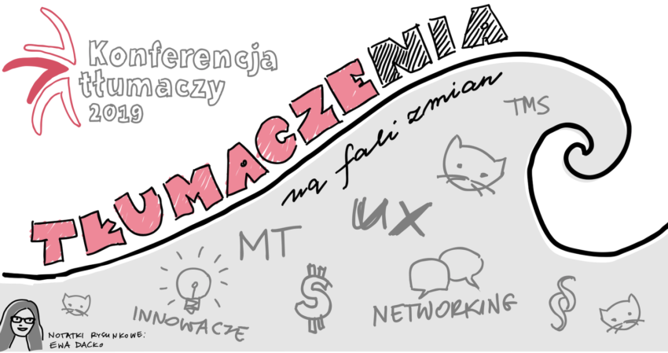

Kolejny raz, z wielką przyjemnością, zapraszamy Was na rodzime wydarzenie, które
obejmujemy naszym patronatem. Mowa o Konferencji Tłumaczy, która odbędzie się we
wrześniu w Warszawie. Poniżej najważniejsze informacje.

### Krótki powrót do przeszłości

Konferencja Tłumaczy, to według organizatorów, największe wydarzenie w branży
tłumaczeniowej w Polsce. Jest ona przede wszystkim skierowana do tłumaczy
ustnych i pisemnych, tłumaczy przysięgłych, przedstawicieli biur tłumaczeń,
kierowników projektów, pracowników instytucji publicznych, akademików i
specjalistów od narzędzi wspomagania tłumaczeń oraz technologii tłumaczeniowych.
Jednak nie tylko osoby z branży tłumaczeniowej są mile widziane na konferencji.
Jest ona także otwarta dla przedstawicieli przemysłu gier, uznanych
językoznawców, specjalistów od prowadzenia biznesu, prawników, a nawet pisarzy.

W roku 2016 Konferencja Tłumaczy była jednym z wydarzeń organizowanych w ramach
anglojęzycznej konferencji Translation and Localization. Jednak już od 2017 roku
imprezy te funkcjonują jako osobne wydarzenia.

### Motyw przewodni na 2019 rok

Tegoroczny motyw przewodni konferencji to “Tłumaczenia na fali zmian”. Świat
wokół nas ulega coraz częstszym i bardziej dynamicznym zmianom. Zjawisko to
dotyczy także zmian zachodzących w świecie tłumaczeń. Liczą się nowe pomysły,
rozwiązania, coraz większa elastyczność i umiejętność odnajdywania się w
dynamicznie komunikującym się świecie. Od tłumacza wymaga się nie tylko kunsztu
językowego, ale także szerokiej wiedzy na temat kultury i niuansów jakie są
charakterystyczne w dobie nowoczesnej komunikacji światowej. Jak umiejętnie
łączyć pędzące zmiany z tradycją? Jak unosić się na fali wydarzeń, by w ich
kontekście odnosić sukces w branży i ciągle się rozwijać? Na te i wiele innych
pytań spróbują odpowiedzieć prelegenci wraz z uczestnikami.

### Co nas czeka?

A skoro o prelegentach mowa, czas na przybliżenie Wam programu tegorocznej
edycji Konferencji Tłumaczy.
[Na stronie wydarzenia](https://www.konferencjatlumaczy.pl/) możecie zobaczyć
wstępną listę wykładów, dyskusji oraz warsztatów. Dokładne godziny i układ
wystąpień nie są jeszcze znane, jednak organizatorzy informują, iż dzień
konferencji będzie trwał w godzinach 9:00-18:00. W tym czasie będziecie mogli
wziąć udział w zróżnicowanych tematycznie prelekcjach. Naszą szczególną uwagę
zwróciły:

- _(Poprawny) balans między normą, a innowacyjnością językową w dobie
  globalizacji_ - dr hab. Michał Szczyszek omówi poprawnościowe aspekty
  współczesnej polszczyzny ze szczególną uwagą zwróconą na takie atrybuty języka
  polskiego, jak balans między rodzimością a obcością czy internacjonalizacją
  współczesnej polszczyzny w zakresie słownictwa i słowotwórstwa; status normy
  językowej w kontekście uzusu i systemu językowego; konsekwencje w praktyce
  językowej funkcjonowania obecnie dwóch norm języka polskiego: normy wzorcowej
  i normy potocznej. Podczas dyskusji uczestnicy omówią wpływ języków obcych na
  współczesną polszczyznę.
- _Surfując na fali zmian - różne perspektywy_ - podczas dyskusji uczestnicy
  będą próbowali odpowiedzieć na pytania: Jak nie zatonąć na wzburzonych wodach
  branży tłumaczeniowej? Co mają na ten temat do powiedzenia freelancerzy, co
  biura tłumaczeń, a co klienci czy też odbiorcy?
- _Kreatywość to podstawa_ - tajemniczy prelegent w swym wystąpieniu pokaże, że
  tłumaczenia to dziś nie tylko książki i instrukcje pralek. To także gry
  komputerowe, komiksy, audiobooki, social media – czyli wszelkiej maści nośniki
  treści, a także nowinki technologiczne, w których kreatywność staje się jedną
  cenniejszych cech, jakimi powinien charakteryzować się współczesny tłumacz.

To tylko namiastka propozycji, jakie w swej ofercie mają dla Was organizatorzy.
Więcej szczegółów znajdziecie
[tutaj](https://www.konferencjatlumaczy.pl/program).

Poza zaplanowanymi prelekcjami czeka na Was także wieczorna impreza
networkingowa, o której szczegółach organizator wkrótce poinformuje.

### Termin i miejsce

Konferencja Tłumaczy odbędzie się **28 września (sobota)** w
[Centrum Konferencyjnym Zielna](http://www.centrumzielna.pl/) w Warszawie.
Podobnie jak w poprzedniej edycji poprzedzają ją dwa dni warsztatów, o których
przeczytacie poniżej.

### Warsztaty

Organizatorzy zapraszają również na cykl warsztatów, które odbędą się w dniach
26 i 27 września.​ Warsztaty są otwarte dla wszystkich (nie trzeba być
uczestnikiem konferencji). Warunkiem udziału jest rejestracja i opłacenie
uczestnictwa. Do wyboru są następujące tematy:

- SDL Trados poziom podstawowy - 26 września
  ([więcej informacji](https://www.localize.pl/product-pol-142-Szkolenie-SDL-Trados-Warszawa-poziom-podstawowy.html)),
- Tłumaczenie maszynowe (MT) w praktyce - 26 września
  ([więcej informacji](https://www.localize.pl/product-pol-73-Tlumaczenie-maszynowe-MT-w-praktyce-Warszawa.html)),
- SDL Trados poziom średniozaawansowany - 27 września
  ([więcej informacji](https://www.localize.pl/product-pol-143-Szkolenie-SDL-Trados-Warszawa-poziom-srednio-zaawansowany.html)),
- Lokalizacja oprogramowania - 27 września -
  ([więcej informacji)](https://www.localize.pl/product-pol-84-Lokalizacja-oprogramowania-Warszawa.html),
- UX w pigułce czyli projektowanie stron www dla tłumaczy i biur tłumaczeń - 27
  września
  ([więcej informacji](https://www.localize.pl/product-pol-165-UX-w-pigulce-czyli-projektowanie-stron-WWW-dla-tlumaczy-i-biur-tlumaczen-warsztaty.html)).

### Bilety

Udział w konferencji, wieczornym networkingu oraz warsztatach wymaga rejestracji
oraz zakupu biletu. Dodatkowo można wykupić obiad na dzień konferencji
(planowany jest około godziny 13:00).

Ceny biletów:

- Bilet na konferencję - 450 zł,
- Obiad - 50 zł,
- wieczorny networking - 150 zł.

Wszelkie dodatkowe informacje znajdziecie
[na stronie Konferencji Tłumaczy](https://www.konferencjatlumaczy.pl/) oraz
[na fanpage’u](https://www.facebook.com/KonferencjaTlumaczy/?__tn__=%2Cd%2CP-R&eid=ARBySda2GOn1vos_3voTdBVckj5-Zpoew0zdw1hOZNKNz8A1o_WqaxnOG-UoS6mAfaA0o3BdFyUZzJBo)
na Facebooku.

Osoby zainteresowane zapraszamy do zapoznania się z
[naszą relacją](http://techwriter.pl/konferencja-tlumaczy-2018-relacja/) z
poprzedniej edycji konferencji.

Wraz z organizatorami serdecznie zapraszamy!

Źródło zdjęć i grafik: zasoby organizatora Konferencji Tłumaczy 2018
