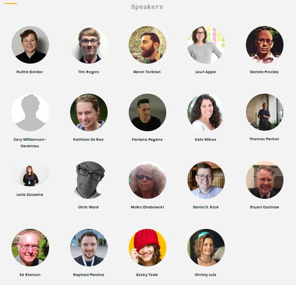

Jedno z najlepszych wydarzeń z naszej branży w Europie zbliża się dużymi
krokami. Przeczytajcie jak można się tam dostać i czego się spodziewać.

<!--truncate-->

### Szczypta historii

Tak było rok temu - jako patron medialny byliśmy oczywiście obecni i uraczyliśmy
Was
[szczegółową relacją](http://techwriter.pl/write-the-docs-europe-2016-relacja/)
😊. Zainteresowanych genezą konferencji zachęcamy do
[lektury wprowadzającej do tematu](http://techwriter.pl/poznajcie-write-the-docs-europe/).
Co jeszcze można dodać - też tam byliśmy, piwo piliśmy, nawet syr zjedliśmy -
zdecydowanie polecamy to miejsce, tych ludzi i ten klimat!

### Co w tym roku?

Oczywiście informacji najlepiej zasięgnąć
[u źródła](http://www.writethedocs.org/conf/eu/2017/), w telegraficznym
skrócie - w sobotę czeka Was zwiedzanie Pragi łódką i nawiązywanie znajomości, w
niedzielę [Writing Day](http://www.writethedocs.org/conf/eu/2017/writing-day/) i
wspólne rozwiązywanie problemów oraz nawiązywanie przyjaźni, w poniedziałek
właściwa konferencja i zacieśnianie więzów podczas wieczornego party, we wtorek
drugi dzień konferencji oraz tzw.
[unconference](http://www.writethedocs.org/conf/eu/2017/unconference/), wymiana
adresów, wzruszające pożegnania i obietnice częstej korespondencji. Generalnie
formuła niemal identyczna do
[tej sprzed roku](http://techwriter.pl/write-the-docs-coraz-blizej/).

### Kogo można spotkać?

Grono mówców wygląda przesympatycznie, sami spójrzcie w te szczere, uśmiechnięte
twarze:

Dokładny opis prelekcji i prelegentów
[znajdziecie tutaj](http://www.writethedocs.org/conf/eu/2017/speakers/). My już
wybraliśmy swoich faworytów, a Wy? Podzielcie się w komentarzach, podpowiedzcie
nam i innym. Poza prezenterami oczywiście dziesiątki uczestników z całego
świata. Rok temu nawiązaliśmy kontakty z techwriterami m.in. z Finlandii,
Australii, Czech, Węgier, USA, a nawet Polski!

### Ile to kosztuje?

Pod względem współczynnika cena/jakość ta konferencja nie ma konkurencji. Jeśli
nie chcecie prosić managera - wystarczy 150 Euro. Studenci i bezrobotni płacą
połowę stawki. Jeśli to firma finansuje Wam pobyt to z budżetu znika 250 Euro,
plus wydatki na hotel i dojazd (polecamy nocny autobus 😊). Dodatkowa
przejażdzka (przepłynka?) łodzią kosztuje dychę - można zabrać rodzinę i
znajomych. Wszystkie opcje z dokładnym opisem oraz możliwością zakupu dostępne
[tutaj](https://ti.to/writethedocs/write-the-docs-eu-2017/).

Uczciwie ostrzegamy, ta konferencja uzależnia!
