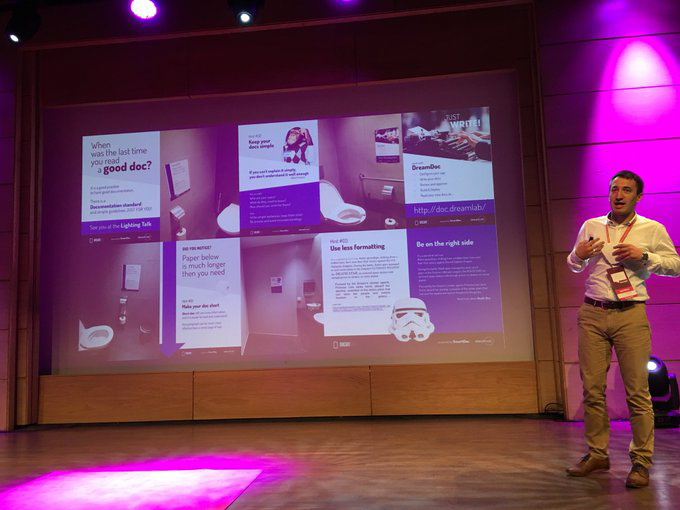
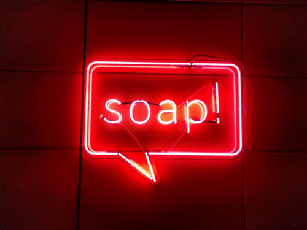

Rozważasz udział w jednej z konferencji tech writingowych: "Write The Docs" i
"SOAP", ale nie wiesz którą wybrać? Przedstawiam kilka wskazówek z perspektywy
osoby, która gościła zarówno na jednej i drugiej. Dzielę się subiektywnymi
przemyśleniami na ten temat i aby podjąć właściwy wybór musisz zajrzeć w głąb
siebie. Mam nadzieję, że artykuł pomoże Ci w tym trudnym zadaniu.

<!--truncate-->

###### Mikey Ariel podczas konferencji Write The Docs.

###### Rafał Pawlicki podczas konferencji SOAP.

## Wstęp

Konferencje [SOAP](https://soapconf.com/) i
[Write The Docs](https://www.writethedocs.org) (w skrócie "WTD") są dobrze znane
wśród osób zajmujących się technical writingiem. Zdecydowanie polecam je zarówno
początkującym jak i zaawansowanym pisarzom, bo dzięki nim możesz:

- być na bieżąco z najświeższymi trendami,
- wpaść na nowe pomysły na to, jak ugryźć dokumentację,
- spotkać wielu znajomych po fachu,
- świetnie się bawić!

Jeśli to możliwe, warto wziąć udział w obydwu.

Jeśli pracujesz na etacie, to być może liczysz, że Twoja firma zasponsoruje Ci
udział. Niestety, zdarza się, że budżet konferencyjno-szkoleniowy na dany rok
nie jest z gumy i musisz dokonać salomonowego wyboru między jednym a drugim
wydarzeniem.

Być może jedziesz za własne fundusze i tylko jedna konferencja wchodzi w grę.

Zwłaszcza jeśli rozważasz udział po raz pierwszy, zapoznaj się z poniższym
artykułem. Spróbuję przybliżyć Ci jak możesz się czuć na każdej z tych imprez.
Dostarczę też argumentów, jak obronić wybór przed szefem.

## Założenia i zastrzeżenia

Chciałbym podkreślić, że są to bardzo subiektywne, osobiste impresje na temat
tych dwóch wydarzeń. Wziąłem już udział w dwóch stacjonarnych odsłonach SOAP
(Kraków 2018 i 2022), jednej edycji stacjonarnej Write The Docs (Praga 2019) i
dwóch wirtualnych WTD (2020 i 2021). Siłą rzeczy, zawsze są tematy mniej i
bardziej pociągające, więc w żadnej z konferencji nie widziałem 100% wykładów i
wziąłem udział tylko w części wydarzeń dodatkowych. Nie mam na celu udowadniać,
że jedna konferencja wyraźnie góruje nad drugą: pamiętam, że w jednym roku ta
sama osoba prezentowała ten sam temat podczas obu wydarzeń, odbiorcy obu to też
w dużej mierze Ci sami ludzie. Chcę zwrócić uwagę na to co każdą z nich wyróżnia
i jaki klimat na nich panuje. Akcenty są rozłożone różnie i to sprawia, że
udział wiąże się z nieco innymi odczuciami. To tak jak z filmem: czasem masz
nastrój by obejrzeć komedię a czasami film obyczajowy, co nie znaczy, że jeden z
tych gatunków jest gorszy.

Moje wywody mogą być nietrafione i nie mają wartości naukowej - traktujmy je z
przymrużeniem oka.

Skoro wyjaśniłem moje krystaliczne intencje zatem - do dzieła!

## Porównanie

| Kategoria           | soap!                                                                                                                                                                                                                                                                                                                                                                                | Write the Docs                                                                                                                                                                                                                                                                                                                                                                                                                                                                                                                                                                                                                                                                                                                                                                                                                             |
| ------------------- | ------------------------------------------------------------------------------------------------------------------------------------------------------------------------------------------------------------------------------------------------------------------------------------------------------------------------------------------------------------------------------------ | ------------------------------------------------------------------------------------------------------------------------------------------------------------------------------------------------------------------------------------------------------------------------------------------------------------------------------------------------------------------------------------------------------------------------------------------------------------------------------------------------------------------------------------------------------------------------------------------------------------------------------------------------------------------------------------------------------------------------------------------------------------------------------------------------------------------------------------------ |
| Nazwa               | W rozmowie z poprzednim managerem (nie specjalizującym się w tech writingu) zaproponowałem, że pojadę na SOAP Content Conference. Padło pytanie „O czym jest ta konferencja?”. Podejrzewam, że sama nazwa mogła brzmieć tajemniczo.&nbsp; Może padło podejrzenie, że to warsztaty z wyrabiania mydła? Propozycja nie zyskała wtedy aprobaty. Za to tamtego roku pojechałem na WTD 😊 | Bardzo konkretna nazwa. Każdy przełożony zrozumie jaki jest cel tej konferencji.                                                                                                                                                                                                                                                                                                                                                                                                                                                                                                                                                                                                                                                                                                                                                           |
| Akcenty             | Minimalnie większy nacisk na narzędzia i rozwiązania. Wracasz do domu i myślisz „ciekawie to pomyśleli”. W jednym przypadku można było ściągnąć projekt z Githuba i zobaczyć konkretne narzędzie open-source w działaniu.Na konferencji dość często pojawiają się wystąpienia dotyczące e-learningu, content designu, structured writing (DITA).                                     | Duży nacisk na budowanie społeczności. Podczas inauguracji zachęca się do nawiązywania kontaktów np.: metodą pacmana. Chodzi o to, by grupka dyskutujących ludzi nie tworzyła zamkniętego kręgu, dzięki czemu do rozmowy łatwiej mogą dołączyć się nowi rozmówcy.                                                                                                                                                                                                                                                                                                                                                                                                                                                                                                                                                                          |
| Klimat              | Jest miejsce na spontaniczność, entuzjazm i dobrą zabawę.                                                                                                                                                                                                                                                                                                                            | Spokojnie, merytorycznie, uprzejmie. Gdyby ta konferencja była postacią komiksu, to byłaby to lekko introwertyczna osoba z intrygującymi zainteresowaniami takimi jak gry komputerowe, historia, poezja, czy pisanie piosenek. Pamiętam wystąpienia inspirowane tymi dziedzinami.                                                                                                                                                                                                                                                                                                                                                                                                                                                                                                                                                          |
| Tryb                | SOAP stawia na doświadczenia w „realu”.Większość prezentuje na żywo, niektórzy wdzwaniają się zdalnie.Choć organizatorzy uzupełnili ofertę o transmisję online to wciąż cenią bezpośrednie spotkanie ze słuchaczami. W czasie szczytu pandemii woleli imprezę przełożyć niż zastąpić ją internetowym wydarzeniem.                                                                    | Wcześniej odbywały się spotkania na żywo w czeskiej Pradze, obecnie organizatorzy stawiają na wydarzenie zdalne.Stosowany jest system wirtualnych stolików na platformie Hopin. Planowanie odbywa się za pomocą wspólnie edytowanego arkusza Excel, co pozwala połapać się w dostępnych panelach dyskusyjnych. Łatwo też możesz stać się gospodarzem własnego stolika i zaproponować dyskusję na frapujący Cię temat.Potrzebna jest biegłość w przełączaniu się między wydarzeniami na platformie.To jak dobrze będziesz się bawić zależy po części od tego jak bardzo chłoniesz nowinki techniczne i czy potrafisz poczuć klimat konferencji wdzwaniając się w serię wideocalli.Zależnie od Twojej sytuacji życiowej i lokalowej, Twoja rodzina lub sublokatorzy mogą skutecznie odrywać Cię od konferencji, którą odbywasz w swoim domu. |
| Plan główny         | Dwa dni, a każdego dnia masz serię wykładów, po których z widowni zadawane są&nbsp; pytania do prelegentów. Każdego dnia masz 9-10 prezentacji do wyboru z kateringiem w połowie dnia.Nie ma wydarzeń toczących się równolegle, jest ciąg wykładów z przerwami między nimi.                                                                                                          | Dwa dni wykładów. Transmitowanych jest 6-7 nagranych prezentacji dziennie, po każdej przeprowadzana jest sesja Q&amp;A na żywo.Wymagana jest zdolność dobrego planowania, czasem potrzebujesz wybrać między wykładem a toczącą się równolegle dyskusją stolikową.                                                                                                                                                                                                                                                                                                                                                                                                                                                                                                                                                                          |
| Zajęcia dodatkowe   | Warsztaty tematyczne za niezbyt wygórowaną dopłatą. Bilet na konferencję umożliwia dokupienie dodatkowych biletów wstępu na warsztaty.                                                                                                                                                                                                                                               | W cenie biletu następujące aktywności:Writing Day&nbsp;– zaproszenie do wzięcia udziału we wspólnym projekcie, dyskusji nad problemem, przedstawieniu narzędzia.Unconference – możliwość prowadzenia wirtualnego stolika do rozmów na wybrany temat. Możesz przywieźć na konferencję swój szczególny problem do rozwikłania i otrzymasz opinie wielu doświadczonych osób!Podsumowując, jest bardzo dużo okazji do nawiązania nowych kontaktów, porozmawiania z ludźmi z branży i spróbowania swoich sił w projekcie do wykonania.Grupy ochotników często wspólnie opracowują wiersz albo piosenkę.Oprócz tego występują:Lightning talks – krótkie wystąpienia, często na temat pozapisarskich hobby.Job Fair – stoisko przy którym porozmawiasz z firmami rekrutującymi tech writerów.                                                     |
| Integracja          | Drugiego dnia zwykle robione jest after party po zakończeniu. Najczęściej jest to lokal T.E.A. Time na ulicy Dietla 1, w Krakowie 😉                                                                                                                                                                                                                                                 | Do późnych godzin można korzystać z wirtualnych stolików, gdzie można pisać na czacie, przysłuchiwać się dyskusjom i zabierać w nich głos.Planowane są też specjalne, wirtualne sesje integracyjne.                                                                                                                                                                                                                                                                                                                                                                                                                                                                                                                                                                                                                                        |
| Elementy szczególne | W cenie biletu otrzymujesz wejście do Muzeum Sztuki i Techniki Japońskiej "Mangha".W 2022 wprowadzono wersję Familiady dla techno skrybów.Osoba która zada pytanie z widowni otrzymuje różowe mydło 😊                                                                                                                                                                               | WTD posiada logo w wersji metalowej, którego autorem jest Christofe Szpajdel. Szanuję!W edycji stacjonarnej do dyspozycji odwiedzających był Quiet Room - ciche pomieszczenie dla osób chcących odreagować konferencyjny rejwach.Po konferencji udostępniane są rysunkowe podsumowania wykładów.Organizatorzy w trakcie trwania wiele razy wspominają o Code of Conduct - regulaminie uprzejmego zachowania. Wedle niego należy zachowywać się kulturalnie i nikogo nie urazić.WTD ma stale funkcjonujące forum dyskusyjne na Slack, gdzie można szybko uzyskać opinię o każdym aspekcie dokumentacji.                                                                                                                                                                                                                                     |

## Podsumowanie

Najlepiej wypróbować obie i wyrobić sobie własną opinię. Na kanałach YouTube obu
konferencji można zapoznać się z opublikowanymi nagraniami prezentacji z
wcześniejszych edycji:

- [SOAP](https://www.youtube.com/c/SoapconfPage)
- [WTD](https://www.youtube.com/c/WritetheDocs)

Tegoroczną edycję SOAP 2022 mamy już za sobą - zapraszam do przeczytania
[relacji z niej](http://techwriter.pl/doniesienia-z-tegoroczenj-konferencji-soap-2022/).

Jeśli chcesz, zapoznaj się z relacjami z wcześniejszych edycji. Znajdziesz tam
więcej informacji o ciągle aktualnych tematach i wrażeniach z tamtych spotkań.

- [Write the Docs Prague 2021 (online)](http://techwriter.pl/relacja-z-konferenecji-write-the-docs-prague-2021/)
- [Write the Docs Prague 2020 (online)](http://techwriter.pl/relacja-z-write-the-docs-prague-2020-online/)
- [SOAP Content Conference 2019](http://techwriter.pl/konferencja-soap-2019-wideorelacja/)
- [Write the Docs Prague 2019](http://techwriter.pl/nasza-relacja-z-write-the-docs-prague-2019/)
- [Write the Docs Prague 2018](http://techwriter.pl/write-the-docs-prague-2018-relacja/)
- [SOAP Content Conference 2018](http://techwriter.pl/konferencja-soap-2018-relacja/)
- [Write the Docs Prague 2017](http://techwriter.pl/write-the-docs-prague-2017-relacja/)
- [Write the Docs Europe 2016](http://techwriter.pl/write-the-docs-europe-2016-relacja/)

11-13 września 2022 odbędzie się WTD - Prague edition. Wybierzesz się? Więcej
informacji znajdziesz w tej
[zapowiedzi](http://techwriter.pl/write-the-docs-prague-2022-juz-we-wrzesniu/).
