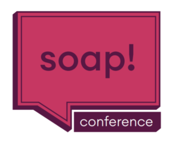
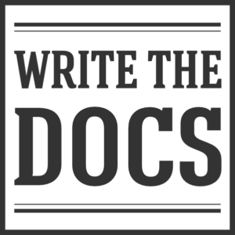
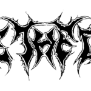

Rozważasz udział w jednej z konferencji tech writingowych: "Write The Docs" i
"SOAP", ale nie wiesz którą wybrać? Przedstawiam kilka wskazówek z perspektywy
osoby, która gościła zarówno na jednej i drugiej. Dzielę się subiektywnymi
przemyśleniami na ten temat i aby podjąć właściwy wybór musisz zajrzeć w głąb
siebie. Mam nadzieję, że artykuł pomoże Ci w tym trudnym zadaniu.

###### Mikey Ariel podczas konferencji Write The Docs.

###### Rafał Pawlicki podczas konferencji SOAP.

# Wstęp

Konferencje [SOAP](https://soapconf.com/) i
[Write The Docs](https://www.writethedocs.org) (w skrócie "WTD") są dobrze znane
wśród osób zajmujących się technical writingiem. Zdecydowanie polecam je zarówno
początkującym jak i zaawansowanym pisarzom, bo dzięki nim możesz:

- być na bieżąco z najświeższymi trendami,
- wpaść na nowe pomysły na to, jak ugryźć dokumentację,
- spotkać wielu znajomych po fachu,
- świetnie się bawić!

Jeśli to możliwe, warto wziąć udział w obydwu.

Jeśli pracujesz na etacie, to być może liczysz, że Twoja firma zasponsoruje Ci
udział. Niestety, zdarza się, że budżet konferencyjno-szkoleniowy na dany rok
nie jest z gumy i musisz dokonać salomonowego wyboru między jednym a drugim
wydarzeniem.

Być może jedziesz za własne fundusze i tylko jedna konferencja wchodzi w grę.

Zwłaszcza jeśli rozważasz udział po raz pierwszy, zapoznaj się z poniższym
artykułem. Spróbuję przybliżyć Ci jak możesz się czuć na każdej z tych imprez.
Dostarczę też argumentów, jak obronić wybór przed szefem.

# Założenia i zastrzeżenia

Chciałbym podkreślić, że są to bardzo subiektywne, osobiste impresje na temat
tych dwóch wydarzeń. Wziąłem już udział w dwóch stacjonarnych odsłonach SOAP
(Kraków 2018 i 2022), jednej edycji stacjonarnej Write The Docs (Praga 2019) i
dwóch wirtualnych WTD (2020 i 2021). Siłą rzeczy, zawsze są tematy mniej i
bardziej pociągające, więc w żadnej z konferencji nie widziałem 100% wykładów i
wziąłem udział tylko w części wydarzeń dodatkowych. Nie mam na celu udowadniać,
że jedna konferencja wyraźnie góruje nad drugą: pamiętam, że w jednym roku ta
sama osoba prezentowała ten sam temat podczas obu wydarzeń, odbiorcy obu to też
w dużej mierze Ci sami ludzie. Chcę zwrócić uwagę na to co każdą z nich wyróżnia
i jaki klimat na nich panuje. Akcenty są rozłożone różnie i to sprawia, że
udział wiąże się z nieco innymi odczuciami. To tak jak z filmem: czasem masz
nastrój by obejrzeć komedię a czasami film obyczajowy, co nie znaczy, że jeden z
tych gatunków jest gorszy.

Moje wywody mogą być nietrafione i nie mają wartości naukowej - traktujmy je z
przymrużeniem oka.

Skoro wyjaśniłem moje krystaliczne intencje zatem - do dzieła!

# Porównanie

<table width="612"><tbody><tr><td width="80">
<strong>Logo</strong>
</td><td width="220">
<strong></strong>
</td><td width="312">
<strong></strong>
</td></tr><tr><td style="text-align: center;" width="96"><strong>Nazwa</strong></td><td style="text-align: justify;" width="228">W rozmowie z poprzednim managerem (nie specjalizującym się w tech writingu) zaproponowałem, że pojadę na SOAP Content Conference. Padło pytanie „<em>O czym jest ta konferencja</em>?”. Podejrzewam, że sama nazwa mogła brzmieć tajemniczo.&nbsp; Może padło podejrzenie, że to warsztaty z wyrabiania mydła? Propozycja nie zyskała wtedy aprobaty. Za to tamtego roku pojechałem na WTD 😊</td><td style="text-align: justify;" width="312">Bardzo konkretna nazwa. Każdy przełożony zrozumie jaki jest cel tej konferencji.</td></tr><tr><td style="text-align: center;" width="96"><strong>Akcenty</strong></td><td style="text-align: justify;" width="228">Minimalnie większy nacisk na narzędzia i rozwiązania. Wracasz do domu i myślisz „ciekawie to pomyśleli”. W jednym przypadku można było ściągnąć projekt z Githuba i zobaczyć konkretne narzędzie open-source w działaniu.

Na konferencji dość często pojawiają się wystąpienia dotyczące e-learningu, content designu, structured writing (DITA).</td><td style="text-align: justify;" width="312">Duży nacisk na budowanie społeczności. Podczas inauguracji zachęca się do nawiązywania kontaktów np.: metodą pacmana. Chodzi o to, by grupka dyskutujących ludzi nie tworzyła zamkniętego kręgu, dzięki czemu do rozmowy łatwiej mogą dołączyć się nowi rozmówcy.</td></tr><tr><td style="text-align: center;" width="96"><strong>Klimat</strong></td><td style="text-align: justify;" width="228">Jest miejsce na spontaniczność, entuzjazm i dobrą zabawę.</td><td style="text-align: justify;" width="312">Spokojnie, merytorycznie, uprzejmie. Gdyby ta konferencja była postacią komiksu, to byłaby to lekko introwertyczna osoba z intrygującymi zainteresowaniami takimi jak gry komputerowe, historia, poezja, czy pisanie piosenek. Pamiętam wystąpienia inspirowane tymi dziedzinami.</td></tr><tr><td style="text-align: center;" width="96"><strong>Tryb</strong></td><td style="text-align: justify;" width="228">SOAP stawia na doświadczenia w „realu”.

Większość prezentuje na żywo, niektórzy wdzwaniają się zdalnie.

Choć organizatorzy uzupełnili ofertę o transmisję online to wciąż cenią bezpośrednie spotkanie ze słuchaczami. W czasie szczytu pandemii woleli imprezę przełożyć niż zastąpić ją internetowym wydarzeniem.</td><td style="text-align: justify;" width="312">Wcześniej odbywały się spotkania na żywo w czeskiej Pradze, obecnie organizatorzy stawiają na wydarzenie zdalne.

Stosowany jest system wirtualnych stolików na platformie Hopin. Planowanie odbywa się za pomocą wspólnie edytowanego arkusza Excel, co pozwala połapać się w dostępnych panelach dyskusyjnych. Łatwo też możesz stać się gospodarzem własnego stolika i zaproponować dyskusję na frapujący Cię temat.

Potrzebna jest biegłość w przełączaniu się między wydarzeniami na platformie.

To jak dobrze będziesz się bawić zależy po części od tego jak bardzo chłoniesz nowinki techniczne i czy potrafisz poczuć klimat konferencji wdzwaniając się w serię wideocalli.
Zależnie od Twojej sytuacji życiowej i lokalowej, Twoja rodzina lub sublokatorzy mogą skutecznie odrywać Cię od konferencji, którą odbywasz w swoim domu.
</td></tr><tr><td style="text-align: center;" width="96"><strong>Plan główny</strong></td><td style="text-align: justify;" width="228">Dwa dni, a każdego dnia masz serię wykładów, po których z widowni zadawane są&nbsp; pytania do prelegentów. Każdego dnia masz 9-10 prezentacji do wyboru z kateringiem w połowie dnia.

Nie ma wydarzeń toczących się równolegle, jest ciąg wykładów z przerwami między nimi.</td><td style="text-align: justify;" width="312">Dwa dni wykładów. Transmitowanych jest 6-7 nagranych prezentacji dziennie, po każdej przeprowadzana jest sesja Q&amp;A na żywo.

Wymagana jest zdolność dobrego planowania, czasem potrzebujesz wybrać między wykładem a toczącą się równolegle dyskusją stolikową.</td></tr><tr><td style="text-align: center;" width="96"><strong>Zajęcia dodatkowe</strong></td><td style="text-align: justify;" width="228">Warsztaty tematyczne za niezbyt wygórowaną dopłatą. Bilet na konferencję umożliwia dokupienie dodatkowych biletów wstępu na warsztaty.</td><td width="312">
W cenie biletu następujące aktywności:

<ul><li style="text-align: justify;"><strong>Writing Day&nbsp;</strong>– zaproszenie do wzięcia udziału we wspólnym projekcie, dyskusji nad problemem, przedstawieniu narzędzia.</li><li style="text-align: justify;"><strong>Unconference</strong> – możliwość prowadzenia wirtualnego stolika do rozmów na wybrany temat. Możesz przywieźć na konferencję swój szczególny problem do rozwikłania i otrzymasz opinie wielu doświadczonych osób!</li></ul>Podsumowując, jest bardzo dużo okazji do nawiązania nowych kontaktów, porozmawiania z ludźmi z branży i spróbowania swoich sił w projekcie do wykonania.

Grupy ochotników często wspólnie opracowują wiersz albo piosenkę.

Oprócz tego występują:<ul><li style="text-align: justify;"><strong>Lightning talks</strong> – krótkie wystąpienia, często na temat pozapisarskich hobby.</li><li style="text-align: justify;"><strong>Job Fair</strong> – stoisko przy którym porozmawiasz z firmami rekrutującymi tech writerów.</li></ul></td></tr><tr><td style="text-align: center;" width="96"><strong>Integracja</strong></td><td style="text-align: justify;" width="228">Drugiego dnia zwykle robione jest <em>after party </em>po zakończeniu. Najczęściej jest to lokal T.E.A. Time na ulicy Dietla 1, w Krakowie ;)</td><td width="312">
Do późnych godzin można korzystać z wirtualnych stolików, gdzie można pisać na czacie, przysłuchiwać się dyskusjom i zabierać w nich głos.

Planowane są też specjalne, wirtualne sesje integracyjne.
</td></tr><tr><td style="text-align: center;" width="96"><strong>Elementy szczególne</strong></td><td width="228"><ul><li style="text-align: justify;">W cenie biletu otrzymujesz wejście do Muzeum Sztuki i Techniki Japońskiej "Mangha".</li><li style="text-align: justify;">W 2022 wprowadzono wersję Familiady dla techno skrybów.</li><li style="text-align: justify;">Osoba która zada pytanie z widowni otrzymuje różowe mydło :)</li></ul></td><td width="312"><ul><li style="text-align: justify;">WTD posiada logo w wersji metalowej, którego autorem jest <a href="https://www.flickr.com/photos/christopheszpajdel/">Christofe Szpajdel</a>. Szanuję!</li><li style="text-align: justify;">W edycji stacjonarnej do dyspozycji odwiedzających był <strong>Quiet Room</strong> - ciche pomieszczenie dla osób chcących odreagować konferencyjny rejwach.</li><li style="text-align: justify;">Po konferencji udostępniane są <a href="https://www.flickr.com/photos/writethedocs/albums/72157720128594755">rysunkowe podsumowania wykładów</a>.</li><li style="text-align: justify;">Organizatorzy w trakcie trwania wiele razy wspominają o <strong>Code of Conduct</strong> - regulaminie uprzejmego zachowania. Wedle niego należy zachowywać się kulturalnie i nikogo nie urazić.</li><li style="text-align: justify;">WTD ma stale funkcjonujące forum dyskusyjne na <a href="https://www.writethedocs.org/slack/">Slack</a>, gdzie można szybko uzyskać opinię o każdym aspekcie dokumentacji.</li></ul></td></tr></tbody></table>

# Podsumowanie

Najlepiej wypróbować obie i wyrobić sobie własną opinię. Na kanałach YouTube obu
konferencji można zapoznać się z opublikowanymi nagraniami prezentacji z
wcześniejszych edycji:

- [SOAP](https://www.youtube.com/c/SoapconfPage)
- [WTD](https://www.youtube.com/c/WritetheDocs)

Tegoroczną edycję SOAP 2022 mamy już za sobą - zapraszam do przeczytania
[relacji z niej](http://techwriter.pl/doniesienia-z-tegoroczenj-konferencji-soap-2022/).

Jeśli chcesz, zapoznaj się z relacjami z wcześniejszych edycji. Znajdziesz tam
więcej informacji o ciągle aktualnych tematach i wrażeniach z tamtych spotkań.

- [Write the Docs Prague 2021 (online)](http://techwriter.pl/relacja-z-konferenecji-write-the-docs-prague-2021/)
- [Write the Docs Prague 2020 (online)](http://techwriter.pl/relacja-z-write-the-docs-prague-2020-online/)
- [SOAP Content Conference 2019](http://techwriter.pl/konferencja-soap-2019-wideorelacja/)
- [Write the Docs Prague 2019](http://techwriter.pl/nasza-relacja-z-write-the-docs-prague-2019/)
- [Write the Docs Prague 2018](http://techwriter.pl/write-the-docs-prague-2018-relacja/)
- [SOAP Content Conference 2018](http://techwriter.pl/konferencja-soap-2018-relacja/)
- [Write the Docs Prague 2017](http://techwriter.pl/write-the-docs-prague-2017-relacja/)
- [Write the Docs Europe 2016](http://techwriter.pl/write-the-docs-europe-2016-relacja/)

11-13 września 2022 odbędzie się WTD - Prague edition. Wybierzesz się? Więcej
informacji znajdziesz w tej
[zapowiedzi](http://techwriter.pl/write-the-docs-prague-2022-juz-we-wrzesniu/).
