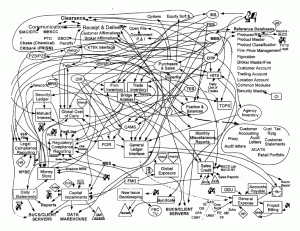

Jak fiksować ale nie sfiksować i dlaczego kanselowanie jest lepsze od
postponowania, czyli ciąg dalszy opowieści o isiusach i kejsach. W kontekście
floł.

<!--truncate-->

W [poprzedniej części naszego cyklu](../langlydz-part-folur/index.md) dogłębnie
wytłumaczyliśmy pojęcie isiu (będziemy się upierać, że w wielu firmach isiu jest
niemal synonimem kejsa). Co zatem dzieje się z takim isiu, kiedy już się urodzi?

- Okres wczesnego niemowlęctwa spędza w stanie niu (_nowy_).
- Później zazwyczaj zostaje bękartem - odbywa się to przy pomocy operacji
  asajnowania (_podrzucenia najmniej zajętej, najmniej protestującej lub po
  prostu nieobecnej osobie_).
- Bękart zostaje poddany intensywnym działaniom wychowawczym, korygującym,
  naprawczym... chyba że nie😊.
- W efekcie zostaje sfiksowany (_naprawiony_), albo nie... czyli czeka sobie
  postponowany (_podmieciony pod dywan_) na lepsze czasy.
- Podrośnięte isiu przechodzi zazwyczaj jeszcze skomplikowaną procedurę
  adopcyjną - jak wiadomo sukces ma wielu ojców, a w naszej pracy spotyka się
  same sukcesy - i znów zostaje asajnowane komuś. Tym razem w celu sprawdzenia
  czy zostało sfiksowane (_naprawione_) a nie sfiksowało samo (_went crazy_).
- Rodzina zastępcza, w zależności od pory dnia, nastroju, kompetencji,
  znajomości tematu, itp., itd... może takiego dojrzałego isiusa albo konfirmnąć
  (_potwierdzić że problem już nie występuje_), albo (o zgrozo!) - sfejlować
  (_potwierdzić, że jednak nie udało się go naprawić_).
- W przypadku sfejlowania wracamy do etapu podrzutka (punkt drugi).

Powyższy opis często przedstawia się w formie prostego diagramu:

Skomplikowane? Bez trwogi, z każdej
sytuacji istnieje wyjście, a cykl życia isiusów nie jest tutaj wyjątkiem. Wzorem
Aleksandra Macedońskiego możecie wybrnąć z tej sytuacji jednym zgrabnym
pociągnięciem myszki.

Kanselując (_anulując, odwołując_) isiusa
pozbywacie się problemu i odzyskujecie wigor, świeżość spojrzenia oraz wzmożoną
chęć do pracy twórczej. Przynajmniej do czasu pojawienia się następnego 😊.
