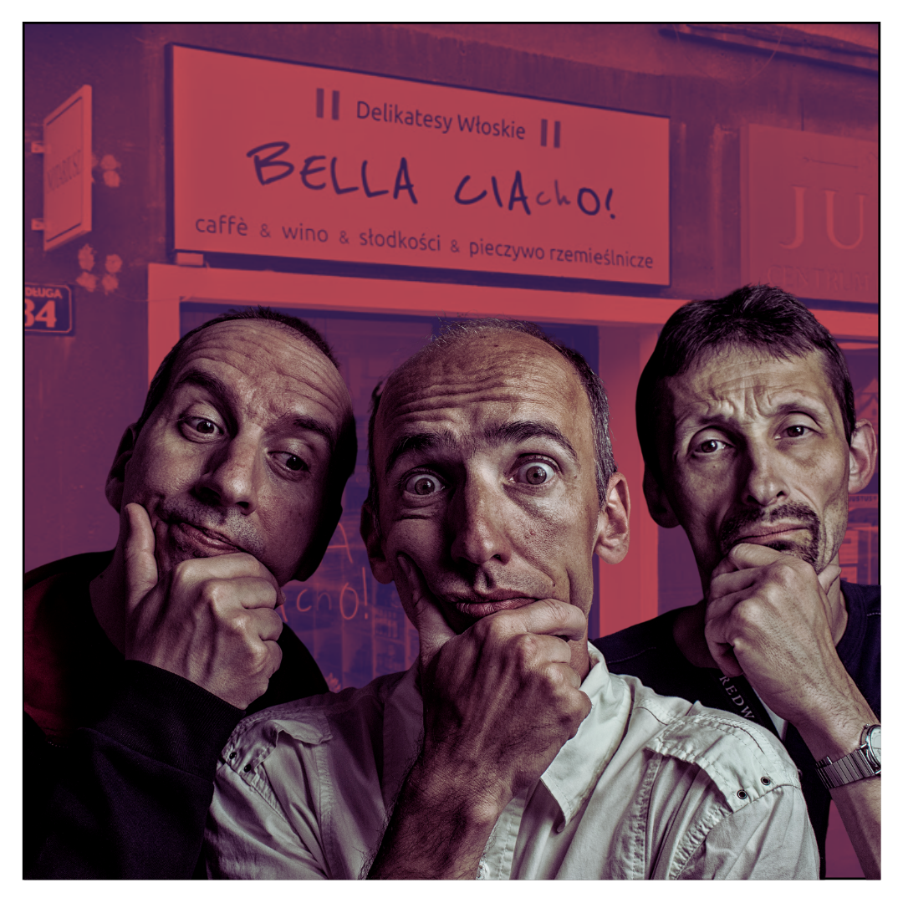

Ludzie czasem hejtują na korpomowę. Ja tego nie robię i to serio, bez ironii.
Korpomowa to nie jest jakaś orwellowska nowomowa. Korpomowa to coś bardzo
przydatnego: **żargon**.

<!--truncate-->

## Po co nam żargon

Żargon, w tym żargon oparty o zapożyczenia, jest jak najbardziej w porządku.
Ułatwia i przyspiesza komunikację, a dodatkowo służy do identyfikacji zawodowej
(mówimy i czujemy się jak członkowie grupy). Żargon jest ładny, tak jak żółty
kask jest ładny, bo pasuje do okazji. Na budowie używasz żółtego kasku, a w
pracy używasz żargonu.

Przykład: Robimy PRy do repo, żeby rozwiązać issue. Jak nafarmimy quick winów,
to będzie o czym opowiadać na meetupie. Dobrze się składa, bo otworzyli call for
papers.

Jak jest _call for papers_ po polsku? Nie wiem, bo nie brałem udziału w
konferencji akademickiej od czasów studiów. Szybciej jest powiedzieć call for
papers, niż tworzyć sztuczne zamienniki, albo robić "yyy" i "aaa" próbując sobie
przypomnieć jakieś archaiczne polskie słowo.

## Przepraszam, czy mogę pożyczyć słówko?

Zapożyczenia, nie tylko żargonowe, ale również te w mowie powszechnej, ogólnie
wzbogacają język. Bez nich byśmy nie mieli fryzjera, dachu, czy meczu.

Nawet zapożyczone znaczenia są fajne; kontrybucja nie musi się kojarzyć tylko z
wojną, ale może oznaczać pozytywny wkład. Pasjonat nie musi wpadać w złość, może
po prostu bardzo coś lubić. A kolaboracja nie musi oznaczać przejścia na stronę
wroga.

Mam silne przekonanie, że mój punkt widzenia nie wymaga obrony. Może wynika z to
faktu, że ukończyłem studia językoznawcze, a może z przekonania o własnej
nieomylności w pewnych kwestiach 😉. Tak czy siak, nie da się zaprzeczyć, że to
już było, to już przerabialiśmy, wiele wiele razy. Zapożyczenia sprawiają, że
język żyje.

Polglisz też na pewno wzbogaca język, co nie zmienia faktu, **że mam kilka
pytań**. Dlatego też napisałem ten mini artykulik: bo mam kilka pytań o
polglisz.

## Pytania o polglisz

Jest taka platforma shoper.pl. Czy poprawna wymowa to _szołper_?

Kiss the Kuk pewnie ma się kojarzyć z kucharzem. Ale ja zawsze z rozpędu czytam
to jak _kiss the cuck_? Możliwe, że to znaczy coś innego, ale nie googlam. 🤔

Mashroom \- chcieliby pewnie, żebym to przeczytał tak jak “mushroom”. Tak mam
zrobić?

Bella Ciacho \- okej, to nie jest polglisz, tylko poltalian, ale kiedyś
widziałem jak trzej Włosi stali przed tym szyldem i się zastanawiali jak to
powiedzieć. “Bella...? Ćjaćjo???” Chciałbym im pomóc, ale nie umiem.

Albo coś bardziej ezoterycznego. Reklama napoju wysoka na pięć pięter, a na niej
napisane “Hydrate for Great” \- co to znaczy? Czy w tym zdaniu czegoś nie
brakuje?

Ale pomijając znaczenie, jak ja mam to przeczytać? Jak akcentuję słowa
poprawnie, to mi się nie rymuje. Poprawnie bym powiedział: /**HAI**\-dreit
for-**GREIT**/. Pomysłodawcy reklamy chyba by chcieli, żebym powiedział
/hai-**DREIT** for **GREIT**/ albo może /**HAI**\-dreit **FOR**\-greit/? Nie
wiem. Ten napis zrobił mi wodę z mózgu.

To jest trochę podobne to tego, o czym mówił znany językoznawca Limmy:

[https://www.youtube.com/watch?v=xvsJwLnVEWk](https://www.youtube.com/watch?v=xvsJwLnVEWk)

Tak czy inaczej, dzięki, że doczytaliście do końca. Mam nadzieję, ten artykuł
będzie dla mnie pierwszym krokiem do zrozumienia polglisza. Może nawet nauczę
się go tworzyć.
