W tym roku mieliśmy przyjemność być partnerem medialnym konferencji [MadWorld](http://www.madcapsoftware.com/events/madworld/?utm_source=TechWriterPL&utm_medium=Banner&utm_campaign=MadWorld2017) organizowanej przez firmę [MadCap Software](http://www.madcapsoftware.com/). Dzięki ogromnej sile woli, licznym poświęceniom i niebywałej determinacji udało nam się dotrzeć do słonecznej Kalifornii, dlatego też mamy dla Was relację z pierwszej ręki.

Konferencja rozpoczęła się w niedzielę (2 kwietnia). W ten dzień można było się zarejestrować, odwiedzić ekspertów od produktów MadCap w [Hospitality Lounge](#hospitality_lounge) i wziąć udział w przyjęciu powitalnym. W poniedziałek i wtorek (3-4 kwietnia) miały miejsce prezentacje. W ciągu tych dwóch dni również można było porozmawiać z ekspertami w Hospitality Lounge. Każdy dzień zakończony był imprezą. Środa (5 kwietnia) była przeznaczona dla osób, które wykupiły osobną wejściówkę na warsztaty. Ten dzień zakończył się krótkim spotkaniem przy piwie (lub czymś mocniejszym). Organizacja wydarzenia stała na wysokim poziomie. Proces rejestracji przebiegł bardzo sprawnie i po kilku minutach mogliśmy się już cieszyć naszym pakietem rejestracyjnym, w którym można było znaleźć m.in. koszulkę oraz kubek termiczny.

[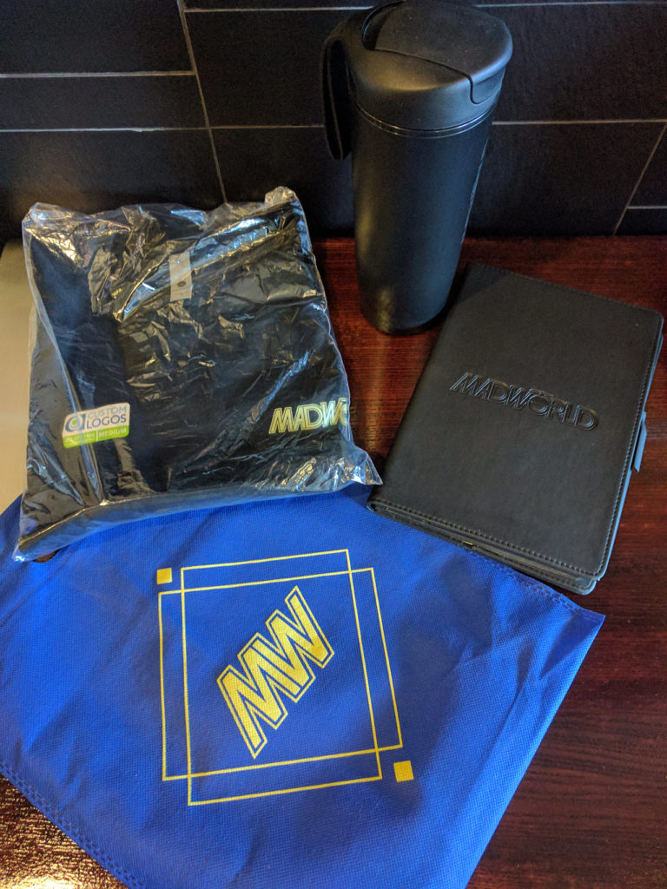](http://techwriter.pl/wp-content/uploads/2017/05/IMG_20170402_160115.jpg)

Jeśli chodzi o organizatorów, to byli bardzo otwarci i przyjaźni w stosunku do uczestników. W powietrzu można było wyczuć “amerykański luz”, który zachęcał, żeby zamienić ze wszystkimi słowo lub dwa.

# Wielkie otwarcie

Pierwszy dzień prezentacji otworzyła sesja ogólna. Na scenie pojawił się **Anthony Olivier**, kapitan statku MadCap, lub jak kto woli, po prostu CEO. Po krótkim powitaniu uczestników przedstawił nam z grubsza jakie zmiany ostatnimi czasy nastąpiły w stylu pracy firmy i jej produktach. MadCap stał się bardziej Agile’owy. Dawniej wypuszczali jedną wersję na rok, teraz chcą częściej naprawiać problemy i dostarczać nowe funkcje. [MadCap Central](http://www.madcapsoftware.com/products/central/) wzbogacił się ostatnio o integrację ze Slackiem, a [Flare](http://www.madcapsoftware.com/products/flare/), np. o nowości w skórce Top Nav i integrację z wyszukiwarką Google.

[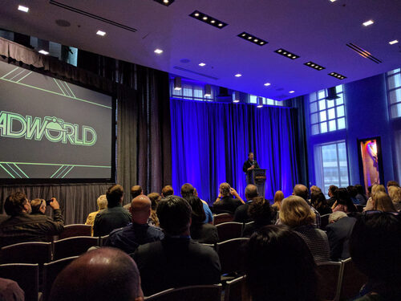](http://techwriter.pl/wp-content/uploads/2017/05/IMG_20170403_083744.jpg)Następnie mikrofon przejęła **Jennifer Morse**, Product Evangelist w MadCap. Po omówieniu rzeczy organizacyjnych oddała scenę prelegentom. Każdy z nich pokrótce opowiadał o sobie i prezentacjach oraz warsztatach, które miał poprowadzić. Niekiedy były to mini stand-upy, które wzbudzały salwę śmiechu na sali. Poza rozrywkowym aspektem, ta część konferencji była świetną okazją, żeby przyjrzeć się dokładniej prezentacjom i oswoić się z prelegentami. Widząc tylko nazwisko na papierze możemy czasem czuć się onieśmieleni autorytetem i pozycją prowadzącego prezentację. Po takim krótkim wstępie okazuje się jednak, że prelegenci “nie gryzą” i wtedy łatwiej uczestnikom nawiązać z nimi bezpośredni kontakt. Dobre posunięcie ze strony organizatorów.

# Prezentacje

## Pierwszy dzień

Każdy z dwóch dni prezentacji oferował uczestnikom 5 sesji, z której każda miała 4 wątki (tracks), dlatego czasami ciężko było się zdecydować, który wybrać. Pomocna tutaj była [prezentacja otwierająca](#otwarcie), podczas której poznaliśmy bliżej tematy prelekcji. Oprócz tego mogliśmy się posiłkować harmonogramem, w którym przy każdej prezentacji była informacja o jej poziomie zaawansowania i o narzędziu lub dziedzinie, której dotyczyła.

Pierwsza prezentacja, w której uczestniczyliśmy nosiła tytuł **Maximizing Re-use within MadCap Flare**. Poprowadził ją [**Matthew Ellison**](http://www.madcapsoftware.com/events/madworld/speakers/matthew-ellison/), który na rozgrzewkę pokazał nam kilka zdjęć ze swoich występów teatralnych, które są jego hobby. Następnie opowiedział nam o tym w jaki sposób można wycisnąć maksymalne korzyści z ponownego wykorzystania treści (reuse) za pomocą snippetów (wycinków treści, które mogą być wielokrotnie użyte) i zmiennych. Główna zasada ponownego wykorzystania treści  to “pisz raz, używaj wiele razy”. Musimy jednak pamiętać, żeby nie dostać na tym punkcie obsesji, bo będziemy więcej czasu spędzać na zarządzaniu reusem niż to jest warte. Następnie, Matthew omówił główne różnice pomiędzy snippetami i zmiennymi oraz w jaki sposób możemy je współdzielić pomiędzy projektami. Jedną z opcji jest posiadanie głównego projektu (Global Project) ze wspólnymi elementami, które następnie importujemy do innych projektów. Ciekawostką były Snippet Variables, czyli możliwość przypisania wartości zmiennym we właściwościach snippeta. Widać było gołym okiem, że Matthew to zaprawiony w bojach prezenter. Kiedy coś szło nie tak, potrafił obrócić to w żart i zaskarbić sobie jeszcze większą sympatię publiczności.

Kolejne wystąpienie pt. **“Wait, What Did You Just Do?” Tips for Enhancing Your Authoring Experience** poprowadził [**Derek Warren**](http://www.madcapsoftware.com/events/madworld/speakers/derek-warren/). Prezentacja była bardzo praktyczna, ale niezbyt porywająca. Prelegent demonstrował sposoby na ułatwienie sobie pracy we Flarze. Wspomniał o Quick Launch box (do szybkiego odnalezienia konkretnego topiku), widoku File List (dającym nam ogólny pogląd na topiki jakie mamy) oraz funkcjach Locate in TOC i Locate in Explorer (dzięki, którym możemy odnaleźć topik w spisie treści i oknie Content Explorer). Derek pokazał nam również jak tworzyć i zachowywać różne układy okien (Layouts). Na przykład, możemy sobie stworzyć inny układ okien do pracy na małym i dużym ekranie. Zasugerował nam też korzystanie z makr do wykonywania często powtarzanych operacji.

[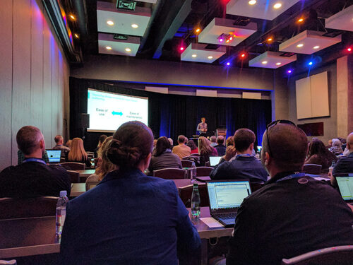](http://techwriter.pl/wp-content/uploads/2017/05/IMG_20170403_101100.jpg)

Po obfitym lunchu, powróciliśmy do sali na prezentację [**Daniela Fergusona**](http://www.madcapsoftware.com/events/madworld/speakers/daniel-ferguson/) pt. **Be Responsible: Using MadCap Flare’s Responsive Design Editor**. Prowadzący zaczął od historii o tym jak lata wcześniej został zwolniony z pracy (notabene razem z Tomem Johnsonem, autorem bloga [I’d Rather Be Writing](http://idratherbewriting.com/)) i zdecydował się zostać niezależnym konsultantem. Używał wtedy Flare’a zaledwie od pół roku, ale umieścił na swojej stronie informację o znajomości tego narzędzia. To spowodowało, że dostał pierwsze zlecenie – migrację dokumentacji z Author-it do Flare’a. Była to ciężka przeprawa, ale warto było wylać trochę potu i łez, ponieważ obecnie ponad 90% zleceń jakie otrzymuje jest związane z Flarem. Po tym krótkim wstępie, Daniel opowiedział nam trochę o Responsive Web Design. Ten rodzaj projektowania oznacza, że rozmiar strony dostosowuje się do wielkości ekranu przez co przeglądanie jej na urządzeniach mobilnych jest prostsze. Głównie dzieje się tak za sprawą odpowiedniej konfiguracji CSS, w której określamy osobne ustawienia dla różnych medium. Dlatego musimy unikać używania stylów lokalnych (inline styles). Jeśli chodzi o Flare’a i Responsive Web Design, to jest on wspierany w pełni dopiero od wersji 12 kiedy wprowadzono Responsive Design Editor. Dzięki niemu, możemy skonfigurować treść pod względem responsywności. Żeby taką konfigurację zrobić dobrze, musimy zapoznać się z pojęciem siatki (grid), czyli podziałem ekranu na segmenty, w których będzie pojawiać się treść. Po części teoretycznej, przeszliśmy do ćwiczenia, dzięki któremu nauczyliśmy się jak we Flarze skonfigurować Responsive Layout. Była to bardzo praktyczna prezentacja, której forma bardziej przypominała warsztat. Takie prezentacje lubimy najbardziej, bo można z nich najwięcej wyciągnąć.

Po zgłębieniu tajników responsywnego projektowania treści, przeszliśmy do całkowicie innego zagadnienia. [**Lindsay Vannarsdall**](http://www.madcapsoftware.com/events/madworld/speakers/lindsay-vannarsdall/) w swojej prezentacji **Using MadCap Contributor and MadCap Analyzer for MadCap Flare Topic Review** pokazała nam w jaki sposób w jej firmie radzą sobie z recenzją dokumentacji przez ekspertów. Dawniej wysyłali do nich pliki PDF, w których zaznaczali swoje uwagi. Proces wprowadzania takich zmian w topikach we Flarze był żmudny i nieefektywny, więc firma postanowiła zmienić ten proces. Obecnie używają MadCap Contributora, Analyzera oraz File Tags we Flarze. Cały proces rozpoczyna się od aktualizacji topików we Flarze i stworzenia z nich paczki do recenzji. Następnie paczka jest wysyłana do eksperta, który używa Contributora. Po tym jak sprawdzi i poprawi topiki, odsyła paczkę do Tech Writera, który importuje ją z powrotem do Flare’a i akceptuje lub odrzuca poszczególne zmiany. Dodatkowo, żeby usprawnić cały proces, używają File Tags z imionami ekspertów oraz raportu w Analyzerze, który pokazuje gdzie poszczególne tagi są użyte. Taki raport jest eksportowany do CSV i na bieżąco aktualizowany, żeby śledzić postęp recenzji. Sama prezentacja była dość krótka, ale resztę czasu wypełniły pytania i dyskusja. Wygląda na to, że dla wielu osób proces recenzowania treści jest bardzo problematyczny.

[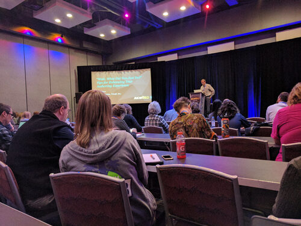](http://techwriter.pl/wp-content/uploads/2017/05/IMG_20170403_110913.jpg)

Krótka przerwa, a po niej nastąpiła ostatnia poniedziałkowa prezentacja - **One Year with MadCap Flare: Problems, Solutions, & Other Fun Innovations**. [**Morgan Hancock**](http://www.madcapsoftware.com/events/madworld/speakers/morgan-hancock/) opowiadała o wyzwaniach i problemach z jakimi musiała się mierzyć w pierwszym roku użytkowania Flare’a. Pokazała nam pewne elementy, które musieli stworzyć poza Flarem, takie jak możliwość zmiany wersji językowej, która otwiera ten sam topik w innych języku, skrypt zamieniający niektóre zmienne na tekst przed wysłaniem tekstu do tłumaczenia czy wyświetlanie dwóch topików na jednej stronie. Po tym jak opowiedziała nam ogólnie o tym co zrobili, przeprowadziła szybkie głosowanie podczas, którego uczestnicy wybrali 3 elementy, które chcieli omówić dokładniej. Niestety, była to najsłabsza prezentacja w jakiej uczestniczyliśmy. Poruszane tematy były ciekawe jednak sposób ich przedstawienia spowodował, że prezentacja dużo straciła.

## Drugi dzień

Wtorek rozpoczęliśmy od prezentacji **Working with MadCap Flare and Confluence in a Dispersed Team**. [**Jayna Locke**](http://www.madcapsoftware.com/events/madworld/speakers/jayna-locke/) przedstawiła różne scenariusze współpracy między osobami dostarczającymi wiedzę do dokumentacji i Tech Writerami przy użyciu Flare’a i Confluence. Jeden ze scenariuszy zakłada, że ekspert tworzy pierwszy szkic dokumentacji w Confluence a następnie Tech Writer przenosi go do Flare'a i tam szlifuje. Po skończonej pracy generuje PDFa lub HTMLa i wrzuca do przestrzeni (space) w Confluence gdzie znajdują się materiały do recenzji. Największym problemem w używaniu Flare’a i Confluence jest brak integracji między tymi dwoma narzędziami. Dlatego przenoszenie treści między nimi nie jest łatwe i trzeba stosować różne obejścia. Niektórzy tworzą skrypty, które obrabiają dokumentację stworzoną we Flarze, żeby nadawała się do importu do Confluence. Inni eksportują treść do pliku Word i importują taki plik do Confluence. W wersji 2017, Flare został wzbogacony o nowy format generowania dokumentacji – czysty XHTML, który nie zawiera tagów Flare’a. Dzięki temu formatowi można łatwiej importować treść do Confluence. Po wykładzie wywiązała się dyskusja. Jeden z uczestników zasugerował, że do eksportu treści z Confluence można użyć wtyczki [Scroll HTML Exporter](https://marketplace.atlassian.com/plugins/com.k15t.scroll.scroll-html/server/overview).

W kolejnej prezentacji pt. **To “Template” or Not to “Template”?** prowadząca [**Nita Beck**](http://www.madcapsoftware.com/events/madworld/speakers/nita-beck/) przeprowadziła nas przez szablony, które są dostępne domyślnie we Flarze. Dowiedzieliśmy się o istnieniu np. takich szablonów jak Slideshow, służącego do tworzenia prezentacji, i San Diego, przeznaczonego do celów treningowych dla nowych użytkowników. Szablony zawierają domyślnie targety, dzięki którym można wygenerować dokumentację do różnych formatów. Oprócz domyślnych szablonów, można też stworzyć własne. Prowadząca przedstawiła również strategię używania kilku szablonów. Zaczynamy od jednego projektu opartego na jednym szablonie, potem tworzymy nowy projekt tymczasowy i z niego importujemy (za pomocą Global Project linking) tylko te rzeczy, które są nam potrzebne. Następnie usuwamy linki do projektu, z którego importowaliśmy elementy. Najłatwiej to zrobić usuwając plik importu.

Następne wystąpienie nosiło tytuł **A New Look at Extending HTML5 Targets with jQuery**. [**Scott DeLoach**](http://www.madcapsoftware.com/events/madworld/speakers/scott-deloach/) w bardzo przejrzysty sposób wprowadził nas w świat wtyczek jQuery, które można wykorzystać w dokumentacji generowanej do formatu HTML5. Na początku prowadzący wyjaśnił nam czym jest jQuery i że jest ono używane w samym Flarze przy tworzeniu niektórych elementów, takich jak drop-down czy pop-up. Wtyczkę jQuery można dodać na dwa sposoby: linkować bezpośrednio do zasobów dostępnych w sieci albo ściągnąć wtyczkę. Następnie Scott zaprezentował nam masę ciekawych przykładów. Na przykład, wtyczka readingTime pokazuje liczbę słów na stronie oraz szacowany czas potrzebny na przeczytanie tekstu, a wtyczka tableExport pozwala nam wyeksportować tabelkę ze strony do różnych formatów, m.in. Word, Excel i PDF. Kolejnym przykładem jest wtyczka tagCloud, która znajduje wszystkie znaczniki conceptów, ktore są dodane do kodu na stronie. Każdy znaleziony concept przedstawiony jest w formie przycisku, którego można użyć do wyszukania tego conceptu na stronie. Była to świetna prezentacja zarówno pod względem tematyki jak i sposobu przedstawienia. Na pewno będziemy przyglądać się bliżej temu zagadnieniu.

Po jQuery przyszedł czas na Page Layouts, czyli układy stron, których używamy do generowania dokumentacji przeznaczonej do druku, np. PDF. [**Robert Plano**](http://www.madcapsoftware.com/events/madworld/speakers/robert-plano/) w swojej prezentacji **Mastering Page Layouts in MadCap Flare** wyjaśnił nam do czego są potrzebne Page Layouts, z jakich elementow się składają oraz jakie szablony mamy domyślnie do dyspozycji we Flarze. Robert pokazał nam kilka ciekawych ustawień. Na przykład, kiedy mamy w layoucie dwie ramki Body możemy za pomocą stylu spowodować, żeby nowy paragraf został wyświetlony w drugiej ramce, zamiast ustawiać tekst za pomocą spacji. Pokazał nam też co należy zrobić, żeby treść wyświetlała się w trzech kolumnach na stronie. Prezentacja była praktycznym demo, które krok po kroku wyjaśniało jak ustawić Page Layouts na różne sposoby. Prezentacja szczególnie przydatna dla osób, które nigdy wcześniej nie używały tego elementu we Flarze.

Wtorek zakończyliśmy udziałem w sesji **MadCap Flare Wishlist: An Open Forum Session with MadCap Software** prowadzonej przez organizatorów. Była to otwarta dyskusja, podczas której uczestnicy mieli szansę wypowiedzieć się na temat tego jakie rzeczy nie odpowiadają im we Flarze i jakie nowe funkcje chcieliby zobaczyć w nowych wersjach. Nie była to jednak sesja przeznaczona na rozwiązywanie problemów związanych z konkretnymi projektami, tylko ogólna dyskusja. Jak to mówią “uderz w stół, a nożyce się odezwą”, dlatego nie trzeba było specjalnie nikogo ciągnąć za język. Chętnych do wypowiedzenia się nie brakowało. Prawdopodobnie gdyby sesja trwała dwa razy dłużej bez problemu dałoby się wypełnić ten czas. Uczestnicy zgłosili propozycje takie jak poprawienie mechanizmu wyszukiwania poprzez dodanie możliwości użycia kilku filtrów jednocześnie, dodanie możliwości związanych z analizą projektu (np. analiza poziomu trudności użytego języka), poprawienie importu z FrameMakera, żeby obrazki automatycznie trafiały do katalogu Resources, możliwość przypisywania skrótów klawiszowych do większej liczby funkcji oraz integracja z JIRA i Confluence. Sesja była bardzo intensywna, więc na jej zakończenie organizatorzy mieli całkiem sporą listę rzeczy, którymi będą musieli się zająć. Oczywiście nie spodziewamy się, że nagle wszystko zostanie naprawione czy dodane, ale taka otwarta dyskusja to znak, że MadCap wychodzi naprzeciw swoim użytkownikom i stara się słuchać ich opinii.

# Warsztaty

Główna część konferencji zakończyła się we wtorek. Środa była w całości przeznaczona na dodatkowo płatne warsztaty. W sumie były 4 sesje, po 2 wątki (tracki) w każdej sesji.

Pierwsze warsztaty, które wybraliśmy nosiły nazwę **Maximize Content Reuse with MadCap Flare**. Poprowadziła je [**Denise Kadilak**](http://www.madcapsoftware.com/events/madworld/speakers/denise-kadilak/), która skupiła się na dwóch sposobach ponownego wykorzystania treści. Pierwszy z nich to Global Project linking. W tej opcji mamy jeden projekt główny, w którym przechowujemy elementy wykorzystywane w innych projektach. Oprócz głównego projektu mamy projekty podrzędne, w których tworzymy właściwą treść. Wszelkie elementy wspólne z głównego projektu są z niego importowane do projektów podrzędnych. Denise wspomniała, że u nich sytuacja jest jeszcze bardziej złożona, bo występuje import elementów na poziomie projektów podrzędnych. Drugi sposób na ponowne wykorzystanie treści to Runtime merge. Polega on na podlinkowaniu w Table of Contents w projekcie głównym projektów podrzędnych. Dzięki temu w trakcie budowania dokumentacji wszystkie projekty zostaną wygenerowane jako jedna dokumentacja. Jest to całkiem interesująca opcja, jednak ma spore ograniczenie. Na tę chwilę działa tylko dla formatu HTML5 w układzie tri-pane (trzy okna).

[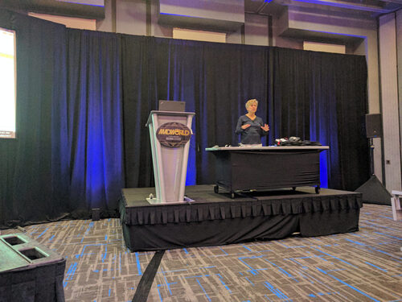](http://techwriter.pl/wp-content/uploads/2017/05/IMG_20170405_080244.jpg)

Kolejne warsztaty nosiły nazwę **Advanced CSS: Using CSS Design Elegant Solutions to Everyday HTML Problems**. [**Mike Kelley**](http://www.madcapsoftware.com/events/madworld/speakers/mike-kelley/) pokazywał nam jak można wzbogacić swój arkusz stylów o ciekawe efekty. Dowiedzieliśmy się jak dodać autonumerację elementów, przejścia, takie jak obrót czy wygaszenie, oraz jak wyrównać poszczególne elementy na stronie. Wspomniał również o CSS Grid Layout, czyli o nowym 2-wymiarowym układzie, który bierze pod uwagę zarówno wiersze jak i kolumny na stronie. Pokazał nam także font icons, czyli zestaw wektorowych ikonek, których możemy użyć zamiast zwykłych obrazków. Ich zaletą jest to, że się dobrze skalują nie tracąc na jakości. Można ich użyć np. we wszelkiego rodzaju wskazówkach lub ostrzeżeniach w dokumentacji lub w listach wypunktowanych zamiast tradycyjnych “bulletów”. Warsztaty krok po kroku prowadziły nas przez konfigurację poszczególnych elementów CSS. Mike Kelley okazał się świetnym prowadzącym z dużym poczuciem humoru. Chętnie odpowiadał na pytania i sam nawet zachęcał do rzucania mu “wyzwań”. Na samym początku warsztatów prowadzący zdradził nam, że praktycznie nie słyszy i prosił o wyrozumiałość. Prawdopodobnie nikt by nawet tego nie zauważył, gdyby nam o tym nie powiedział, ponieważ absolutnie nie miało to żadnego wpływu na przebieg warsztatów. Jesteśmy pełni podziwu, że pomimo takich przeciwności losu, Mike nie ma żadnego problemu z publicznymi wystąpieniami i co więcej jest w tym bardzo dobry.

https://twitter.com/ollyhell/status/849685169208344576

Ostatnimi warsztatami był **MAD for MadCap Flare Certification Bootcamp** przygotowujący do zdania certyfikatu potwierdzającego znajomość Flare’a. Całość została podzielona na dwie sesje. Warsztaty były prowadzone przez [**Scotta DeLoacha**](http://www.madcapsoftware.com/events/madworld/speakers/scott-deloach/) oraz [**Mike’a Hamiltona**](http://www.madcapsoftware.com/events/madworld/speakers/mike-hamilton/), którzy przeszli przekrojowo przez funkcje Flare’a i zapoznali nas z przykładowymi pytaniam jakie można spotkać podczas zdawania testu certyfikującego. Zaczęliśmy od projektów a skończyliśmy na śledzeniu zmian, po drodze dotykając jeszcze zagadnień związanych z linkami, stylami, topikami, zmiennymi, budowaniem dokumentacji czy też raportami. Nie sposób tutaj wymienić wszystkiego o czym była mowa. Z ciekawostek można wspomnieć pytanie o to jaką maksymalną wielkość może mieć projekt. Odpowiedź brzmi, że nie ma żadnego ograniczenia. Do tej odpowiedzi Mike dodał jeszcze, że największy projekt Flare’a jaki do tej pory widział liczył 300 000 topików. Zbudowanie tego potwora początkowo trwało 9 godzin. Potem udało się ten czas zredukować o ponad połowę. Pomimo ogromnej ilości informacji jaką dostaliśmy podczas tych warsztatów, chciało się tam zostać jeszcze na jedną sesję. W dużej części była to zasługa prowadzących, którzy potrafili utrzymać nasze zainteresowanie od początku do końca.

Na koniec wypełniliśmy test, taki jaki muszą zdać osoby ubiegające się o certyfikat Flare. Byliśmy przekonani, że to był test próbny, ale spotkała nas miła niespodzianka – osobom, które zdały test został zaliczony na poczet certyfikatu Flare. Oznacza to, że jeśli takie osoby zdecydują się wykupić egzamin będą musiały przygotować tylko próbny projekt. Wielu osobom, w tym także nam, dało to powody do radości :)

# Loża ekspertów

Przez trzy dni uczestnicy mieli do dyspozycji **Hospitality Lounge** gdzie mogli udać się po wsparcie. W praktyce była to osobna sala, w której urzędowali pracownicy firmy MadCap. Można było po prostu tam pójść i wylać swoje żale, co też oczywiście uczyniliśmy (i to niejednokrotnie). Wszystkie osoby, z którymi rozmawialiśmy były cierpliwe, wyrozumiałe i chętne do pomocy. Nawet po dłuższym narzekaniu z naszej strony nie poddawali się i starali się znaleźć jakieś rozwiązanie. ?

Nie da się ukryć, że Hospitality Lounge jest bardzo ważną częścią konferencji MadWorld. Było to widać doskonale po liczbie osób ustawiających się w kolejce do ekspertów. Uczestnicy cenią sobie bardzo możliwość porozmawiania twarzą w twarz o tym z jakimi problemami mierzą się używając produktów firmy MadCap. Dla wielu z nich jest to wystarczający argument, żeby kupić wejściówkę na MadWorld.

# Aplikacja

Organizatorzy stworzyli dla uczestników specjalną aplikację konferencyjną. Można było w niej sprawdzić harmonogram konferencji i oznaczyć wydarzenia, w których chcieliśmy wziąć udział. Aplikacja miała też możliwość ustawienia przypomnień przed wydarzeniami, które dodaliśmy do naszego harmonogramu. Było to szczególnie pomocne kiedy w przerwie między prezentacjami wdawaliśmy się w ożywioną dyskusję z innymi uczestnikami tracąc poczucie czasu.

[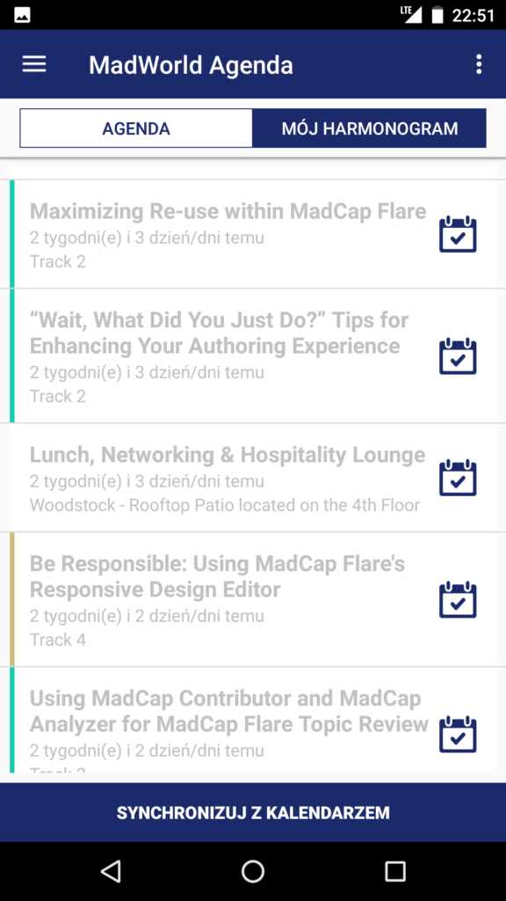](http://techwriter.pl/wp-content/uploads/2017/04/MadWorld-app1.png)

Oprócz tego, aplikacja spełniała też funkcję wewnętrznego Twittera. Uczestnicy na gorąco wrzucali zdjęcia i komentowali wydarzenia.

[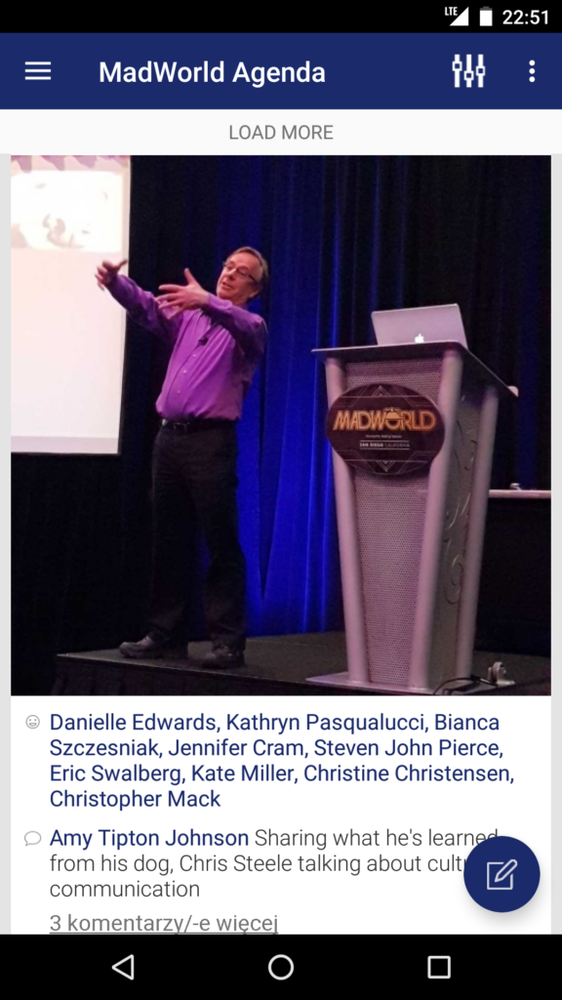](http://techwriter.pl/wp-content/uploads/2017/04/MadWorld-app2.png)

Był nawet konkurs na najbardziej aktywnych użytkowników. Za każdą aktywność przyznawane były punkty. Na koniec konferencji, zwycięzcy otrzymali od organizatorów nagrody rzeczowe. Dobry przykład gamifikacji.

# Tańce, hulańce, swawole

Żadna dobra konferencja nie może obyć się bez rozrywki pozwalającej uczestnikom rozluźnić się po intensywnym chłonięciu wiedzy. Nie inaczej było w przypadku MadWorld. Każdy dzień konferencji zakończony był wydarzeniem towarzyskim, podczas którego można było przy drinku i jedzeniu nawiązać nowe znajomości.

https://twitter.com/neilmatheson/status/848689027167510532

Uczestnicy byli bardzo skorzy do interakcji, dlatego za każdym razem w miejscu spotkania było gwarno i wesoło. Jedna z imprez odbyła się w pobliskim barze country.

Główną atrakcją była nauka amerykańskiego tańca liniowego. Musimy przyznać, że kilka rzędów Tech Writerów wykonujących te same ruchy taneczne to dość niecodzienny widok ;)

# Miejsce konferencji

Tegoroczna edycja konferencji odbyła się w [hotelu Hard Rock](http://www.hardrockhotelsd.com/), zlokalizowanym w historycznej dzielnicy Gaslamp. Według nas był to dobry wybór. Główną zaletą była lokalizacja hotelu w centrum miasta, przez co łatwo było się do niego dostać.

Wynajęte sale konferencyjne były przestronne i komfortowe. Przy wejściu do każdej sali był wyświetlacz pokazujący jej numer oraz plan prezentacji. Dzięki temu łatwiej było się odnaleźć. Jedyną niedogodnością był niedobór gniazdek w salach, który był szczególnie odczuwalny podczas warsztatów, kiedy to laptopy były bardzo potrzebne.

[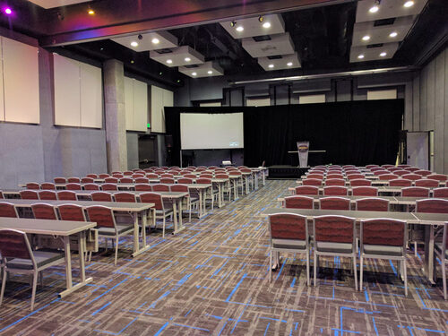](http://techwriter.pl/wp-content/uploads/2017/05/IMG_20170402_143618.jpg)

Pracownicy hotelu zapewnili uczestnikom profesjonalną obsługę oraz świetny catering. Uczestnicy w cenie wejściówki mieli śniadanie i lunch. Podczas dni kiedy odbywały się prezentacje były one serwowane na tarasie. Dzięki temu można było cieszyć się piękną pogodą i odetchnąć chwilę na świeżym powietrzu w przerwie między prezentacjami.

https://twitter.com/MichaelJasper/status/848993111875473409

# Miasto

Konferencja [MadWorld](http://www.madworldconference.com/?utm_source=TechWriterPL&utm_medium=Banner&utm_campaign=MadWorld2017) od pięciu lat odbywa się w San Diego. Co tu dużo pisać - miasto jest piękne i ciężko się w nim nudzić. Są muzea, parki, plaże, restauracje i browary rzemieślnicze.

[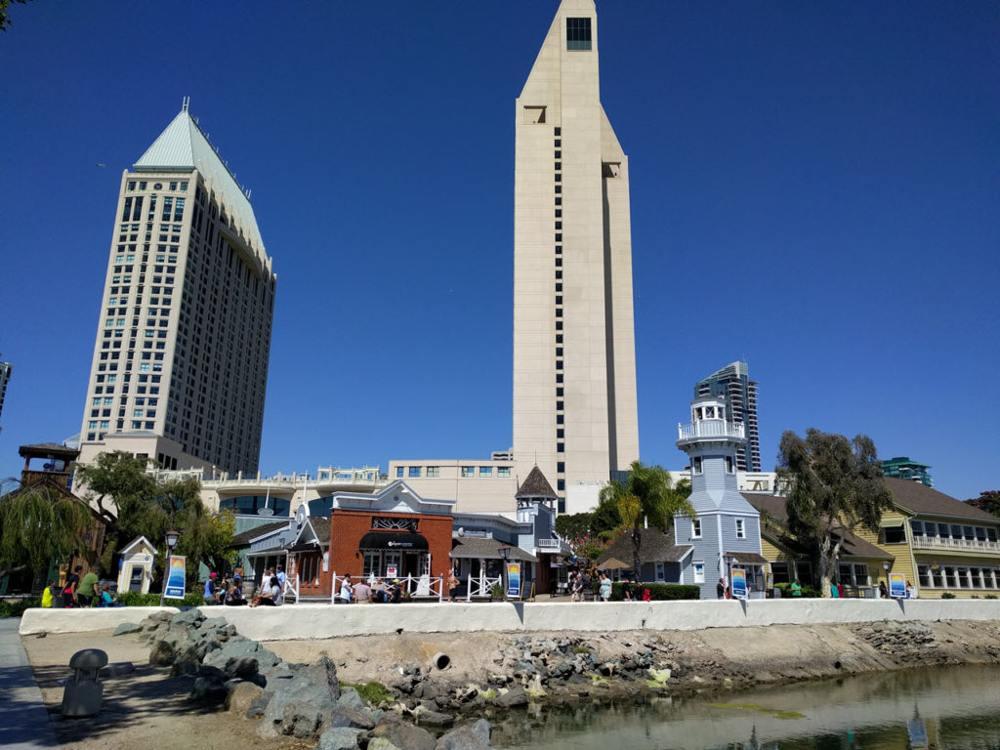](http://techwriter.pl/wp-content/uploads/2017/05/IMG_20170401_143036.jpg)[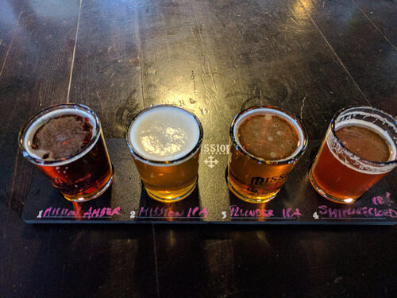](http://techwriter.pl/wp-content/uploads/2017/05/IMG_20170401_151917.jpg)Pogoda zdecydowanie sprzyja aktywnemu spędzaniu wolnego czasu. Polecamy przemierzanie miasta na piechotę. Wbrew powszechnemu przekonaniu, miasta w Ameryce potrafią być przyjazne pieszym ? Możecie też wypożyczyć rower i pojeździć po okolicy. Infrastruktura jest bardzo dobrze przygotowana, dlatego pomimo dużego ruchu samochodowego w mieście i poza nim, można bezpiecznie podróżować rowerem. Kolejna opcja to wypuszczenie się kilka kilometrów za miasto i pochodzenie po górkach. Naprawdę warto – można się solidnie zmęczyć podziwiając przepiękne widoki.

[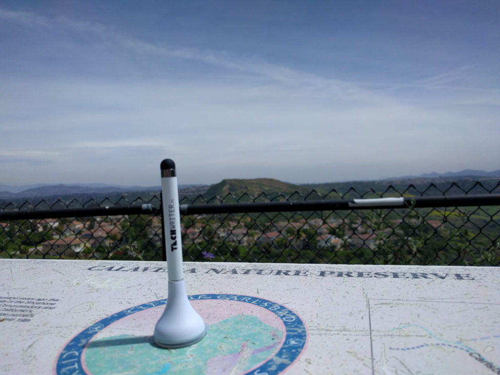](http://techwriter.pl/wp-content/uploads/2017/05/IMG_20170407_125902.jpg)Jeśli wszystkie opisane propozycje to dla Was ciągle za mało, wystarczy kupić bilet na pociąg i w niecałe 3 godziny będziecie w Los Angeles. A tam czeka na Was kolejna porcja atrakcji.

Jak widać, w San Diego każdy znajdzie coś dla siebie. Zarówno Ci, którzy lubią leniuchować jak i Ci, którzy nie mogą usiedzieć na miejscu.

# Podsumowanie

Jak wiadomo, MadWorld jest przeznaczony dla bardzo wąskiej grupy odbiorców. Konferencję można by określić jako coroczny zjazd użytkowników produktów MadCapa. Ale nie ma w tym absolutnie nic złego. Takie wydarzenia też są potrzebne. Dzięki MadWorld, Tech Writerzy używający Flare’a mają miejsce, w którym mogą zdobyć konkretną wiedzę, uzyskać pomoc od ekspertów, poznać nowe osoby, które mają podobne problemy i które mogą podzielić się swoim doświadczeniem.

Atmosfera panująca na konferencji jest świetna. Widać, że ludzie nie tylko dużo się uczą, ale też dobrze się przy tym bawią. Poziom prezentacji, jak to bywa na takich wydarzeniach, jest zróżnicowany. Ponadto wiadomo, że każdy uczestnik przyjeżdża na konferencję z różnym poziomem doświadczenia i określonymi oczekiwaniami. Dlatego to co dla jednych jest oczywiste, dla innych jest czymś odkrywczym. Jednak przy tak dużej liczbie prezentacji, na pewno każdy znajdzie coś dla siebie i zdobędzie wartościową wiedzę.

Koszt uczestnictwa jest dość wysoki. Oprócz ceny wejściówek, musimy liczyć się z kosztami przelotów i noclegów. Po zsumowaniu tego wszystkiego, dostajemy całkiem sporą sumę. Bądźmy realistami – nie będzie łatwo przekonać szefa do przyznania nam takiego budżetu. Ale jeśli jest na to jakaś szansa, to warto powalczyć ze względu na to wszystko o czym pisaliśmy wyżej. Oprócz wartościowej konferencji, będziecie mieć też szansę na mini wakacje w słonecznej Kalifornii co sprawia, że MadWorld wydaje się jeszcze bardziej kuszący :)

Podsumowując, jeśli korzystacie na co dzień z Flare’a, to zdecydowanie polecamy udział w MadWorld.

https://twitter.com/CFree22/status/850117198605504513

Jeśli interesuje Was co mają do powiedzenia na temat konferencji inni uczestnicy, odsyłamy do linków poniżej:

- [My First MadWorld: Excerpts from a Newbie and Why It Was Worth My Time](http://www.madcapsoftware.com/blog/2017/04/27/first-madworld-excerpts-newbie-worth-time/)
- [Madworld Day 1](https://medium.com/@thejoelwilhelm/madworld-day-1-422ea4f11160)
- [MadWorld Day 2](https://medium.com/@thejoelwilhelm/madworld-day-2-4accf23c9913)
- [MadWorld 2017 Thoughts Part 1](https://blog.ericswalberg.com/2017/04/18/madworld-2017-thoughts-part-1/)
- [MadWorld 2017 Thoughts Part 2](https://blog.ericswalberg.com/2017/04/24/madworld-2017-thoughts-part-2/)

Na koniec, dziękujemy serdecznie organizatorom za ciepłe przyjęcie i mamy nadzieję, że w następnym roku uda nam się wrócić do San Diego.

[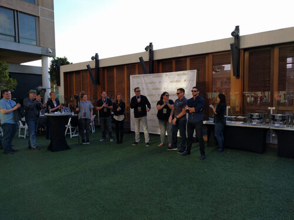](http://techwriter.pl/wp-content/uploads/2017/05/IMG_20170404_181518.jpg)
