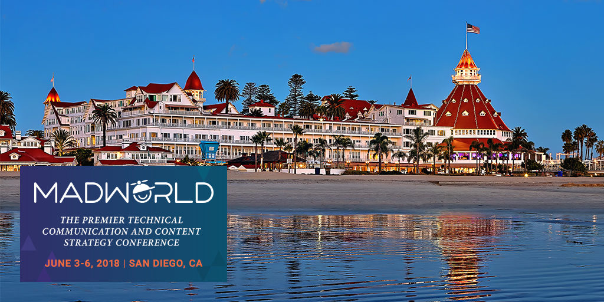
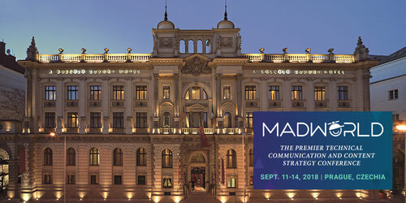
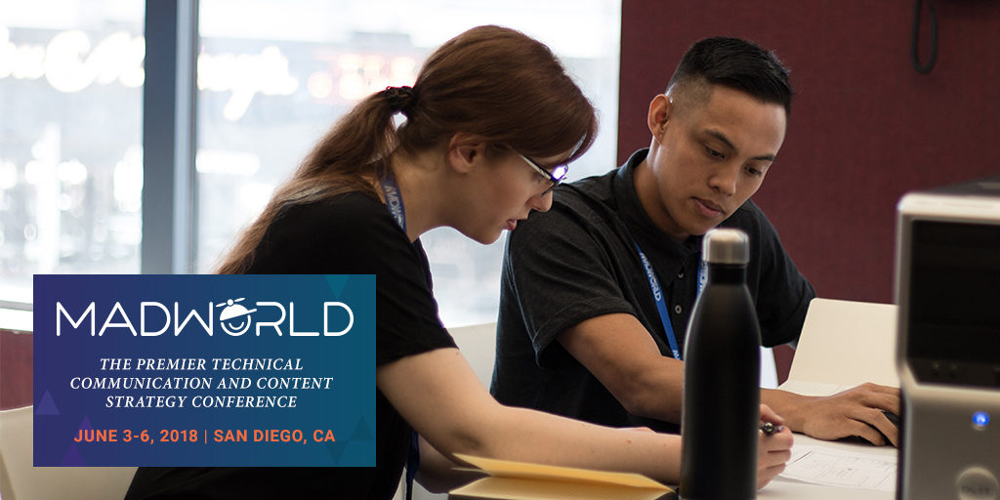

W zeszłym roku, jako partner medialny, mieliśmy okazję uczestniczyć w 5. edycji
konferencji MadWorld w San Diego. Co tu dużo pisać - podobało nam się i to
bardzo!

<!--truncate-->

Na dowód przedstawiamy
[naszą relację z tego wydarzenia](http://techwriter.pl/madworld-2017-relacja/).
W tym roku użytkownicy narzędzia MadCap Flare mają duże powody do radości.
Oprócz konferencji w USA, wreszcie doczekaliśmy się europejskiej edycji. Dzięki
temu więcej osób będzie mogło zdobyć cenną wiedzę związaną z Flarem. Poniżej
przedstawiamy zestawienie najważniejszych informacji na temat obu wydarzeń.

## Termin

MadWorld San Diego odbędzie się w dniach 3-6 czerwca 2018, a MadWorld Prague w
dniach 11-14 września 2018.

## Miejsce

MadWorld San Diego odbędzie się w innym miejscu niż ostatnio. Na tegoroczną
edycję, organizatorzy wybrali [Hotel del Coronado](https://hoteldel.com/) -
zabytkowy drewniany hotel w stylu wiktoriańskim, usytuowany nad oceanem. W
momencie otwarcia w 1888 roku był największym ośrodkiem wczasowym na świecie.
Obecnie jest to druga co do wielkości drewniana konstrukcja w Stanach
Zjednoczonych.

Pierwsza edycja MadWorld Prague zagości
w [Carlo IV, The Dedica Anthology, Autograph Collection](https://www.marriott.com/hotels/travel/prgak-carlo-iv-the-dedica-anthology-autograph-collection/?scid=bb1a189a-fec3-4d19-a255-54ba596febe2).
Ten luksusowy hotel usytuowany w centrum Pragi został zaprojektowany przez
austriackiego architekta Wolfa w neoklasycystycznym stylu. Dziewiętnastowieczny
budynek był na początku siedzibą banku, a w trakcie reżimu komunistycznego
mieściła się tam główna siedziba poczty.

## Agenda

MadWorld jest jedyną nam znaną konferencją tech comm, która ogłasza pełny
program na wiele miesięcy przed samym wydarzeniem. Dzięki temu nie "kupujemy
kota w worku". Oczywiście zdarzają się zmiany związane z sytuacjami losowymi,
ale raczej są to kosmetyczne różnice. Proces selekcji jest dość wymagający -
osoby, które prezentowały rok wcześniej nie miały z automatu zapewnionego
miejsca w edycji 2018. Jest to dowód na to, że organizatorzy obiektywnie
podchodzą do proponowaych tematów i starają się wybrać to co będzie najbardziej
dopasowane do potrzeb uczestników.

Schemat obu konferencji jest podobny:

- Pierwszy dzień  - rejestracja, Hospitality Lounge, przyjęcie
- Drugi i trzeci dzień - prelekcje: w San Diego będzie to 20 prezentacji każdego
  dnia (5 sesji po 4 ścieżki), w Pradze będzie to 10 prezentacji (5 sesji po 2
  ścieżki). Jednocześnie dostępni są eksperci w Hospitality Lounge. Każdy dzień
  zakończony jest imprezą.
- Czwarty dzień - seria zaawansowanych warsztatów zakończona Happy Hour - czyli
  rozmowami przy piwie lub innym drinku

Miło widzieć, że uczestnicy konferencji stają się w kolejnych latach
prelegentami. Tak stało się np. w przypadku
[Joela Wilhelma](https://www.madcapsoftware.com/conference/madworld-2018/speakers/joel-wilhelm/),
który w tym roku wraz z Jayną Locke opowie uczestnikom o tym co manadżerowie
powinni wiedzieć na temat MadCap Flare'a, żeby efektywnie prowadzić zespół.
Ciekawie zapowiada się też sesja
[Patricka Calnana](https://www.madcapsoftware.com/conference/madworld-2018/speakers/patrick-calnan/)
o wymaganiach związanych z ułatwieniem użytkownikom dostępu do dokumentacji
(accessibility) oraz o tym jak spełnić te wymagania za pomocą Flare'a. Warto też
zwrócić uwagę na prezentację
[Paula Pehrsona](https://www.madcapsoftware.com/conference/madworld-2018/speakers/paul-pehrson/)
o tym jak sobie radzić w sytuacjach kiedy napotykamy problemy z Flarem. Wydaje
się, że będzie to bardzo praktyczna prezentacja, która może ułatwić życie
niejednemu użytkownikowi. To tylko wybrane pozycje z agendy MadWorld San Diego,
która jest naprawdę bogata.

Jeśli chodzi o MadWorld Prague to pomimo mniejszej liczby prezentacji, każdy
powinien znaleźć coś dla siebie. Dla nas interesująca wydaje się prezentacja
[Michaela Fritza](https://www.madcapsoftware.com/conference/madworld-europe-2018/speakers/michael-fritz/),
który postara się wyjaśnić uczestnikom co tak naprawdę kryje się za określeniem
Industry 4.0 i co to oznacza dla świata dokumentacji technicznej. Kolejną
ciekawą pozycją jest sesja
[Ellisa Pratta](https://www.madcapsoftware.com/conference/madworld-europe-2018/speakers/ellis-pratt/)
o tym jak zespoły dokumentacyjne zaadaptowały metodykę zwinną (Agile) na swoje
potrzeby, pomimo tego, że domyślnie nie obejmuje ona dobrych praktyk związanych
z tworzeniem pomocy dla użytkowników. Na deser proponujemy jeszcze prezentację
[Eloise Lewis](https://www.madcapsoftware.com/conference/madworld-europe-2018/speakers/eloise-lewis/),
która opowie o tym jak rozbudować pomoc w formacie HTML5 o interaktywnego
asystenta (wizard), który potrafi przeprowadzić użytkownika przez skomplikowane
zadanie.

Szczegółowy program konferencji znajdziecie na poniższych stronach:

- [Program MadWorld San Diego](https://www.madcapsoftware.com/conference/madworld-2018/schedule/)
- [Program MadWorld Prague](https://www.madcapsoftware.com/conference/madworld-europe-2018/schedule/).

Polecamy też zaglądać na [MadBlog](https://www.madcapsoftware.com/blog/) gdzie
pojawiają się wpisy przybliżające sylwetki prezenterów z MadWorld i ich
prezentacje.

## Ceny

Poniżej przedstawiamy zestawienie cen biletów.

|             |               |               |               |               |       |
| ----------- | ------------- | ------------- | ------------- | ------------- | ----- |
| Do 30.04    | 01.05 - 03.06 | 01.04 - 31.05 | 01.06 - 31.07 | 01.08 - 11.09 |       |
| Konferencja | $1999         | $2199         | $999          | $1099         | $1199 |
| Warsztaty   | $699          | $699          | $399          | $499          | $599  |

Organizatorzy przewidzieli też specjalne zniżki dla studentów. Niestety, na taki
przywilej mogą liczyć tylko uczestnicy MadWorld San Diego. W Stanach
Zjednoczonych kształcąca się młodzież może nabyć bilet na konferencję w cenie
$499, a na warsztaty w cenie $199.

Cena wejściówki na MadWorld San Diego i MadWorld Prague obejmuje:

- Wstęp na pierwszy, drugi i trzeci dzień konferencji
- Dostęp do pracowników wsparcia technicznego MadCap w Hospitality Lounge
- Aplikację konferencyjną na urządzenia mobilne
- Przyjęcie na zakończenie każdego dnia konferencji
- Śniadanie (w przypadku MadWorld Prague dotyczy to tylko uczestników
  mieszkających w hotelu, w którym odbywa się konferencja) i bufet lunchowy w
  trakcie drugiego i trzeciego dnia konferencji
- Przerwy kawowe
- Zestaw rejetracyjny (torba, koszulka, itp.)
- Dostęp do slajdów i nagrań audio prezentacji po konferencji

Uczestnicy konferencji, mogą również skorzystać ze specjalnych cen na pobyt w
hotelach, w których odbywa się konferencja. Więcej szczegółów znajdziecie na
poniższych stronach:

- [Ceny MadWorld San Diego](https://www.madcapsoftware.com/conference/madworld-2018/pricing.aspx)
- [Ceny MadWorld Prague](https://www.madcapsoftware.com/conference/madworld-europe-2018/pricing.aspx).

## Dlaczego warto?

Według nas istnieje kilka powodów, dla których każdy użytkownik narzędzia MadCap
Flare powinien rozważyć poważnie udział w konferencji MadWorld. Po pierwsze,
prezentacje są bardzo praktyczne przez co można się z nich sporo nauczyć. Po
drugie, dostajemy bezpośredni dostęp do specjalistów wsparcia technicznego
(Hospitality Lounge). Dzięki temu w dość krótkim czasie możemy rozwiązać całkiem
sporo problemów, które nas trapią. Dla niektórych uczestników jest to główny
powód, dla którego decydują się na udział w
konferencji.

Po trzecie, na MadWorld panuje świetna atmosfera, a organizacja wydarzenia stoi
na wysokim poziomie. Dodatkowo, dostajemy możliwość zwiedzenia ciekawych miejsc,
a w przypadku MadWorld San Diego skorzystania również ze słonecznej pogody i
plaż.

Według informacji podanej na stronie MadWorld San Diego, 95% uczestników
konferencji planuje powrócić w kolejnym roku. Dane te pochodzą z ankiety
przeprowadzonej wśród uczestników MadWorld 2017 w San Diego. Wydaje się, że
organizator ma powody do zadowolenia.

Jeśli nadal się wahacie, to możecie przejrzeć
[archiwalne materiały](https://www.madcapsoftware.com/past-conferences/) na
temat poprzednich edycji MadWorld San Diego.
